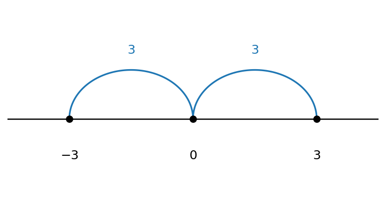
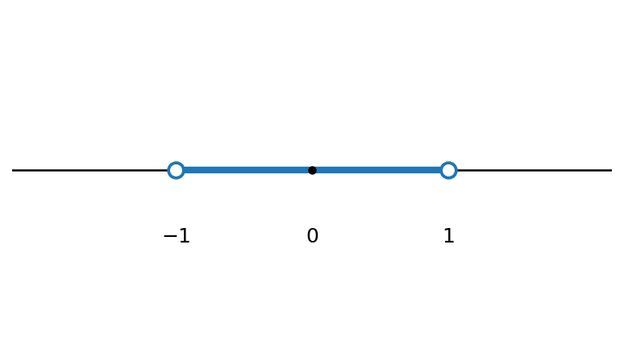
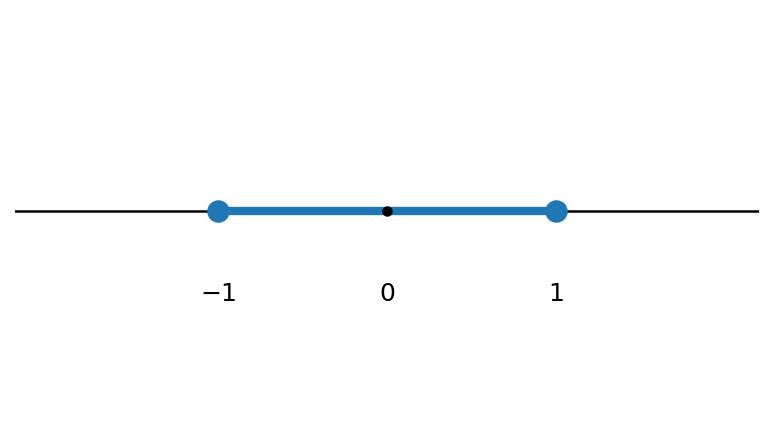
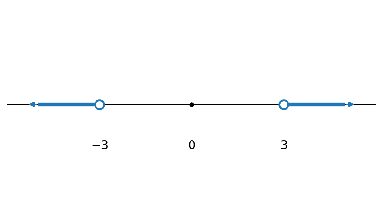
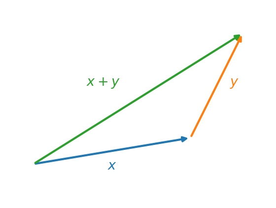
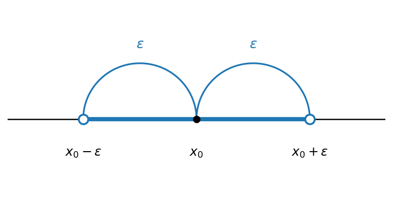

# מושגי יסוד

## מבוא

כל תופעה שנחקרת או מנותחת מנוסחת בסופו של דבר בעזרת שפה מתמטית. זו הסיבה שבגינה מתמטיקה מכונה לעיתים ״שפת המדעים״. המתמטיקאי הצרפתי אנרי פואנקרה ניסח זאת בציטוטו המפורסם: ״מתמטיקה היא האמנות של מתן שמות זהים לדברים שונים״. מה זה אומר? מדובר בתהליך שנקרא **הפשטה**: אנו לוקחים תופעה מסוימת, מתמקדים בתכונות שמעניינות אותנו (ורק בהן), מסמנים אותן בסימונים זהים — ״שמות זהים״ — ומנתחים אותן בעזרת אותן פעולות. הדוגמה הפשוטה ביותר לכך היא היכולת לספור דברים. כעת נציג את השפה ואת מושגי היסוד שישרתו אותנו בהמשך הקורס ובהמשך התואר.

## השפה של המתמטיקה ומבוא קצר ללוגיקה

לפני שנעבור ללב הקורס, חשוב להתעכב על אחד הדברים המבלבלים סטודנטים חדשים במתמטיקה — **השפה של המתמטיקה**. למתמטיקה יש שפה משלה, הכוללת אוצר מילים וביטויים אופייניים: *יהי*, *קיים*, *נניח*, *נניח בשלילה*, *לכן*, *מכאן נובע ש-*, *סתירה*, *הפרכה*, *מש״ל*, *הוכחה* וכדומה. למעשה, ברגע שמבינים אותה היא פשוטה מאוד, שכן היא מבוססת על היגיון; אולם רוב הסטודנטים המתחילים תואר כמעט לא התנסו בה — פרט אולי לפסיכומטרי או להוכחות בגיאומטריה של המישור בבית הספר — ולכן היא מהווה קושי בתחילת הדרך.

בסעיף זה נבנה מעין **שיחון** של המונחים והביטויים השכיחים. אך לפני שנציג אותו, ננסה להסביר בקצרה כיצד עובדת החשיבה המתמטית. הדבר הראשון שחשוב להבין הוא שהמתמטיקה היא **דדוקטיבית**. מה פירוש הדבר? המתמטיקה אינה ממציאה דבר חדש — היא רק מסיקה האם טענה נכונה או אינה נכונה מתוך הנחות קיימות; ״הכול נובע מן הנתונים״. יש אפילו בדיחה ידועה על כך: ״במתמטיקה הכול טריוויאלי, שהרי הכול נובע מן הנתונים״. אפשר לחשוב על כך כעל משחק: נתון ״עולם״ ובו הנחות מסוימות, וכן כללים הקובעים מה מותר לעשות עם ההנחות הללו. בהינתן שאלה, מנסים להכריע אם התשובה היא ״נכון״, ״לא נכון״, או ״אין מספיק נתונים״.

::: {#exm-deduction .example}
נניח שכל הכלבים הם יונקים, ושחומי הוא כלב. אז הטענה ״חומי הוא יונק״ **נכונה**. לעומת זאת, נניח שלאיגור יש דוברמן; האם שמו של הדוברמן הוא חומי? כאן התשובה היא **״אין מספיק נתונים״**.
:::

התחום הפורמלי במתמטיקה, במדע ובפילוסופיה העוסק בהסקת מסקנות מהנחות ובבדיקת טענות על סמך הנחות נקרא **לוגיקה** (בעברית: *תורת ההיגיון*). זהו תחום מורכב ועמוק, שלא ניכנס אליו לעומק; אך הלוגיקה הבסיסית מופיעה בכל תחום במתמטיקה ובמדע, וחשוב להכירה **כשפה**. נציג אותה כאן באופן לא-פורמלי, בעזרת דוגמאות יומיומיות, ולצד זאת נציג את הסימונים הבסיסיים.

המושג הבסיסי ביותר בלוגיקה הוא ה**פסוק**.

::: {#def-proposition .definition}
**פסוק** הוא משפט הצהרתי שאפשר לקבוע לגביו, באופן חד-משמעי, אם הוא **אמת** או **שקר** (אך לא שניהם בו-זמנית). ערך זה — אמת או שקר — נקרא **ערך האמת** של הפסוק. נהוג לסמן את הערך ״אמת״ באות $T$ (מאנגלית, *True*) ואת הערך ״שקר״ באות $F$ (*False*).
:::

::: {#exm-propositions .example}
- ״$2+2=4$״ — פסוק שערך האמת שלו **אמת**.
- ״$3 > 5$״ — פסוק שערך האמת שלו **שקר**.
- ״חומי הוא יונק״ — פסוק (ערך האמת תלוי בעובדות).
- ״מהי השעה?״ — **אינו** פסוק: זוהי שאלה, ואי אפשר לקבוע לגביה אמת או שקר.
:::

כשהתוכן אינו חשוב, או כשאנו רוצים לקצר, נסמן פסוקים באותיות לועזיות גדולות, כגון $P, Q, \dots$.

לעיתים נתבונן בביטוי המכיל **משתנה**, שאינו פסוק בפני עצמו אלא הופך לפסוק רק לאחר שמציבים במקום המשתנה ערך מסוים.

::: {#def-predicate .definition}
ביטוי $P(x)$ התלוי במשתנה $x$, אשר בהצבת כל ערך קונקרטי $a$ במקום $x$ הופך לפסוק $P(a)$ (אמת או שקר), נקרא **פסוק פתוח** (או **תכונה**). נאמר ש-$a$ **מקיים** את $P$ אם $P(a)$ הוא פסוק אמת.
:::

::: {#exm-predicate .example}
ניקח את $P(x)$ להיות ״$x > 5$״. כל עוד $x$ אינו ידוע, $P(x)$ אינו פסוק; אך בהצבת ערך מתקבל פסוק: $P(7)$ היא הטענה ״$7 > 5$״, שהיא **אמת**, ואילו $P(3)$ היא ״$3 > 5$״, שהיא **שקר**. אם כן, $7$ מקיים את $P$ ואילו $3$ אינו מקיים.
:::

מפסוקים נתונים אנו מרכיבים פסוקים מורכבים יותר בעזרת **קשרים לוגיים**. נציג את החשובים שבהם בזה אחר זה, ולכל אחד נלווה דוגמאות. כל קשר מוגדר באופן מלא על ידי ערך האמת שהוא מקבל, בהתאם לערכי האמת של הפסוקים שעליהם הוא פועל.

**שלילה.** נתחיל בפעולה הפשוטה ביותר, הפועלת על פסוק יחיד.

::: {#def-negation .definition}
ה**שלילה** של פסוק $P$, המסומנת $\neg P$ ונקראת ״לא $P$״, היא הפסוק שהוא **אמת** בדיוק כאשר $P$ **שקר** (ו**שקר** כאשר $P$ אמת).
:::

::: {#exm-negation .example}
- אם $P$ הוא ״$5$ הוא מספר ראשוני״ (אמת), אז $\neg P$ הוא ״$5$ אינו מספר ראשוני״ (שקר).
- אם $Q$ הוא ״$2 > 3$״ (שקר), אז $\neg Q$ הוא ״$2 \le 3$״ (אמת).
:::

**וגם.** כעת נעבור לקשרים הפועלים על שני פסוקים. הראשון הוא ה**וגם** (קוניונקציה).

::: {#def-conjunction .definition}
ה**קוניונקציה** של $P$ ו-$Q$, המסומנת $P \land Q$ ונקראת ״$P$ **וגם** $Q$״, היא הפסוק שהוא אמת בדיוק כאשר **שני** הפסוקים אמת.
:::

::: {#exm-conjunction .example}
- ״$2$ זוגי **וגם** $2$ ראשוני״ — שני החלקים אמת, ולכן הפסוק כולו **אמת**.
- ״$2$ זוגי **וגם** $2 > 3$״ — החלק השני שקר, ולכן הפסוק כולו **שקר**.
- בשפה היומיומית: ״ירד גשם וגם נשבה רוח״ אמת רק אם **שני** הדברים קרו.
:::

**או.** הקשר הבא, ה**או** (דיסיונקציה), הוא מקור נפוץ לבלבול, ולכן נתעכב עליו.

::: {#def-disjunction .definition}
ה**דיסיונקציה** של $P$ ו-$Q$, המסומנת $P \lor Q$ ונקראת ״$P$ **או** $Q$״, היא הפסוק שהוא אמת בדיוק כאשר **לפחות אחד** מהפסוקים אמת — כולל המקרה שבו **שניהם** אמת.
:::

הבלבול נובע מכך שבשפה היומיומית ״או״ הוא לרוב **מפריד**: אחד מן השניים, אך לא שניהם (״תה או קפה?״). ה״או״ הלוגי, לעומת זאת, הוא **מכליל** — הוא אמת גם כששני החלקים מתקיימים. לכן, מבחינה לוגית, ״$P$ או $Q$?״ היא שאלת כן/לא, שהתשובה עליה ״כן״ אם מתקיים לפחות אחד מהם.

::: {#exm-or-jokes .example}
ההבדל הזה הוא מקור לבדיחות:

- ״ילדה אשתך בן **או** בת?״ — ״כן.״
- בקופה: ״תשלם במזומן **או** באשראי?״ — ״כן.״

מבחינה לוגית התשובות נכונות לחלוטין: בכל אחד מן המקרים מתקיים לפחות אחד מן הצדדים, ולכן הפסוק ״$P$ או $Q$״ אמת. אלא שבשפה היומיומית ציפינו ש״או״ ידרוש **בחירה** בין השתיים.
:::

הפעולה המתאימה ל״או״ המפריד של השפה היומיומית נקראת **או מפריד** (״או בלעדי״; באנגלית XOR), ומסומנת $P \oplus Q$. היא אמת בדיוק כאשר **בדיוק אחד** מן השניים אמת — ולא כששניהם אמת. ההבדל בין שתי הפעולות מתבטא רק בשורה הראשונה:

| $P$ | $Q$ | $P \lor Q$ | $P \oplus Q$ |
|:---:|:---:|:----------:|:------------:|
| $T$ | $T$ |    $T$     |     $F$      |
| $T$ | $F$ |    $T$     |     $T$      |
| $F$ | $T$ |    $T$     |     $T$      |
| $F$ | $F$ |    $F$     |     $F$      |

**גרירה.** הקשר הבא, ה**גרירה**, הוא ככל הנראה המבלבל ביותר.

::: {#def-implication .definition}
ה**גרירה** $P \to Q$, הנקראת ״**אם** $P$ **אז** $Q$״, היא הפסוק שהוא **שקר** בדיוק במקרה אחד: כאשר $P$ אמת ו-$Q$ שקר. בכל מקרה אחר היא **אמת**. הפסוק $P$ נקרא ה**הנחה**, ו-$Q$ נקרא ה**מסקנה**.
:::

יש להדגיש: הגרירה **אינה** קשר של סיבה ותוצאה, אלא אמירה על ערכי אמת בלבד. שתי הדוגמאות הבאות ממחישות זאת.

::: {#exm-implication-smoke .example}
הפתגם ״אין עשן בלי אש״ הוא בעצם הגרירה ״**אם** יש עשן, **אז** יש אש״ — כלומר הפסוק ׳יש עשן׳ **גורר** את הפסוק ׳יש אש׳. שימו לב לכיוון: מבחינת סיבה ותוצאה, ה**אש** היא הסיבה וה**עשן** הוא התוצאה; אך הגרירה פועלת **מן העשן (התוצאה) אל האש (הסיבה)**, שהרי מתוך תצפית בעשן אנו מסיקים שקיימת אש. הכיוון הלוגי הפוך, אם כן, לכיוון הסיבתי.
:::

::: {#exm-implication-vacuous .example}
דוגמה מבלבלת אף יותר: הגרירה $$2 \neq 2 \;\to\; 5 = 5$$ היא **אמת**! ההנחה ״$2 \neq 2$״ שקרית, ולכן — לפי ההגדרה — הגרירה כולה אמת, על אף שאין שום קשר תוכני בין שני הצדדים. זהו ביטוי לכלל ״מן השקר נובע הכול״: בכל פעם שההנחה $P$ שקרית, $P \to Q$ אמת באופן אוטומטי.
:::

אפשר לבנות אינטואיציה למקרה זה דרך הבטחה: ״אם ירד גשם — אקח מטרייה״. ההבטחה מופרת רק אם ירד גשם (ההנחה אמת) ובכל זאת לא לקחתי מטרייה (המסקנה שקר); אם לא ירד גשם כלל, לא הפרתי דבר, ולכן ההבטחה נחשבת מקוימת — כלומר אמת.

**שקילות.** לבסוף, ה**שקילות**.

::: {#def-equivalence .definition}
ה**שקילות** $P \leftrightarrow Q$, הנקראת ״$P$ **אם ורק אם** $Q$״, היא הפסוק שהוא אמת בדיוק כאשר ל-$P$ ול-$Q$ **אותו ערך אמת** (שניהם אמת, או שניהם שקר). היא שקולה לקיום שתי הגרירות יחד: $P \to Q$ וגם $Q \to P$.
:::

::: {#exm-equivalence .example}
- עבור מספר שלם $n$: ״$n$ זוגי״ **אם ורק אם** ״$n+1$ אי-זוגי״ — לשני הפסוקים תמיד אותו ערך אמת, ולכן השקילות **אמת**.
- ״$3 > 5 \leftrightarrow 10 < 0$״ — שני הצדדים שקריים, ולכן השקילות **אמת**.
- ״$2+2 = 4 \leftrightarrow 1 = 2$״ — צד אחד אמת והשני שקר, ולכן השקילות **שקר**.
:::

לסיכום, ערכי האמת של חמשת הקשרים מרוכזים ב**טבלת האמת** הבאה:

| $P$ | $Q$ | $\neg P$ | $P \land Q$ | $P \lor Q$ | $P \to Q$ | $P \leftrightarrow Q$ |
|:---------:|:---------:|:---------:|:---------:|:---------:|:---------:|:---------:|
| $T$ | $T$ |   $F$    |     $T$     |    $T$     |    $T$    |          $T$          |
| $T$ | $F$ |   $F$    |     $F$     |    $T$     |    $F$    |          $F$          |
| $F$ | $T$ |   $T$    |     $F$     |    $T$     |    $T$    |          $F$          |
| $F$ | $F$ |   $T$    |     $F$     |    $F$     |    $T$    |          $T$          |

**הערה על סימונים.** את הגרירה ואת השקילות סימנו כאן בחצים $\to$ ו-$\leftrightarrow$. במקורות רבים נהוג לסמנם דווקא בחצים הכפולים, $\implies$ ו-$\iff$ (בהתאמה); מדובר באותם קשרים בדיוק, בסימון שונה.

## קבוצות: איברים והכלה

אחד המושגים הבסיסיים ביותר במתמטיקה הוא המושג **קבוצה**. באופן אינטואיטיבי, קבוצה היא אוסף של איברים, וכל אוסף ״הגיוני״ ניתן לחשוב עליו כקבוצה. למשל, אפשר לדבר על קבוצת כל המרצים בקורס בחדו״א 1 למהנדסים, על קבוצת ראשי ממשלת ישראל שכיהנו עד 2026, על קבוצות של אותיות, על קבוצות של מספרים, וכן הלאה. ברוב הקורס נעסוק בקבוצות של אובייקטים מתמטיים, כמו מספרים.

נתחיל בדוגמה פשוטה. קבוצות נהוג לסמן **באותיות לועזיות גדולות** (או בסימנים מיוחדים, כשמדובר בקבוצות מוכרות, כפי שנראה בהמשך), ואת איברי הקבוצה ניתן לתאר בכמה דרכים. הדרך הפשוטה ביותר היא רישום האיברים בתוך סוגריים מסולסלים. נסמן ב-$A$ את קבוצת שלוש האותיות הראשונות בא״ב האנגלי; הרישום המלא הוא $$.A=\{a,\,b,\,c\}$$

הקבוצה נקראת $A$, ואיבריה הם האותיות $a$, $b$ ו-$c$.

כדי לציין שאובייקט מסוים הוא איבר בקבוצה, משתמשים בסימן ההשתייכות $\in$. הכתיב $x \in X$ נקרא ״$x$ שייך ל-$X$״, ופירושו ש-$x$ הוא איבר של $X$; הכתיב $x \notin X$ פירושו ש-$x$ אינו איבר של $X$. כך, למשל, $a \in A$ ואילו $d \notin A$.

מה מאפיין קבוצה? אך ורק זהות איבריה. לפיכך, שתי קבוצות שוות זו לזו אם ורק אם הן מכילות בדיוק את אותם האיברים. בעזרת סימן ההשתייכות נוכל לנסח זאת באופן פורמלי.

::: {#def-set-equality .definition}
שתי קבוצות $A$ ו-$B$ הן **שוות**, ונסמן $A=B$, אם לכל אובייקט $x$ מתקיים $$,x \in A \leftrightarrow x \in B$$ כלומר, כל איבר של $A$ הוא איבר של $B$ ולהפך.
:::

מהגדרה זו נובע שברישום של קבוצה אין חשיבות לסדר האיברים ואין חשיבות לחזרות. כך, למשל, שלוש הקבוצות הבאות שוות זו לזו: $$.\{a,a,b,c,c\}=\{a,b,c\}=\{b,c,a\}$$

לעומת זאת, נתבונן בקבוצה $B=\{a,\,b,\,d\}$. הקבוצות $A=\{a,\,b,\,c\}$ ו-$B$ **אינן** שוות. כדי להראות זאת, די למצוא אובייקט **יחיד** שעבורו השקילות $x \in A \leftrightarrow x \in B$ אינה מתקיימת — כלומר איבר ששייך לאחת הקבוצות אך לא לשנייה. ואכן, $c \in A$ אך $c \notin B$: האות $c$ שייכת ל-$A$ אך אינה שייכת ל-$B$, ולכן השקילות נכשלת עבור $x=c$, **ודי בכך** כדי להסיק ש-$A \neq B$. כלומר, **מספיק איבר מבדיל אחד** — אין צורך לבדוק את כל האיברים. במקרה זה קיים גם איבר מבדיל שני, שכן $d \in B$ אך $d \notin A$, אך כאמור צד אחד מספיק; הצגנו את שניהם רק לשם ההמחשה.

כעת נפנה למושג ה**הכלה**: מתי קבוצה אחת ״נמצאת בתוך״ קבוצה אחרת.

::: {#def-subset .definition}
תהיינה $A$ ו-$B$ קבוצות. נאמר ש-$B$ **מוכלת** ב-$A$, או ש-$B$ היא **תת-קבוצה** של $A$, ונסמן $B \subseteq A$, אם כל איבר של $B$ הוא גם איבר של $A$; כלומר, לכל $x$ מתקיים $$.x \in B \to x \in A$$
:::

::: {#exm-subset .example}
נתבונן שוב בקבוצה $A=\{a,\,b,\,c\}$. הקבוצה $\{a,\,b\}$ היא תת-קבוצה של $A$, כלומר $\{a,\,b\} \subseteq A$, שכן כל איבר שלה שייך גם ל-$A$: אכן $a \in A$ וגם $b \in A$.
:::

חשוב להבחין בין שני הסימנים $\in$ ו-$\subseteq$, שכן ערבוב ביניהם הוא מקור נפוץ לבלבול. הסימן $\in$ מקשר **אובייקט (איבר)** לקבוצה: $x \in A$ פירושו ש-$x$ הוא אחד מאיברי $A$. לעומתו, הסימן $\subseteq$ מקשר **קבוצה** לקבוצה: $B \subseteq A$ פירושו שכל איברי $B$ הם איברים של $A$. כך, למשל, עבור $A=\{a,\,b,\,c\}$:

- $a \in A$ — נכון, שכן $a$ הוא איבר של $A$;
- $\{a\} \subseteq A$ — נכון, שכן הקבוצה $\{a\}$ מכילה איבר יחיד, $a$, ששייך ל-$A$;
- $\{a\} \in A$ — **לא נכון**: איברי $A$ הם האותיות $a,b,c$, והקבוצה $\{a\}$ אינה אחת מהן;
- $a \subseteq A$ — **חסר משמעות**, שכן $a$ אינו קבוצה (אלא איבר), ואין מובן ל״הכלה״ של איבר.

הקשר בין הכלה לשוויון נותן בידינו את שיטת ההוכחה החשובה ביותר לשוויון קבוצות.

::: {#prp-double-inclusion .proposition}
שתי קבוצות $A$ ו-$B$ שוות אם ורק אם כל אחת מהן מוכלת בשנייה; כלומר, $A=B$ אם ורק אם $A \subseteq B$ וגם $B \subseteq A$.
:::

הטענה נובעת ישירות מהגדרת השוויון: התנאי $x \in A \leftrightarrow x \in B$ שקול לכך ששתי הגרירות מתקיימות — $x \in A \to x \in B$ (שהיא $A \subseteq B$) ו-$x \in B \to x \in A$ (שהיא $B \subseteq A$). **זוהי הדרך הסטנדרטית והנפוצה ביותר להוכיח שוויון בין קבוצות**: מוכיחים בנפרד את שתי ההכלות, $A \subseteq B$ ואז $B \subseteq A$. שיטה זו שימושית במיוחד כאשר הקבוצות מוגדרות על ידי תכונה (בשיטת השומר) ולא על ידי רשימת איברים מפורשת — ובמקרים כאלה היא לרוב הדרך הטבעית ביותר.

נחזור לעניין תיאור איבריה של קבוצה. אף על פי שהסימון בעזרת סוגריים מסולסלים הוא פשוט וחד-משמעי, הוא אינו תמיד נוח, ולעיתים אף אינו מספיק. כל עוד באוסף יש מעט איברים אין בכך בעיה, אך מה נעשה אם במקום 3 איברים יש 100,000? כתיבת כולם עלולה להיות מייגעת למדי. **הכלל הוא שסימון נועד להקל על ההבנה ועל הניתוח של המידע, לא לסרבל אותם**; **אם סימון מסרבל במקום לפשט — אין בו צורך.** בעיה שנייה, חמורה אף יותר, מתעוררת כאשר בקבוצה יש אינסוף איברים — למשל אוסף כל המספרים הטבעיים $0,1,2,\dots$. במקרה כזה הסימון שהצגנו אינו מספיק כלל, שכן לא ניתן לכתוב אינסוף איברים בתוך סוגריים מסולסלים. לכן נזדקק לדרכים נוספות לתיאור קבוצות.

מהן האפשרויות? כאשר ההקשר ברור, לעיתים אפשר שלא לרשום את כל האיברים אלא להסתפק בכמה מהם ובשלוש נקודות. למשל, את קבוצת המספרים הטבעיים, המוכרת לכולכם, נהוג לכתוב $\mathbb{N}=\{0, 1, 2, \dots\}$; שלושת האיברים הראשונים $0, 1, 2$ כבר מבהירים את התבנית, ושלוש הנקודות מציינות שהרשימה נמשכת באותו אופן. (בקבוצה זו נדון בהרחבה [בסעיף על מערכות מספרים](#sec-number-systems).) דרך שנייה, נוחה לעיתים יותר — בפרט להגדרת קבוצות ותת-קבוצות באמצעות תכונה או נוסחה — היא **שיטת השומר** (סימון בונה-קבוצות), שאותה נציג כעת.

::: {#def-set-builder .definition}
תהי $X$ קבוצה, ותהי $P(x)$ **תכונה** — טענה שכל אובייקט $x$ מקיים אותה או אינו מקיים אותה. הקבוצה $$\{x \in X \mid P(x)\}$$ מוגדרת כקבוצת **כל** האיברים $x$ שב-$X$ המקיימים את התכונה $P$. הקו האנכי $\mid$, ה**שומר**, נקרא ״כך ש-״ (או ״שעבורם״), והוא מפריד בין שם האיבר לבין התנאי שעליו לקיים. כלומר, לכל אובייקט $y$ מתקיים ש-$y$ שייך לקבוצה אם ורק אם $y \in X$ והתכונה $P(y)$ מתקיימת. כאשר ה״עולם״ $X$ ברור מן ההקשר, נהוג לקצר ולכתוב $\{x \mid P(x)\}$.
:::

::: {#exm-set-builder .example}
הקבוצה $\{n \in \mathbb{N} \mid n > 5\}$ היא קבוצת כל המספרים הטבעיים הגדולים מ-$5$, כלומר $$.\{n \in \mathbb{N} \mid n > 5\} = \{6, 7, 8, \dots\}$$ כך, $7$ שייך לקבוצה (שכן $7 \in \mathbb{N}$ וגם $7 > 5$), ואילו $3$ אינו שייך לה (שכן $3$ אינו גדול מ-$5$).
:::

::: todo
תוכן בהכנה — להשלמה.
:::

## פעולות על קבוצות: איחוד, חיתוך והפרש

::: todo
תוכן בהכנה — להשלמה.
:::

## הקבוצה הריקה

::: todo
תוכן בהכנה — להשלמה.
:::

## מערכות מספרים: $\mathbb{N},\ \mathbb{Z},\ \mathbb{Q},\ \mathbb{R}$ {#sec-number-systems}

::: todo
תוכן בהכנה — להשלמה.
:::

## אי-רציונליות; $\sqrt{2}$ כדוגמה

### הוכחות

::: {#prp-sqrt2-irrational .proposition}
$$.\sqrt{2} \notin \mathbb{Q}$$
:::

**הוכחה:** נניח בשלילה כי $\sqrt{2} \in \mathbb{Q}$.

הסכם נסכום מהגדרת המספרים הרציונליים. <!-- בדיקה: שורה בכתב יד, קריאה משוערת -->

לכן קיימים $m,n \in \mathbb{Z}$, $n \neq 0$ עבורם $$.\sqrt{2} = \frac{m}{n}$$

(מבלי הגבלת הכלליות נצמצם את השבר) <!-- בדיקה: הערה בכתב יד "ללא הגבלת..." -->

נעלה בריבוע את שני האגפים: $$.2 = \frac{m^2}{n^2}$$

נכפול ב-$n^2$: $$2 \cdot n^2 = m^2 \quad (*)$$

האגף השמאלי שלם וזוגי.

לכן גם $m^2$ זוגי, ולכן $m$ זוגי.

לכן קיים $k \in \mathbb{Z}$ עבורו: $$.m = 2 \cdot k$$

נציב חזרה ב-$(*)$: $$2 \cdot n^2 = (2 \cdot k)^2$$ $$2 \cdot n^2 = 4k^2$$ $$.n^2 = 2 \cdot k^2$$

לכן $n^2$ זוגי ואז $n$ זוגי.

קיבלנו כי $m,n$ זוגיים, בסתירה לכך ש-$\frac{m}{n}$ הוא שבר מצומצם.

ולכן הראנו: $\sqrt{2} \notin \mathbb{Q}$.

## תכונות הסדר על הממשיים

::: todo
תוכן בהכנה — להשלמה.
:::

## קטעים

::: todo
תוכן בהכנה — להשלמה.
:::

## ערך מוחלט

### ערך מוחלט

::: {#def-absolute-value .definition}
לכל מספר $x$ ממשי, הערך המוחלט של $x$ מסומן ומוגדר ע"י: $$|x| =
\begin{cases}
x & : x \geq 0 \\
-x & : x < 0
\end{cases}$$
:::

::: {#exm-abs-values .example}
$$|5| = 5, \quad |-3| = 3$$
:::

ערך מוחלט של $x$ זה המרחק של $x$ מ-$0$, ולכן אין שלילי במרחק.

::::: {#exm-abs-distance .example}
$$|-3| = |3| = 3$$

```{python}
#| echo: false
#| output: false
import numpy as np
import matplotlib.pyplot as plt

fig, ax = plt.subplots(figsize=(6.4, 3.4))

# number line
ax.axhline(0, color="black", lw=1.2, zorder=1)
for x in [-3, 0, 3]:
    ax.plot([x], [0], "o", color="black", ms=6, zorder=3)
    ax.annotate("", xy=(x, 0.03), xytext=(x, -0.03))
ax.text(-3, -0.22, r"$-3$", ha="center", va="top", fontsize=12)
ax.text(0, -0.22, r"$0$", ha="center", va="top", fontsize=12)
ax.text(3, -0.22, r"$3$", ha="center", va="top", fontsize=12)

# distance arcs (both sides)
th = np.linspace(0, np.pi, 100)
for (a, b) in [(-3, 0), (0, 3)]:
    cx = (a + b) / 2.0
    r = (b - a) / 2.0
    ax.plot(cx + r * np.cos(th), 0.35 * np.sin(th), color="C0", lw=1.6)
    ax.text(cx, 0.45, r"$3$", ha="center", va="bottom", fontsize=12, color="C0")

ax.set_xlim(-4.5, 4.5)
ax.set_ylim(-0.6, 0.8)
ax.axis("off")

fig.savefig("c01_fig01.png", dpi=150, bbox_inches="tight")
plt.close(fig)
```

```{=latex}
\par\medskip
\noindent\beginL\hbox to \linewidth{\hss\includegraphics[width=0.62\linewidth]{c01_fig01.png}\hss}\endL\par
\medskip
```

::: {style="text-align:center"}
תרשים: ציר מספרים עם הנקודות $-3$, $0$, $3$ וקשתות "מרחק 3" משני הצדדים.
:::

::: {.content-visible when-format="html"}
{#fig-c01_fig01 width="62%" fig-align="center"}
:::
:::::

לכן המרחק בין שני מספרים $a,b \in R$ הוא: $|a-b| = |b-a|$.

::: {#exm-abs-no-solution .example}
$$|x| = -2$$ ל-$x$ חיובי או אפס ולכן אין פתרון.
:::

::::: {#exm-abs-open-interval .example}
$$|x| < 1$$ הקטע הפתוח: $\{x \mid -1 < x < 1\} = (-1,1)$

```{python}
#| echo: false
#| output: false
import numpy as np
import matplotlib.pyplot as plt

fig, ax = plt.subplots(figsize=(6.4, 3.4))

ax.axhline(0, color="black", lw=1.2, zorder=1)

# open interval (-1, 1): highlight segment
ax.plot([-1, 1], [0, 0], color="C0", lw=4, solid_capstyle="butt", zorder=2)

# open circles at -1 and 1
for x in [-1, 1]:
    ax.plot([x], [0], "o", ms=9, markerfacecolor="white",
            markeredgecolor="C0", markeredgewidth=1.8, zorder=3)
ax.plot([0], [0], "o", color="black", ms=4, zorder=3)

ax.text(-1, -0.18, r"$-1$", ha="center", va="top", fontsize=12)
ax.text(0, -0.18, r"$0$", ha="center", va="top", fontsize=12)
ax.text(1, -0.18, r"$1$", ha="center", va="top", fontsize=12)

ax.set_xlim(-2.2, 2.2)
ax.set_ylim(-0.5, 0.5)
ax.axis("off")

fig.savefig("c01_fig02.png", dpi=150, bbox_inches="tight")
plt.close(fig)
```

```{=latex}
\par\medskip
\noindent\beginL\hbox to \linewidth{\hss\includegraphics[width=0.62\linewidth]{c01_fig02.png}\hss}\endL\par
\medskip
```

::: {style="text-align:center"}
תרשים: ציר מספרים עם נקודות פתוחות ב-$-1$ וב-$1$, והקטע הפתוח ביניהן.
:::

::: {.content-visible when-format="html"}
{#fig-c01_fig02 width="62%" fig-align="center"}
:::
:::::

::::: {#exm-abs-closed-interval .example}
$$|x| \leq 1$$ הקטע הסגור: $\{x \mid -1 \leq x \leq 1\} = [-1,1]$

```{python}
#| echo: false
#| output: false
import numpy as np
import matplotlib.pyplot as plt

fig, ax = plt.subplots(figsize=(6.4, 3.4))

ax.axhline(0, color="black", lw=1.2, zorder=1)

# closed interval [-1, 1]: highlight segment
ax.plot([-1, 1], [0, 0], color="C0", lw=4, solid_capstyle="butt", zorder=2)

# closed (filled) circles at -1 and 1
for x in [-1, 1]:
    ax.plot([x], [0], "o", ms=9, markerfacecolor="C0",
            markeredgecolor="C0", markeredgewidth=1.8, zorder=3)
ax.plot([0], [0], "o", color="black", ms=4, zorder=3)

ax.text(-1, -0.18, r"$-1$", ha="center", va="top", fontsize=12)
ax.text(0, -0.18, r"$0$", ha="center", va="top", fontsize=12)
ax.text(1, -0.18, r"$1$", ha="center", va="top", fontsize=12)

ax.set_xlim(-2.2, 2.2)
ax.set_ylim(-0.5, 0.5)
ax.axis("off")

fig.savefig("c01_fig03.png", dpi=150, bbox_inches="tight")
plt.close(fig)
```

```{=latex}
\par\medskip
\noindent\beginL\hbox to \linewidth{\hss\includegraphics[width=0.62\linewidth]{c01_fig03.png}\hss}\endL\par
\medskip
```

::: {style="text-align:center"}
תרשים: ציר מספרים עם נקודות סגורות ב-$-1$ וב-$1$, והקטע הסגור ביניהן.
:::

::: {.content-visible when-format="html"}
{#fig-c01_fig03 width="62%" fig-align="center"}
:::
:::::

::::: {#exm-abs-greater .example}
$$|x| > 3$$ $$\{x \mid x > 3 \cup x < -3\} = (3,\infty) \cup (-\infty,-3)$$

```{python}
#| echo: false
#| output: false
import numpy as np
import matplotlib.pyplot as plt

fig, ax = plt.subplots(figsize=(6.4, 3.4))

ax.axhline(0, color="black", lw=1.2, zorder=1)

# outer rays: x < -3 and x > 3
ax.plot([-3, -5], [0, 0], color="C0", lw=4, solid_capstyle="butt", zorder=2)
ax.plot([3, 5], [0, 0], color="C0", lw=4, solid_capstyle="butt", zorder=2)

# arrowheads on the rays
ax.annotate("", xy=(-5.4, 0), xytext=(-5, 0),
            arrowprops=dict(arrowstyle="-|>", color="C0", lw=1.6))
ax.annotate("", xy=(5.4, 0), xytext=(5, 0),
            arrowprops=dict(arrowstyle="-|>", color="C0", lw=1.6))

# open circles at -3 and 3
for x in [-3, 3]:
    ax.plot([x], [0], "o", ms=9, markerfacecolor="white",
            markeredgecolor="C0", markeredgewidth=1.8, zorder=3)
ax.plot([0], [0], "o", color="black", ms=4, zorder=3)

ax.text(-3, -0.18, r"$-3$", ha="center", va="top", fontsize=12)
ax.text(0, -0.18, r"$0$", ha="center", va="top", fontsize=12)
ax.text(3, -0.18, r"$3$", ha="center", va="top", fontsize=12)

ax.set_xlim(-6, 6)
ax.set_ylim(-0.5, 0.5)
ax.axis("off")

fig.savefig("c01_fig04.png", dpi=150, bbox_inches="tight")
plt.close(fig)
```

```{=latex}
\par\medskip
\noindent\beginL\hbox to \linewidth{\hss\includegraphics[width=0.62\linewidth]{c01_fig04.png}\hss}\endL\par
\medskip
```

::: {style="text-align:center"}
תרשים: ציר מספרים עם נקודות פתוחות ב-$-3$ וב-$3$, והקרניים החיצוניות מסומנות.
:::

::: {.content-visible when-format="html"}
{#fig-c01_fig04 width="62%" fig-align="center"}
:::
:::::

### אי שוויון המשולש

```{python}
#| echo: false
#| output: false
import numpy as np
import matplotlib.pyplot as plt

fig, ax = plt.subplots(figsize=(6.4, 3.4))

O = np.array([0.0, 0.0])
x = np.array([3.0, 0.5])
y = np.array([1.0, 2.0])

# vector x from origin
ax.annotate("", xy=O + x, xytext=O,
            arrowprops=dict(arrowstyle="-|>", color="C0", lw=2))
# vector y starting at tip of x (tip-to-tail)
ax.annotate("", xy=O + x + y, xytext=O + x,
            arrowprops=dict(arrowstyle="-|>", color="C1", lw=2))
# resultant x+y from origin
ax.annotate("", xy=O + x + y, xytext=O,
            arrowprops=dict(arrowstyle="-|>", color="C2", lw=2))

ax.text(*(O + x / 2 + np.array([0.0, -0.35])), r"$x$",
        color="C0", fontsize=13, ha="center")
ax.text(*(O + x + y / 2 + np.array([0.25, 0.0])), r"$y$",
        color="C1", fontsize=13, ha="left")
ax.text(*(O + (x + y) / 2 + np.array([-0.35, 0.25])), r"$x+y$",
        color="C2", fontsize=13, ha="right")

ax.set_xlim(-0.5, 4.5)
ax.set_ylim(-0.7, 3.0)
ax.set_aspect("equal")
ax.axis("off")

fig.savefig("c01_fig05.png", dpi=150, bbox_inches="tight")
plt.close(fig)
```

```{=latex}
\par\medskip
\noindent\beginL\hbox to \linewidth{\hss\includegraphics[width=0.62\linewidth]{c01_fig05.png}\hss}\endL\par
\medskip
```

::: {style="text-align:center"}
תרשים: סקיצת משולש וקטורים — וקטור $x$, וקטור $y$ והווקטור $x+y$, להמחשת אי-שוויון המשולש.
:::

::: {.content-visible when-format="html"}
{#fig-c01_fig05 width="62%" fig-align="center"}
:::

אורך צלע $\geq$ סכום הצלעות האחרות.

לכל $x,y \in R$ מתקיים: $$.|x+y| \leq |x| + |y|$$

::: {#exm-triangle-inequality .example}
$$x = 2, y = -1$$ $$|x+y| < |x| + |y|$$ $$|1| < |2| + |(-1)|$$ $$1 < 2 + 1 = 3$$
:::

## סביבת-$\varepsilon$ של נקודה

### $\varepsilon$-סביבות

(נחוצה לתורת הגבולות) <!-- בדיקה: הערה בכתב יד -->

אם $\varepsilon > 0$, ואם $x_0 \in R$, אז נגדיר את הסביבת $\varepsilon$ של $x_0$ להיות קבוצת כל המספרים שמרחקם מ-$x_0$ קטן מ-$\varepsilon$.

כלומר: $(x_0 - \varepsilon, x_0 + \varepsilon)$

```{python}
#| echo: false
#| output: false
import numpy as np
import matplotlib.pyplot as plt

fig, ax = plt.subplots(figsize=(6.4, 3.4))

ax.axhline(0, color="black", lw=1.2, zorder=1)

x0 = 0.0
eps = 1.5

# open neighborhood (x0-eps, x0+eps)
ax.plot([x0 - eps, x0 + eps], [0, 0], color="C0", lw=4,
        solid_capstyle="butt", zorder=2)
for x in [x0 - eps, x0 + eps]:
    ax.plot([x], [0], "o", ms=9, markerfacecolor="white",
            markeredgecolor="C0", markeredgewidth=1.8, zorder=3)
ax.plot([x0], [0], "o", color="black", ms=6, zorder=3)

ax.text(x0 - eps, -0.22, r"$x_0-\varepsilon$", ha="center", va="top", fontsize=12)
ax.text(x0, -0.22, r"$x_0$", ha="center", va="top", fontsize=12)
ax.text(x0 + eps, -0.22, r"$x_0+\varepsilon$", ha="center", va="top", fontsize=12)

# epsilon arcs on both sides
th = np.linspace(0, np.pi, 100)
for (a, b) in [(x0 - eps, x0), (x0, x0 + eps)]:
    cx = (a + b) / 2.0
    r = (b - a) / 2.0
    ax.plot(cx + r * np.cos(th), 0.45 * np.sin(th), color="C0", lw=1.6)
    ax.text(cx, 0.55, r"$\varepsilon$", ha="center", va="bottom",
            fontsize=13, color="C0")

ax.set_xlim(x0 - eps - 1, x0 + eps + 1)
ax.set_ylim(-0.7, 0.9)
ax.axis("off")

fig.savefig("c01_fig06.png", dpi=150, bbox_inches="tight")
plt.close(fig)
```

```{=latex}
\par\medskip
\noindent\beginL\hbox to \linewidth{\hss\includegraphics[width=0.62\linewidth]{c01_fig06.png}\hss}\endL\par
\medskip
```

::: {style="text-align:center"}
תרשים: ציר מספרים עם הנקודות $x_0-\varepsilon$, $x_0$, $x_0+\varepsilon$ וקשתות באורך $\varepsilon$ משני צדי $x_0$.
:::

::: {.content-visible when-format="html"}
{#fig-c01_fig06 width="62%" fig-align="center"}
:::

::: {#exm-epsilon-neighborhood .example}
סביבת $\frac{1}{2}$ של $2$ היא: $\left(\frac{3}{2}, \frac{5}{2}\right)$.
:::

## אינדוקציה

### עקרון האינדוקציה

שיטת הוכחה לטענות מהצורה:

לכל מספר טבעי $n$, מתקיים \_\_\_\_\_\_\_\_\_.

::: {#exm-induction-statements .example}
לכל מספר $n \in N$ מתקיים: $2^n + n \leq 3^n$

לכל מספר $n \in N$ מתקיים: $1 + 2 + 3 + \dots + n = \frac{n(n+1)}{2}$

לכל מספר $n \in N$ מתקיים: $1^2 + 2^2 + \dots + n^2 = \frac{n(n+1)(2n+1)}{6}$

לכל מספר $n \in N$ מתקיים: $24 \mid 2 \cdot 7^n + 3 \cdot 5^n - 5$

(מתרגול ה-24) <!-- בדיקה: הערה בכתב יד -->
:::

### שלבי האינדוקציה

במקום לבדוק את נכונות הטענה לכל $n = 1,2,3,\dots$ נעשה כך:

1)  בסיס האינדוקציה - נבדוק שהטענה נכונה עבור $n=1$.

2)  נניח כי הטענה נכונה עבור $n$ כללי, ואז נראה כי הטענה נכונה עבור $n+1$.

::: {#exm-induction-sum-squares .example}
נוכיח באינדוקציה כי מתקיים: $1^2 + 2^2 + \dots + n^2 = \frac{n(n+1)(2n+1)}{6}$ לכל $n \in N$.

**פתרון:**

1)  נבדוק את בסיס האינדוקציה:

עבור $n=1$ נקבל: $$1^2 \overset{?}{=} \frac{1 \cdot 2 \cdot 3}{6} \overset{\checkmark}{=} 1$$

2)  נניח כי מתקיים: $1^2 + 2^2 + \dots + n^2 = \frac{n(n+1)(2n+1)}{6}$

ונראה כי: $$1^2 + \dots + n^2 + (n+1)^2 = \frac{(n+1)(n+1+1)(2(n+1)+1)}{6}$$ $$1^2 + \dots + n^2 + (n+1)^2 = \frac{(n+1)(n+2)(2n+3)}{6}$$

נעבוד על אגף שמאל: $$1^2 + \dots + n^2 + (n+1)^2 = \underbrace{\frac{n(n+1)(2n+1)}{6}}_{\text{הנחת האינדוקציה}} + (n+1)^2 =$$ $$= \frac{(n+1)[n(2n+1) + 6(n+1)]}{6} = \frac{(n+1)[2n^2 + 7n + 6]}{6} = \frac{(n+1) \cdot [n+2][2n+3]}{6}$$
:::