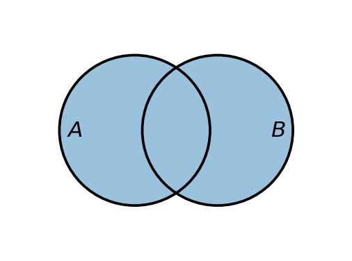
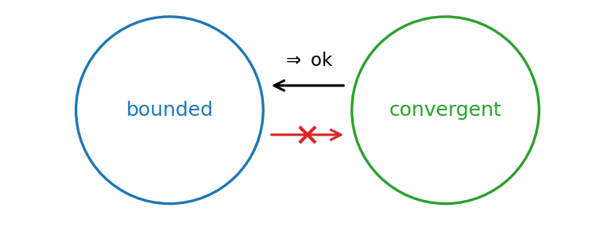
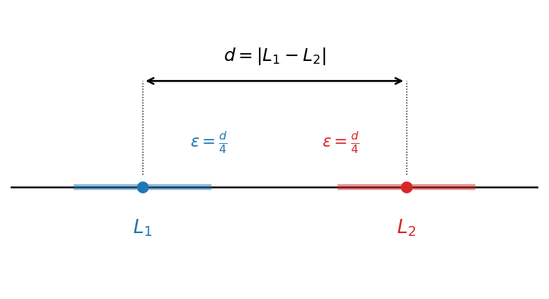
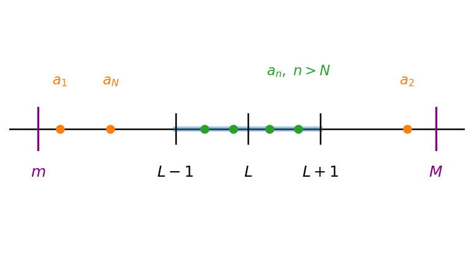

# קבוצות

## איברים והכלה

אחד המושגים הבסיסיים ביותר במתמטיקה הוא המושג **קבוצה**. באופן אינטואיטיבי, קבוצה היא אוסף של איברים, וכל אוסף ״הגיוני״ ניתן לחשוב עליו כקבוצה. למשל, אפשר לדבר על קבוצת כל המרצים בקורס בחדו״א 1 למהנדסים, על קבוצת ראשי ממשלת ישראל שכיהנו עד 2026, על קבוצות של אותיות, על קבוצות של מספרים, וכן הלאה. ברוב הקורס נעסוק בקבוצות של אובייקטים מתמטיים, כמו מספרים.

נתחיל בדוגמה פשוטה. קבוצות נהוג לסמן **באותיות לועזיות גדולות** (או בסימנים מיוחדים, כשמדובר בקבוצות מוכרות, כפי שנראה בהמשך), ואת איברי הקבוצה ניתן לתאר בכמה דרכים. הדרך הפשוטה ביותר היא רישום האיברים בתוך סוגריים מסולסלים. נסמן ב-$A$ את קבוצת שלוש האותיות הראשונות בא״ב האנגלי; הרישום המלא הוא $$.A=\{a,\,b,\,c\}$$

הקבוצה נקראת $A$, ואיבריה הם האותיות $a$, $b$ ו-$c$.

כדי לציין שאובייקט מסוים הוא איבר בקבוצה, משתמשים בסימן ההשתייכות $\in$. הכתיב $x \in X$ נקרא ״$x$ שייך ל-$X$״, ופירושו ש-$x$ הוא איבר של $X$; הכתיב $x \notin X$ פירושו ש-$x$ אינו איבר של $X$. כך, למשל, $a \in A$ ואילו $d \notin A$.

מה מאפיין קבוצה? אך ורק זהות איבריה. לפיכך, שתי קבוצות שוות זו לזו אם ורק אם הן מכילות בדיוק את אותם האיברים. בעזרת סימן ההשתייכות נוכל לנסח זאת באופן פורמלי.

::: {#def-set-equality .definition}
שתי קבוצות $A$ ו-$B$ הן **שוות**, ונסמן $A=B$, אם לכל אובייקט $x$ מתקיים $$,x \in A \leftrightarrow x \in B$$ כלומר, כל איבר של $A$ הוא איבר של $B$ ולהפך.
:::

מהגדרה זו נובע שברישום של קבוצה אין חשיבות לסדר האיברים ואין חשיבות לחזרות. כך, למשל, שלוש הקבוצות הבאות שוות זו לזו: $$.\{a,a,b,c,c\}=\{a,b,c\}=\{b,c,a\}$$

לעומת זאת, נתבונן בקבוצה $B=\{a,\,b,\,d\}$. הקבוצות $A=\{a,\,b,\,c\}$ ו-$B$ **אינן** שוות. כדי להראות זאת, די למצוא אובייקט **יחיד** שעבורו השקילות $x \in A \leftrightarrow x \in B$ אינה מתקיימת — כלומר איבר ששייך לאחת הקבוצות אך לא לשנייה. ואכן, $c \in A$ אך $c \notin B$: האות $c$ שייכת ל-$A$ אך אינה שייכת ל-$B$, ולכן השקילות נכשלת עבור $x=c$, **ודי בכך** כדי להסיק ש-$A \neq B$. כלומר, **מספיק איבר מבדיל אחד** — אין צורך לבדוק את כל האיברים. במקרה זה קיים גם איבר מבדיל שני, שכן $d \in B$ אך $d \notin A$, אך כאמור צד אחד מספיק; הצגנו את שניהם רק לשם ההמחשה.

כעת נפנה למושג ה**הכלה**: מתי קבוצה אחת ״נמצאת בתוך״ קבוצה אחרת.

::: {#def-subset .definition}
תהיינה $A$ ו-$B$ קבוצות. נאמר ש-$B$ **מוכלת** ב-$A$, או ש-$B$ היא **תת-קבוצה** של $A$, ונסמן $B \subseteq A$, אם כל איבר של $B$ הוא גם איבר של $A$; כלומר, לכל $x$ מתקיים $$.x \in B \to x \in A$$
:::

::: {#exm-subset .example}
נתבונן שוב בקבוצה $A=\{a,\,b,\,c\}$. הקבוצה $\{a,\,b\}$ היא תת-קבוצה של $A$, כלומר $\{a,\,b\} \subseteq A$, שכן כל איבר שלה שייך גם ל-$A$: אכן $a \in A$ וגם $b \in A$.
:::

חשוב להבחין בין שני הסימנים $\in$ ו-$\subseteq$, שכן ערבוב ביניהם הוא מקור נפוץ לבלבול. הסימן $\in$ מקשר **אובייקט (איבר)** לקבוצה: $x \in A$ פירושו ש-$x$ הוא אחד מאיברי $A$. לעומתו, הסימן $\subseteq$ מקשר **קבוצה** לקבוצה: $B \subseteq A$ פירושו שכל איברי $B$ הם איברים של $A$. כך, למשל, עבור $A=\{a,\,b,\,c\}$:

- $a \in A$ — נכון, שכן $a$ הוא איבר של $A$;
- $\{a\} \subseteq A$ — נכון, שכן הקבוצה $\{a\}$ מכילה איבר יחיד, $a$, ששייך ל-$A$;
- $\{a\} \in A$ — **לא נכון**: איברי $A$ הם האותיות $a,b,c$, והקבוצה $\{a\}$ אינה אחת מהן;
- $a \subseteq A$ — **חסר משמעות**, שכן $a$ אינו קבוצה (אלא איבר), ואין מובן ל״הכלה״ של איבר.

הקשר בין הכלה לשוויון נותן בידינו את שיטת ההוכחה החשובה ביותר לשוויון קבוצות.

::: {#prp-double-inclusion .proposition}
שתי קבוצות $A$ ו-$B$ שוות אם ורק אם כל אחת מהן מוכלת בשנייה; כלומר, $A=B$ אם ורק אם $A \subseteq B$ וגם $B \subseteq A$.
:::

הטענה נובעת ישירות מהגדרת השוויון: התנאי $x \in A \leftrightarrow x \in B$ שקול לכך ששתי הגרירות מתקיימות — $x \in A \to x \in B$ (שהיא $A \subseteq B$) ו-$x \in B \to x \in A$ (שהיא $B \subseteq A$). **זוהי הדרך הסטנדרטית והנפוצה ביותר להוכיח שוויון בין קבוצות**: מוכיחים בנפרד את שתי ההכלות, $A \subseteq B$ ואז $B \subseteq A$. שיטה זו שימושית במיוחד כאשר הקבוצות מוגדרות על ידי תכונה (בשיטת השומר) ולא על ידי רשימת איברים מפורשת — ובמקרים כאלה היא לרוב הדרך הטבעית ביותר.

נחזור לעניין תיאור איבריה של קבוצה. אף על פי שהסימון בעזרת סוגריים מסולסלים הוא פשוט וחד-משמעי, הוא אינו תמיד נוח, ולעיתים אף אינו מספיק. כל עוד באוסף יש מעט איברים אין בכך בעיה, אך מה נעשה אם במקום 3 איברים יש 100,000? כתיבת כולם עלולה להיות מייגעת למדי. **הכלל הוא שסימון נועד להקל על ההבנה ועל הניתוח של המידע, לא לסרבל אותם**; **אם סימון מסרבל במקום לפשט — אין בו צורך.** בעיה שנייה, חמורה אף יותר, מתעוררת כאשר בקבוצה יש אינסוף איברים — למשל אוסף כל המספרים הטבעיים $0,1,2,\dots$. במקרה כזה הסימון שהצגנו אינו מספיק כלל, שכן לא ניתן לכתוב אינסוף איברים בתוך סוגריים מסולסלים. לכן נזדקק לדרכים נוספות לתיאור קבוצות.

מהן האפשרויות? כאשר ההקשר ברור, לעיתים אפשר שלא לרשום את כל האיברים אלא להסתפק בכמה מהם ובשלוש נקודות. למשל, את קבוצת המספרים הטבעיים, המוכרת לכולכם, נהוג לכתוב $\mathbb{N}=\{0, 1, 2, \dots\}$; שלושת האיברים הראשונים $0, 1, 2$ כבר מבהירים את התבנית, ושלוש הנקודות מציינות שהרשימה נמשכת באותו אופן. (בקבוצה זו נדון בהרחבה [בסעיף על מערכות מספרים](03-number-systems.qmd#sec-number-systems).) דרך שנייה, נוחה לעיתים יותר — בפרט להגדרת קבוצות ותת-קבוצות באמצעות תכונה או נוסחה — היא **שיטת השומר** (סימון בונה-קבוצות), שאותה נציג כעת.

::: {#def-set-builder .definition}
תהי $X$ קבוצה, ותהי $P(x)$ **תכונה** — טענה שכל אובייקט $x$ מקיים אותה או אינו מקיים אותה. הקבוצה $$\{x \in X \mid P(x)\}$$ מוגדרת כקבוצת **כל** האיברים $x$ שב-$X$ המקיימים את התכונה $P$. הקו האנכי $\mid$, ה**שומר**, נקרא ״כך ש-״ (או ״שעבורם״), והוא מפריד בין שם האיבר לבין התנאי שעליו לקיים. כלומר, לכל אובייקט $y$ מתקיים ש-$y$ שייך לקבוצה אם ורק אם $y \in X$ והתכונה $P(y)$ מתקיימת. כאשר ה״עולם״ $X$ ברור מן ההקשר, נהוג לקצר ולכתוב $\{x \mid P(x)\}$.
:::

::: {#exm-set-builder .example}
הקבוצה $\{n \in \mathbb{N} \mid n > 5\}$ היא קבוצת כל המספרים הטבעיים הגדולים מ-$5$, כלומר $$.\{n \in \mathbb{N} \mid n > 5\} = \{6, 7, 8, \dots\}$$ כך, $7$ שייך לקבוצה (שכן $7 \in \mathbb{N}$ וגם $7 > 5$), ואילו $3$ אינו שייך לה (שכן $3$ אינו גדול מ-$5$).
:::

## הכמתים בשפה של תורת הקבוצות

בפרק על הלוגיקה הצגנו את ה**כמתים** ״לכל״ ($\forall$) ו״קיים״ ($\exists$) באופן לא-פורמלי, כאשר התחום שעליו הם פועלים תואר במילים (״כל איברי הקבוצה הנדונה״). כעת, משהגדרנו את סימן ההשתייכות $\in$, נוכל לציין במפורש על איזו קבוצה פועל הכמת, ולכתוב טענות ״לכל״ ו״קיים״ בסימון קצר ומדויק. (להצגה המלאה של הכמתים ראו את [הסעיף על כמתים לוגיים](01-logic.qmd#sec-quantifiers) בפרק הראשון.)

תהי $A$ קבוצה ותהי $P(x)$ תכונה. נכתוב:

- $\forall x \in A,\ P(x)$ ונקרא ״לכל $x$ ב-$A$ מתקיים $P(x)$״ — כלומר, **כל** איברי $A$ מקיימים את $P$;
- $\exists x \in A,\ P(x)$ ונקרא ״קיים $x$ ב-$A$ שעבורו $P(x)$״ — כלומר, **לפחות איבר אחד** של $A$ מקיים את $P$.

הצירוף $x \in A$ שליד הכמת מצמצם את הדיון לאיברי $A$ בלבד. למעשה, אלה קיצורים לביטויים שכבר מוכרים לנו: הטענה $\forall x \in A,\ P(x)$ שקולה ל-$\forall x\,(x \in A \to P(x))$, והטענה $\exists x \in A,\ P(x)$ שקולה ל-$\exists x\,(x \in A \land P(x))$. שימו לב לקשר בין הכמתים לקשרים הלוגיים: הכמת $\forall$ נשען על הגרירה $\to$ (״לכל איבר: אם הוא ב-$A$, אז הוא מקיים את $P$״), ואילו הכמת $\exists$ נשען על ה״וגם״ $\land$ (״קיים איבר שהוא ב-$A$ **וגם** מקיים את $P$״).

נדגים:

- $\forall n \in \mathbb{N},\ n \ge 0$ — אמת, שכן כל מספר טבעי הוא אי-שלילי;
- $\exists n \in \mathbb{N},\ n > 5$ — אמת, למשל עבור $n = 6$;
- $\forall x \in \mathbb{R},\ x^{2} \ge 0$ — אמת, שכן ריבוע של מספר ממשי לעולם אינו שלילי;
- $\exists x \in \mathbb{R},\ x^{2} = 4$ — אמת, למשל עבור $x = 2$;
- $\forall n \in \mathbb{N},\ n > 5$ — **שקר**: $3 \in \mathbb{N}$ אך $3$ אינו גדול מ-$5$, כלומר $3$ הוא דוגמה נגדית.

לבסוף, נעיר שכבר נעזרנו בכמת ״לכל״ בפרק זה, גם אם לא בסימון המפורש: הגדרת שוויון הקבוצות אינה אלא $\forall x\,(x \in A \leftrightarrow x \in B)$, והגדרת ההכלה אינה אלא $\forall x\,(x \in B \to x \in A)$. הכמת ״לכל״ עומד, אם כן, בבסיס עצם המושגים של שוויון והכלה בין קבוצות.

## הקבוצה הריקה

לעיתים נתקלים בקבוצה שאין בה אף איבר. למשל, קבוצת כל המספרים הטבעיים הקטנים מ-$0$ ריקה, וכן קבוצת הפתרונות הממשיים של המשוואה $x^2 = -1$. קבוצה כזו נקראת ה**קבוצה הריקה**.

::: {#def-empty-set .definition}
ה**קבוצה הריקה**, המסומנת $\emptyset$ (או $\{\}$), היא הקבוצה שאין לה אף איבר: לכל אובייקט $x$ מתקיים $x \notin \emptyset$.
:::

מכיוון שקבוצה נקבעת על ידי איבריה בלבד (כפי שקובעת הגדרת שוויון הקבוצות), יש **בדיוק קבוצה ריקה אחת** — כל שתי קבוצות נטולות איברים שוות זו לזו.

**נכונות באופן ריק.** מהי משמעותה של טענת ״לכל״ כאשר אין כלל איברים? נזכיר [מן הפרק על הלוגיקה](01-logic.qmd#sec-quantifiers) שטענה מן הצורה ״לכל $x$ ב-$A$ מתקיים $P(x)$״ היא **שקר** רק אם קיימת **דוגמה נגדית** — איבר של $A$ שאינו מקיים את $P$. אך בקבוצה הריקה אין אף איבר, ולכן אין דוגמה נגדית; לפיכך **כל** טענת ״לכל״ על הקבוצה הריקה היא **אמת**. אומרים שטענה כזו **נכונה באופן ריק** (vacuously true).

כאן מסתתרת נקודה חשובה: טענת ״לכל״ **אינה** טוענת שקיים משהו. הפסוק ״לכל $x \in \emptyset$ מתקיים $P(x)$״ אמת תמיד — לא משום שיש איברים המקיימים את $P$, אלא דווקא משום שאין איברים כלל. לעומת זאת, טענת ״קיים״ על הקבוצה הריקה היא תמיד **שקר**, שכן אין אף איבר להצביע עליו. כך, על הקבוצה הריקה **כל** טענת ״לכל״ אמת ו**כל** טענת ״קיים״ שקר — המחשה חדה לכך ש**״לכל״ אינו גורר ״קיים״**.

תוצאה מיידית של רעיון זה היא היחס בין הקבוצה הריקה לכל קבוצה אחרת.

::: {#prp-empty-subset .proposition}
הקבוצה הריקה מוכלת בכל קבוצה: לכל קבוצה $A$ מתקיים $\emptyset \subseteq A$.
:::

**הוכחה.** לפי הגדרת ההכלה, $\emptyset \subseteq A$ פירושו שלכל $x$ מתקיים ״אם $x \in \emptyset$ אז $x \in A$״. אך $x \in \emptyset$ הוא לעולם שקר, ולכן הגרירה אמת באופן ריק עבור כל $x$ (זהו הכלל ״מן השקר נובע הכול״ שראינו בפרק על הגרירה). מאחר שאין $x$ המפר את ההכלה, נובע ש-$\emptyset \subseteq A$. $\blacksquare$

## פעולות על קבוצות: איחוד, חיתוך והפרש

עד כה עסקנו בקבוצות נתונות. כעת נראה כיצד לבנות מהן קבוצות חדשות, בעזרת **פעולות על קבוצות**. שלוש הפעולות הבסיסיות הן ה**איחוד**, ה**חיתוך** וה**הפרש**. פעולות אלה אינן שרירותיות: כל אחת מהן מקבילה לאחד ה[קשרים הלוגיים](01-logic.qmd#sec-connectives) שראינו בפרק הקודם — ולמעשה נגדיר כל פעולה בעזרת הקשר המתאים, המופעל על פסוקי ההשתייכות $x \in A$ ו-$x \in B$. לאורך הסעיף, $A$ ו-$B$ הן קבוצות כלשהן.

כדי להמחיש פעולות אלה נשתמש ב**דיאגרמות ון** (על שם הלוגיקן ג׳ון ון). בדיאגרמה כזו כל קבוצה מצוירת כאזור במישור — לרוב עיגול — ונקודות שבתוכו מייצגות את איבריה; אזור החפיפה בין שני עיגולים מייצג את האיברים המשותפים לשתי הקבוצות, ומלבן מקיף (כשנזדקק לו) מייצג את ה״עולם״ שבתוכו אנו עובדים. את תוצאת הפעולה נדגיש בעזרת **הצללה** של האזור המתאים. חשוב לזכור: דיאגרמת ון היא כלי המחשה בלבד, לא הוכחה — היא מסייעת לאינטואיציה, אך ההגדרות הפורמליות הן הקובעות.

### איחוד

::: {#def-union .definition}
ה**איחוד** של $A$ ו-$B$, המסומן $A \cup B$, הוא קבוצת כל האיברים השייכים ל-$A$ או ל-$B$ (או לשתיהן): $$.A \cup B = \{x \mid x \in A \lor x \in B\}$$
:::

הגדרה זו נשענת על הקשר [״או״](01-logic.qmd#sec-disjunction): איבר שייך לאיחוד בדיוק כאשר הפסוק $x \in A \lor x \in B$ אמת. כזכור, ה״או״ הלוגי הוא **מכליל**, ולכן איבר השייך לשתי הקבוצות שייך גם לאיחוד.

```{python}
#| echo: false
#| output: false
import numpy as np
import matplotlib.pyplot as plt
from matplotlib.patches import Circle

res = 500
xs = np.linspace(-2.2, 2.2, res)
ys = np.linspace(-1.6, 1.6, res)
X, Y = np.meshgrid(xs, ys)
A = (X + 0.55) ** 2 + Y ** 2 <= 1.0
B = (X - 0.55) ** 2 + Y ** 2 <= 1.0
region = A | B

img = np.zeros((res, res, 4))
img[..., 0], img[..., 1], img[..., 2] = 0.12, 0.47, 0.71
img[..., 3] = np.where(region, 0.45, 0.0)

fig, ax = plt.subplots(figsize=(4.2, 3.0))
ax.imshow(img, extent=[xs[0], xs[-1], ys[0], ys[-1]], origin="lower", zorder=1)
ax.add_patch(Circle((-0.55, 0), 1.0, fill=False, lw=1.8, color="black", zorder=2))
ax.add_patch(Circle((0.55, 0), 1.0, fill=False, lw=1.8, color="black", zorder=2))
ax.text(-1.35, 0.0, r"$A$", ha="center", va="center", fontsize=15)
ax.text(1.35, 0.0, r"$B$", ha="center", va="center", fontsize=15)
ax.set_xlim(xs[0], xs[-1])
ax.set_ylim(ys[0], ys[-1])
ax.set_aspect("equal")
ax.axis("off")
fig.savefig("c02_fig01.png", dpi=150, bbox_inches="tight")
plt.close(fig)
```

```{=latex}
\par\medskip
\noindent\beginL\hbox to \linewidth{\hss\includegraphics[width=0.5\linewidth]{c02_fig01.png}\hss}\endL\par
\medskip
```

:::: {.content-visible when-format="pdf"}
::: {style="text-align:center"}
דיאגרמת ון: האיחוד $A \cup B$ הוא האזור המוצלל.
:::
::::

::: {.content-visible when-format="html"}
{#fig-union width="50%" fig-align="center"}
:::

::: {#exm-union .example}
עבור $A = \{1,2,3,4\}$ ו-$B = \{3,4,5,6\}$ מתקבל $$.A \cup B = \{1,2,3,4,5,6\}$$
:::

### חיתוך

::: {#def-intersection .definition}
ה**חיתוך** של $A$ ו-$B$, המסומן $A \cap B$, הוא קבוצת כל האיברים השייכים ל-$A$ **וגם** ל-$B$: $$.A \cap B = \{x \mid x \in A \land x \in B\}$$
:::

כאן הפעולה נשענת על הקשר [״וגם״](01-logic.qmd#sec-conjunction): איבר שייך לחיתוך רק אם הוא שייך לשתי הקבוצות בו-זמנית.

```{python}
#| echo: false
#| output: false
import numpy as np
import matplotlib.pyplot as plt
from matplotlib.patches import Circle

res = 500
xs = np.linspace(-2.2, 2.2, res)
ys = np.linspace(-1.6, 1.6, res)
X, Y = np.meshgrid(xs, ys)
A = (X + 0.55) ** 2 + Y ** 2 <= 1.0
B = (X - 0.55) ** 2 + Y ** 2 <= 1.0
region = A & B

img = np.zeros((res, res, 4))
img[..., 0], img[..., 1], img[..., 2] = 0.12, 0.47, 0.71
img[..., 3] = np.where(region, 0.45, 0.0)

fig, ax = plt.subplots(figsize=(4.2, 3.0))
ax.imshow(img, extent=[xs[0], xs[-1], ys[0], ys[-1]], origin="lower", zorder=1)
ax.add_patch(Circle((-0.55, 0), 1.0, fill=False, lw=1.8, color="black", zorder=2))
ax.add_patch(Circle((0.55, 0), 1.0, fill=False, lw=1.8, color="black", zorder=2))
ax.text(-1.35, 0.0, r"$A$", ha="center", va="center", fontsize=15)
ax.text(1.35, 0.0, r"$B$", ha="center", va="center", fontsize=15)
ax.set_xlim(xs[0], xs[-1])
ax.set_ylim(ys[0], ys[-1])
ax.set_aspect("equal")
ax.axis("off")
fig.savefig("c02_fig02.png", dpi=150, bbox_inches="tight")
plt.close(fig)
```

```{=latex}
\par\medskip
\noindent\beginL\hbox to \linewidth{\hss\includegraphics[width=0.5\linewidth]{c02_fig02.png}\hss}\endL\par
\medskip
```

:::: {.content-visible when-format="pdf"}
::: {style="text-align:center"}
דיאגרמת ון: החיתוך $A \cap B$ הוא האזור המשותף המוצלל.
:::
::::

::: {.content-visible when-format="html"}
{#fig-intersection width="50%" fig-align="center"}
:::

::: {#exm-intersection .example}
עבור אותן $A = \{1,2,3,4\}$ ו-$B = \{3,4,5,6\}$ מן הדוגמה הקודמת, $$.A \cap B = \{3,4\}$$ שכן רק $3$ ו-$4$ שייכים לשתי הקבוצות.
:::

### הפרש

::: {#def-difference .definition}
ה**הפרש** ״$A$ פחות $B$״, המסומן $A \setminus B$, הוא קבוצת כל האיברים השייכים ל-$A$ אך **אינם** שייכים ל-$B$: $$.A \setminus B = \{x \mid x \in A \land x \notin B\}$$
:::

ההפרש משלב את הקשר ״וגם״ עם ה[שלילה](01-logic.qmd#sec-negation): התנאי $x \notin B$ הוא בדיוק שלילת הפסוק $x \in B$. שימו לב שההפרש **אינו סימטרי** — בדרך כלל $A \setminus B \neq B \setminus A$.

```{python}
#| echo: false
#| output: false
import numpy as np
import matplotlib.pyplot as plt
from matplotlib.patches import Circle

res = 500
xs = np.linspace(-2.2, 2.2, res)
ys = np.linspace(-1.6, 1.6, res)
X, Y = np.meshgrid(xs, ys)
A = (X + 0.55) ** 2 + Y ** 2 <= 1.0
B = (X - 0.55) ** 2 + Y ** 2 <= 1.0
region = A & ~B

img = np.zeros((res, res, 4))
img[..., 0], img[..., 1], img[..., 2] = 0.12, 0.47, 0.71
img[..., 3] = np.where(region, 0.45, 0.0)

fig, ax = plt.subplots(figsize=(4.2, 3.0))
ax.imshow(img, extent=[xs[0], xs[-1], ys[0], ys[-1]], origin="lower", zorder=1)
ax.add_patch(Circle((-0.55, 0), 1.0, fill=False, lw=1.8, color="black", zorder=2))
ax.add_patch(Circle((0.55, 0), 1.0, fill=False, lw=1.8, color="black", zorder=2))
ax.text(-1.35, 0.0, r"$A$", ha="center", va="center", fontsize=15)
ax.text(1.35, 0.0, r"$B$", ha="center", va="center", fontsize=15)
ax.set_xlim(xs[0], xs[-1])
ax.set_ylim(ys[0], ys[-1])
ax.set_aspect("equal")
ax.axis("off")
fig.savefig("c02_fig03.png", dpi=150, bbox_inches="tight")
plt.close(fig)
```

```{=latex}
\par\medskip
\noindent\beginL\hbox to \linewidth{\hss\includegraphics[width=0.5\linewidth]{c02_fig03.png}\hss}\endL\par
\medskip
```

:::: {.content-visible when-format="pdf"}
::: {style="text-align:center"}
דיאגרמת ון: ההפרש $A \setminus B$ הוא החלק של $A$ שאינו ב-$B$ (האזור המוצלל).
:::
::::

::: {.content-visible when-format="html"}
{#fig-difference width="50%" fig-align="center"}
:::

::: {#exm-difference .example}
עבור $A = \{1,2,3,4\}$ ו-$B = \{3,4,5,6\}$ מתקבל $$.A \setminus B = \{1,2\}$$ ואילו $$.B \setminus A = \{5,6\}$$ ואכן שני ההפרשים שונים זה מזה.
:::

### הפרש סימטרי

::: {#def-symmetric-difference .definition}
ה**הפרש הסימטרי** של $A$ ו-$B$, המסומן $A \triangle B$, הוא קבוצת כל האיברים השייכים ל**אחת** מן הקבוצות בלבד — לזו או לזו, אך לא לשתיהן. באופן טבעי מגדירים אותו כאיחוד שני ההפרשים: $$.A \triangle B = (A \setminus B) \cup (B \setminus A)$$
:::

כלומר, $x \in A \triangle B$ בדיוק כאשר $x \in A \setminus B$ או $x \in B \setminus A$. השם ״הפרש סימטרי״ נובע מכך: זהו ההפרש, ״מסומטר״ על ידי איחוד $A \setminus B$ עם $B \setminus A$. יש להפרש הסימטרי גם צורה שקולה תמציתית יותר — **האיחוד ללא החיתוך** — שאותה נוכיח בהמשך.

```{python}
#| echo: false
#| output: false
import numpy as np
import matplotlib.pyplot as plt
from matplotlib.patches import Circle

res = 500
xs = np.linspace(-2.2, 2.2, res)
ys = np.linspace(-1.6, 1.6, res)
X, Y = np.meshgrid(xs, ys)
A = (X + 0.55) ** 2 + Y ** 2 <= 1.0
B = (X - 0.55) ** 2 + Y ** 2 <= 1.0
region = A ^ B

img = np.zeros((res, res, 4))
img[..., 0], img[..., 1], img[..., 2] = 0.12, 0.47, 0.71
img[..., 3] = np.where(region, 0.45, 0.0)

fig, ax = plt.subplots(figsize=(4.2, 3.0))
ax.imshow(img, extent=[xs[0], xs[-1], ys[0], ys[-1]], origin="lower", zorder=1)
ax.add_patch(Circle((-0.55, 0), 1.0, fill=False, lw=1.8, color="black", zorder=2))
ax.add_patch(Circle((0.55, 0), 1.0, fill=False, lw=1.8, color="black", zorder=2))
ax.text(-1.35, 0.0, r"$A$", ha="center", va="center", fontsize=15)
ax.text(1.35, 0.0, r"$B$", ha="center", va="center", fontsize=15)
ax.set_xlim(xs[0], xs[-1])
ax.set_ylim(ys[0], ys[-1])
ax.set_aspect("equal")
ax.axis("off")
fig.savefig("c02_fig05.png", dpi=150, bbox_inches="tight")
plt.close(fig)
```

```{=latex}
\par\medskip
\noindent\beginL\hbox to \linewidth{\hss\includegraphics[width=0.5\linewidth]{c02_fig05.png}\hss}\endL\par
\medskip
```

:::: {.content-visible when-format="pdf"}
::: {style="text-align:center"}
דיאגרמת ון: ההפרש הסימטרי $A \triangle B$ הוא כל מה ששייך לאחת הקבוצות בלבד (האזור המוצלל).
:::
::::

::: {.content-visible when-format="html"}
{#fig-symmetric-difference width="50%" fig-align="center"}
:::

::: {#exm-symmetric-difference .example}
עבור $A = \{1,2,3,4\}$ ו-$B = \{3,4,5,6\}$ מתקבל $$.A \triangle B = \{1,2,5,6\}$$ האיברים $3$ ו-$4$, המשותפים לשתי הקבוצות, מושמטים, ונותרים רק אלה השייכים לאחת מהן בלבד.
:::

הצורה השקולה שהזכרנו — האיחוד ללא החיתוך — היא טענה הראויה להוכחה, וגם דוגמה יפה לשיטת ההכלה הכפולה.

::: {#prp-symmetric-difference .proposition}
לכל שתי קבוצות $A$ ו-$B$ מתקיים $$.A \triangle B = (A \cup B) \setminus (A \cap B)$$
:::

**הוכחה.** נוכיח את השוויון ב**שיטת ההכלה הכפולה**: נראה שכל אחת מן הקבוצות מוכלת בשנייה.

**כיוון ראשון** — נוכיח ש-$A \triangle B \subseteq (A \cup B) \setminus (A \cap B)$. יהי $x$ איבר כלשהו של $A \triangle B = (A \setminus B) \cup (B \setminus A)$; עלינו להראות ש-$x \in (A \cup B) \setminus (A \cap B)$. לפי הגדרת האיחוד, $x \in A \setminus B$ **או** $x \in B \setminus A$. נבחן את שני המקרים:

- אם $x \in A \setminus B$, אז $x \in A$ (ולכן $x \in A \cup B$) וגם $x \notin B$ (ולכן $x \notin A \cap B$).
- אם $x \in B \setminus A$, אז $x \in B$ (ולכן $x \in A \cup B$) וגם $x \notin A$ (ולכן $x \notin A \cap B$).

בשני המקרים $x \in A \cup B$ אך $x \notin A \cap B$, כלומר $x \in (A \cup B) \setminus (A \cap B)$. לכן $A \triangle B \subseteq (A \cup B) \setminus (A \cap B)$.

**כיוון שני** — נוכיח ש-$(A \cup B) \setminus (A \cap B) \subseteq A \triangle B$. יהי $x$ איבר כלשהו של $(A \cup B) \setminus (A \cap B)$; עלינו להראות ש-$x \in A \triangle B$. לפי הגדרת ההפרש, $x \in A \cup B$ אך $x \notin A \cap B$: כלומר $x$ שייך ל-$A$ או ל-$B$ (לפחות לאחת), אך לא לשתיהן גם יחד. לכן הוא שייך **בדיוק לאחת** מהן:

- אם $x \in A$, אז מאחר ש-$x \notin A \cap B$ בהכרח $x \notin B$, ולכן $x \in A \setminus B$.
- אם $x \in B$, אז באותו אופן $x \notin A$, ולכן $x \in B \setminus A$.

בשני המקרים $x \in (A \setminus B) \cup (B \setminus A) = A \triangle B$. לכן $(A \cup B) \setminus (A \cap B) \subseteq A \triangle B$.

משתי ההכלות נובע, לפי שיטת ההכלה הכפולה, ש-$A \triangle B = (A \cup B) \setminus (A \cap B)$. $\blacksquare$

**הערה על מבנה ההוכחה.** זהו המבנה הסטנדרטי להוכחת שוויון קבוצות: כדי להראות $S \subseteq T$ בוחרים איבר **כלשהו** $x \in S$ ומראים, צעד אחר צעד לפי ההגדרות, ש-$x \in T$; ומכיוון ש-$x$ שרירותי, הדבר תקף לכל איברי $S$. כאשר כל צעד הוא **שקילות** (״אם ורק אם״), אפשר לקצר ולאחד את שני הכיוונים לשרשרת שקילויות אחת — כפי שנעשה מיד בטענה על ההפרש והמשלים.

### משלים

לעיתים כל הקבוצות שבהן אנו דנים הן תת-קבוצות של קבוצה אחת גדולה — למשל, בקורס זה נעסוק כמעט תמיד בתת-קבוצות של הממשיים. קבוצה כזו, שכל האיברים הנדונים שייכים לה, נקראת **קבוצה אוניברסלית** (או ״עולם״) ומסומנת $U$. חשוב להבין ש-$U$ אינה ״קבוצת הכול״ מוחלטת — אין דבר כזה — אלא **תחום הדיון** שבחרנו לעבוד בתוכו, והוא משתנה מהקשר להקשר. זהו בדיוק אותו ״עולם״ שכבר פגשנו בשיטת השומר, ולרוב הוא ברור מאליו מן ההקשר (אצלנו — הממשיים). ביחס לעולם כזה נגדיר את ה**משלים** של קבוצה.

::: {#def-complement .definition}
תהי $U$ קבוצה אוניברסלית ותהי $A \subseteq U$. ה**משלים** של $A$ (**ביחס ל-**$U$), המסומן $A^{c}$ (או $\overline{A}$), הוא קבוצת כל איברי $U$ שאינם שייכים ל-$A$: $$.A^{c} = \{x \in U \mid x \notin A\} = U \setminus A$$
:::

במילים אחרות, המשלים אינו אלא ה**הפרש מן העולם כולו**, $U \setminus A$ — מקרה פרטי של פעולת ההפרש. הוא גם המקבילה הקבוצתית של ה[שלילה](01-logic.qmd#sec-negation): מתקיים $x \in A^{c}$ אם ורק אם הפסוק $x \in A$ שקר.

הדגשנו ״**ביחס ל-**$U$״ במתכוון, שכן המשלים **תלוי בעולם**: כך, המשלים של קבוצת המספרים הזוגיים הוא קבוצת האי-זוגיים כאשר $U = \mathbb{N}$, אך קבוצה אחרת לגמרי כאשר $U = \mathbb{R}$. מאחורי הסימון $A^{c}$ מסתתר, אם כן, עולם $U$ מסוים. כאשר העולם ברור מן ההקשר — וכך כמעט תמיד — משמיטים את ״ביחס ל-$U$״ וכותבים בקצרה $A^{c}$, אך יש לזכור שהוא תמיד עומד ברקע.

```{python}
#| echo: false
#| output: false
import numpy as np
import matplotlib.pyplot as plt
from matplotlib.patches import Circle, Rectangle

res = 500
xs = np.linspace(-2.0, 2.0, res)
ys = np.linspace(-1.5, 1.5, res)
X, Y = np.meshgrid(xs, ys)
A = X ** 2 + Y ** 2 <= 1.0
region = ~A

img = np.zeros((res, res, 4))
img[..., 0], img[..., 1], img[..., 2] = 0.12, 0.47, 0.71
img[..., 3] = np.where(region, 0.40, 0.0)

fig, ax = plt.subplots(figsize=(4.4, 3.3))
ax.imshow(img, extent=[xs[0], xs[-1], ys[0], ys[-1]], origin="lower", zorder=1)
ax.add_patch(Rectangle((xs[0], ys[0]), xs[-1] - xs[0], ys[-1] - ys[0],
                       fill=False, lw=1.6, color="black"))
ax.add_patch(Circle((0, 0), 1.0, fill=False, lw=1.8, color="black", zorder=2))
ax.text(0, 0, r"$A$", ha="center", va="center", fontsize=15)
ax.text(xs[0] + 0.16, ys[-1] - 0.16, r"$U$", ha="left", va="top", fontsize=15)
ax.set_xlim(xs[0], xs[-1])
ax.set_ylim(ys[0], ys[-1])
ax.set_aspect("equal")
ax.axis("off")
fig.savefig("c02_fig04.png", dpi=150, bbox_inches="tight")
plt.close(fig)
```

```{=latex}
\par\medskip
\noindent\beginL\hbox to \linewidth{\hss\includegraphics[width=0.5\linewidth]{c02_fig04.png}\hss}\endL\par
\medskip
```

:::: {.content-visible when-format="pdf"}
::: {style="text-align:center"}
דיאגרמת ון: המשלים $A^{c}$ הוא כל מה שבתוך העולם $U$ ומחוץ ל-$A$ (האזור המוצלל).
:::
::::

::: {.content-visible when-format="html"}
{#fig-complement width="50%" fig-align="center"}
:::

::: {#exm-complement .example}
נניח $U = \{1, 2, \dots, 10\}$ ו-$A = \{1,2,3,4\}$. אז $$.A^{c} = \{5,6,7,8,9,10\}$$
:::

לבסוף, בעזרת המשלים אפשר לנסח מחדש את ההפרש: להוציא מ-$A$ את איברי $B$ שקול להשאיר את איברי $A$ שנמצאים במשלים של $B$.

::: {#prp-difference-complement .proposition}
תהי $U$ קבוצה אוניברסלית ו-$A, B \subseteq U$. אז $$.A \setminus B = A \cap B^{c}$$
:::

**הוכחה.** כאן כל צעד הוא שקילות, ולכן נוכיח את השוויון בשרשרת שקילויות אחת (במקום בשתי הכלות נפרדות): לכל $x$, $$.x \in A \setminus B \iff (x \in A \ \wedge\ x \notin B) \iff (x \in A \ \wedge\ x \in B^{c}) \iff x \in A \cap B^{c}$$ השקילות הראשונה היא הגדרת ההפרש, השנייה — הגדרת המשלים, והשלישית — הגדרת החיתוך. מאחר שלכל $x$ מתקיים $x \in A \setminus B$ אם ורק אם $x \in A \cap B^{c}$, שתי הקבוצות שוות. $\blacksquare$

### תרגילים

כמה תרגילי חישוב לסיכום הפעולות. רשמו את איברי כל קבוצה שמתקבלת בסדר עולה, או השאירו ריק אם היא הקבוצה הריקה. (בגרסה המקוונת אפשר להקליד את התשובה וללחוץ ״בדיקה״; בגרסה המודפסת — הפתרונות בהמשך.)

::: {.content-visible when-format="html"}
```{=html}
<p><strong>תרגיל 1.</strong> נתונות \(A = \{1,2,3,4,5\}\) ו-\(B = \{2,4,6\}\):</p>
<div class="set-quiz" data-answer="1,2,3,4,5,6"><span class="set-label">(א) \(A \cup B\)</span><input class="set-input" type="text" placeholder="לדוגמה: 1, 2, 3"><button class="set-check">בדיקה</button><span class="set-feedback"></span></div>
<div class="set-quiz" data-answer="2,4"><span class="set-label">(ב) \(A \cap B\)</span><input class="set-input" type="text" placeholder="לדוגמה: 1, 2, 3"><button class="set-check">בדיקה</button><span class="set-feedback"></span></div>
<div class="set-quiz" data-answer="1,3,5"><span class="set-label">(ג) \(A \setminus B\)</span><input class="set-input" type="text" placeholder="לדוגמה: 1, 2, 3"><button class="set-check">בדיקה</button><span class="set-feedback"></span></div>
<div class="set-quiz" data-answer="6"><span class="set-label">(ד) \(B \setminus A\)</span><input class="set-input" type="text" placeholder="לדוגמה: 1, 2, 3"><button class="set-check">בדיקה</button><span class="set-feedback"></span></div>
<div class="set-quiz" data-answer="1,3,5,6"><span class="set-label">(ה) \(A \triangle B\)</span><input class="set-input" type="text" placeholder="לדוגמה: 1, 2, 3"><button class="set-check">בדיקה</button><span class="set-feedback"></span></div>

<p><strong>תרגיל 2.</strong> יהי העולם \(U = \{1,2,\dots,10\}\), ותהיינה \(A = \{1,3,5,7,9\}\) ו-\(B = \{2,3,5,7\}\):</p>
<div class="set-quiz" data-answer="2,4,6,8,10"><span class="set-label">(א) \(A^{c}\)</span><input class="set-input" type="text" placeholder="לדוגמה: 1, 2, 3"><button class="set-check">בדיקה</button><span class="set-feedback"></span></div>
<div class="set-quiz" data-answer="1,4,6,8,9,10"><span class="set-label">(ב) \(B^{c}\)</span><input class="set-input" type="text" placeholder="לדוגמה: 1, 2, 3"><button class="set-check">בדיקה</button><span class="set-feedback"></span></div>
<div class="set-quiz" data-answer="3,5,7"><span class="set-label">(ג) \(A \cap B\)</span><input class="set-input" type="text" placeholder="לדוגמה: 1, 2, 3"><button class="set-check">בדיקה</button><span class="set-feedback"></span></div>
<div class="set-quiz" data-answer="1,2,3,5,7,9"><span class="set-label">(ד) \(A \cup B\)</span><input class="set-input" type="text" placeholder="לדוגמה: 1, 2, 3"><button class="set-check">בדיקה</button><span class="set-feedback"></span></div>
<div class="set-quiz" data-answer="1,2,9"><span class="set-label">(ה) \(A \triangle B\)</span><input class="set-input" type="text" placeholder="לדוגמה: 1, 2, 3"><button class="set-check">בדיקה</button><span class="set-feedback"></span></div>
<div class="set-quiz" data-answer=""><span class="set-label">(ו) \(A \cap A^{c}\)</span><input class="set-input" type="text" placeholder="השאירו ריק אם התוצאה ∅"><button class="set-check">בדיקה</button><span class="set-feedback"></span></div>
```
:::

:::: {.content-visible when-format="pdf"}
**תרגיל 1.** נתונות $A = \{1,2,3,4,5\}$ ו-$B = \{2,4,6\}$. חשבו: (א) $A \cup B$; (ב) $A \cap B$; (ג) $A \setminus B$; (ד) $B \setminus A$; (ה) $A \triangle B$.

**תרגיל 2.** יהי העולם $U = \{1,2,\dots,10\}$, ותהיינה $A = \{1,3,5,7,9\}$ ו-$B = \{2,3,5,7\}$. חשבו: (א) $A^{c}$; (ב) $B^{c}$; (ג) $A \cap B$; (ד) $A \cup B$; (ה) $A \triangle B$; (ו) $A \cap A^{c}$.

::: {.callout-tip title="פתרונות"}
**תרגיל 1.** (א) $\{1,2,3,4,5,6\}$; (ב) $\{2,4\}$; (ג) $\{1,3,5\}$; (ד) $\{6\}$; (ה) $\{1,3,5,6\}$.

**תרגיל 2.** (א) $\{2,4,6,8,10\}$; (ב) $\{1,4,6,8,9,10\}$; (ג) $\{3,5,7\}$; (ד) $\{1,2,3,5,7,9\}$; (ה) $\{1,2,9\}$; (ו) $\emptyset$.
:::
::::