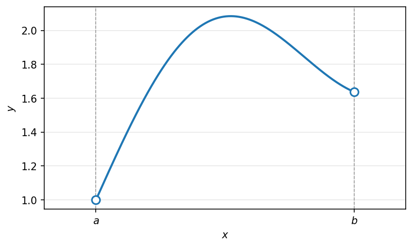
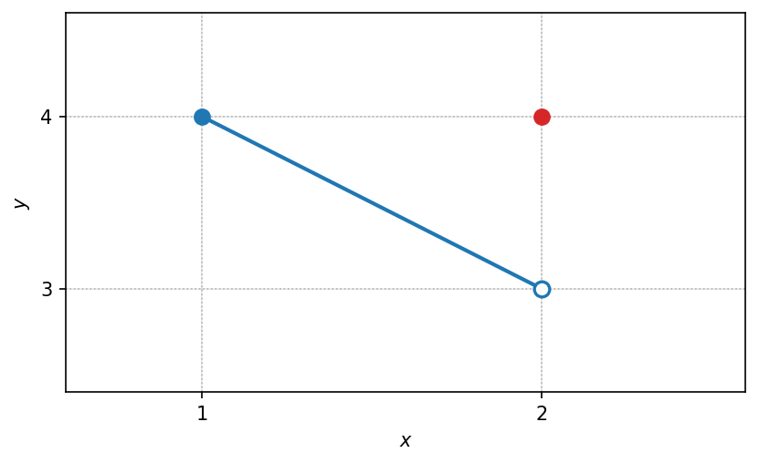
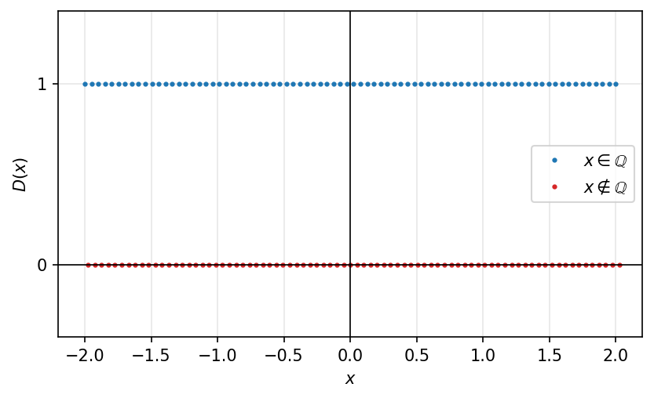
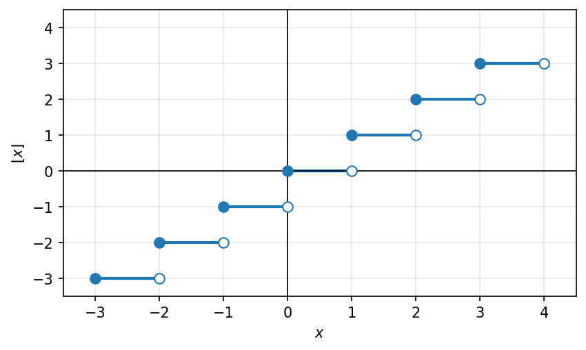
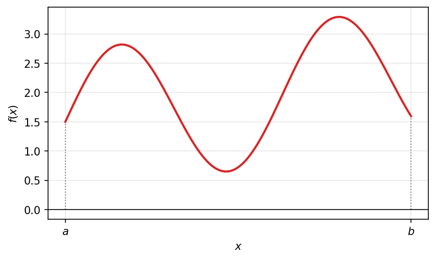
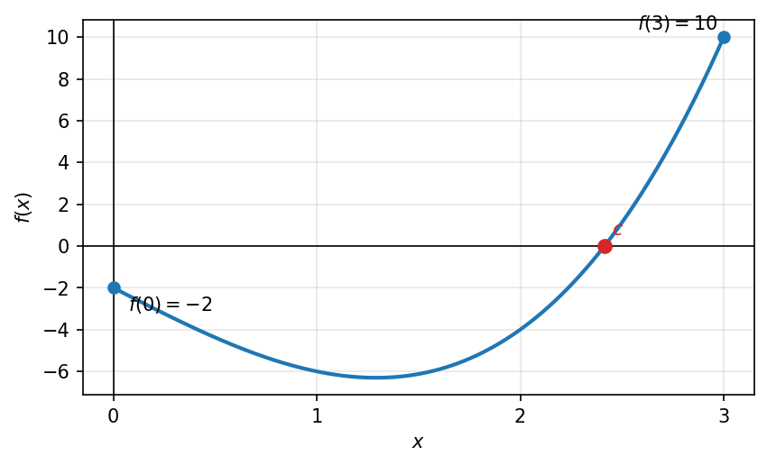
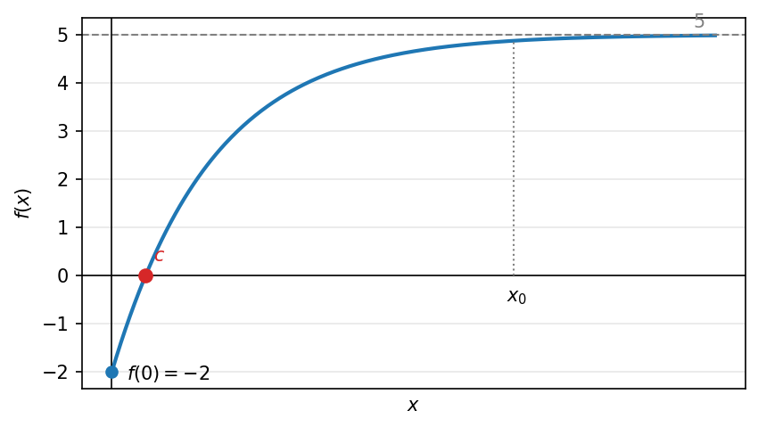

# רציפות

## הגדרת רציפות בנקודה ובקטע

### פונקציות רציפות

פונקציה היא רציפה אם ניתן לשרטטה מבלי להרים את העט מהדף.

פונקציה $f(x)$ היא רציפה ב- $x_0$ , אם $f$ מוגדרת בסביבה של $x_0$ , ומתקיים

$$\lim_{x \to x_0} f(x) = f(x_0)$$

(אגף שמאל: הגבול של $f$ ב-$x_0$ ; אגף ימין: הערך של $f$ ב-$x_0$)

```{python}
#| echo: false
#| output: false
import numpy as np
import matplotlib.pyplot as plt

fig, ax = plt.subplots(figsize=(6.4, 3.6))
a, b = 1.0, 4.0
x = np.linspace(a, b, 400)
f = 1.0 + 0.6 * np.sin(1.3 * (x - a)) + 0.35 * (x - a)
ax.plot(x, f, color="C0", lw=2)

ax.axvline(a, color="0.6", lw=0.8, ls="--")
ax.axvline(b, color="0.6", lw=0.8, ls="--")
# open endpoints
ax.plot([a], [f[0]], "o", mfc="white", mec="C0", mew=1.6, ms=8, zorder=5)
ax.plot([b], [f[-1]], "o", mfc="white", mec="C0", mew=1.6, ms=8, zorder=5)

ax.set_xticks([a, b])
ax.set_xticklabels([r"$a$", r"$b$"])
ax.set_xlabel(r"$x$")
ax.set_ylabel(r"$y$")
ax.grid(alpha=0.3)
ax.set_xlim(0.4, 4.6)
fig.savefig("c04_fig15.png", dpi=150, bbox_inches="tight")
plt.close(fig)
```

```{=latex}
\par\medskip
\noindent\beginL\hbox to \linewidth{\hss\includegraphics[width=0.62\linewidth]{c04_fig15.png}\hss}\endL\par
\medskip
```

::: {style="text-align:center"}
תרשים: פונקציה רציפה בקטע פתוח $(a,b)$
:::

::: {.content-visible when-format="html"}
{#fig-c04_fig15 width="62%" fig-align="center"}
:::

פונקציה $f(x)$ היא רציפה ב- $(a,b)$ , אם לכל $x_0 \in (a, b)$ הפונקציה $f$ רציפה ב- $x_0$ .

```{python}
#| echo: false
#| output: false
import numpy as np
import matplotlib.pyplot as plt

fig, ax = plt.subplots(figsize=(6.4, 3.6))
a, b = 1.0, 4.0
x = np.linspace(a, b, 400)
f = 4.0 - 0.8 * (x - a)   # decreasing linear
ax.plot(x, f, color="C0", lw=2)

ax.axvline(a, color="0.6", lw=0.8, ls="--")
ax.axvline(b, color="0.6", lw=0.8, ls="--")
# closed endpoints (continuous on closed interval)
ax.plot([a], [4.0], "o", color="C0", ms=8, zorder=5)
ax.plot([b], [4.0 - 0.8 * (b - a)], "o", color="C0", ms=8, zorder=5)

x0 = 2.3
ax.plot([x0], [4.0 - 0.8 * (x0 - a)], "o", color="C3", ms=6, zorder=6)
ax.axvline(x0, color="0.7", lw=0.8, ls=":")

ax.set_xticks([a, x0, b])
ax.set_xticklabels([r"$a$", r"$x_0$", r"$b$"])
ax.set_xlabel(r"$x$")
ax.set_ylabel(r"$y$")
ax.grid(alpha=0.3)
ax.set_xlim(0.4, 4.6)
fig.savefig("c04_fig16.png", dpi=150, bbox_inches="tight")
plt.close(fig)
```

```{=latex}
\par\medskip
\noindent\beginL\hbox to \linewidth{\hss\includegraphics[width=0.62\linewidth]{c04_fig16.png}\hss}\endL\par
\medskip
```

::: {style="text-align:center"}
תרשים: פונקציה לינארית יורדת רציפה בקטע סגור $[a,b]$ עם נקודה $x_0$
:::

::: {.content-visible when-format="html"}
![פונקציה לינארית יורדת רציפה בקטע סגור $[a,b]$ עם נקודה $x_0$](c04_fig16.png){#fig-c04_fig16 width="62%" fig-align="center"}
:::

פונקציה $f(x)$ היא רציפה ב- $[a,b]$ , אם לכל $a < x_0 < b$ הפונקציה $f$ רציפה ב- $x_0$ וגם

$$\lim_{x \to a^+} f(x) = f(a) \quad , \quad \lim_{x \to b^-} f(x) = f(b)$$

דוגמא

```{python}
#| echo: false
#| output: false
import numpy as np
import matplotlib.pyplot as plt

fig, ax = plt.subplots(figsize=(6.4, 3.6))
# decreasing curve from (1,4) approaching (2,3) but not including it
x = np.linspace(1, 2, 300)
f = 4.0 - (x - 1.0)        # goes from 4 at x=1 to 3 at x=2
ax.plot(x, f, color="C0", lw=2)

# filled point at (1,4)
ax.plot([1], [4], "o", color="C0", ms=8, zorder=6)
# limit value 3 as x->2 : open circle at (2,3)
ax.plot([2], [3], "o", mfc="white", mec="C0", mew=1.6, ms=8, zorder=6)
# actual value f(2)=4 : filled point at (2,4)
ax.plot([2], [4], "o", color="C3", ms=8, zorder=6)

for yv in (3, 4):
    ax.axhline(yv, color="0.7", lw=0.8, ls=":")
ax.axvline(1, color="0.7", lw=0.8, ls=":")
ax.axvline(2, color="0.7", lw=0.8, ls=":")

ax.set_yticks([3, 4])
ax.set_yticklabels([r"$3$", r"$4$"])
ax.set_xticks([1, 2])
ax.set_xticklabels([r"$1$", r"$2$"])
ax.set_xlabel(r"$x$")
ax.set_ylabel(r"$y$")
ax.grid(alpha=0.3)
ax.set_xlim(0.6, 2.6)
ax.set_ylim(2.4, 4.6)
fig.savefig("c04_fig17.png", dpi=150, bbox_inches="tight")
plt.close(fig)
```

```{=latex}
\par\medskip
\noindent\beginL\hbox to \linewidth{\hss\includegraphics[width=0.62\linewidth]{c04_fig17.png}\hss}\endL\par
\medskip
```

::: {style="text-align:center"}
תרשים: אי-רציפות ב-$x=2$ — $\lim_{x\to 2}f(x)=3$ אך $f(2)=4$
:::

::: {.content-visible when-format="html"}
{#fig-c04_fig17 width="62%" fig-align="center"}
:::

$$\lim_{x \to 2} f(x) = 3$$

$$f(2) = 4$$

הפונקציה רציפה ב- $(1,2)$ וב- $[1,2)$

הפונקציה לא רציפה ב- $[1,2]$

### דוגמאות:

- האם הפונקציה $f(x) = \frac{\sin(x)}{x}$ רציפה ב-0?

לא, כי היא לא מוגדרת ב-0. ת.ה: $R \setminus \{0\}$

- האם הפונקציה רציפה ב-0?

$$g(x) = \begin{cases} \frac{\sin(x)}{x} & x \neq 0 \\ 5 & x = 0 \end{cases}$$

$g$ מוגדרת ב-0: $g(0) = 5$

גבול הפונקציה:

$$\lim_{x \to 0} g(x) = \lim_{x \to 0} \frac{\sin(x)}{x} = 1$$

(נבול מופלא)

ולכן $g$ אינה רציפה, כי $1 = \lim_{x \to 0} g(x) \neq g(0) = 5$

- האם הפונקציה רציפה ב-0?

$$h(x) = \begin{cases} \frac{\sin(x)}{x} & x \neq 0 \\ 1 & x = 0 \end{cases}$$

הפונקציה רציפה ב-0, כי $\lim_{x \to 0} h(x) = 1 = h(0)$ $\longleftarrow$ $\lim_{x \to 0} \sin(x) = \sin(x_0)$

כלומר, $\sin(x)$ רציפה ב- $x_0$ לכל $x_0 \in R$ .

<!-- בדיקה: שוב מופיע "נבול מופלא" כמו בעמודים קודמים -->

## דוגמה: פונקציה מפוצלת עם גבולות מופלאים ופרמטר

### דוגמא נוספת

עבור אילו ערכים של $A, B \in R$ הפונקציה הבאה רציפה בנקודות $0$:

$$f(x) = \begin{cases} \dfrac{A \cdot \sin(2x)}{x} & x > 0 \\[2mm] B & x = 0 \\[2mm] 2 + \dfrac{\ln(x^2 + 1)}{x} & x < 0 \end{cases}$$

- נחשב את הגבולות החד צדדיים ב-$0$:

$$\lim\limits_{x \to 0^+} f(x) = \lim\limits_{x \to 0^+} A \cdot \frac{\sin(2x)}{x} = \lim\limits_{x \to 0} A \cdot 2 \cdot \frac{\sin(2x)}{2x} = A \cdot 2 \cdot 1 = 2A$$

ארתמטיקה של גבול בהנחה שהגבול האמצעי קיים: $\lim\limits_{t \to 0} \dfrac{\sin(t)}{t} = 1$

- בדומה:

$$\lim\limits_{x \to 0^-} f(x) = \lim\limits_{x \to 0} - \left(2 + \frac{\ln(x^2 + 1)}{x}\right) = \lim\limits_{x \to 0} \left(2 + \frac{x \cdot \ln(1 + x^2)}{x^2}\right) = 2 + 1 \cdot 0 = 2$$

עפ"י ארתמטיקה גם פה (בהנחה שקיים): $\lim\limits_{t \to 0} \dfrac{\ln(1 + t)}{t} = 1$

- לכן $f$ רציפה ב-$0$ אם ורק אם

$$\lim\limits_{x \to 0^+} f(x) = \lim\limits_{x \to 0^-} f(x) = f(0)$$

$$2A \qquad\qquad 2 \qquad\qquad B$$

כלומר: $A = 1$ , $B = 2$

> **הערה (מהמקור):** שלושת הביטויים $2A$, $2$, $B$ נכתבו במקור מתחת לשלושת איברי השוויון $\lim\limits_{x \to 0^+} f(x) = \lim\limits_{x \to 0^-} f(x) = f(0)$ בהתאמה, כדי להמחיש את תנאי הרציפות $2A = 2 = B$.

⭐ טעות נפוצה של "חצי אריתמטיקה": החלפת הפונקציה בגבול שלה

$$1 \overset{?}{=} \lim\limits_{x \to 0} \frac{\sin(x)}{x} \neq \lim\limits_{x \to 0} \frac{0}{x} = 0$$

## דוגמה: פונקציית דיריכלה

### פונקציית דיריכלה

$$D(x) = \begin{cases} 1 & x \in Q \\ 0 & x \notin Q \end{cases}$$

```{python}
#| echo: false
#| output: false
import numpy as np
import matplotlib.pyplot as plt

fig, ax = plt.subplots(figsize=(6.4, 3.6))
xs = np.linspace(-2, 2, 80)
ax.plot(xs, np.ones_like(xs), ".", color="C0", ms=4, label=r"$x \in \mathbb{Q}$")
ax.plot(xs + 0.025, np.zeros_like(xs), ".", color="C3", ms=4, label=r"$x \notin \mathbb{Q}$")
ax.axhline(0, color="black", lw=0.8)
ax.axvline(0, color="black", lw=0.8)
ax.set_xlim(-2.2, 2.2)
ax.set_ylim(-0.4, 1.4)
ax.set_xlabel("$x$")
ax.set_ylabel("$D(x)$")
ax.set_yticks([0, 1])
ax.legend(loc="center right")
ax.grid(alpha=0.3)
fig.savefig("c05_fig02.png", dpi=150, bbox_inches="tight")
plt.close(fig)
```

```{=latex}
\par\medskip
\noindent\beginL\hbox to \linewidth{\hss\includegraphics[width=0.62\linewidth]{c05_fig02.png}\hss}\endL\par
\medskip
```

::: {style="text-align:center"}
תרשים: גרף פונקציית דיריכלה, שתי שורות נקודות בגובה $1$ (רציונליים) ובגובה $0$ (אי רציונליים)
:::

::: {.content-visible when-format="html"}
{#fig-c05_fig02 width="62%" fig-align="center"}
:::

נראה כי $\lim\limits_{x \to x_0} D(x)$ לא רציפה באף נקודה.

לכל $x_0 \in R$ קיימת סדרה $(a_n)_{n=1}^{\infty}$ בה כולם רציונליים: $a_n \in Q$ , $\quad a_n \to x_0$ אז $D(a_n) = 1 \xrightarrow[n \to \infty]{} 1$

מצד שני, קיימת סדרה $b_n \notin Q$ : $\quad b_n \to x_0$ אז $D(b_n) = 0 \xrightarrow[n \to \infty]{} 0$

לכן לפי היינה $\lim\limits_{n \to \infty} D(x)$ לא קיים.

## דוגמה: פונקציית הערך השלם


### דוגמאות מיוחדות

פונקציית הערך השלם $f(x) = \lfloor x \rfloor$ רציפה בכל נקודה $x_0$, עבור $x_0 \notin \mathbb{Z}$.

```{python}
#| echo: false
#| output: false
import numpy as np
import matplotlib.pyplot as plt

fig, ax = plt.subplots(figsize=(6.4, 3.6))
for n in range(-3, 4):
    ax.hlines(n, n, n + 1, color="C0", lw=2)
    ax.plot(n, n, "o", color="C0", ms=7, zorder=5)            # closed left endpoint
    ax.plot(n + 1, n, "o", mfc="white", mec="C0", ms=7, zorder=5)  # open right endpoint
ax.axhline(0, color="black", lw=0.8)
ax.axvline(0, color="black", lw=0.8)
ax.set_xlim(-3.5, 4.5)
ax.set_ylim(-3.5, 4.5)
ax.set_xlabel("$x$")
ax.set_ylabel(r"$\lfloor x \rfloor$")
ax.set_xticks(range(-3, 5))
ax.set_yticks(range(-3, 5))
ax.grid(alpha=0.3)
fig.savefig("c05_fig01.png", dpi=150, bbox_inches="tight")
plt.close(fig)
```

```{=latex}
\par\medskip
\noindent\beginL\hbox to \linewidth{\hss\includegraphics[width=0.62\linewidth]{c05_fig01.png}\hss}\endL\par
\medskip
```

::: {style="text-align:center"}
תרשים: גרף פונקציית הערך השלם $f(x) = \lfloor x \rfloor$ עם נקודות מלאות וריקות בערכים השלמים
:::

::: {.content-visible when-format="html"}
{#fig-c05_fig01 width="62%" fig-align="center"}
:::

בכל נקודה $x_0 \notin \mathbb{Z}$ לא רציפה, כי לא קיים $\lim\limits_{x \to x_0} \lfloor x \rfloor$ אבל היא כן רציפה <u>מימין</u> בכל נקודה כזו $x_0$.

רציפה ב- $(1,2)$ וגם ב- $[1,2)$.

לא רציפה ב- $[1,2]$.

## אריתמטיקה של פונקציות רציפות

### אריתמטיקה של פונקציות רציפות

חיבור, חיסור, כפל, חילוק, הרכבה והופכית של פונקציות רציפות יצא פונקציה רציפה.

$$f(x) + g(x) \quad \text{רציפה ב-} x_0 : \lim\limits_{x \to \infty} (f(x) + g(x)) = f(x_0) + g(x_0)$$

> **הערה (מהמקור):** במקור סומן מתחת ל-$f(x)$ ומתחת ל-$g(x)$ (בנפרד) הכיתוב "רציפה ב-$x_0$", כדי להדגיש שכל אחת מהפונקציות רציפה בנקודה $x_0$.

```{python}
#| echo: false
#| output: false
import numpy as np
import matplotlib.pyplot as plt

fig, ax = plt.subplots(figsize=(6.4, 3.6))
a, b = 1.0, 6.0
x = np.linspace(a, b, 400)
f = 2.0 + 1.3 * np.sin(1.6 * (x - a)) + 0.25 * (x - a)
ax.plot(x, f, color="C0", lw=2)

fa, fb = f[0], f[-1]
y = 0.5 * (fa + fb)  # an intermediate value
ax.axhline(y, color="gray", ls="--", lw=1)
# intersections with the level y
cross = np.where(np.diff(np.sign(f - y)))[0]
for i in cross:
    xc = x[i] + (x[i + 1] - x[i]) * (y - f[i]) / (f[i + 1] - f[i])
    ax.plot(xc, y, "o", color="C3", ms=6, zorder=5)

ax.plot([a, a], [0, fa], color="gray", ls=":", lw=1)
ax.plot([b, b], [0, fb], color="gray", ls=":", lw=1)
ax.plot(a, fa, "o", color="C0", ms=6)
ax.plot(b, fb, "o", color="C0", ms=6)
ax.axhline(0, color="black", lw=0.8)
ax.set_xticks([a, b])
ax.set_xticklabels(["$a$", "$b$"])
ax.set_yticks([0, y, fa, fb])
ax.set_yticklabels(["$0$", "$y$", "$f(a)$", "$f(b)$"])
ax.set_xlabel("$x$"); ax.set_ylabel("$f(x)$")
ax.grid(alpha=0.3)
fig.savefig("c05_fig05.png", dpi=150, bbox_inches="tight")
plt.close(fig)
```

```{=latex}
\par\medskip
\noindent\beginL\hbox to \linewidth{\hss\includegraphics[width=0.62\linewidth]{c05_fig05.png}\hss}\endL\par
\medskip
```

::: {style="text-align:center"}
תרשים: פונקציה רציפה גלית על $[a,b]$ המקבלת כל ערך ביניים $y$ שבין $f(a)$ ל-$f(b)$
:::

::: {.content-visible when-format="html"}
![פונקציה רציפה גלית על $[a,b]$ המקבלת כל ערך ביניים $y$ שבין $f(a)$ ל-$f(b)$](c05_fig05.png){#fig-c05_fig05 width="62%" fig-align="center"}
:::

#### משפט ערך הביניים

אם פונקציה $f(x)$ רציפה ב-$[a,b]$, אז לכל מספר $y$ שנמצא בין $f(a)$ ל-$f(b)$, קיימת $c \in (a, b)$

לדוגמא:

הפונקציה $f(x) = x^3 - 5x - 2$ בקטע $[0,3]$ היא רציפה (אלמנטרית).

משפט ערך הביניים: $f(3) > 0$ , $f(0) < 0$ אז קיימת $c \in (0, 3)$ עבורה

$$c^3 - 5c - 2 = f(c) = 0$$

```{python}
#| echo: false
#| output: false
import numpy as np
import matplotlib.pyplot as plt

fig, ax = plt.subplots(figsize=(6.4, 3.6))
x = np.linspace(0, 3, 400)
f = x**3 - 5 * x - 2
ax.plot(x, f, color="C0", lw=2)
ax.axhline(0, color="black", lw=0.8)
ax.axvline(0, color="black", lw=0.8)

# endpoints f(0) = -2, f(3) = 10
ax.plot(0, -2, "o", color="C0", ms=6)
ax.plot(3, 10, "o", color="C0", ms=6)
ax.annotate("$-2$", (0, -2), textcoords="offset points", xytext=(8, -10))
ax.annotate("$10$", (3, 10), textcoords="offset points", xytext=(-22, 0))

# root c in (0,3)
c = np.roots([1, 0, -5, -2])
c = float(c[np.isreal(c) & (c.real > 0) & (c.real < 3)].real[0])
ax.plot(c, 0, "o", color="C3", ms=7, zorder=5)
ax.annotate("$c$", (c, 0), textcoords="offset points", xytext=(4, 6), color="C3")

ax.set_xticks([0, 1, 2, 3])
ax.set_xlabel("$x$"); ax.set_ylabel(r"$f(x)=x^3-5x-2$")
ax.grid(alpha=0.3)
fig.savefig("c05_fig06.png", dpi=150, bbox_inches="tight")
plt.close(fig)
```

```{=latex}
\par\medskip
\noindent\beginL\hbox to \linewidth{\hss\includegraphics[width=0.62\linewidth]{c05_fig06.png}\hss}\endL\par
\medskip
```

::: {style="text-align:center"}
תרשים: הפונקציה $f(x)=x^3-5x-2$ על $[0,3]$ החותכת את ציר ה-$x$ בנקודה $c$, עם $f(0)=-2$ ו-$f(3)=10$
:::

::: {.content-visible when-format="html"}
![הפונקציה $f(x)=x^3-5x-2$ על $[0,3]$ החותכת את ציר ה-$x$ בנקודה $c$, עם $f(0)=-2$ ו-$f(3)=10$](c05_fig06.png){#fig-c05_fig06 width="62%" fig-align="center"}
:::

<!-- מקור: הרצאה 15 -->

חיבור, חיסור, כפל, חילוק, הרכבה והופכית של פונקציות רציפות יצא פונקציה רציפה.

$f(x) + g(x)$ רציפה ב-$x_0$: $$\lim_{x \to \infty} (f(x) + g(x)) = f(x_0) + g(x_0)$$

<!-- בדיקה: מתחת ל-$f(x)+g(x)$ מופיעות ההערות "רציפה ב-$x_0$" ו-"רציפה ב-$x_0$" עם חצים -->

```{python}
#| echo: false
#| output: false
import numpy as np
import matplotlib.pyplot as plt

fig, ax = plt.subplots(figsize=(6.4, 3.6))
a, b = 1.0, 6.0
x = np.linspace(a, b, 400)
f = 1.5 + 1.2 * np.sin(2.0 * (x - a)) + 0.15 * (x - a)
ax.plot(x, f, color="C3", lw=2)
ax.plot([a, a], [0, f[0]], color="gray", ls=":", lw=1)
ax.plot([b, b], [0, f[-1]], color="gray", ls=":", lw=1)
ax.axhline(0, color="black", lw=0.8)
ax.set_xticks([a, b])
ax.set_xticklabels(["$a$", "$b$"])
ax.set_xlabel("$x$"); ax.set_ylabel("$f(x)$")
ax.grid(alpha=0.3)
fig.savefig("c05_fig07.png", dpi=150, bbox_inches="tight")
plt.close(fig)
```

```{=latex}
\par\medskip
\noindent\beginL\hbox to \linewidth{\hss\includegraphics[width=0.62\linewidth]{c05_fig07.png}\hss}\endL\par
\medskip
```

::: {style="text-align:center"}
תרשים: פונקציה רציפה בעלת התנהגות גלית בין $a$ ל-$b$
:::

::: {.content-visible when-format="html"}
{#fig-c05_fig07 width="62%" fig-align="center"}
:::

## פונקציות אלמנטריות

### פונקציה אלמנטרית

פונקציה אלמנטרית היא פונקציה שמתקבלת מהרכבה של פונקציות בסיסיות בעזרת פעולות: חיבור, חיסור, כפל, חילוק והרכבה.

כאשר הפונקציות הבסיסיות הן:

- פולינומים $p(x)$
- פונקציות רציונליות $r(x)$
- חזקה $x^a$ ($x > 0$)
- שורש $\sqrt{x}$ ($x \geq 0$)
- אקספוננט $a^x$ ($a > 0$)
- לוג $\log(x)$
- סינוס $\sin(x)$
- קוסינוס $\cos(x)$
- טנגנס $\tan(x)$
- פונקציות טריגונומטריות הפוכות $\arcsin(x), \arccos(x), \arctan(x)$

כל פונקציה אלמנטרית היא פונקציה <u>רציפה</u>, בכל נקודה בתחום הגדרתה.

## משפט ערך הביניים

אם פונקציה $f(x)$ רציפה ב-$[a,b]$, אז לכל מספר $y$ שנמצא בין $f(a)$ ל-$f(b)$, קיימת $c \in (a,b)$.

לדוגמא:

הפונקציה $f(x) = x^3 - 5x - 2$ בקטע $[0,3]$ היא רציפה (אלמנטרית).

ממשפט ערך הביניים: $f(0) < 0$ , $f(3) > 0$ אז קיימת $c \in (0,3)$

עבורה $c^3 - 5c - 2 = f(c) = 0$

```{python}
#| echo: false
#| output: false
import numpy as np
import matplotlib.pyplot as plt

fig, ax = plt.subplots(figsize=(6.4, 3.6))
x = np.linspace(0, 3, 400)
f = x**3 - 5 * x - 2
ax.plot(x, f, color="C0", lw=2)
ax.axhline(0, color="black", lw=0.8)
ax.axvline(0, color="black", lw=0.8)

# f(0) = -2, f(3) = 10
ax.plot(0, -2, "o", color="C0", ms=6)
ax.plot(3, 10, "o", color="C0", ms=6)
ax.annotate("$f(0)=-2$", (0, -2), textcoords="offset points", xytext=(8, -12))
ax.annotate("$f(3)=10$", (3, 10), textcoords="offset points", xytext=(-46, 4))

c = np.roots([1, 0, -5, -2])
c = float(c[np.isreal(c) & (c.real > 0) & (c.real < 3)].real[0])
ax.plot(c, 0, "o", color="C3", ms=7, zorder=5)
ax.annotate("$c$", (c, 0), textcoords="offset points", xytext=(4, 6), color="C3")

ax.set_xticks([0, 1, 2, 3])
ax.set_xlabel("$x$"); ax.set_ylabel("$f(x)$")
ax.grid(alpha=0.3)
fig.savefig("c05_fig08.png", dpi=150, bbox_inches="tight")
plt.close(fig)
```

```{=latex}
\par\medskip
\noindent\beginL\hbox to \linewidth{\hss\includegraphics[width=0.62\linewidth]{c05_fig08.png}\hss}\endL\par
\medskip
```

::: {style="text-align:center"}
תרשים: גרף עולה של $f(x)=x^3-5x-2$ החותך את ציר ה-$x$ בנקודה $c$, מ-$f(0)=-2$ עד $f(3)=10$
:::

::: {.content-visible when-format="html"}
{#fig-c05_fig08 width="62%" fig-align="center"}
:::

## דוגמה: חוסר רציפות בנקודה אחת הורס את המסקנה

::: {.todo}
תוכן בהכנה — להשלמה.
:::

## דוגמה: קיום פתרון של משוואה

### דוגמאות לשימושים בערך הביניים

**1)** נתונות שתי פונקציות $f,g$ רציפות בקטע $[0,1]$ ונתון כי $f(0) < g(0)$ , $f(1) > g(1)$. הראו כי קיימת נקודה $0 < c < 1$ עבורה $f(c) = g(c)$.

פתרון:

נגדיר פונקציה חדשה $h(x) = f(x) - g(x)$

מהנתונים נסיק: $h(1) = f(1) - g(1) > 0$ , $h(0) = f(0) - g(0) < 0$

בנוסף, $h(x)$ הפונקציה רציפה ב-$[0,1]$, כי היא <u>חיסור</u> של פונקציות רציפות ב-$[0,1]$.

לכן, ממשפט ערך הביניים נסיק שקיימת $0 < c < 1$ עבורה

$h(c) = 0 \quad \leftarrow \quad f(c) - g(c) = 0$

$$f(c) = g(c)$$

```{python}
#| echo: false
#| output: false
import numpy as np
import matplotlib.pyplot as plt

fig, axs = plt.subplots(1, 2, figsize=(6.4, 3.4))
x = np.linspace(0, 1, 400)

# Panel 1: straight lines
ax = axs[0]
f1 = 1.0 + 2.0 * x      # f(0)=1, f(1)=3
g1 = 3.0 - 1.5 * x      # g(0)=3, g(1)=1.5
ax.plot(x, f1, color="C0", lw=2, label="$f$")
ax.plot(x, g1, color="C3", lw=2, label="$g$")
c1 = (3.0 - 1.0) / (2.0 + 1.5)
ax.plot(c1, 1.0 + 2.0 * c1, "o", color="black", ms=6, zorder=5)
ax.annotate("$c$", (c1, 1.0 + 2.0 * c1), textcoords="offset points", xytext=(2, 8))
ax.set_xticks([0, c1, 1]); ax.set_xticklabels(["$0$", "$c$", "$1$"])
ax.set_xlabel("$x$"); ax.legend(loc="lower right"); ax.grid(alpha=0.3)

# Panel 2: curved
ax = axs[1]
f2 = 1.0 + 2.2 * x**2          # f(0)=1, f(1)=3.2
g2 = 3.0 - 1.6 * x            # g(0)=3, g(1)=1.4
ax.plot(x, f2, color="C0", lw=2, label="$f$")
ax.plot(x, g2, color="C3", lw=2, label="$g$")
i = np.argmin(np.abs(f2 - g2))
ax.plot(x[i], f2[i], "o", color="black", ms=6, zorder=5)
ax.annotate("$c$", (x[i], f2[i]), textcoords="offset points", xytext=(2, 8))
ax.set_xticks([0, x[i], 1]); ax.set_xticklabels(["$0$", "$c$", "$1$"])
ax.set_xlabel("$x$"); ax.legend(loc="lower right"); ax.grid(alpha=0.3)

fig.tight_layout()
fig.savefig("c05_fig09.png", dpi=150, bbox_inches="tight")
plt.close(fig)
```

```{=latex}
\par\medskip
\noindent\beginL\hbox to \linewidth{\hss\includegraphics[width=0.62\linewidth]{c05_fig09.png}\hss}\endL\par
\medskip
```

::: {style="text-align:center"}
תרשים: שתי דוגמאות לעקומות $f$ ו-$g$ על $[0,1]$ הנחתכות בנקודה $c$ (כאשר $f(0)<g(0)$ ו-$f(1)>g(1)$)
:::

::: {.content-visible when-format="html"}
![שתי דוגמאות לעקומות $f$ ו-$g$ על $[0,1]$ הנחתכות בנקודה $c$ (כאשר $f(0)<g(0)$ ו-$f(1)>g(1)$)](c05_fig09.png){#fig-c05_fig09 width="62%" fig-align="center"}
:::

**2)** אם $f(x)$ פונקציה רציפה ב-$\mathbb{R}$ (כלומר בכל נקודה ב-$\mathbb{R}$), ונתון כי: $$f(0) = -2 \quad , \quad \lim_{x \to -\infty} f(x) = 4 \quad , \quad \lim_{x \to \infty} f(x) = 5$$

הראו כי הפונקציה מתאפסת ב-2 נקודות שונות לפחות.

פתרון:

נשתמש בהגדרה של $\lim_{x \to \infty} f(x) = 5$:

החל מ-$x_0$ מתקיים $4.99 < f(x) < 5.01$

ניקח $x_0 < x_1$ ובו $0 < 4.99 < f(x_1)$

ואז ממשפט ערך הביניים בין $0$ ל-$x_1$: $f(x_1) > 0$ , $f(0) = -2$

קיימת $c$: $f(c) = 0$

```{python}
#| echo: false
#| output: false
import numpy as np
import matplotlib.pyplot as plt

fig, ax = plt.subplots(figsize=(6.4, 3.6))
x = np.linspace(0, 12, 400)
# rises from f(0) = -2 toward horizontal asymptote y = 5
f = 5.0 - 7.0 * np.exp(-0.5 * x)
ax.plot(x, f, color="C0", lw=2)
ax.axhline(5, color="gray", ls="--", lw=1)
ax.annotate("$5$", (12, 5), textcoords="offset points", xytext=(-12, 4), color="gray")
ax.axhline(0, color="black", lw=0.8)
ax.axvline(0, color="black", lw=0.8)

ax.plot(0, -2, "o", color="C0", ms=6)
ax.annotate("$f(0)=-2$", (0, -2), textcoords="offset points", xytext=(8, -4))

# root where f = 0
xc = -np.log(5.0 / 7.0) / 0.5
ax.plot(xc, 0, "o", color="C3", ms=7, zorder=5)
ax.annotate("$c$", (xc, 0), textcoords="offset points", xytext=(4, 8), color="C3")

# x0 marker further along (where f close to 5)
x0 = 8.0
ax.plot([x0, x0], [0, 5.0 - 7.0 * np.exp(-0.5 * x0)], color="gray", ls=":", lw=1)
ax.annotate("$x_0$", (x0, 0), textcoords="offset points", xytext=(-4, -14))

ax.set_xticks([])
ax.set_xlabel("$x$"); ax.set_ylabel("$f(x)$")
ax.grid(alpha=0.3)
fig.savefig("c05_fig10.png", dpi=150, bbox_inches="tight")
plt.close(fig)
```

```{=latex}
\par\medskip
\noindent\beginL\hbox to \linewidth{\hss\includegraphics[width=0.62\linewidth]{c05_fig10.png}\hss}\endL\par
\medskip
```

::: {style="text-align:center"}
תרשים: פונקציה רציפה השואפת ל-$5$ עם אסימפטוטה אופקית מקווקוות, החוצה את ציר ה-$x$, עם סימון $x_0$
:::

::: {.content-visible when-format="html"}
{#fig-c05_fig10 width="62%" fig-align="center"}
:::

## דוגמה: קיום מספר פתרונות של משוואה

::: {.todo}
ראו את הדוגמאות למשפט ערך הביניים לעיל (קיום פתרון). להשלמת המקרה של מספר פתרונות.
:::

## משפט ויירשטראס

אם $f(x)$ רציפה, ב-$[a,b]$, אז היא חסומה ב-$[a,b]$ ומקבלת בו מינימום ומקסימום.

קיימות $x_{min}, x_{max} \in [a,b]$ כך שמתקיים $f(x_{min}) \leq f(x) \leq f(x_{max})$ לכל $x \in [a,b]$

### דוגמאות לגרפים:

```{python}
#| echo: false
#| output: false
import numpy as np
import matplotlib.pyplot as plt

fig, axs = plt.subplots(1, 3, figsize=(6.6, 3.0))
a, b = 0.0, 1.0

# Panel A: continuous but unbounded on (a,b) -> Weierstrass cannot apply
ax = axs[0]
x = np.linspace(a + 0.02, b - 0.02, 400)
y = 1.0 / (b - x)            # blows up near b
ax.plot(x, y, color="C0", lw=2)
ax.axvline(b, color="gray", ls="--", lw=1)
ax.plot(a, 1.0 / (b - a), "o", mfc="white", mec="C0", ms=6)
ax.annotate(r"$x_{\min}$", (a, 1.0 / (b - a)), textcoords="offset points", xytext=(2, 6))
ax.set_ylim(0, 12)
ax.set_xticks([a, b]); ax.set_xticklabels(["$a$", "$b$"])
ax.set_title("(A)")

# Panel B: continuous on [a,b], a single max and min
ax = axs[1]
x = np.linspace(a, b, 400)
y = -1.0 + 3.0 * np.sin(np.pi * x)     # f(a)<0, f(b)<0, max in the middle
ax.plot(x, y, color="C0", lw=2)
imax = np.argmax(y); imin_end = 0
ax.plot(x[imax], y[imax], "o", color="C3", ms=6, zorder=5)
ax.annotate(r"$x_{\max}$", (x[imax], y[imax]), textcoords="offset points", xytext=(-12, 6))
ax.plot(a, y[0], "o", color="C0", ms=6); ax.plot(b, y[-1], "o", color="C0", ms=6)
ax.axhline(0, color="black", lw=0.8)
ax.set_xticks([a, b]); ax.set_xticklabels(["$a$", "$b$"])
ax.set_title("(B)")

# Panel C: continuous, several local maxima/minima -> can apply
ax = axs[2]
x = np.linspace(a, b, 400)
y = np.sin(4 * np.pi * x) + 0.3 * x
ax.plot(x, y, color="C0", lw=2)
for k, fac in [(np.argmax, "C3"), (np.argmin, "C0")]:
    pass
ax.plot(x[np.argmax(y)], y[np.argmax(y)], "o", color="C3", ms=5, zorder=5)
ax.plot(x[np.argmin(y)], y[np.argmin(y)], "o", color="C0", ms=5, zorder=5)
ax.annotate(r"$x_{\max}$", (x[np.argmax(y)], y[np.argmax(y)]), textcoords="offset points", xytext=(-6, 6))
ax.annotate(r"$x_{\min}$", (x[np.argmin(y)], y[np.argmin(y)]), textcoords="offset points", xytext=(-6, -14))
ax.axhline(0, color="black", lw=0.8)
ax.set_xticks([a, b]); ax.set_xticklabels(["$a$", "$b$"])
ax.set_title("(C)")

for ax in axs:
    ax.grid(alpha=0.3)
fig.tight_layout()
fig.savefig("c05_fig11.png", dpi=150, bbox_inches="tight")
plt.close(fig)
```

```{=latex}
\par\medskip
\noindent\beginL\hbox to \linewidth{\hss\includegraphics[width=0.62\linewidth]{c05_fig11.png}\hss}\endL\par
\medskip
```

::: {style="text-align:center"}
תרשים: שלוש דוגמאות למשפט ויירשטראס. (A) פונקציה רציפה אך לא חסומה על הקטע הפתוח ליד $b$ — אי אפשר ליישם את המשפט. (B) פונקציה רציפה על $[a,b]$ עם מקסימום פנימי ומינימום בקצוות. (C) פונקציה רציפה עם כמה נקודות $x_{\max}$ ו-$x_{\min}$ — אפשר ליישם את המשפט.
:::

::: {.content-visible when-format="html"}
![שלוש דוגמאות למשפט ויירשטראס: (A) רציפה אך לא חסומה — אי אפשר ליישם; (B) רציפה על $[a,b]$ עם מקסימום ומינימום; (C) רציפה עם כמה $x_{\max}$ ו-$x_{\min}$ — אפשר ליישם](c05_fig11.png){#fig-c05_fig11 width="62%" fig-align="center"}
:::

<!-- בדיקה: כותרות התרשימים נכתבו בכתב יד; ניסוח "אי אפשר/אפשר ליישם את משפט ויירשטראס" הוא קריאה משוערת -->

## נקודות אי-רציפות: סליקה, קפיצה ועיקרית

::: {.todo}
תוכן בהכנה — להשלמה.
:::
