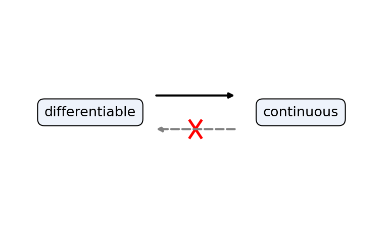
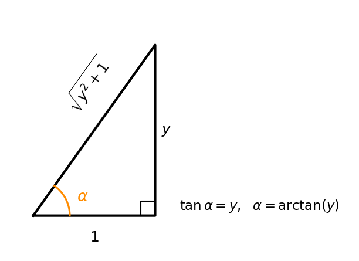
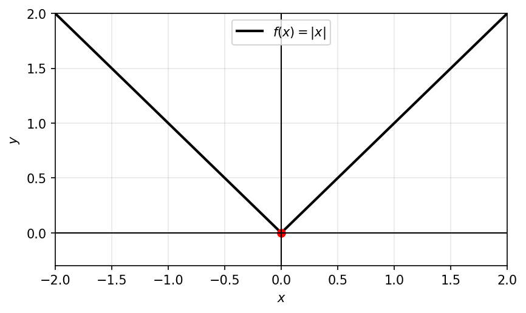

# הנגזרת

## אינטואיציה גיאומטרית ופיזיקלית למושג הנגזרת

**משמעות פיזיקלית**

זמן: $f(t)$ המודד מרחקים, כאשר $t$ הוא זמן.

מרחק: $f(x) - f(x_0)$ המרחק בין פרקי הזמן $x_0$ ו- $x$.

המהירות הממוצעת: $\frac{f(x) - f(x_0)}{x - x_0}$ המהירות הממוצעת בין הזמנים $x_0$ ו- $x$ כאשר $x \to x_0$.

המהירות הרגעית: $f'(x_0) = \lim_{x \to x_0} \frac{f(x) - f(x_0)}{x - x_0}$ המהירות הרגעית בזמן $x_0$.

**משמעות גיאומטרית**

$\mathbb{R}^2$

```{python}
#| echo: false
#| output: false
import numpy as np
import matplotlib.pyplot as plt

fig, ax = plt.subplots(figsize=(6.4, 3.6))

def f(x):
    return 0.35 * x**2 + 0.3

xs = np.linspace(0.2, 4.2, 300)
ax.plot(xs, f(xs), color="black", lw=2, label=r"$f(x)$")

x0 = 1.4
y0 = f(x0)
# tangent line at x0 (slope f'(x0) = 0.7*x0)
m = 0.7 * x0
xt = np.linspace(0.2, 4.2, 50)
ax.plot(xt, y0 + m * (xt - x0), color="darkorange", lw=2, label=r"tangent at $x_0$")

# secant lines through (x, f(x)) approaching x0
for xv, c in zip([4.0, 3.2, 2.4], ["#9ecae1", "#4292c6", "#08519c"]):
    yv = f(xv)
    ms = (yv - y0) / (xv - x0)
    ax.plot(xt, y0 + ms * (xt - x0), color=c, lw=1.4, ls="--")
    ax.plot([xv], [yv], "o", color=c, ms=5)

ax.plot([x0], [y0], "o", color="darkorange", ms=7)

# markers on axes for x0 and f(x0)
ax.plot([x0, x0], [0, y0], color="gray", ls=":", lw=1)
ax.plot([0, x0], [y0, y0], color="gray", ls=":", lw=1)
ax.annotate(r"$(x_0, f(x_0))$", xy=(x0, y0), xytext=(x0 + 0.2, y0 - 0.7),
            fontsize=11)
ax.text(-0.05, y0, r"$f(x_0)$", ha="right", va="center", fontsize=11)
ax.text(x0, -0.25, r"$x_0$", ha="center", va="top", fontsize=11)
ax.text(4.0, f(4.0) + 0.2, r"$(x,f(x))$", ha="center", fontsize=10)
ax.text(3.0, 5.0, r"slope $=\dfrac{f(x)-f(x_0)}{x-x_0}$", fontsize=11)

ax.axhline(0, color="black", lw=1)
ax.axvline(0, color="black", lw=1)
ax.set_xlim(0, 4.5)
ax.set_ylim(0, 7)
ax.set_xlabel(r"$x$")
ax.set_ylabel(r"$y$")
ax.grid(alpha=0.3)
ax.legend(loc="upper left", fontsize=9)

fig.savefig("c06_fig03.png", dpi=150, bbox_inches="tight")
plt.close(fig)
```

```{=latex}
\par\medskip
\noindent\beginL\hbox to \linewidth{\hss\includegraphics[width=0.62\linewidth]{c06_fig03.png}\hss}\endL\par
\medskip
```

::: {style="text-align:center"}
תרשים: המשיק כגבול של הישרים החותכים והשיפוע כנגזרת
:::

::: {.content-visible when-format="html"}
{#fig-c06_fig03 width="62%" fig-align="center"}
:::

כלומר: $\lim_{x \to x_0} \frac{f(x) - f(x_0)}{x - x_0}$ הוא השיפוע של הישר המשיק לגרף הפונקציה ב- $(x_0, f(x_0))$.


<!-- מקור: הרצאה 17 -->

## הגדרת הנגזרת

תהי פונקציה $f(x)$ מוגדרת בסביבה של נקודה $x_0$, נגיד כי $f(x)$ גזירה ב-$x_0$ אם קיים הגבול הבא: $$\lim_{h \to 0} \frac{f(x_0 + h) - f(x_0)}{h}$$

ואז נגדיר את הנגזרת של $f$ בנקודה $x_0$ ע"י: $$f'(x_0) = \lim_{h \to 0} \frac{f(x_0 + h) - f(x_0)}{h}$$

## חישובי נגזרת לפונקציות בסיסיות: $C,\ x^a,\ \sin x,\ \cos x,\ e^x,\ \ln x,\ |x|$

### דוגמאות:

**1)** עבור הפונקציה הקבועה $f(x) = C$ (קבוע $C$)

נראה כי $f$ גזירה <u>בכל</u> נקודה $x_0$ ומתקיים $f'(x_0) = 0$

לפי ההגדרה נבדוק: $$\lim_{h \to 0} \frac{f(x_0 + h) - f(x_0)}{h} = \lim_{h \to 0} 0 = \boxed{0}$$

<!-- בדיקה: במונה מסומנים $C$ ו-$C$ מעל $f(x_0+h)$ ו-$f(x_0)$ -->

כלומר, הפונקציה גזירה ב-$x_0$ ומתקיים $f'(x_0) = 0$

**2)** עבור הפונקציה $f(x) = x^a$ כאשר $a > 0$ קבוע לכל $x_0$

נראה כי $f$ גזירה ב-$x_0$ ונחשב את $f'(x_0)$ נסתכל על: $$\lim_{h \to 0} \frac{f(x_0 + h) - f(x_0)}{h} = \lim_{h \to 0} \frac{(x_0 + h)^a - x_0^a}{h} = \lim_{h \to 0} x_0^a \frac{\left(1 + \frac{h}{x_0}\right)^a - 1}{h} =$$

<!-- בדיקה: מתחת לאיבר מופיעה ההערה "גבול מוכפל" עם $\lim_{x \to a} \frac{(x+1)^a - 1}{x} = a$ -->

$$= \lim_{h \to 0} \frac{x_0^a}{x_0} \cdot \frac{\left(1 + \frac{h}{x_0}\right)^a - 1}{\frac{h}{x_0}} = \frac{x_0^a}{x_0} \cdot a = \boxed{a \cdot x_0^{a-1}}$$

<!-- בדיקה: מתחת לביטוי $\frac{(1+\frac{h}{x_0})^a-1}{\frac{h}{x_0}}$ מסומן שהוא שואף ל-$a$ -->

לכן, הפונקציה $x^a$ היא גזירה ב-$x_0$ ו- $(x^a)'(x_0) = a \cdot x_0^{a-1}$

**3)** הפונקציה $f(x) = |x|$ (שהיא אלמנטרית) אינה גזירה ב-$x_0$.

נראה כי הגבול הבא אינו קיים: $$\lim_{h \to 0} f(0 + h) - f(0) = \lim_{h \to 0} \frac{|h| - 0}{h} = \lim_{h \to 0} \frac{|h|}{h}$$

נשים לב כי $$\lim_{h \to 0^-} \frac{|h|}{h} = -1 \quad \text{וכי} \quad \lim_{h \to 0^+} \frac{|h|}{h} = 1$$

כלומר, הגבול מימין ומשמאל שונים.

**(4)** הפונקציה $f(x) = e^x$ גזירה ב- $x_0$ לכל $x_0 \in \mathbb{R}$:

$$\lim_{h \to 0} \frac{f(x_0 + h) - f(x_0)}{h} = \lim_{x \to 0} \frac{e^{x_0 + h} - e^{x_0}}{h} = \lim_{h \to 0} e^{x_0} \left(\frac{e^h - 1}{h}\right) = e^{x_0} \cdot 1 = e^{x_0}$$

<!-- בדיקה: הערה ליד הגבול: $\frac{e^t - 1}{t} \xrightarrow[t \to 1]{} 1$, וחץ אל $e^{x_0}$ מסומן $f'(x)$ -->

**(5)** הפונקציה $f(x) = \sin(x)$ גזירה ב- $x_0$ לכל $x_0 \in \mathbb{R}$ ו- $f'(x_0) = \cos(x_0)$:

$$\lim_{h \to 0} \frac{\sin(x_0 + h) - \sin(x_0)}{h} = \lim_{h \to 0} \frac{2 \sin\left(\frac{(x_0 + h) - x_0}{2}\right) \cos\left(\frac{(x_0 + h) + x_0}{2}\right)}{h} = \lim_{h \to 0} 2 \cdot \frac{\sin\left(\frac{h}{2}\right)}{2 \cdot \left(\frac{h}{2}\right)} \cdot \cos\left(x_0 + \frac{h}{2}\right) =$$

<!-- בדיקה: מתחת לאיבר $\frac{\sin(h/2)}{(h/2)}$ רשום $1$, ומתחת ל- $\cos(x_0 + h/2)$ רשום $\cos(x_0)$ -->

$$= 1 \cdot \cos(x_0) = \cos(x_0)$$

**(6)** הפונקציה $f(x) = \ln(x)$ גזירה ב- $x_0$ לכל $x_0 \in \mathbb{R}$ ו- $f'(x) = \frac{1}{x_0}$:

$$\lim_{h \to 0} \frac{\ln(x_0 + h) - \ln(x_0)}{h} = \lim_{h \to 0} \frac{\ln\left(\frac{x_0 + h}{x_0}\right)}{h} = \lim_{h \to 0} \frac{\ln\left(1 + \frac{h}{x_0}\right)}{h} = \lim_{h \to 0} \frac{\ln\left(1 + \frac{h}{x_0}\right)}{\frac{h}{x_0}} \cdot \frac{1}{x_0} = \frac{1}{x_0}$$

<!-- בדיקה: הערה ליד הגבול: $\lim_{x \to 0} \frac{\ln(1 + x)}{x} = 1$ -->

**(7)** הפונקציה $f(x) = \cos(x)$ גזירה ב- $x_0$ לכל $x_0 \in \mathbb{R}$ ו- $f'(x) = -\sin(x_0)$:

$$\lim_{h \to 0} \frac{\cos(x_0 + h) - \cos(x_0)}{h} = \lim_{h \to 0} \frac{-2 \sin\left(\frac{(x_0 + h) + x_0}{2}\right) \sin\left(\frac{h}{2}\right)}{h} = \lim_{h \to 0} -2 \sin\left(x_0 + \frac{h}{2}\right) \frac{\sin\left(\frac{h}{2}\right)}{2} =$$

<!-- בדיקה: מתחת רשום הזהות $\cos a - \cos b = -2 \sin\left(\frac{a+b}{2}\right) \sin\left(\frac{a-b}{2}\right)$ -->

$$= \lim_{h \to 0} -\sin\left(x_0 + \frac{h}{2}\right) \frac{\sin\left(\frac{h}{2}\right)}{\frac{h}{2}} = -\sin(x_0)$$

<!-- בדיקה: מתחת לאיברים רשום $-\sin(x_0)$ ו- $1$ -->

ניתן להגדיר את הנגזרת גם כך:

$$\lim_{x \to x_0} \frac{f(x) - f(x_0)}{x - x_0}$$

## הקשר בין גזירוּת לרציפות

::: {#thm-gzira-retzifut .theorem}
אם $f$ גזירה ב- $x_0$, אז $f$ רציפה ב- $x_0$.
:::

```{python}
#| echo: false
#| output: false
import numpy as np
import matplotlib.pyplot as plt

fig, ax = plt.subplots(figsize=(6.4, 3.6))
ax.set_xlim(0, 10)
ax.set_ylim(0, 5)
ax.axis("off")

# two boxes
box_style = dict(boxstyle="round,pad=0.5", facecolor="#eef3fb", edgecolor="black")
ax.text(2.2, 2.5, "differentiable", ha="center", va="center", fontsize=13, bbox=box_style)
ax.text(7.8, 2.5, "continuous", ha="center", va="center", fontsize=13, bbox=box_style)

# forward arrow (differentiable => continuous), valid
ax.annotate("", xy=(6.1, 2.9), xytext=(3.9, 2.9),
            arrowprops=dict(arrowstyle="-|>", color="black", lw=2))

# backward arrow (continuous => differentiable), crossed out
ax.annotate("", xy=(3.9, 2.1), xytext=(6.1, 2.1),
            arrowprops=dict(arrowstyle="-|>", color="gray", lw=2, ls="--"))
# X mark over the backward arrow
ax.plot([4.85, 5.15], [1.9, 2.3], color="red", lw=2.5)
ax.plot([4.85, 5.15], [2.3, 1.9], color="red", lw=2.5)

fig.savefig("c06_fig01.png", dpi=150, bbox_inches="tight")
plt.close(fig)
```

```{=latex}
\par\medskip
\noindent\beginL\hbox to \linewidth{\hss\includegraphics[width=0.62\linewidth]{c06_fig01.png}\hss}\endL\par
\medskip
```

::: {style="text-align:center"}
תרשים: גזירות גוררת רציפות, אך רציפות אינה גוררת גזירות
:::

::: {.content-visible when-format="html"}
{#fig-c06_fig01 width="62%" fig-align="center"}
:::

**הוכחת הטענה:**

נניח כי $f$ גזירה ב- $x_0$, לכן קיים הגבול $\lim_{x \to x_0} \frac{f(x) - f(x_0)}{x - x_0}$.

לכן:

$$\lim_{x \to x_0} f(x) - f(x_0) = \lim_{x \to x_0} \frac{f(x) - f(x_0)}{x - x_0} \cdot (x - x_0) = 0$$

<!-- בדיקה: מתחת לאיברים רשום $\to f'(x_0)$ ו- $\to 0$; הערה: אריתמטיקה של גבולות -->

כלומר: $\lim_{x \to x_0} f(x) = f(x_0)$ ואז $f$ רציפה ב- $x_0$.

**תרגיל להבנה:**

נתון $\lim_{x \to \infty} f(x) = 5$ או $\lim_{x \to x_0} (f(x) - 5) = 5 - 5 = 0$.

גם להפך: נתון $\lim_{x \to \infty} (f(x) - 5) = 0$ או $\lim_{x \to x_0} f(x) = \lim_{x \to x_0} (f(x) - 5 + 5) = 5$.

**דוגמא:**

האם הפונקציה רציפה ב-0 והאם הפונקציה גזירה ב-0?

$$f(x) = \begin{cases} x & x \in \mathbb{Q} \\ 0 & x \notin \mathbb{Q} \end{cases}$$

```{python}
#| echo: false
#| output: false
import numpy as np
import matplotlib.pyplot as plt

fig, ax = plt.subplots(figsize=(6.4, 3.6))
x = np.linspace(-2, 2, 200)
ax.plot(x, x, color="gray", ls="--", lw=2, label=r"$y=x$")

ax.axhline(0, color="black", lw=1)
ax.axvline(0, color="black", lw=1)
ax.set_xlim(-2, 2)
ax.set_ylim(-2, 2)
ax.set_aspect("equal")
ax.set_xlabel(r"$x$")
ax.set_ylabel(r"$y$")
ax.grid(alpha=0.3)
ax.legend(loc="upper left")

fig.savefig("c06_fig02.png", dpi=150, bbox_inches="tight")
plt.close(fig)
```

```{=latex}
\par\medskip
\noindent\beginL\hbox to \linewidth{\hss\includegraphics[width=0.62\linewidth]{c06_fig02.png}\hss}\endL\par
\medskip
```

::: {style="text-align:center"}
תרשים: קו מקווקו אלכסוני העובר דרך הראשית
:::

::: {.content-visible when-format="html"}
{#fig-c06_fig02 width="62%" fig-align="center"}
:::

נשים לב כי $f(x) = x \cdot D(x)$

<!-- בדיקה: הערה: פונקציית דיריכלה -->

מתקיים $f(0) = 0$ אבל $\lim_{x \to 0} f(x) = \lim_{x \to 0} x \cdot D(x) = 0$ הפונקציה רציפה ב-0

<!-- בדיקה: הערות: חסומה, כלל הסנדוויץ' -->

לא קיים $\lim_{x \to 0} \frac{f(x) - f(0)}{x - 0} = \lim_{x \to 0} D(x)$ הפונקציה **לא** גזירה ב-0

## אריתמטיקה של נגזרות

::: {#thm-aritmetika-nagzeret .theorem}
אם $f, g$ פונקציות גזירות בנקודה $x_0$, אז:

א) הפונקציה $(f \pm g)$ גזירה ב- $x_0$ ומתקיים: $(f \pm g)'(x_0) = f'(x_0) \pm g'(x_0)$

ב) הפונקציה $f \cdot g$ גזירה ב- $x_0$ ומתקיים: $(f \cdot g)'(x_0) = f'(x_0) \cdot g(x_0) + f(x_0) \cdot g'(x_0)$

ג) אם $g(x_0) \neq 0$ אז הפונקציה $\frac{f}{g}$ גזירה ב- $x_0$ ומתקיים: $\left(\frac{f}{g}\right)'(x_0) = \frac{g(x_0) \cdot f'(x_0) - g'(x_0) \cdot f(x_0)}{g^2(x_0)}$
:::

**הוכחה של (ב):**

נראה כי $f \cdot g$ גזירה ב- $x_0$ על ידי שימוש בהגדרה:

$$\lim_{x \to x_0} \frac{f(x) g(x) - f(x_0) g(x_0)}{x - x_0} = \lim_{x \to x_0} \frac{f(x) \cdot g(x) - f(x_0) \cdot g(x) + f(x_0) \cdot g(x) - f(x_0) \cdot g(x_0)}{x - x_0} =$$

$$= \lim_{x \to x_0} \frac{(f(x) - f(x_0)) \cdot g(x)}{x - x_0} + \frac{f(x_0) \cdot (g(x) - g(x_0))}{x - x_0} =$$

<!-- בדיקה: מתחת לאיברים רשום $\to f'(x_0)$, $\to g(x_0)$, $\to f(x_0)$, $\to g'(x_0)$ -->

הפונקציה $g$ גזירה ב- $x_0$ ולכן היא גם רציפה ב- $x_0 \to \lim_{x \to x_0} g(x) = g(x_0)$

$$= \lim_{x \to x_0} \frac{f(x) \cdot g(x_0) - f(x_0) \cdot g(x_0)}{x - x_0} = f'(x_0) \cdot g(x_0) + f(x_0) \cdot g'(x_0)$$

**דוגמא למשפט:**

הפונקציה $\tan(x) = \frac{\sin(x)}{\cos(x)}$ גזירה בכל נקודה $x_0$ בה $\cos(x_0) \neq 0$ כלומר $x \neq \frac{\pi}{2} + \pi k$

$$(\tan(x))'(x_0) = \left(\frac{\sin(x)}{\cos(x)}\right)'(x_0) = \frac{\cos(x_0) \cos(x_0) - \sin(x_0) \cdot (-\sin(x_0))}{\cos^2(x_0)} = \frac{1}{\cos^2(x_0)}$$

## כלל השרשרת

::: {#thm-chain-rule .theorem}
**כלל השרשרת**

אם $f$ גזירה ב-$x_0$, ואם $g$ גזירה ב-$f(x_0)$, אז הפונקציה $g \circ f$ גזירה ב-$x_0$, ומתקיים: $$g \circ f)'(x_0) = g'(f(x_0)) \cdot f'(x_0)($$
:::

דוגמאות:

נגזור את הפונקציה $h(x) = e^{x^2}$

$\downarrow$

נשים לב כי כאשר $f(x) = x^2, g(x) = e^x$ אז $h(x) = g(f(x))$

אז מהכלל $h'(x) = g'(f(x)) \cdot f'(x) = e^{x^2} \cdot 2 \cdot x$

נגזור את $h(x) = \cos(x)$ (לא לפי ההגדרה)

נשים לב כי $\cos(x) = \sin(x + \frac{\pi}{2})$ ולכן נגזור לפי כלל השרשרת:

<!-- בדיקה: סימון g תחת sin ו-f תחת (x+π/2) בתרשים מתחת הנוסחה -->

$$(\cos(x))' = \cos(x + \frac{\pi}{2}) \cdot 1 = -\sin(x)$$

נגזור את $2^x = e^{x \cdot \ln(2)}$

נשים לב כי ולכן נגזור לפי כלל השרשרת:

<!-- בדיקה: נכתב (2x)' = g(f(x))·f(x) מעל הנוסחה, ככל הנראה כוונה (2^x)' -->

$$(2^x)' = e^{x \ln(2)} \cdot \ln(2) = 2^x \cdot \ln(2)$$

## נגזרת של פונקציה הפוכה

פונקציות הפיכות ידועות:

$$\begin{array}{ccc}
e^x & \longleftrightarrow & \ln(x) \\
a^x & \longleftrightarrow & \log_a(x) \\
\sin(x) & \longleftrightarrow & \arcsin(x) \\
\cos(x) & \longleftrightarrow & \arccos(x) \\
\tan(x) & \longleftrightarrow & \arctan(x) \\
x^2 & \longleftrightarrow & \sqrt{x}
\end{array}$$

::: {#thm-inverse-derivative .theorem}
**נגזרת של פונקציה הופכית**

אם $f$ הפיכה וגזירה ב-$x_0$, אז $f^{-1}$ גזירה ב-$x_0 = f^{-1}(y)$ ומתקיים: $$(f^{-1})'(y) = \frac{1}{f'(x_0)} = \frac{1}{f'(f^{-1}(y))}$$
:::

דוגמאות:

ניקח את $f(x) = e^x$, ניזכר $f'(y) = \ln(y)$

$\downarrow$

מהכלל: $$(\ln(y))' = (f^{-1})'(y) = \frac{1}{f'(f^{-1}(y))} = \frac{1}{f'(\ln(x))} = \frac{1}{e^{\ln(x)}} = \frac{1}{x}$$

נגזור את $\arctan(x)$

נסמן: $f(x) = \tan(x)$, ניזכר כי: $$f'(x) = \frac{1}{\cos^2(x)}$$

נגזור את $(f^{-1})'(y)$: $$(\arctan(y))' = (f^{-1})' = \frac{1}{f'(f^{-1}(y))} = \frac{1}{f'(\arctan(y))} = \frac{1}{\frac{1}{\cos^2(\arctan(y))}} =$$ $$= \cos^2(\arctan(y)) = \left(\frac{1}{\sqrt{y^2+1}}\right)^2 = \frac{1}{y^2+1}$$

נפשט ע"י ציור:

```{python}
#| echo: false
#| output: false
import numpy as np
import matplotlib.pyplot as plt

fig, ax = plt.subplots(figsize=(6.4, 3.6))

# right triangle: horizontal leg = 1, vertical leg = y
ax.plot([0, 1, 1, 0], [0, 0, 1.4, 0], color="black", lw=2)

# right-angle marker at bottom-right
ax.plot([0.88, 0.88, 1.0], [0, 0.12, 0.12], color="black", lw=1)

# labels
ax.text(0.5, -0.12, r"$1$", ha="center", va="top", fontsize=12)
ax.text(1.05, 0.7, r"$y$", ha="left", va="center", fontsize=12)
ax.text(0.45, 0.82, r"$\sqrt{y^2+1}$", ha="center", va="bottom",
        rotation=np.degrees(np.arctan2(1.4, 1.0)), fontsize=12)

# angle alpha at origin
th = np.linspace(0, np.arctan2(1.4, 1.0), 30)
ax.plot(0.3 * np.cos(th), 0.3 * np.sin(th), color="darkorange", lw=1.5)
ax.text(0.36, 0.12, r"$\alpha$", fontsize=13, color="darkorange")

ax.text(1.2, 0.05, r"$\tan\alpha=y,\ \ \alpha=\arctan(y)$", fontsize=11)

ax.set_xlim(-0.2, 2.6)
ax.set_ylim(-0.3, 1.7)
ax.set_aspect("equal")
ax.axis("off")

fig.savefig("c06_fig04.png", dpi=150, bbox_inches="tight")
plt.close(fig)
```

```{=latex}
\par\medskip
\noindent\beginL\hbox to \linewidth{\hss\includegraphics[width=0.62\linewidth]{c06_fig04.png}\hss}\endL\par
\medskip
```

::: {style="text-align:center"}
תרשים: משולש ישר-זווית עבור $\arctan(y)$
:::

::: {.content-visible when-format="html"}
{#fig-c06_fig04 width="62%" fig-align="center"}
:::

## נגזרות של $\sqrt{x}$, $\log_a x$, $\arctan x$, $\arccos x$, $\arcsin x$

::: {.todo}
נגזרות הפונקציות ההופכיות ($\arctan$ וכו') נדונות עם ״נגזרת של פונקציה הפוכה״ לעיל. להשלמה.
:::

## נוסחת המשיק והקירוב הלינארי

::: {.todo}
תוכן בהכנה — להשלמה.
:::

## נגזרת חד-צדדית

פונקציה $f$ היא <u>גזירה מימין</u> ב-$x_0$, אם הגבול הבא קיים: $$\lim_{x \to x_0^+} \frac{f(x) - f(x_0)}{x - x_0} = f'_+(x_0)$$

פונקציה $f$ היא <u>גזירה משמאל</u> ב-$x_0$, אם הגבול הבא קיים: $$\lim_{x \to x_0^-} \frac{f(x) - f(x_0)}{x - x_0} = f'_-(x_0)$$

דוגמא:

הפונקציה $f(x) = |x|$ לא גזירה ב-0

```{python}
#| echo: false
#| output: false
import numpy as np
import matplotlib.pyplot as plt

fig, ax = plt.subplots(figsize=(6.4, 3.6))
x = np.linspace(-2, 2, 400)
ax.plot(x, np.abs(x), color="black", lw=2, label=r"$f(x)=|x|$")
ax.plot([0], [0], "o", color="red", ms=6)

ax.axhline(0, color="black", lw=1)
ax.axvline(0, color="black", lw=1)
ax.set_xlim(-2, 2)
ax.set_ylim(-0.3, 2)
ax.set_xlabel(r"$x$")
ax.set_ylabel(r"$y$")
ax.grid(alpha=0.3)
ax.legend(loc="upper center")

fig.savefig("c06_fig05.png", dpi=150, bbox_inches="tight")
plt.close(fig)
```

```{=latex}
\par\medskip
\noindent\beginL\hbox to \linewidth{\hss\includegraphics[width=0.62\linewidth]{c06_fig05.png}\hss}\endL\par
\medskip
```

::: {style="text-align:center"}
תרשים: גרף $f(x)=|x|$ בצורת V עם קודקוד בראשית
:::

::: {.content-visible when-format="html"}
{#fig-c06_fig05 width="62%" fig-align="center"}
:::

מימין ל-0: $$\lim_{x \to 0^+} \frac{|x| - |0|}{x - 0} = \lim_{x \to 0^+} \frac{|x|}{x} = 1$$

משמאל ל-0: $$\lim_{x \to 0^-} \frac{-x - 0}{x} = \lim_{x \to 0^-} \frac{-x}{x} = -1$$

::: {#thm-derivative-iff-one-sided .theorem}
הפונקציה $f$ <u>גזירה</u> ב-$x_0$, אם ורק אם היא <u>רציפה</u> ב-$x_0$, <u>גזירה מימין ומשמאל</u> ב-0, ומתקיים: $$f'_+(x_0) = f'_-(x_0)$$
:::

דוגמא:

מצאו את $A, B \in \mathbb{R}$ כך שהפונקציה: $$f(x) = \begin{cases} x^2 + A & x > 2 \\ B \cdot (x - 1) & x \leq 2 \end{cases}$$ גזירה ב-2.

והסבירו מדוע היא גזירה בכל נקודה ב-$\mathbb{R}$

פתרון:

לכל נקודה $x_0 \neq 2$, מתקיים שהפונקציה $f(x)$ היא $x^2 + A$ בסביבת הנקודה $x_0$ <u>או</u> שהיא $B \cdot (x-1)$ בסביבת הנקודה $x_0$. לכן $f$ גזירה ב-$x_0$.

נבדוק גזירות $f$ ב-2: $$f'_+(2) = (x^2 + A)'_+(2) = (2 \cdot x)(2) = 4$$ $$f'_-(2) = (B(x-1))'_-(2) = (B)(2) = B$$

לכן כדי ש-$f$ תהיה גזירה ב-2, חובה שיתקיים $B = 4$: $$\lim_{x \to 2^-} f(x) = f(2) = \lim_{x \to 2^+} f(x)$$ $$B(2-1) = B(2-1) = 4 + A$$

$$B = 4 + A \longrightarrow A = 0$$
