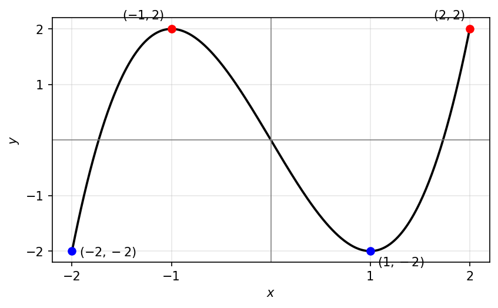
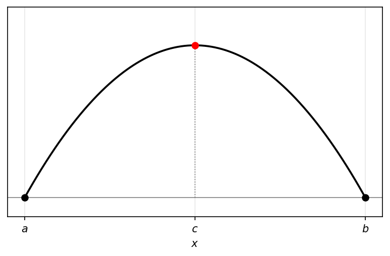
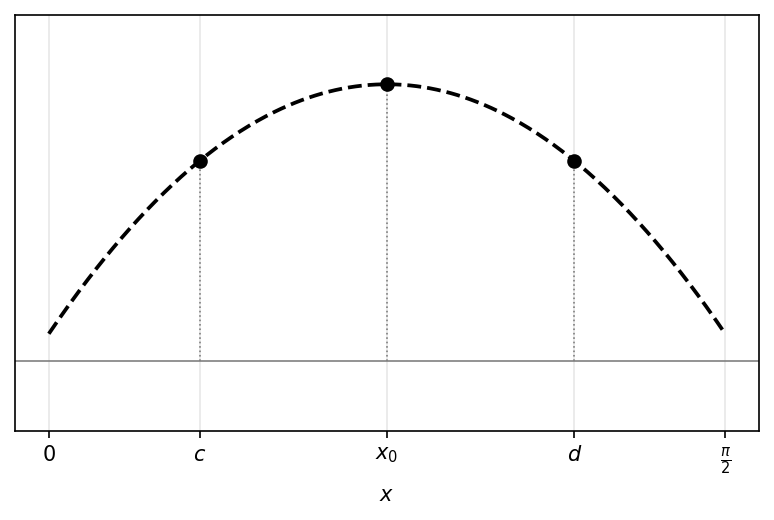
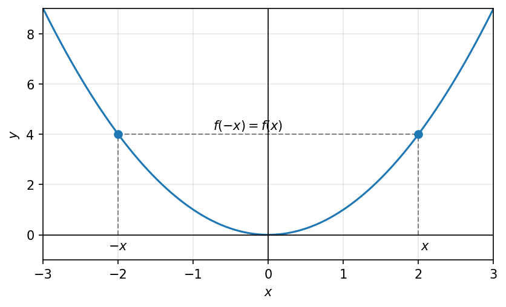
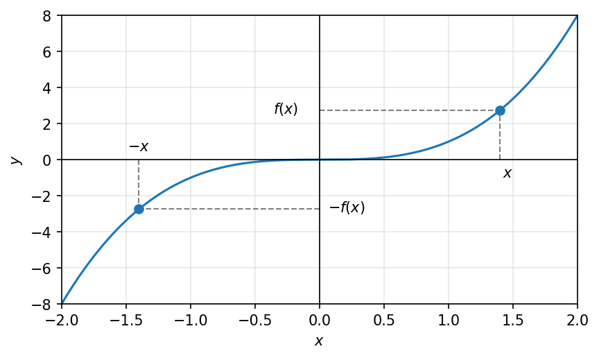
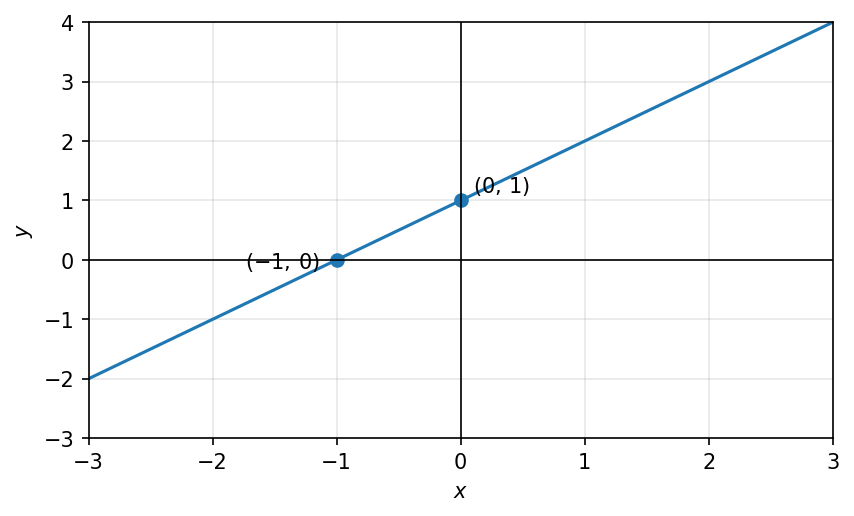
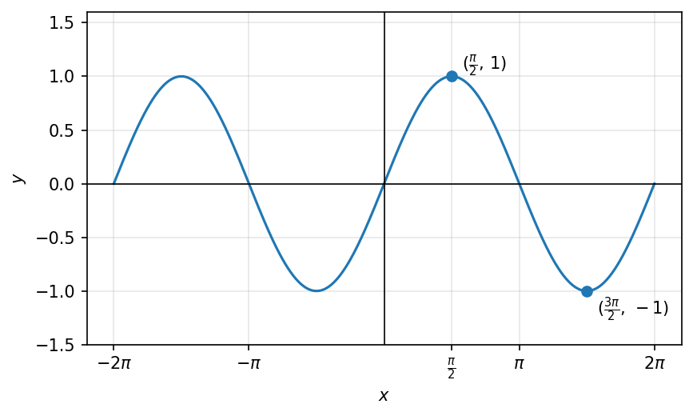
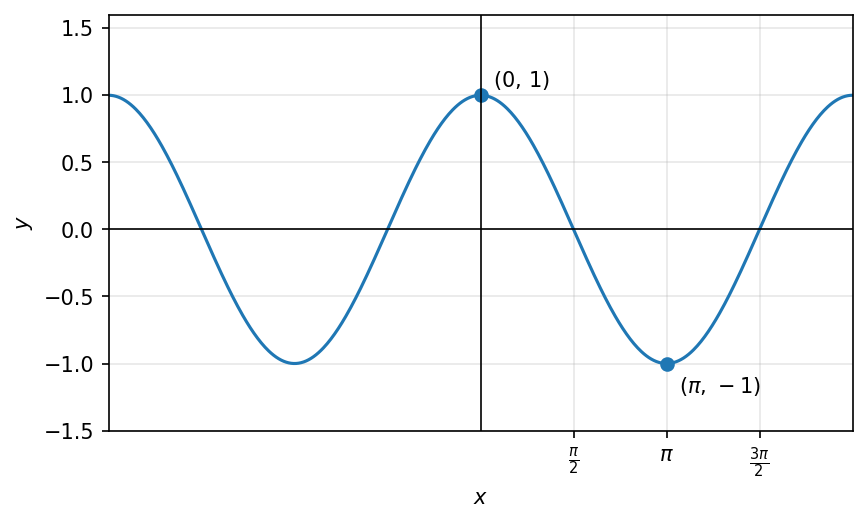
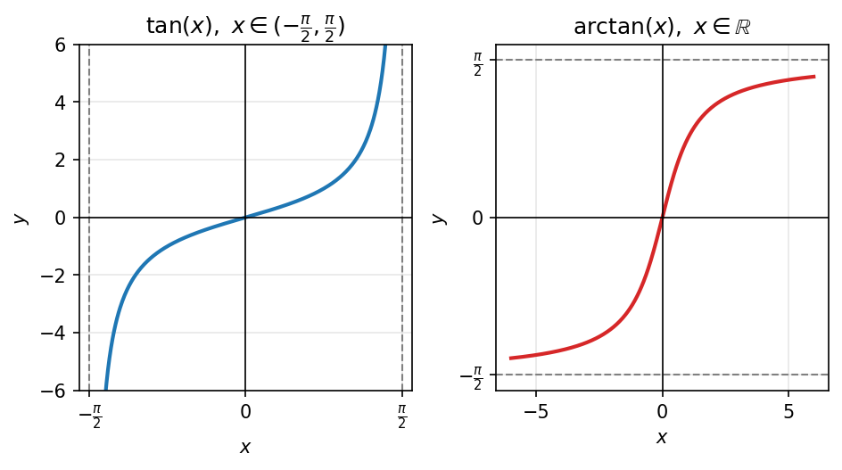

# מבוא לפונקציות

## מושג הפונקציה

::: {#def-funkcia .definition}
פונקציה מ-$A$ ל-$B$ היא העתקה שמתאימה לכל איבר ב-$A$, איבר ב-$B$.

נסמן $f : A \to B$, ל-$A$ נקרא <u>התחום</u> שלה, ל-$B$ נקרא <u>הטווח</u> שלה.
:::

דוגמאות:

- הפונקציה $f : \mathbb{R} \setminus \{1\} \to \mathbb{R}$ היא $f(x) = \frac{x + 3}{x - 1}$

  (התחום, הטווח)

- הפונקציה $f(x) = \lfloor x \rfloor$ שנקראת פונקציית הערך השלם,

  מקיימת $f : \mathbb{R} \to \mathbb{R}$ שניתן לכתוב גם כך: $f : \mathbb{R} \to \mathbb{Z}$

::: {#def-tmuna .definition}
התמונה של $f : A \to B$ מוגדרת על ידי:

$$I_m(f) = (\{f(x) | x \in A\} = \{y \in B | f(x) = y$$ עבור $x \in A$ קיים $\}$

כלומר, $I_m(f)$ היא קבוצת כל המספרים ש-$f$ מניעה אליהם.

תמיד מתקיים: $I_m(f) \subseteq B$
:::

::: {#exm-tmuna .example}
$f : \mathbb{R} \to \mathbb{R}$ שנתונה על ידי $f(x) = x^2$, לכן $I_m(f) = [0, \infty)$

(כל המספרים אינם שליליים)
:::

<!-- מקור: הרצאה 10 -->


### חיבור

אם $f, g : R \to R$, אז הפונקציה $f + g$ מוגדרת ע"י $(f + g)(x) = f(x) + g(x)$

### חיסור

אם $f, g : R \to R$, אז הפונקציה $f - g$ מוגדרת ע"י $(f - g)(x) = f(x) - g(x)$

### כפל

אם $f, g : R \to R$, אז הפונקציה $f \cdot g$ מוגדרת ע"י $(f \cdot g)(x) = f(x) \cdot g(x)$

### חילוק

אם $f, g : R \to R$, אז הפונקציה $\frac{f}{g}$ מוגדרת ע"י $(\frac{f}{g})(x) = \frac{f(x)}{g(x)}$, $g(x) \neq 0$

## תחום, טווח ותמונה של פונקציה

::: {.todo}
תחום, טווח ותמונה נדונים בחלקם בסעיף ״מושג הפונקציה״ לעיל. להשלמה ולסידור.
:::

## גרפים

::: {.todo}
תוכן בהכנה — להשלמה.
:::

## תכונות של פונקציות: מונוטוניות

- פונקציה מונוטונית עולה- לכל $x,y \in A$, אם $x \leq y$ אז $f(x) \leq f(y)$

- פונקציה מונוטונית יורדת- לכל $x,y \in A$, אם $x \leq y$ אז $f(x) \geq f(y)$

פונקצייה נקראת מונוטונית עולה ממש, אם לכל $x < y$, מתקיים $f(x) < f(y)$

לדוגמא:

$f(x) = x^2$, $f : R \to R$, לא מונוטונית כי $f(-1) > f(0)$ וגם $f(0) < f(1)$

<!-- בדיקה: מתחת ל-$f(-1)>f(0)$ הערה בכתב יד "הערך עולה ולפונקציה יורד", ומתחת ל-$f(0)<f(1)$ הערה "הערך עולה ולפונקציה עולה" -->

לעומת זאת, בתחום $[0,\infty)$ הפונקציה מונוטונית עולה, כי $x \leq y$ ולכן $f(x) = x^2 \leq y^2 = f(y)$

ובתחום $(-\infty,0]$ הפונקציה מונוטונית יורדת, כי $y \leq x \leq 0$ ולכן $f(x) = x^2 \leq y^2 = f(y)$

```{python}
#| echo: false
#| output: false
import numpy as np
import matplotlib.pyplot as plt

fig, ax = plt.subplots(figsize=(6.4, 3.6))
x = np.linspace(-3, 3, 400)
ax.plot(x, x**2, color="C0")

x0 = 1.5
ax.plot([x0, x0], [0, x0**2], color="gray", ls="--", lw=1)
ax.plot([0, x0], [x0**2, x0**2], color="gray", ls="--", lw=1)
ax.plot([x0], [x0**2], "o", color="C0")
ax.annotate(r"$x$", (x0, 0), textcoords="offset points", xytext=(4, -12))
ax.annotate(r"$f(x)$", (0, x0**2), textcoords="offset points", xytext=(-30, -4))

ax.axhline(0, color="black", lw=0.8)
ax.axvline(0, color="black", lw=0.8)
ax.set_xlabel(r"$x$")
ax.set_ylabel(r"$y$")
ax.grid(alpha=0.3)
ax.set_xlim(-3, 3)
ax.set_ylim(-1, 9)
fig.savefig("c07_fig01.png", dpi=150, bbox_inches="tight")
plt.close(fig)
```

```{=latex}
\par\medskip
\noindent\beginL\hbox to \linewidth{\hss\includegraphics[width=0.62\linewidth]{c07_fig01.png}\hss}\endL\par
\medskip
```

::: {style="text-align:center"}
תרשים: גרף הפרבולה $f(x)=x^2$ עם נקודה $x$ על ציר $X$ והערך $f(x)$ המתאים
:::

::: {.content-visible when-format="html"}
{#fig-c03_fig01 width="62%" fig-align="center"}
:::

דוגמא נוספת:

```{python}
#| echo: false
#| output: false
import numpy as np
import matplotlib.pyplot as plt

fig, ax = plt.subplots(figsize=(6.4, 3.6))
for n in range(-3, 4):
    ax.plot([n, n + 1], [n, n], color="C0")
    ax.plot([n], [n], "o", color="C0")            # closed left endpoint
    ax.plot([n + 1], [n], "o", color="C0", mfc="white")  # open right endpoint

# marked points x1, x2 on the x-axis
ax.annotate(r"$x_1$", (0.5, 0), textcoords="offset points", xytext=(-2, -14))
ax.annotate(r"$x_2$", (2.4, 0), textcoords="offset points", xytext=(-2, -14))
ax.plot([0.5], [0], "|", color="gray")
ax.plot([2.4], [0], "|", color="gray")

ax.axhline(0, color="black", lw=0.8)
ax.axvline(0, color="black", lw=0.8)
ax.set_xlabel(r"$x$")
ax.set_ylabel(r"$y$")
ax.grid(alpha=0.3)
ax.set_xlim(-3, 4)
ax.set_ylim(-3.5, 3.5)
fig.savefig("c07_fig02.png", dpi=150, bbox_inches="tight")
plt.close(fig)
```

```{=latex}
\par\medskip
\noindent\beginL\hbox to \linewidth{\hss\includegraphics[width=0.62\linewidth]{c07_fig02.png}\hss}\endL\par
\medskip
```

::: {style="text-align:center"}
תרשים: גרף פונקציית הערך השלם $f(x)=\lfloor x \rfloor$ (פונקציית מדרגות) עם הנקודות $x_1, x_2$
:::

::: {.content-visible when-format="html"}
{#fig-c03_fig02 width="62%" fig-align="center"}
:::

הפונקציה מונוטונית עולה, אבל היא לא חד חד ערכית.

$$0 = f(\tfrac{1}{2}) = f(\tfrac{3}{4}) = 0$$

לכל $x_1, x_2 \in A$, אם $x_1 \neq x_2$ אז $f(x_1) \neq f(x_2)$

לדוגמא:

$f(x) = x^2$ בתחום $(-\infty, 0)$ היא חד חד ערכית.

```{python}
#| echo: false
#| output: false
import numpy as np
import matplotlib.pyplot as plt

fig, ax = plt.subplots(figsize=(6.4, 3.6))
x = np.linspace(-3, 3, 400)
ax.plot(x, x**2, color="C0")

x0 = -1.5
ax.plot([x0, x0], [0, x0**2], color="gray", ls="--", lw=1)
ax.plot([0, x0], [x0**2, x0**2], color="gray", ls="--", lw=1)
ax.plot([x0], [x0**2], "o", color="C0")
ax.annotate(r"$x$", (x0, 0), textcoords="offset points", xytext=(-6, -12))
ax.annotate(r"$f(x)$", (0, x0**2), textcoords="offset points", xytext=(6, -4))

ax.axhline(0, color="black", lw=0.8)
ax.axvline(0, color="black", lw=0.8)
ax.set_xlabel(r"$x$")
ax.set_ylabel(r"$y$")
ax.grid(alpha=0.3)
ax.set_xlim(-3, 3)
ax.set_ylim(-1, 9)
fig.savefig("c07_fig03.png", dpi=150, bbox_inches="tight")
plt.close(fig)
```

```{=latex}
\par\medskip
\noindent\beginL\hbox to \linewidth{\hss\includegraphics[width=0.62\linewidth]{c07_fig03.png}\hss}\endL\par
\medskip
```

::: {style="text-align:center"}
תרשים: גרף $f(x)=x^2$ עם נקודה $x$ שלילית על ציר $X$ והערך $f(x)$ המתאים
:::

::: {.content-visible when-format="html"}
{#fig-c03_fig03 width="62%" fig-align="center"}
:::

$f(x) = x^2$ בתחום ב-$\mathbb{R}$ היא לא חד חד ערכית.

```{python}
#| echo: false
#| output: false
import numpy as np
import matplotlib.pyplot as plt

fig, ax = plt.subplots(figsize=(6.4, 3.6))
x = np.linspace(-3, 3, 400)
ax.plot(x, x**2, color="C0")

x0 = 1.8
ax.plot([-x0, -x0], [0, x0**2], color="gray", ls="--", lw=1)
ax.plot([x0, x0], [0, x0**2], color="gray", ls="--", lw=1)
ax.plot([-x0, x0], [x0**2, x0**2], color="gray", ls="--", lw=1)
ax.plot([-x0, x0], [x0**2, x0**2], "o", color="C0")
ax.annotate(r"$-x$", (-x0, 0), textcoords="offset points", xytext=(-8, -12))
ax.annotate(r"$x$", (x0, 0), textcoords="offset points", xytext=(2, -12))
ax.annotate(r"$f(x)$", (0, x0**2), textcoords="offset points", xytext=(-30, 4))

ax.axhline(0, color="black", lw=0.8)
ax.axvline(0, color="black", lw=0.8)
ax.set_xlabel(r"$x$")
ax.set_ylabel(r"$y$")
ax.grid(alpha=0.3)
ax.set_xlim(-3, 3)
ax.set_ylim(-1, 9)
fig.savefig("c07_fig04.png", dpi=150, bbox_inches="tight")
plt.close(fig)
```

```{=latex}
\par\medskip
\noindent\beginL\hbox to \linewidth{\hss\includegraphics[width=0.62\linewidth]{c07_fig04.png}\hss}\endL\par
\medskip
```

::: {style="text-align:center"}
תרשים: גרף $f(x)=x^2$ עם הנקודות $-x$ ו-$x$ בעלות אותו ערך $f(x)$
:::

::: {.content-visible when-format="html"}
{#fig-c03_fig04 width="62%" fig-align="center"}
:::

## פונקציות זוגיות ואי-זוגיות

פונקציה תיקרא זוגית, אם לכל $x \in A$ מתקיים $f(x) = f(-x)$

לדוגמא:

```{python}
#| echo: false
#| output: false
import numpy as np
import matplotlib.pyplot as plt

fig, ax = plt.subplots(figsize=(6.4, 3.6))
x = np.linspace(-3, 3, 400)
ax.plot(x, x**2, color="C0")

x0 = 2.0
ax.plot([-x0, -x0], [0, x0**2], color="gray", ls="--", lw=1)
ax.plot([x0, x0], [0, x0**2], color="gray", ls="--", lw=1)
ax.plot([-x0, x0], [x0**2, x0**2], color="gray", ls="--", lw=1)
ax.plot([-x0, x0], [x0**2, x0**2], "o", color="C0")
ax.annotate(r"$-x$", (-x0, 0), textcoords="offset points", xytext=(-8, -12))
ax.annotate(r"$x$", (x0, 0), textcoords="offset points", xytext=(2, -12))
ax.annotate(r"$f(-x)=f(x)$", (0, x0**2), textcoords="offset points", xytext=(-44, 4))

ax.axhline(0, color="black", lw=0.8)
ax.axvline(0, color="black", lw=0.8)
ax.set_xlabel(r"$x$")
ax.set_ylabel(r"$y$")
ax.grid(alpha=0.3)
ax.set_xlim(-3, 3)
ax.set_ylim(-1, 9)
fig.savefig("c07_fig05.png", dpi=150, bbox_inches="tight")
plt.close(fig)
```

```{=latex}
\par\medskip
\noindent\beginL\hbox to \linewidth{\hss\includegraphics[width=0.62\linewidth]{c07_fig05.png}\hss}\endL\par
\medskip
```

::: {style="text-align:center"}
תרשים: גרף הפונקציה הזוגית $f(x)=x^2$ - הנקודות $-x$ ו-$x$ בעלות אותו גובה
:::

::: {.content-visible when-format="html"}
{#fig-c03_fig07 width="62%" fig-align="center"}
:::

פונקציה תיקרא אי זוגית, אם לכל $x \in A$ מתקיים $f(-x) = -f(x)$

לדוגמא:

```{python}
#| echo: false
#| output: false
import numpy as np
import matplotlib.pyplot as plt

fig, ax = plt.subplots(figsize=(6.4, 3.6))
x = np.linspace(-2, 2, 400)
ax.plot(x, x**3, color="C0")

x0 = 1.4
y0 = x0**3
ax.plot([x0, x0], [0, y0], color="gray", ls="--", lw=1)
ax.plot([-x0, -x0], [0, -y0], color="gray", ls="--", lw=1)
ax.plot([0, x0], [y0, y0], color="gray", ls="--", lw=1)
ax.plot([0, -x0], [-y0, -y0], color="gray", ls="--", lw=1)
ax.plot([x0, -x0], [y0, -y0], "o", color="C0")
ax.annotate(r"$x$", (x0, 0), textcoords="offset points", xytext=(2, -12))
ax.annotate(r"$-x$", (-x0, 0), textcoords="offset points", xytext=(-8, 6))
ax.annotate(r"$f(x)$", (0, y0), textcoords="offset points", xytext=(-32, -2))
ax.annotate(r"$-f(x)$", (0, -y0), textcoords="offset points", xytext=(6, -2))

ax.axhline(0, color="black", lw=0.8)
ax.axvline(0, color="black", lw=0.8)
ax.set_xlabel(r"$x$")
ax.set_ylabel(r"$y$")
ax.grid(alpha=0.3)
ax.set_xlim(-2, 2)
ax.set_ylim(-8, 8)
fig.savefig("c07_fig06.png", dpi=150, bbox_inches="tight")
plt.close(fig)
```

```{=latex}
\par\medskip
\noindent\beginL\hbox to \linewidth{\hss\includegraphics[width=0.62\linewidth]{c07_fig06.png}\hss}\endL\par
\medskip
```

::: {style="text-align:center"}
תרשים: גרף הפונקציה האי-זוגית $f(x)=x^3$ - הנקודות $-x$ ו-$x$ בעלות ערכים נגדיים
:::

::: {.content-visible when-format="html"}
{#fig-c03_fig08 width="62%" fig-align="center"}
:::

\* דוגמא לפונקציה שהיא לא זוגית ולא אי זוגית: $f(x) = x + 1$

```{python}
#| echo: false
#| output: false
import numpy as np
import matplotlib.pyplot as plt

fig, ax = plt.subplots(figsize=(6.4, 3.6))
x = np.linspace(-3, 3, 400)
ax.plot(x, x + 1, color="C0")

# intercepts
ax.plot([0], [1], "o", color="C0")
ax.annotate(r"$(0,\,1)$", (0, 1), textcoords="offset points", xytext=(6, 4))
ax.plot([-1], [0], "o", color="C0")
ax.annotate(r"$(-1,\,0)$", (-1, 0), textcoords="offset points", xytext=(-44, -4))

ax.axhline(0, color="black", lw=0.8)
ax.axvline(0, color="black", lw=0.8)
ax.set_xlabel(r"$x$")
ax.set_ylabel(r"$y$")
ax.grid(alpha=0.3)
ax.set_xlim(-3, 3)
ax.set_ylim(-3, 4)
fig.savefig("c07_fig07.png", dpi=150, bbox_inches="tight")
plt.close(fig)
```

```{=latex}
\par\medskip
\noindent\beginL\hbox to \linewidth{\hss\includegraphics[width=0.62\linewidth]{c07_fig07.png}\hss}\endL\par
\medskip
```

::: {style="text-align:center"}
תרשים: גרף הישר $f(x)=x+1$
:::

::: {.content-visible when-format="html"}
{#fig-c03_fig09 width="62%" fig-align="center"}
:::

## פונקציות מחזוריות

פונקציה $f : R \to R$ תיקרא מחזורית, עם מחזור $0 < T$ אם $f(x) = f(x + T)$ לכל $x \in R$.

דוגמאות:

```{python}
#| echo: false
#| output: false
import numpy as np
import matplotlib.pyplot as plt

fig, ax = plt.subplots(figsize=(6.4, 3.6))
x = np.linspace(-2*np.pi, 2*np.pi, 600)
ax.plot(x, np.sin(x), color="C0")

# x-axis ticks at multiples of pi
ax.set_xticks([-2*np.pi, -np.pi, np.pi/2, np.pi, 2*np.pi])
ax.set_xticklabels([r"$-2\pi$", r"$-\pi$", r"$\frac{\pi}{2}$", r"$\pi$", r"$2\pi$"])

# max and min points
ax.plot([np.pi/2], [1], "o", color="C0")
ax.annotate(r"$(\frac{\pi}{2},\,1)$", (np.pi/2, 1), textcoords="offset points", xytext=(6, 4))
ax.plot([3*np.pi/2], [-1], "o", color="C0")
ax.annotate(r"$(\frac{3\pi}{2},\,-1)$", (3*np.pi/2, -1), textcoords="offset points", xytext=(6, -14))

ax.axhline(0, color="black", lw=0.8)
ax.axvline(0, color="black", lw=0.8)
ax.set_xlabel(r"$x$")
ax.set_ylabel(r"$y$")
ax.grid(alpha=0.3)
ax.set_ylim(-1.5, 1.6)
fig.savefig("c07_fig08.png", dpi=150, bbox_inches="tight")
plt.close(fig)
```

```{=latex}
\par\medskip
\noindent\beginL\hbox to \linewidth{\hss\includegraphics[width=0.62\linewidth]{c07_fig08.png}\hss}\endL\par
\medskip
```

::: {style="text-align:center"}
תרשים: גרף $f(x)=\sin x$ עם נקודת מקסימום $(\frac{\pi}{2},1)$ ונקודת מינימום $(\frac{3\pi}{2},-1)$
:::

::: {.content-visible when-format="html"}
{#fig-c03_fig05 width="62%" fig-align="center"}
:::

הפונקציה $\sin(x)$ מונוטונית עולה וחד חד ערכית בתחום $[-\frac{\pi}{2}, \frac{\pi}{2}]$

הפונקציה $\sin(x)$ לא חד חד ערכית בתחום $[0, \pi]$

הפונקציה $\sin(x)$ מחזורית עם מחזור $2\pi$

```{python}
#| echo: false
#| output: false
import numpy as np
import matplotlib.pyplot as plt

fig, ax = plt.subplots(figsize=(6.4, 3.6))
x = np.linspace(-2*np.pi, 2*np.pi, 600)
ax.plot(x, np.cos(x), color="C0")

# x-axis ticks
ax.set_xticks([np.pi/2, np.pi, 3*np.pi/2, 5*np.pi/2])
ax.set_xticklabels([r"$\frac{\pi}{2}$", r"$\pi$", r"$\frac{3\pi}{2}$", r"$\frac{5\pi}{2}$"])

# max and min points
ax.plot([0], [1], "o", color="C0")
ax.annotate(r"$(0,\,1)$", (0, 1), textcoords="offset points", xytext=(6, 4))
ax.plot([np.pi], [-1], "o", color="C0")
ax.annotate(r"$(\pi,\,-1)$", (np.pi, -1), textcoords="offset points", xytext=(6, -14))

ax.axhline(0, color="black", lw=0.8)
ax.axvline(0, color="black", lw=0.8)
ax.set_xlabel(r"$x$")
ax.set_ylabel(r"$y$")
ax.grid(alpha=0.3)
ax.set_xlim(-2*np.pi, 2*np.pi)
ax.set_ylim(-1.5, 1.6)
fig.savefig("c07_fig09.png", dpi=150, bbox_inches="tight")
plt.close(fig)
```

```{=latex}
\par\medskip
\noindent\beginL\hbox to \linewidth{\hss\includegraphics[width=0.62\linewidth]{c07_fig09.png}\hss}\endL\par
\medskip
```

::: {style="text-align:center"}
תרשים: גרף $f(x)=\cos x$ עם נקודת מקסימום $(0,1)$ ונקודת מינימום $(\pi,-1)$
:::

::: {.content-visible when-format="html"}
{#fig-c03_fig06 width="62%" fig-align="center"}
:::

הפונקציה $\cos(x)$ מונוטונית יורדת וחד חד ערכית בתחום $[0, \pi]$

הפונקציה $\cos(x)$ לא חד חד ערכית בתחום $[-\frac{\pi}{2}, \frac{\pi}{2}]$

הפונקציה $\cos(x)$ מחזורית עם מחזור $2\pi$

## הרכבת פונקציות

### הרכבת פונקציות

$$(f \circ g)(x) = f(g(x)) \qquad \{f \circ g : R \setminus \{0\} \to R\}$$

לדוגמא: $f(x) = x^2$ , $g(x) = \ln(x)$

$$(f \circ g)(x) = f(g(x)) = f(\ln x)^2 = \underline{(\ln x)^2}$$ $$(g \circ f)(x) = g(f(x)) = g(x^2) = \underline{\ln(x^2)}$$

## פונקציות הפוכות

### פונקציה הפיכה והופכית

- הפונקציה $f : A \to B$ נקראת הפיכה, אם $f$ חח"ע והתמונה שלה היא $B$. אם $f$ הפיכה, אז קיימת הופכית לה $f^{-1} : B \to A$

$$f(x) = y \longleftrightarrow x = f^{-1}(y)$$

- $$f'(f(x)) = x \quad \text{לכל } x \in A$$ $$f(f^{-1}(y)) = y \quad \text{לכל } y \in B$$

### פונקציות הפוכות מוכרות

1)  פונקציה $\sqrt{x} : [0, \infty) \to [0, \infty)$

    ההופכית $x^2 : [0, \infty) \to [0, \infty)$

2)  פונקציה $\sin(x) : \left[-\dfrac{\pi}{2}, \dfrac{\pi}{2}\right] \to [-1, 1]$

    ההופכית $\arcsin(x) : [-1, 1] \to \left[-\dfrac{\pi}{2}, \dfrac{\pi}{2}\right]$

```{python}
#| echo: false
#| output: false
import numpy as np
import matplotlib.pyplot as plt

fig, axs = plt.subplots(1, 2, figsize=(6.4, 3.6))

ax = axs[0]
x = np.linspace(-np.pi / 2, np.pi / 2, 400)
ax.plot(x, np.sin(x), color="C0", lw=2)
ax.axhline(0, color="black", lw=0.8)
ax.axvline(0, color="black", lw=0.8)
ax.set_title(r"$\sin(x),\ x\in[-\frac{\pi}{2},\frac{\pi}{2}]$")
ax.set_xticks([-np.pi / 2, 0, np.pi / 2])
ax.set_xticklabels([r"$-\frac{\pi}{2}$", "$0$", r"$\frac{\pi}{2}$"])
ax.set_yticks([-1, 0, 1])
ax.set_xlabel("$x$"); ax.set_ylabel("$y$")
ax.grid(alpha=0.3)

ax = axs[1]
t = np.linspace(-1, 1, 400)
ax.plot(t, np.arcsin(t), color="C3", lw=2)
ax.axhline(0, color="black", lw=0.8)
ax.axvline(0, color="black", lw=0.8)
ax.set_title(r"$\arcsin(x),\ x\in[-1,1]$")
ax.set_xticks([-1, 0, 1])
ax.set_yticks([-np.pi / 2, 0, np.pi / 2])
ax.set_yticklabels([r"$-\frac{\pi}{2}$", "$0$", r"$\frac{\pi}{2}$"])
ax.set_xlabel("$x$"); ax.set_ylabel("$y$")
ax.grid(alpha=0.3)

fig.tight_layout()
fig.savefig("c07_fig10.png", dpi=150, bbox_inches="tight")
plt.close(fig)
```

```{=latex}
\par\medskip
\noindent\beginL\hbox to \linewidth{\hss\includegraphics[width=0.62\linewidth]{c07_fig10.png}\hss}\endL\par
\medskip
```

::: {style="text-align:center"}
תרשים: גרף $\sin(x)$ על $\left[-\frac{\pi}{2}, \frac{\pi}{2}\right]$ והופכיתו $\arcsin(x)$ על $[-1,1]$
:::

::: {.content-visible when-format="html"}
![גרף $\sin(x)$ על $\left[-\frac{\pi}{2}, \frac{\pi}{2}\right]$ והופכיתו $\arcsin(x)$ על $[-1,1]$](c07_fig10.png){#fig-c05_fig03 width="62%" fig-align="center"}
:::

3)  פונקציה $\tan(x) : \left(-\dfrac{\pi}{2}, \dfrac{\pi}{2}\right) \to R$

    ההופכית $\arctan(x) : R \to \left(-\dfrac{\pi}{2}, \dfrac{\pi}{2}\right)$

```{python}
#| echo: false
#| output: false
import numpy as np
import matplotlib.pyplot as plt

fig, axs = plt.subplots(1, 2, figsize=(6.4, 3.6))

ax = axs[0]
x = np.linspace(-np.pi / 2 + 0.05, np.pi / 2 - 0.05, 400)
ax.plot(x, np.tan(x), color="C0", lw=2)
for v in (-np.pi / 2, np.pi / 2):
    ax.axvline(v, color="gray", ls="--", lw=1)
ax.axhline(0, color="black", lw=0.8)
ax.axvline(0, color="black", lw=0.8)
ax.set_ylim(-6, 6)
ax.set_title(r"$\tan(x),\ x\in(-\frac{\pi}{2},\frac{\pi}{2})$")
ax.set_xticks([-np.pi / 2, 0, np.pi / 2])
ax.set_xticklabels([r"$-\frac{\pi}{2}$", "$0$", r"$\frac{\pi}{2}$"])
ax.set_xlabel("$x$"); ax.set_ylabel("$y$")
ax.grid(alpha=0.3)

ax = axs[1]
t = np.linspace(-6, 6, 400)
ax.plot(t, np.arctan(t), color="C3", lw=2)
for h in (-np.pi / 2, np.pi / 2):
    ax.axhline(h, color="gray", ls="--", lw=1)
ax.axhline(0, color="black", lw=0.8)
ax.axvline(0, color="black", lw=0.8)
ax.set_title(r"$\arctan(x),\ x\in\mathbb{R}$")
ax.set_yticks([-np.pi / 2, 0, np.pi / 2])
ax.set_yticklabels([r"$-\frac{\pi}{2}$", "$0$", r"$\frac{\pi}{2}$"])
ax.set_xlabel("$x$"); ax.set_ylabel("$y$")
ax.grid(alpha=0.3)

fig.tight_layout()
fig.savefig("c07_fig11.png", dpi=150, bbox_inches="tight")
plt.close(fig)
```

```{=latex}
\par\medskip
\noindent\beginL\hbox to \linewidth{\hss\includegraphics[width=0.62\linewidth]{c07_fig11.png}\hss}\endL\par
\medskip
```

::: {style="text-align:center"}
תרשים: גרף $\tan(x)$ עם אסימפטוטות אנכיות, והופכיתו $\arctan(x)$ עם אסימפטוטות אופקיות ב-$\pm\frac{\pi}{2}$
:::

::: {.content-visible when-format="html"}
{#fig-c05_fig04 width="62%" fig-align="center"}
:::

4)  פונקציה $f(x) = e^x$

    ההופכית $f(x)^{-1} = \ln(x)$
