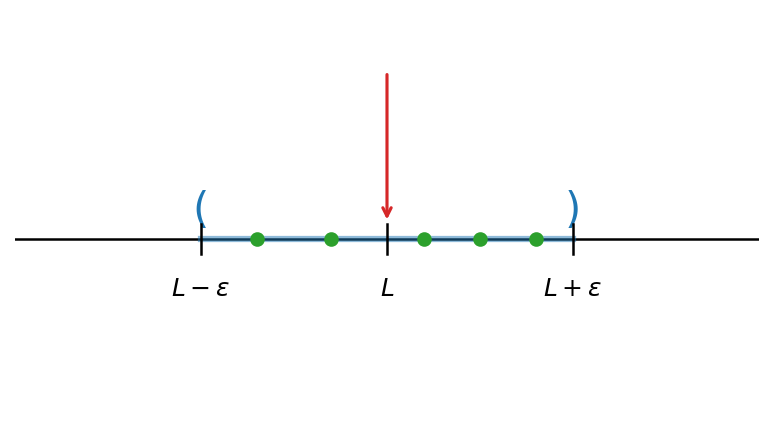
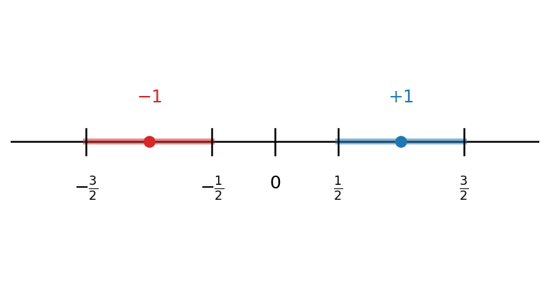
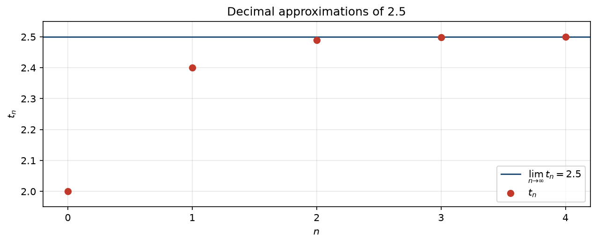

# גבול של סדרה

## הגדרה ודרכי תיאור

::: {#box-def-sequence .thmdef}
**סדרה (ממשית)** היא אוסף **אינסופי** של מספרים ממשיים, שבו יש **חשיבות לסדר** ו**חזרות מותרות** (ראו את הדיון על ההבדל בין סדרה לקבוצה [בפרק המבוא](06-sequences-intro.qmd)): $$a_1, a_2, a_3, \dots, a_n, \dots$$ $a_n$ הוא ה**איבר** שבמקום $n$, ו-$n$ הוא ה**אינדקס** הרץ על המספרים הטבעיים. את הסדרה כולה נסמן בקיצור $\{a_n\}_{n=1}^{\infty}$.
:::

::: {.thmrem title="ההגדרה הפורמלית: סדרה כפונקציה"}
פורמלית, סדרה ממשית $\{a_n\}_{n=1}^{\infty}$ היא **פונקציה** $a:\mathbb{N}\to\mathbb{R}$ — לכל מספר טבעי $n$ מותאם ערך ממשי יחיד $a_n = a(n)$. הצגה זו הופכת את ״הסדר״ ואת ״האינסופיות״ למדויקים. האינדקס רץ על המספרים הטבעיים $\mathbb{N} = \{1, 2, 3, \dots\}$, ולכן סדרה מתחילה כברירת מחדל מ-$a_1$; רק כאשר יצוין במפורש נתחיל את האינדקס במקום אחר (למשל $a_0$).
:::

איך מתארים סדרות? באופן עקרוני, עלינו לתאר באופן מדוייק איזה איבה נמצא במקום ה $n$ לכל $n\in\mathbb{N}$. אם ננסה לכתוב את כל איברי הסדרה לפי הסדר - נגלה שהדבר הוא בלתי אפשרי, יש לנו אינסוף איברים. איך מתמודדים עם הבעיה, יש מספר דרכים.

1.  הדרך ה״נאיבית״ - רושמים מספר איברים ראשונים של הסדרה תחת ההנחה ששאר האיברים ברורים מההקשר. לדוגמה: $1,3,5,7...$ היא סדרת כל האיברים האי-זוגיים בסדר עולה. דרך זאת לא נוחה מספר סיבות. ייתכן שיש כמה דרכים הגיוניות באותה מידה להמשיך את הסדרה. בנוסף, לעיתים מאוד קשה להגיד מה הוא האיבר במקום מסויים בסדרה.

2.  דרך שניה היא על בעזרת נוסחא ״סגורה״ של $n$ . למשל, את סדרת המספרים האי-זוגיים נתאר על ידי $a_n = 2n-1$.

3.  דרך שלישית היא בעזרת נוסחת רקורסיה. רקורסיה מוגרת באופן הבא: אנו מגדירים איזה שהו מספר סופי של האיברים הראשונים ופונקציה שמייצרת את איבר הבא על בסיס האיברים הקודמים. באופן עקרוני, ייתכן שהאיבר הבא בסדרה מוגדר על סמך כל האיברים הקודמים, אמנם בקורס איבר הבא יהיה פונקציה סגורה של מספר סופי של איברים הקודמים.

::: {#box-exm-sequences .thmexm}
- $a_n = n$ נותנת $1, 2, 3, 4, \dots$
- $a_n = (-1)^n$ נותנת $-1, 1, -1, 1, \dots$
- הסדרה הקבועה $a_n = 8$ נותנת $8, 8, 8, 8, \dots$
- אפשר להגדיר סדרה גם [**ברקורסיה**](05-induction.qmd#sec-recursive-definition): $a_1 = 1$ ו-$a_{n+1} = (n+1)\,a_n$ נותנת $1, 2, 6, 24, \dots$ . כלומר $a_n = n!$.
:::

## גבול של סדרה

מהו הערך שסדרה **מתקרבת** אליו? הרעיון: איברי הסדרה נעשים קרובים לערך $L$ כרצוננו — קרובים ככל שנדרוש — החל ממקום מסוים והלאה.

::: {#box-def-convergence .thmdef}
תהי $\{a_n\}_{n=1}^{\infty}$ סדרה. נאמר שהסדרה **מתכנסת**, או שיש לה **גבול**, אם קיים $L\in\mathbb{R}$ כך שלכל $\varepsilon>0$ קיים $N\in\mathbb{N}$ כך שלכל $n > N$ מתקיים $$|a_n - L| < \varepsilon$$ במקרה זה נאמר שהסדרה **שואפת** (או **מתכנסת**) ל-$L$, ונסמן $\lim\limits_{n\to\infty}a_n=L$ או $a_n \to L$. אם אין לסדרה גבול, נאמר שהיא **מתבדרת**.
:::

שימו לב למספר פרטים בהגדרה:

1.  התנאי מתקיים **לכל** מספר חיובי $\varepsilon>0$.
2.  האינדקס $N$ תלוי ב-$\varepsilon$, אך תמיד קיים — ככל שנדרוש דיוק רב יותר (כלומר $\varepsilon$ קטן יותר), ייתכן שנצטרך להתקדם רחוק יותר בסדרה.
3.  לכל $\varepsilon>0$, מספר האיברים המקיימים $|a_n - L| \geq \varepsilon$ הוא **סופי**.
4.  ההתכנסות אינה תלויה באיברים הראשונים של הסדרה — ״חשוב מה שקורה בסוף״.

```{python}
#| echo: false
#| output: false
import numpy as np
import matplotlib.pyplot as plt

fig, ax = plt.subplots(figsize=(6.4, 3.4))
L = 0.0
ax.axhline(0, color="black", lw=1.2, zorder=1)
ax.plot([L-1, L+1], [0, 0], color="tab:blue", lw=3, alpha=0.5, zorder=2)
for x, s in [(L-1, "("), (L+1, ")")]:
    ax.annotate(s, xy=(x, 0), xytext=(x, 0.02), ha="center", va="bottom",
                fontsize=20, color="tab:blue")
for x, lab in [(L-1, r"$L-\varepsilon$"), (L, r"$L$"), (L+1, r"$L+\varepsilon$")]:
    ax.plot([x, x], [-0.04, 0.04], color="black", lw=1.2, zorder=3)
    ax.annotate(lab, xy=(x, 0), xytext=(x, -0.10), ha="center", va="top", fontsize=12)
ax.annotate("", xy=(L, 0.04), xytext=(L, 0.45),
            arrowprops=dict(arrowstyle="->", color="tab:red", lw=1.5))
xs = [L-0.7, L-0.3, L+0.2, L+0.5, L+0.8]
ax.plot(xs, [0]*len(xs), "o", color="tab:green", ms=6, zorder=4)
ax.set_xlim(L-2, L+2)
ax.set_ylim(-0.45, 0.6)
ax.axis("off")
fig.savefig("figures/c07_fig01.png", dpi=150, bbox_inches="tight")
plt.close(fig)
```

```{=latex}
\par\medskip
\noindent\beginL\hbox to \linewidth{\hss\includegraphics[width=0.62\linewidth]{figures/c07_fig01.png}\hss}\endL\par
\medskip
```

::: {style="text-align:center"}
תרשים: ציר מספרים עם הקטע $(L-\varepsilon,\,L+\varepsilon)$ סביב הגבול $L$ — כל איברי הסדרה נמצאים בקטע החל ממקום מסוים
:::

::: {.content-visible when-format="html"}
{#fig-seq-eps-band width="62%" fig-align="center"}
:::

## דוגמאות

נציג שלוש דוגמאות בסיסיות: סדרה קבועה (התכנסות מיידית), סדרה מתחלפת (התבדרות), וסדרה שמתכנסת ״באמת״ אך אינה קבועה.

::: {#box-exm-constant-seq .thmexm}
הסדרה הקבועה $a_n = 1$ (כלומר $1, 1, 1, \dots$) מתכנסת, וגבולה — באופן לא מפתיע — הוא $1$: לכל $\varepsilon>0$ ולכל $n$ מתקיים $|a_n - 1| = |1-1| = 0 < \varepsilon$, כך שאותו $N$ מתאים לכל $\varepsilon$. זהו מקרה **חריג**: כאשר הסדרה אינה קבועה, בדרך כלל $N$ תלוי ב-$\varepsilon$.
:::

::: {#box-exm-pm-one .thmexm}
הסדרה $a_n = (-1)^n$, כלומר $-1, 1, -1, 1, \dots$, **מתבדרת**. נניח בשלילה שיש לה גבול $L$. אז לכל $\varepsilon>0$ קיים $N$ כך שלכל $n>N$ מתקיים $|a_n - L| < \varepsilon$. ניקח $\varepsilon = 1$. לכל $n>N$ **זוגי** מתקיים $a_n = 1$, ולכן $|1 - L| < 1$; לכל $n>N$ **אי-זוגי** מתקיים $a_n = -1$, ולכן $|L - (-1)| < 1$. לפי אי-שוויון המשולש, $$2 = |1 - (-1)| \le |1 - L| + |L - (-1)| < 1 + 1 = 2,$$ כלומר $2 < 2$ — סתירה. לכן הסדרה מתבדרת.
:::

```{python}
#| echo: false
#| output: false
import numpy as np
import matplotlib.pyplot as plt

N = 20
n = np.arange(1, N + 1)
a_n = (-1.0) ** n

fig, ax = plt.subplots(figsize=(7.2, 3.6))
ax.axhline(1, linestyle="--", color="0.65", linewidth=1)
ax.axhline(-1, linestyle="--", color="0.65", linewidth=1)
ax.scatter(n, a_n, s=18, color="#c0392b", zorder=3, label=r"$a_n = (-1)^n$")
ax.set_xlabel(r"$n$")
ax.set_ylabel(r"$a_n$")
ax.set_title(r"$a_n = (-1)^n$")
ax.set_xticks(n[::2])
ax.set_ylim(-1.4, 1.4)
ax.grid(True, alpha=0.3)
ax.legend(loc="upper right")
fig.tight_layout()
fig.savefig("figures/c07_fig02.png", dpi=150, bbox_inches="tight")
plt.close(fig)
```

```{=latex}
\par\medskip
\noindent\beginL\hbox to \linewidth{\hss\includegraphics[width=0.85\linewidth]{figures/c07_fig02.png}\hss}\endL\par
\medskip
```

::: {style="text-align:center"}
תרשים: הסדרה $a_n = (-1)^n$ — איבריה קופצים בין שני קווים, ולכן אינם מתקרבים לקו אחד
:::

::: {.content-visible when-format="html"}
{#fig-seq-pm-one width="80%" fig-align="center"}
:::

::: {#box-exm-one-frac-n .thmexm}
הסדרה $a_n = 1 + \dfrac{\sin(n)}{n}$ (עבור $n \ge 1$) מתכנסת, וגבולה $1$. יהי $\varepsilon>0$. קיים $N$ כך ש-$N \ge \dfrac{1}{\varepsilon}$, ולכן לכל $n>N$ מתקיים $\dfrac{1}{n} < \dfrac{1}{N} \le \varepsilon$. לכן $$|a_n - 1| = \left|\frac{\sin(n)}{n}\right| \le \frac{1}{n} < \varepsilon,$$ כנדרש.
:::

```{python}
#| echo: false
#| output: false
import numpy as np
import matplotlib.pyplot as plt

N = 30
n = np.arange(1, N + 1)
a_n = 1 + np.sin(n) / n

x = np.linspace(1, N, 600)
upper = 1 + 1 / x
lower = 1 - 1 / x

fig, ax = plt.subplots(figsize=(7.2, 4.3))
ax.plot(x, upper, linestyle=":", color="0.65", linewidth=1)
ax.plot(x, lower, linestyle=":", color="0.65", linewidth=1)
ax.axhline(1, linestyle="--", color="#1f4e79", linewidth=1.4,
           label=r"$\lim_{n\to\infty} a_n = 1$")
ax.scatter(n, a_n, s=10, color="#c0392b", zorder=3,
           label=r"$a_n = 1 + \frac{\sin(n)}{n}$")
ax.set_xlabel(r"$n$")
ax.set_ylabel(r"$a_n$")
ax.set_title(r"$a_n = 1 + \frac{\sin(n)}{n}$")
ax.set_xticks(np.arange(5, N + 1, 5))
ax.grid(True, alpha=0.3)
ax.legend()
fig.tight_layout()
fig.savefig("figures/c07_fig03.png", dpi=150, bbox_inches="tight")
plt.close(fig)
```

```{=latex}
\par\medskip
\noindent\beginL\hbox to \linewidth{\hss\includegraphics[width=0.85\linewidth]{figures/c07_fig03.png}\hss}\endL\par
\medskip
```

::: {style="text-align:center"}
תרשים: התכנסות הסדרה $a_n = 1 + \frac{\sin(n)}{n}$ אל $1$ — הנקודות נעשות צפופות סביב קו הגבול
:::

::: {.content-visible when-format="html"}
{#fig-seq-sin-n width="80%" fig-align="center"}
:::

נשים לב: הגדרת ההתכנסות בודקת רק את **קיום** הגבול, לא את **מהירות** ההתקרבות אליו. שתי סדרות יכולות להתכנס לאותו גבול בקצבים שונים מאוד.

### דוגמאות נוספות

::: {#box-exm-one-over-n .thmexm}
עבור $a_n = \dfrac{1}{n}$ מתקיים $\lim\limits_{n\to\infty} a_n = 0$. יהי $\varepsilon>0$; נבחר $N = \left\lfloor \dfrac{1}{\varepsilon}\right\rfloor + 1$. אז לכל $n>N$ מתקיים $n > \dfrac{1}{\varepsilon}$, ולכן $\left|\dfrac{1}{n} - 0\right| = \dfrac{1}{n} < \varepsilon$.
:::

::: {#box-exm-seq-3n-4 .thmexm}
עבור $a_n = \dfrac{3n-4}{n+2}$ מתקיים $\lim\limits_{n\to\infty} a_n = 3$. נפשט: $$\left|\frac{3n-4}{n+2} - 3\right| = \left|\frac{3n-4-3(n+2)}{n+2}\right| = \frac{10}{n+2} < \frac{10}{n}.$$ יהי $\varepsilon>0$; נבחר $N = \left\lfloor \dfrac{10}{\varepsilon}\right\rfloor + 1$. אז לכל $n>N$ מתקיים $\dfrac{10}{n} < \varepsilon$, ולכן $\left|a_n - 3\right| < \varepsilon$.
:::

::::::::: extra
## פיתוח עשרוני כסדרה (העשרה)

בפרק המבוא ראינו את סדרת הקירובים העשרוניים של $\sqrt{2}$. כעת, משהוגדרה ההתכנסות, נטפל בפיתוח העשרוני במדויק. כדוגמה, נענה על השאלה: האם $0.999\dots = 1$? אחרי שראינו הגדרה של המושג גבול, התשובה היא ״כן״ — שני הסימונים מתארים את אותו מספר. הסיבה: $0.999\dots$ הוא קיצור לסדרת הקירובים $0.9,\ 0.99,\ 0.999,\ \dots$, המתכנסת ל-$1$.

::: {#box-def-decimal-expansion .thmdef}
יהי $a>0$ ממשי. נגדיר [**ברקורסיה**](05-induction.qmd#sec-recursive-definition) סדרת ספרות $\{a_n\}_{n=1}^\infty$ (עם $a_n \in \{0,1,\dots,9\}$, ו-$a_0$ שלם כלשהו): $a_0$ הוא **המספר השלם הגדול ביותר הקטן ממש מ-**$a$, ובהינתן $a_0,\dots,a_n$, $$a_{n+1} = \max\left\{k \in \{0,\dots,9\} \;\middle|\; a_0.a_1\dots a_n + \frac{k}{10^{n+1}} < a\right\}.$$ הביטוי $a_0.a_1a_2\dots$ נקרא ה**פיתוח העשרוני** של $a$ (עבור $a<0$ לוקחים את הפיתוח של $-a$ עם סימן מינוס, ועבור $a=0$ את הסדרה הקבועה $0$). נסמן $t_n = a_0.a_1\dots a_n$, ונקרא ל-$\{t_n\}$ **סדרת הקירובים העשרוניים** של $a$.
:::

::: {#box-prp-decimal-convergence .thmprp}
יהי $a\in\mathbb{R}$, ותהי $\{t_n\}$ סדרת הקירובים העשרוניים שלו. אז $\lim\limits_{n\to\infty} t_n = a$; במילים אחרות, $a = a_0.a_1a_2\dots$.
:::

::: thmproof
נניח $a>0$ (המקרים $a<0$ ו-$a=0$ דומים). לפי בניית הספרות, לכל $n$ מתקיים $t_n < a \le t_n + \frac{1}{10^n}$, ולכן $|t_n - a| \le \frac{1}{10^n}$. יהי $\varepsilon>0$. לפי [**תכונת ארכימדס**](03-number-systems.qmd#box-thm-archimedes) (לכל ממשי חיובי קיים מספר טבעי הגדול ממנו) קיים $N$ כך ש-$10^N > \frac{1}{\varepsilon}$, כלומר $\frac{1}{10^N} < \varepsilon$. לכן לכל $n>N$ מתקיים $|t_n - a| \le \frac{1}{10^n} \le \frac{1}{10^N} < \varepsilon$, כנדרש.
:::

::: {#box-exm-expansion-25 .thmexm}
הפיתוח העשרוני של $2.5$ הוא $2.4999\dots$, וסדרת הקירובים שלו היא $2,\ 2.4,\ 2.49,\ 2.499,\ \dots$ — המתכנסת ל-$2.5$.
:::

```{python}
#| echo: false
#| output: false
import numpy as np
import matplotlib.pyplot as plt

N = 4
n = np.arange(0, N + 1)
a = 2.5
t_n = np.array([2.0 if i == 0 else a - 10.0 ** (-int(i)) for i in n])

fig, ax = plt.subplots(figsize=(8.6, 3.6))
ax.axhline(a, linestyle="-", color="#1f4e79", linewidth=1.4,
           label=r"$\lim_{n\to\infty} t_n = 2.5$")
ax.scatter(n, t_n, s=40, color="#c0392b", zorder=3, label=r"$t_n$")
ax.set_xlabel(r"$n$")
ax.set_ylabel(r"$t_n$")
ax.set_title(r"Decimal approximations of $2.5$")
ax.set_xticks(n)
ax.set_ylim(1.95, 2.55)
ax.grid(True, alpha=0.3)
ax.legend()
fig.tight_layout()
fig.savefig("figures/c07_fig04.png", dpi=150, bbox_inches="tight")
plt.close(fig)
```

```{=latex}
\par\medskip
\noindent\beginL\hbox to \linewidth{\hss\includegraphics[width=0.85\linewidth]{figures/c07_fig04.png}\hss}\endL\par
\medskip
```

::: {style="text-align:center"}
תרשים: התכנסות הקירובים העשרוניים הסופיים של $2.5$
:::

::: {.content-visible when-format="html"}
{#fig-seq-decimal width="80%" fig-align="center"}
:::

כעת נשוב לשאלה שפתחנו בה. לפי הגדרת הפיתוח, הפיתוח של $1$ הוא $0.999\dots$: המספר השלם הגדול ביותר הקטן ממש מ-$1$ הוא $a_0 = 0$, ובכל שלב הספרה הגדולה ביותר ששומרת על הקירוב קטן ממש מ-$1$ היא $9$. סדרת הקירובים $0,\ 0.9,\ 0.99,\ \dots$ מתכנסת ל-$1$, ולכן $$0.999\dots = \lim_{n\to\infty} t_n = 1.$$ שני הסימונים $0.999\dots$ ו-$1.000\dots$ מתארים אפוא את אותו מספר ממשי.
:::::::::