# גבולות של פונקציות

## הגדרת הגבול של פונקציה + דוגמה


<!-- מקור: הרצאה 10 -->

אם $f(x)$ פונקציה שמוגדרת בסביבה של $x_0$, ואם $L \in R$

אז נגיד כי הגבול של $f(x)$ בנקודה $x_0$ שווה ל-L, ונסמן זאת ע"י $\lim_{x \to x_0} f(x) = L$

אם לכל $\varepsilon > 0$, קיימת $\delta > 0$, כך שלכל x עבורם $|x - x_0| < \delta$

מתקיים $|f(x) - L| < \varepsilon$

```{python}
#| echo: false
#| output: false
import numpy as np
import matplotlib.pyplot as plt

fig, ax = plt.subplots(figsize=(6.4, 3.6))
x = np.linspace(0.2, 3.4, 400)
f = 0.6 * x + 0.5 * np.sin(0.9 * x) + 0.8
ax.plot(x, f, color="C0", lw=2)

x0 = 1.8
L = 0.6 * x0 + 0.5 * np.sin(0.9 * x0) + 0.8
eps = 0.35
delta = 0.45

# horizontal band L +/- eps
ax.axhspan(L - eps, L + eps, color="C1", alpha=0.15)
ax.axhline(L, color="0.4", lw=0.8, ls="--")
ax.axhline(L + eps, color="C1", lw=0.8, ls="--")
ax.axhline(L - eps, color="C1", lw=0.8, ls="--")
# vertical band x0 +/- delta
ax.axvspan(x0 - delta, x0 + delta, color="C2", alpha=0.12)
ax.axvline(x0, color="0.4", lw=0.8, ls="--")
ax.axvline(x0 - delta, color="C2", lw=0.8, ls="--")
ax.axvline(x0 + delta, color="C2", lw=0.8, ls="--")
ax.plot([x0], [L], "o", color="C0")

ax.set_yticks([L - eps, L, L + eps])
ax.set_yticklabels([r"$L-\varepsilon$", r"$L$", r"$L+\varepsilon$"])
ax.set_xticks([x0 - delta, x0, x0 + delta])
ax.set_xticklabels([r"$x_0-\delta$", r"$x_0$", r"$x_0+\delta$"])
ax.set_xlabel(r"$x$")
ax.set_ylabel(r"$y$")
ax.grid(alpha=0.3)
ax.set_xlim(0.2, 3.4)
fig.savefig("c08_fig01.png", dpi=150, bbox_inches="tight")
plt.close(fig)
```

```{=latex}
\par\medskip
\noindent\beginL\hbox to \linewidth{\hss\includegraphics[width=0.62\linewidth]{c08_fig01.png}\hss}\endL\par
\medskip
```

::: {style="text-align:center"}
תרשים: הגדרת הגבול לפי $\varepsilon$-$\delta$ — רצועה אופקית $L\pm\varepsilon$ ורצועה אנכית $x_0\pm\delta$
:::

::: {.content-visible when-format="html"}
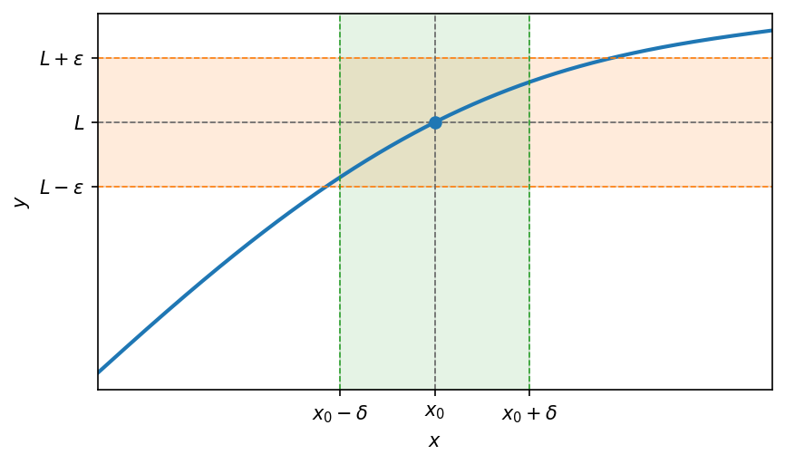{#fig-c04_fig01 width="62%" fig-align="center"}
:::

אם $f(x)$ מוגדרת בסביבה נקובה של $x_0$, אז $0 < |x - x_0| < \delta$

```{python}
#| echo: false
#| output: false
import numpy as np
import matplotlib.pyplot as plt

fig, ax = plt.subplots(figsize=(6.4, 3.6))
x0 = 1.5
L = 2.0
x = np.linspace(0.2, 3.0, 400)
f = 0.7 * x + 0.95  # straight line passing through (x0, L)
ax.plot(x, f, color="C0", lw=2)

# removable point: open circle at (x0, L)
ax.axhline(L, color="0.4", lw=0.8, ls="--")
ax.axvline(x0, color="0.4", lw=0.8, ls="--")
ax.plot([x0], [L], "o", mfc="white", mec="C0", mew=1.8, ms=9, zorder=5)

ax.set_xticks([x0])
ax.set_xticklabels([r"$x_0$"])
ax.set_yticks([L])
ax.set_yticklabels([r"$L$"])
ax.set_xlabel(r"$x$")
ax.set_ylabel(r"$y$")
ax.grid(alpha=0.3)
ax.set_xlim(0.2, 3.0)
fig.savefig("c08_fig02.png", dpi=150, bbox_inches="tight")
plt.close(fig)
```

```{=latex}
\par\medskip
\noindent\beginL\hbox to \linewidth{\hss\includegraphics[width=0.62\linewidth]{c08_fig02.png}\hss}\endL\par
\medskip
```

::: {style="text-align:center"}
תרשים: גבול $L$ בנקודה $x_0$ שבה הפונקציה אינה מוגדרת — עיגול ריק על הגרף
:::

::: {.content-visible when-format="html"}
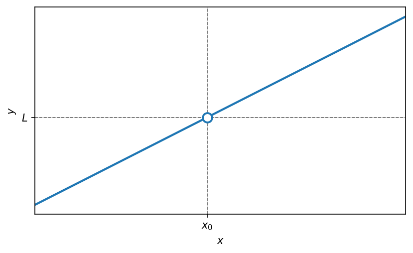{#fig-c04_fig02 width="62%" fig-align="center"}
:::

גבול של $f(x)$ בנקודה $x_0$, אינם תלוי באם הפונקציה $f(x)$ מוגדרת ב-$x_0$ בכלל ואיך היא מוגדרת ב-$x_0$.

לדוגמא:

הראו כי $\lim_{x \to 2}(x^2 + 1) = 5$

פתרון לפי ההגדרה:

$L = 5$, $x_0 = 2$, $f(x) = x^2 + 1$

יהי $\varepsilon > 0$, נחפש $\delta > 0$ כך שלכל x המקיים $|x - 2| < \delta$ יתקיים $|(x^2 + 1) - 5| < \varepsilon$

$$|(x^2 + 1) - 5| = |x^2 - 4| = |(x-2)(x+2)| = |x - 2| \cdot |x + 2| < \delta \cdot |x + 2| =$$

<!-- בדיקה: מתחת ל-$|x-2|$ סומן "$<\delta$" -->

$$= \delta \cdot |x - 2 + 4| \leq \delta \cdot (|x - 2| + 4) < \delta \cdot (\delta + 4)$$

<!-- בדיקה: מתחת ל-$|x-2|$ סומן "$<\delta$", ומתחת ל-$\leq$ הערה בכתב יד "אי שוויון המשולש" -->

נרצה למצוא $\varepsilon$ כך שיתקיים $\delta \cdot (\delta + 4) < \varepsilon$

מראש נחפש $\delta < 1$: $\delta \cdot (\delta + 4) < \delta \cdot 5 < \varepsilon$

$$\delta < \frac{\varepsilon}{5}$$

לכן, לסיכום נבחר $0 < \delta < min\{1, \frac{\varepsilon}{5}\}$

<!-- מקור: הרצאה 11 -->

## משפט היינה


### משפט היינה

אם $f(x)$ מוגדרת בסביבה נקובה של $x_0$, אז $\lim_{x \to x_0} f(x) = L$ אם

ורק אם, לכל סדרה $a_n \to x_0$ שמקיימת $a_n \neq x_0$ מתקיים $f(a_n) \to L$

$$\lim_{x \to x_0} f(x) = L \iff f(a_n) \to L$$

לדוגמא:

עבור הפונקציה $f(x) = x^2$, מהו $\lim_{x \to 2} f(x) = \square$

כלומר: $f(x) = x^2$, $x_0 = 2$, $L = ?$

פתרון:

ניעזר בהיינה- תהי $a_n \to 2$ (כאשר $a_n \neq 2$) נבדוק האם ולאן מתכנסת $f(a_n)$:

$$a_n^2 \to 4$$

<!-- בדיקה: הערה בכתב יד מודגשת ליד הביטוי, לא ברורה לקריאה -->

ולכן לפי היינה הראנו

$$\lim_{x \to 2} x^2 = 4$$


### דוגמא מטעית היינה:

הראו כי הגבול $$\lim_{x \to 0} \sin\left(\frac{1}{x}\right)$$ אינו קיים.

```{python}
#| echo: false
#| output: false
import numpy as np
import matplotlib.pyplot as plt

fig, ax = plt.subplots(figsize=(6.4, 3.6))
x = np.linspace(-0.5, 0.5, 6000)
x = x[np.abs(x) > 1e-4]
y = np.sin(1.0 / x)
ax.plot(x, y, color="C0", lw=0.7)

ax.axhline(1, color="0.6", lw=0.8, ls="--")
ax.axhline(-1, color="0.6", lw=0.8, ls="--")
ax.set_yticks([-1, 0, 1])
ax.set_xlabel(r"$x$")
ax.set_ylabel(r"$y$")
ax.set_title(r"$f(x)=\sin\!\left(\frac{1}{x}\right)$")
ax.grid(alpha=0.3)
ax.set_xlim(-0.5, 0.5)
ax.set_ylim(-1.4, 1.4)
fig.savefig("c08_fig03.png", dpi=150, bbox_inches="tight")
plt.close(fig)
```

```{=latex}
\par\medskip
\noindent\beginL\hbox to \linewidth{\hss\includegraphics[width=0.62\linewidth]{c08_fig03.png}\hss}\endL\par
\medskip
```

::: {style="text-align:center"}
תרשים: $f(x)=\sin\left(\frac{1}{x}\right)$ — תנודות צפופות בקרבת הראשית
:::

::: {.content-visible when-format="html"}
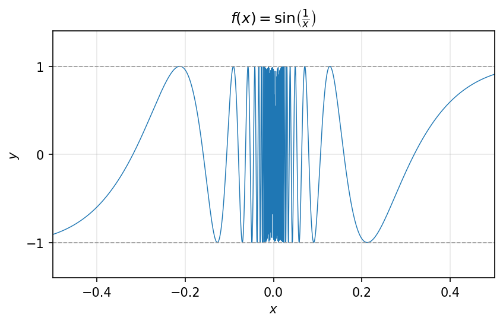{#fig-c04_fig05 width="62%" fig-align="center"}
:::

### פתרון:

$$f(x) = \sin\left(\frac{1}{x}\right) \;,\; x_0 = 0$$

נחפש: $a_n \to 0$ , $b_n \to 0$ עבורן: $f(a_n) \to \neq \to f(b_n)$

ניקח: $$a_n = \frac{1}{\frac{\pi}{2} + 2\pi n} \to 0$$ וגם $$f(a_n) = \sin\left(\frac{\pi}{2} + 2\pi n\right) = 1 \xrightarrow[n \to \infty]{} 1$$

וניקח: $$b_n = \frac{1}{0 + 2\pi \cdot n} \to 0$$ וגם $$f(b_n) = \sin(2\pi n) = 0 \xrightarrow[n \to \infty]{} 0$$

ולכן $$\lim_{x \to 0} \sin\left(\frac{1}{x}\right)$$ לא קיים

## אריתמטיקה של גבולות

### אריתמטיקה של גבולות

אם $f, g$ פונקציות שמוגדרות בסביבה נקובה של $x_0$

ואם $\lim_{x \to x_0} f(x) = L_1$, $\lim_{x \to x_0} g(x) = L_2$

אז מתקיים:

חיבור: $$\lim_{x \to x_0} (f(x) + g(x)) = L_1 + L_2$$

חיסור: $$\lim_{x \to x_0} (f(x) - g(x)) = L_1 - L_2$$

כפל: $$\lim_{x \to x_0} (f(x) \cdot g(x)) = L_1 \cdot L_2$$

חילוק ($L_2 \neq 0, g(x) \neq 0$): $$\lim_{x \to x_0} \frac{f(x)}{g(x)} = \frac{L_1}{L_2}$$

חזקה (רק כאשר $L_1^{L_2}$ מוגדר): $$\lim_{x \to x_0} f(x)^{g(x)} = L_1^{L_2}$$

**הוכחה של הכפל**

נראה כי $\lim_{x \to x_0} (f(x) \cdot g(x)) = L_1 \cdot L_2$

נראה זאת בעזרת היינה: תהי $a_n \to x_0$ סדרה המקיימת $a_n \neq x_0$

ולכן מהנתון, היינה אומר כי $\lim_{x \to x_0} f(x) = L_1$ ולכן $f(a_n) \to L_1$

בדומה, ולפי היינה $\lim_{x \to x_0} g(x) = L_2$, $g(a_n) \to L_2$

לפי אריתמטיקה של כפל סדרות, נסיק: $f(a_n) \cdot g(a_n) \to L_1 \cdot L_2$

$$\lim_{n \to \infty} (f \cdot g)(a_n) = L_1 \cdot L_2 \longrightarrow \lim_{x \to x_0} (f \cdot g)(x) = L_1 \cdot L_2$$

### דוגמאות שימושיות

#### 1) פונקציות מהצורה $x^a$

$\lim_{x \to x_0} x^a = x_0^a$, כאשר $a$ קבוע

<!-- בדיקה: הערה בכתב יד מודגשת ("אריתמטיקה של גבולות"?), לא ברורה לקריאה -->

כלומר: אם $f(x) = x$ אז $\lim_{x \to x_0} f(x) = x_0$

למשל: $\lim_{x \to 2} x^3 = 8$

#### 2) פונקציות מעריכיות

$\lim_{x \to x_0} b^x = b^{x_0}$ כאשר $b > 0$ קבוע

למשל: $\lim_{x \to -3} e^x = e^{-3}$

#### 3) פונקציות טריגונומטריות

$$\lim_{x \to 0} \cos(x) = \cos(x_0) \quad , \quad \lim_{x \to 0} \sin(x) = \sin(x_0)$$

נוכיח כי $\lim_{x \to x_0} \sin(x) = \sin(x_0)$ לפי ההגדרה:

יהי $\varepsilon > 0$, נחפש $\delta > 0$ כך שלכל $x$ המקיים $0 < |x - x_0| < \delta$

יתקיים: $|f(x) - L| < \varepsilon$

$$|f(x) - L| = |\sin(x) - \sin(x_0)| = \left|2 \cdot \sin\left(\frac{x - x_0}{2}\right) \cdot \cos\left(\frac{x + x_0}{2}\right)\right| \leq 2 \cdot \left|\sin\left(\frac{x - x_0}{2}\right)\right| =$$

$$= 2 \cdot \left|\frac{x - x_0}{2}\right| = |x - x_0| < \delta$$

ולכן נבחר מראש $0 < \delta < \varepsilon$

לסיכום, הראנו שלכל $\varepsilon > 0$, נבחר $\delta = \frac{\varepsilon}{2}$ וכך הראנו שלכל $x$ המקיים $|x - x_0| < \delta$

מתקיים: $|\sin(x) - \sin(x_0)| < \varepsilon$

אי שוויון חשוב לזכור: $\sin: |\sin(t)| \leq t$ לכל $t \in R$

<!-- בדיקה: הערה בכתב יד "אי שוויון חשוב לזכור", הביטוי נקרא $|\sin(t)| \leq t$ -->

למשל: $\lim_{x \to 0} \tan(x) = \lim_{x \to 0} \frac{\sin(x)}{\cos(x)} = \frac{\sin(x_0)}{\cos(x_0)}$ לכל $x_0$ עבורו $\cos(x_0) \neq 0$

#### 4) פונקציות לוגריתמיות

$\lim_{x \to \infty} \log_a(x) = \log_a(x_0)$ כאשר $a > 0$ קבוע וכאשר $x_0 > 0$

<!-- בדיקה: סימן הגבול נקרא $x \to \infty$ אך לפי ההקשר ייתכן $x \to x_0$ -->

למשל: $\lim_{x \to 4} \ln(x) = \ln(4)$ כי $\ln(x) = \log_e(x)$

## משפט הסנדוויץ׳

### משפט כלל הסנדויץ'

אם $f, g, h$ פונקציות מוגדרות בסביבת הנקודה של $x_0$

ואם $h(x) \leq f(x) \leq g(x)$ לכל $x$ בסביבה נקובה של $x_0$

ו- $\lim_{x \to x_0} h(x) = \lim_{x \to x_0} g(x) = L$

```{python}
#| echo: false
#| output: false
import numpy as np
import matplotlib.pyplot as plt

fig, ax = plt.subplots(figsize=(6.4, 3.6))
x0 = 1.0
L = 1.5
x = np.linspace(-0.6, 2.6, 400)
base = L  # common value at x0
g = base + 0.9 * (x - x0) ** 2 + 0.0
f = base + 0.35 * (x - x0) ** 2 * np.cos(2 * (x - x0))
h = base - 0.9 * (x - x0) ** 2

ax.plot(x, g, color="C0", lw=2, label=r"$g$")
ax.plot(x, f, color="C1", lw=2, label=r"$f$")
ax.plot(x, h, color="C3", lw=2, label=r"$h$")

ax.axvline(x0, color="0.5", lw=0.8, ls="--")
ax.axhline(L, color="0.5", lw=0.8, ls="--")
ax.plot([x0], [L], "o", color="0.2", ms=6, zorder=5)

ax.set_xticks([x0])
ax.set_xticklabels([r"$x_0$"])
ax.set_yticks([L])
ax.set_yticklabels([r"$L$"])
ax.set_xlabel(r"$x$")
ax.set_ylabel(r"$y$")
ax.legend(loc="upper center")
ax.grid(alpha=0.3)
fig.savefig("c08_fig04.png", dpi=150, bbox_inches="tight")
plt.close(fig)
```

```{=latex}
\par\medskip
\noindent\beginL\hbox to \linewidth{\hss\includegraphics[width=0.62\linewidth]{c08_fig04.png}\hss}\endL\par
\medskip
```

::: {style="text-align:center"}
תרשים: כלל הסנדוויץ' — $h\le f\le g$ והקצוות נפגשים בנקודה $L$ מעל $x_0$
:::

::: {.content-visible when-format="html"}
{#fig-c04_fig03 width="62%" fig-align="center"}
:::


<!-- מקור: הרצאה 12 -->

אם $f,g,h$ פונקציות מוגדרות בסביבת הנקודה של $x_0$

ואם $h(x) \leq f(x) \leq g(x)$ לכל $x$ בסביבה נקובה של $x_0$

ו- $$\lim_{x \to x_0} h(x) = \lim_{x \to x_0} g(x) = L$$

```{python}
#| echo: false
#| output: false
import numpy as np
import matplotlib.pyplot as plt

fig, ax = plt.subplots(figsize=(6.4, 3.6))
x0 = 1.0
L = 1.5
x = np.linspace(-0.6, 2.6, 400)
g = L + 0.9 * (x - x0) ** 2
f = L + 0.35 * (x - x0) ** 2 * np.cos(2 * (x - x0))
h = L - 0.9 * (x - x0) ** 2

ax.plot(x, g, color="C0", lw=2, label=r"$g$")
ax.plot(x, f, color="C1", lw=2, label=r"$f$")
ax.plot(x, h, color="C3", lw=2, label=r"$h$")

ax.axvline(x0, color="0.5", lw=0.8, ls="--")
ax.axhline(L, color="0.5", lw=0.8, ls="--")
ax.plot([x0], [L], "o", color="0.2", ms=6, zorder=5)

ax.set_xticks([x0])
ax.set_xticklabels([r"$x_0$"])
ax.set_yticks([L])
ax.set_yticklabels([r"$L$"])
ax.set_xlabel(r"$x$")
ax.set_ylabel(r"$y$")
ax.legend(loc="upper center")
ax.grid(alpha=0.3)
fig.savefig("c08_fig05.png", dpi=150, bbox_inches="tight")
plt.close(fig)
```

```{=latex}
\par\medskip
\noindent\beginL\hbox to \linewidth{\hss\includegraphics[width=0.62\linewidth]{c08_fig05.png}\hss}\endL\par
\medskip
```

::: {style="text-align:center"}
תרשים: כלל הסנדוויץ' — $h\le f\le g$ הכלואות זו בזו ונפגשות בנקודה $L$ מעל $x_0$
:::

::: {.content-visible when-format="html"}
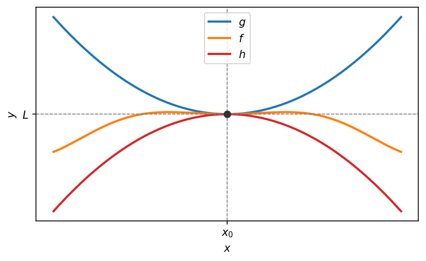{#fig-c04_fig04 width="62%" fig-align="center"}
:::

מסקנה מכלל הסנדוויץ'

אם $f,g$ פונקציות שמוגדרות בסביבה מנוקבת של $x_0$ , ואם $$\lim_{x \to x_0} f(x) = 0$$ ואם $g(x)$ חסומה בסביבת הנקודה המנוקבת $x_0$ ,

אז: $$\lim_{x \to x_0} f(x) \cdot g(x) = 0$$ "אפסה כפול חסומה"

### לדוגמא:

חשבו את הגבול

$$\lim_{x \to 0} x \sin\left(\frac{1}{x}\right)$$

### פתרון:

$$\lim_{x \to 0} x = 0$$ והפונקציה $\sin\left(\frac{1}{x}\right)$ חסומה בסביבה הנקובה $0$, כי $\left|\sin\left(\frac{1}{x}\right)\right| \leq 1$

ולכן מ"אפסה כפול חסומה", נסיק: $$\lim_{x \to 0} x \sin\left(\frac{1}{x}\right) = \boxed{0}$$

## גבולות חד-צדדיים

אם $f$ מוגדרת בסביבה מנוקבת ימנית של $x_0$ , כלומר ב- $(x_0 \,,\, x_0 + \square)$

אז נגיד כי $$\lim_{x \to x_0^+} f(x) = L$$ אם לכל $\varepsilon > 0$ קיימת $\delta > 0$ ,

כך שלכל $x$ המקיים: $0 < x - x_0 < \delta$ . כלומר: $x_0 < x < x_0 + \delta$ ,

ומתקיים $$|f(x) - L| < \varepsilon$$

אם $f$ מוגדרת בסביבה מנוקבת שמאלית של $x_0$ , כלומר ב- $(x_0 - \square \,,\, x_0)$

אז נגיד כי $$\lim_{x \to x_0^-} f(x) = L$$ אם לכל $\varepsilon > 0$ קיימת $\delta > 0$ ,

כך שלכל $x$ המקיים: $x_0 - \delta < x < x_0$ . כלומר: $x \in (x_0 - \delta, x_0)$ ,

ומתקיים $$|f(x) - L| < \varepsilon$$

### דוגמא:

האם קיים הגבול $$\lim_{x \to 1} \lfloor x \rfloor$$

```{python}
#| echo: false
#| output: false
import numpy as np
import matplotlib.pyplot as plt

fig, ax = plt.subplots(figsize=(6.4, 3.6))
for k in range(-1, 4):
    # step on [k, k+1) has value k
    ax.hlines(k, k, k + 1, color="C0", lw=2)
    ax.plot([k], [k], "o", color="C0", ms=7, zorder=5)            # closed left end
    ax.plot([k + 1], [k], "o", mfc="white", mec="C0", mew=1.6, ms=7, zorder=5)  # open right end

ax.axvline(1, color="0.6", lw=0.8, ls="--")
ax.set_xticks([-1, 0, 1, 2, 3])
ax.set_yticks([-1, 0, 1, 2, 3])
ax.set_xlabel(r"$x$")
ax.set_ylabel(r"$y$")
ax.set_title(r"$f(x)=\lfloor x \rfloor$")
ax.grid(alpha=0.3)
ax.set_xlim(-1.3, 3.3)
ax.set_ylim(-1.5, 3.5)
fig.savefig("c08_fig06.png", dpi=150, bbox_inches="tight")
plt.close(fig)
```

```{=latex}
\par\medskip
\noindent\beginL\hbox to \linewidth{\hss\includegraphics[width=0.62\linewidth]{c08_fig06.png}\hss}\endL\par
\medskip
```

::: {style="text-align:center"}
תרשים: פונקציית הערך השלם $f(x)=\lfloor x \rfloor$ — קפיצה בנקודה $x=1$
:::

::: {.content-visible when-format="html"}
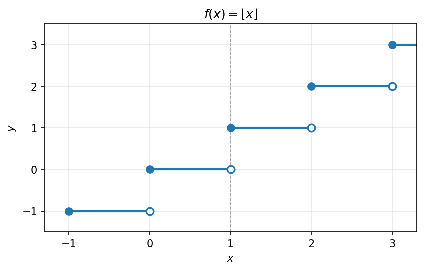{#fig-c04_fig06 width="62%" fig-align="center"}
:::

### פתרון:

ניעזר בהיינה ונבחר: $$a_n = 1 + \frac{1}{n}$$ המקיימת $a_{n \to 1}$ וגם $f(a_n) = 1 \xrightarrow[n \to \infty]{} 1$

ניקח: $$b_n = 1 - \frac{1}{n}$$ המקיימת $b_{n \to 1}$ וגם $f(b_n) = 0 \xrightarrow[n \to \infty]{} 0$

לכן מהיינה, הגבול $$\lim_{x \to 1} \lfloor x \rfloor$$ לא קיים.

### דוגמא נוספת:

$$\lim_{x \to 0^+} \sqrt{x} = 0$$

```{python}
#| echo: false
#| output: false
import numpy as np
import matplotlib.pyplot as plt

fig, ax = plt.subplots(figsize=(6.4, 3.6))
x = np.linspace(0, 4, 400)
ax.plot(x, np.sqrt(x), color="C0", lw=2)
ax.plot([0], [0], "o", color="C0", ms=6, zorder=5)
ax.set_xlabel(r"$x$")
ax.set_ylabel(r"$y$")
ax.set_title(r"$f(x)=\sqrt{x}$")
ax.grid(alpha=0.3)
ax.set_xlim(-0.2, 4)
ax.set_ylim(-0.2, 2.2)
fig.savefig("c08_fig07.png", dpi=150, bbox_inches="tight")
plt.close(fig)
```

```{=latex}
\par\medskip
\noindent\beginL\hbox to \linewidth{\hss\includegraphics[width=0.62\linewidth]{c08_fig07.png}\hss}\endL\par
\medskip
```

::: {style="text-align:center"}
תרשים: הפונקציה $f(x)=\sqrt{x}$ והגבול החד-צדדי $\lim_{x\to 0^+}\sqrt{x}=0$
:::

::: {.content-visible when-format="html"}
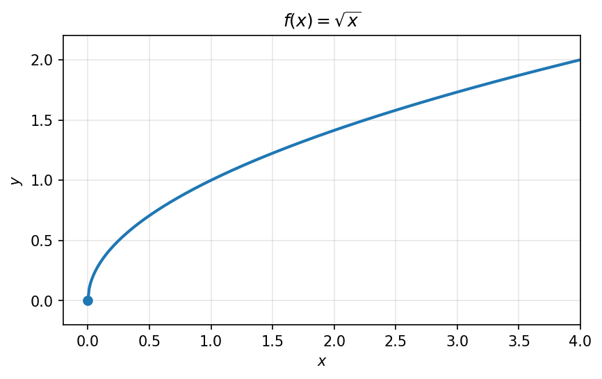{#fig-c04_fig07 width="62%" fig-align="center"}
:::

::: {#prp-onesided-limit .proposition}
אם $f$ מוגדרת בסביבה מנוקבת של $x_0$ , אז $$\lim_{x \to x_0} f(x)$$ קיים ושווה $L$

$\Updownarrow$

$$\lim_{x \to x_0^+} f(x) = L = \lim_{x \to x_0^-} f(x)$$
:::

- בשביל להראות שגבול של פונקציה בנקודה לא קיים, מספיק להראות: $$\lim_{x \to x_0^+} f$$ לא קיים.

- אם $$\lim_{x \to x_0} f$$ קיים, אז הוא יחיד.

### דוגמא:

עבור הפונקציה $$f(x) = \begin{cases} x^2 + A \cdot x & x > 1 \\ 3x & x < 1 \end{cases}$$

עבור איזה $A \in R$ הגבול $$\lim_{x \to 1} f(x)$$ קיים?

```{python}
#| echo: false
#| output: false
import numpy as np
import matplotlib.pyplot as plt

fig, ax = plt.subplots(figsize=(6.4, 3.6))
# left branch: 3x for x < 1
xl = np.linspace(-0.3, 1, 200)
ax.plot(xl, 3 * xl, color="C0", lw=2, label=r"$3x$")
# right branch: x^2 + 2x for x > 1  (A = 2)
xr = np.linspace(1, 1.8, 200)
ax.plot(xr, xr ** 2 + 2 * xr, color="C1", lw=2, label=r"$x^2+2x$")

# common one-sided value at x=1 is 3 ; open circles at x=1
ax.plot([1], [3], "o", mfc="white", mec="C0", mew=1.6, ms=8, zorder=5)
ax.plot([1], [3], "o", mfc="white", mec="C1", mew=1.6, ms=8, zorder=5)
ax.axvline(1, color="0.6", lw=0.8, ls="--")
ax.axhline(3, color="0.6", lw=0.8, ls="--")

ax.set_xticks([1])
ax.set_xticklabels([r"$1$"])
ax.set_yticks([3])
ax.set_yticklabels([r"$3$"])
ax.set_xlabel(r"$x$")
ax.set_ylabel(r"$y$")
ax.legend(loc="upper left")
ax.grid(alpha=0.3)
fig.savefig("c08_fig08.png", dpi=150, bbox_inches="tight")
plt.close(fig)
```

```{=latex}
\par\medskip
\noindent\beginL\hbox to \linewidth{\hss\includegraphics[width=0.62\linewidth]{c08_fig08.png}\hss}\endL\par
\medskip
```

::: {style="text-align:center"}
תרשים: פונקציה מוגדרת בקטעים — $3x$ משמאל ו-$x^2+2x$ מימין, עם נקודה ריקה ב-$x=1$
:::

::: {.content-visible when-format="html"}
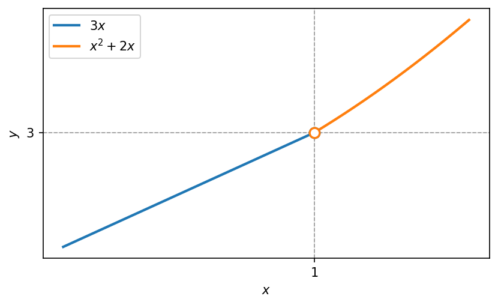{#fig-c04_fig08 width="62%" fig-align="center"}
:::

### פתרון:

ננסה להבין מהו $$\lim_{x \to 1} f(x)$$ ע"י מציאת הגבולות החד צדדיים של $f$ בנקודה $1$.

גבול מימין: $$\lim_{x \to 1^+} f(x) = \lim_{x \to 1^+} (x^2 + A \cdot x) = \underline{1 + A}$$

גבול משמאל: $$\lim_{x \to 1^-} f(x) = \lim_{x \to 1^-} 3x = \underline{3}$$

ולכן הגבול $$\lim_{x \to 1} f(x)$$ קיים אם ורק אם: $$\underbrace{3}_{\text{גבול משמאל}} = \underbrace{1 + A}_{\text{גבול מימין}}$$

כלומר: $$\boxed{A = 2}$$

## הגבולות ה״מופלאים״: $\frac{\sin x}{x}$, $\frac{1-\cos x}{x^2}$

ניתן להשתמש בכל הגבולות הבאים:

$$\lim_{x \to 0} \frac{\sin(x)}{x} = 1 \qquad (1)$$

$$\lim_{x \to 0} \frac{1 - \cos(x)}{x^2} = \frac{1}{2} \qquad (2)$$

$$\lim_{x \to 0} (1 + x)^{\frac{1}{x}} = e \qquad (3)$$

$$\lim_{x \to 0} \frac{\ln(1 + x)}{x} = 1 \qquad (4)$$

$$\lim_{x \to 0} \frac{a^x - 1}{x} = \ln(a) \qquad (5)$$ ($a > 0$ קבוע)

$$\lim_{x \to 0} \frac{(1 + x)^a - 1}{x} = a \qquad (6)$$ ($a$ קבוע)

## גבולות מופלאים נוספים: $(1+x)^{1/x}$, $\frac{\ln(1+x)}{x}$, $\frac{e^x-1}{x}$, $\frac{(1+x)^a-1}{x}$

### הסבר ל-(3)

ממשפט אוילר: $$\lim_{n \to \infty} \underbrace{(1 + a_n)^{\frac{1}{a_n}}}_{f(a_n)} = \boxed{e}$$ אם $a_n \to 0$

ממשפט היינה: $$\lim_{x \to 0} \underbrace{(1 + x)^{\frac{1}{x}}}_{f(x)} = \boxed{e}$$

### הסבר ל-(4)

$$\frac{\ln(1 + x)}{x} = \frac{1}{x} \cdot \ln(1 + x) = \ln\left((1 + x)^{\frac{1}{x}}\right) = \ln\underbrace{(e)}_{\xrightarrow[x \to 0]{}} = \boxed{1}$$

### הסבר ל-(5)

$$\lim_{x \to 0} \frac{e^x - 1}{x} = \lim_{t \to 0} \frac{t}{\ln(t + 1)} = \lim_{t \to 0} \frac{1}{\left(\frac{\ln(t + 1)}{t}\right)} = \frac{1}{1} = \boxed{1}$$

נציב: $t = e^x - 1$ ; $t + 1 = e^x$ ; $\ln(t + 1) = x$ (אריתמטיקה של חילוק)

### הסבר ל-(6)

$$\lim_{x \to 0} \frac{(x + 1)^a - 1}{x} = \lim_{x \to 0} \frac{e^{\ln(x+1)^a} - 1}{x} = \lim_{x \to 0} \frac{e^{a \cdot \ln(x+1)} - 1}{x} =$$

$$= \underbrace{\left(\frac{e^{a \ln(x+1)} - 1}{a \cdot \ln(x+1)}\right)}_{\xrightarrow{} 1 \text{ נבול מופלא}} \cdot \underbrace{\left(\frac{a \cdot \ln(x+1)}{x}\right)}_{\xrightarrow{} a \text{ נבול מופלא}} \to \boxed{a}$$

<!-- בדיקה: בחצים מעל האיברים כתוב "0←" ו-"a←" בהתאמה -->

ניתן להשתמש בכל הגבולות הבאים:

$$\lim_{x \to 0} \frac{\sin(x)}{x} = 1 \tag{1}$$

$$\lim_{x \to 0} \frac{\cos(x) - 1}{x^2} = \frac{1}{2} \tag{2}$$

$$\lim_{x \to 0} (1 + x)^{\frac{1}{x}} = e \tag{3}$$

$$\lim_{x \to 0} \frac{\ln(1 + x)}{x} = 1 \tag{4}$$

$$\lim_{x \to 0} \frac{a^x - 1}{x} = \ln(a) \tag{5}$$

(קבוע $a > 0$)

$$\lim_{x \to 0} \frac{(1 + x)^a - 1}{x} = a \tag{6}$$

(קבוע $a$)

### הסבר ל-(3)

ממשפט אוילר: אם $a_n \to 0$

$$\lim_{n \to \infty} \underbrace{(1 + a_n)^{\frac{1}{a_n}}}_{f(a_n)} = e$$

ממשפט היינה:

$$\lim_{x \to 0} \underbrace{(1 + x)^{\frac{1}{x}}}_{f(x)} = e$$

### הסבר ל-(4)

$$\frac{\ln(1 + x)}{x} = \frac{1}{x} \cdot \ln(1 + x) = \ln\left((1 + x)^{\frac{1}{x}}\right) \underset{\underset{x \to 0}{\longrightarrow} e}{=} \ln(e) = 1$$

### הסבר ל-(5)

$$\lim_{x \to 0} \frac{e^x - 1}{x} = \lim_{t \to 0} \frac{t}{\ln(t + 1)} = \lim_{t \to 0} \frac{1}{\left(\frac{\ln(t+1)}{t}\right)} = \frac{1}{1} = 1$$

נציב:

$$t = e^x - 1$$ $$t + 1 = e^x$$ $$\ln(t + 1) = x$$

(אריתמטיקה של חילוק)

### הסבר ל-(6)

$$\lim_{x \to 0} \frac{(x + 1)^a - 1}{x} = \lim_{x \to 0} \frac{e^{\ln(x+1)^a} - 1}{x} = \lim_{x \to 0} \frac{e^{a \cdot \ln(x+1)} - 1}{x} =$$

$$= \underbrace{\left(\frac{e^{a \cdot \ln(x+1)} - 1}{a \cdot \ln(x+1)}\right)}_{\underset{\to 1}{\nearrow^{\to 0}}\ \text{נבול מופלא}} \cdot \underbrace{\left(\frac{a \cdot \ln(x+1)}{x}\right)}_{\underset{\to a}{}\ \text{נבול מופלא}} \to a$$

<!-- בדיקה: הסימון "נבול מופלא" כתוב כך במקור (כנראה "גבול מופלא") -->

## אינסוף כגבול וגבול באינסוף

$$\lim_{x \to x_0} f(x) = \infty \qquad (1)$$

אם לכל $M > 0$ , קיימת $\delta > 0$ , כך שלכל $x$ עבורו $0 < |x - x_0| < \delta$ מתקיים $f(x) > M$ .

לדוגמא: $$f(x) = \frac{1}{x^2}$$

```{python}
#| echo: false
#| output: false
import numpy as np
import matplotlib.pyplot as plt

fig, ax = plt.subplots(figsize=(6.4, 3.6))
xl = np.linspace(-2, -0.18, 300)
xr = np.linspace(0.18, 2, 300)
ax.plot(xl, 1 / xl ** 2, color="C0", lw=2)
ax.plot(xr, 1 / xr ** 2, color="C0", lw=2)
ax.axvline(0, color="0.6", lw=0.8, ls="--")
ax.set_xlabel(r"$x$")
ax.set_ylabel(r"$y$")
ax.set_title(r"$f(x)=\dfrac{1}{x^2}$")
ax.grid(alpha=0.3)
ax.set_xlim(-2, 2)
ax.set_ylim(0, 30)
fig.savefig("c08_fig09.png", dpi=150, bbox_inches="tight")
plt.close(fig)
```

```{=latex}
\par\medskip
\noindent\beginL\hbox to \linewidth{\hss\includegraphics[width=0.62\linewidth]{c08_fig09.png}\hss}\endL\par
\medskip
```

::: {style="text-align:center"}
תרשים: $f(x)=\frac{1}{x^2}$ — שואפת לאינסוף בקרבת הראשית
:::

::: {.content-visible when-format="html"}
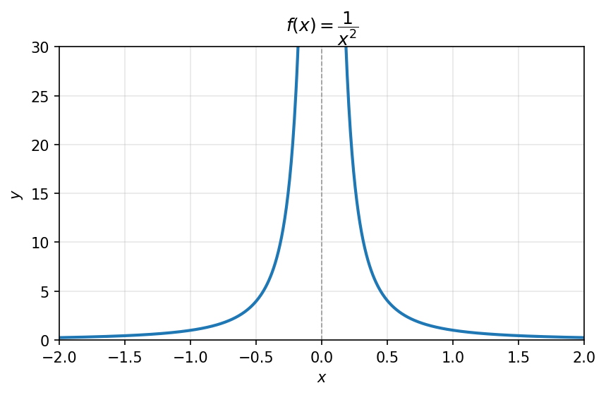{#fig-c04_fig09 width="62%" fig-align="center"}
:::

$$\lim_{x \to x_0} f(x) = -\infty \qquad (2)$$

אם לכל $M < 0$ , קיימת $\delta > 0$ , כך שלכל $x$ עבורו $0 < |x - x_0| < \delta$ מתקיים $f(x) < M$ .

$$\lim_{x \to \infty} f(x) = L \qquad (3)$$

לכל $\varepsilon > 0$ , קיים $a$ כך שלכל $x$ עבורו $x > a$ מתקיים $|f(x) - L| < \varepsilon$

לדוגמא: $f(x) = \arctan$

```{python}
#| echo: false
#| output: false
import numpy as np
import matplotlib.pyplot as plt

fig, ax = plt.subplots(figsize=(6.4, 3.6))
x = np.linspace(-12, 12, 400)
ax.plot(x, np.arctan(x), color="C0", lw=2)
ax.axhline(np.pi / 2, color="C3", lw=1.0, ls="--")
ax.axhline(-np.pi / 2, color="C3", lw=1.0, ls="--")
ax.set_yticks([-np.pi / 2, 0, np.pi / 2])
ax.set_yticklabels([r"$-\frac{\pi}{2}$", r"$0$", r"$\frac{\pi}{2}$"])
ax.set_xlabel(r"$x$")
ax.set_ylabel(r"$y$")
ax.set_title(r"$f(x)=\arctan x$")
ax.grid(alpha=0.3)
ax.set_xlim(-12, 12)
fig.savefig("c08_fig10.png", dpi=150, bbox_inches="tight")
plt.close(fig)
```

```{=latex}
\par\medskip
\noindent\beginL\hbox to \linewidth{\hss\includegraphics[width=0.62\linewidth]{c08_fig10.png}\hss}\endL\par
\medskip
```

::: {style="text-align:center"}
תרשים: $f(x)=\arctan x$ — אסימפטוטה אופקית בגובה $\frac{\pi}{2}$
:::

::: {.content-visible when-format="html"}
{#fig-c04_fig10 width="62%" fig-align="center"}
:::

$$\lim_{x \to \infty} f(x) = \infty \qquad (4)$$

לכל $M > 0$ , קיים $a$ עבורו לכל $x > a$ : $f(x) > M$

לדוגמא: $f(x) = x^2$

```{python}
#| echo: false
#| output: false
import numpy as np
import matplotlib.pyplot as plt

fig, ax = plt.subplots(figsize=(6.4, 3.6))
x = np.linspace(-5, 5, 400)
ax.plot(x, x ** 2, color="C0", lw=2)

M1, M2 = 6.0, 16.0
for M, a in [(M1, np.sqrt(6.0)), (M2, 4.0)]:
    ax.axhline(M, color="0.6", lw=0.8, ls="--")
    ax.plot([a], [M], "o", color="C0", ms=5, zorder=5)
    ax.vlines(a, 0, M, color="0.7", lw=0.8, ls=":")

ax.set_yticks([M1, M2])
ax.set_yticklabels([r"$M_1$", r"$M_2$"])
ax.set_xlabel(r"$x$")
ax.set_ylabel(r"$y$")
ax.set_title(r"$f(x)=x^2$")
ax.grid(alpha=0.3)
ax.set_xlim(-5, 5)
ax.set_ylim(0, 25)
fig.savefig("c08_fig11.png", dpi=150, bbox_inches="tight")
plt.close(fig)
```

```{=latex}
\par\medskip
\noindent\beginL\hbox to \linewidth{\hss\includegraphics[width=0.62\linewidth]{c08_fig11.png}\hss}\endL\par
\medskip
```

::: {style="text-align:center"}
תרשים: $f(x)=x^2$ — שואפת לאינסוף, עם סימוני $M_1$, $M_2$ על ציר ה-$y$
:::

::: {.content-visible when-format="html"}
{#fig-c04_fig11 width="62%" fig-align="center"}
:::

<!-- מקור: הרצאה 13 -->

### גבולות לא סופיים של פונקציות

$$\lim_{x \to x_0} f(x) = \infty \tag{1}$$

אם לכל $M > 0$, קיימת $\delta > 0$, כך שלכל $x$ עבורו $0 < |x - x_0| < \delta$ מתקיים $f(x) > M$.

```{python}
#| echo: false
#| output: false
import numpy as np
import matplotlib.pyplot as plt

fig, ax = plt.subplots(figsize=(6.4, 3.6))
xl = np.linspace(-2, -0.18, 300)
xr = np.linspace(0.18, 2, 300)
ax.plot(xl, 1 / xl ** 2, color="C0", lw=2)
ax.plot(xr, 1 / xr ** 2, color="C0", lw=2)
ax.axvline(0, color="C3", lw=1.0, ls="--")  # vertical asymptote
ax.set_xlabel(r"$x$")
ax.set_ylabel(r"$y$")
ax.set_title(r"$f(x)=\dfrac{1}{x^2}$")
ax.grid(alpha=0.3)
ax.set_xlim(-2, 2)
ax.set_ylim(0, 30)
fig.savefig("c08_fig12.png", dpi=150, bbox_inches="tight")
plt.close(fig)
```

```{=latex}
\par\medskip
\noindent\beginL\hbox to \linewidth{\hss\includegraphics[width=0.62\linewidth]{c08_fig12.png}\hss}\endL\par
\medskip
```

::: {style="text-align:center"}
תרשים: $f(x)=\frac{1}{x^2}$ — אסימפטוטה אנכית ב-$x=0$
:::

::: {.content-visible when-format="html"}
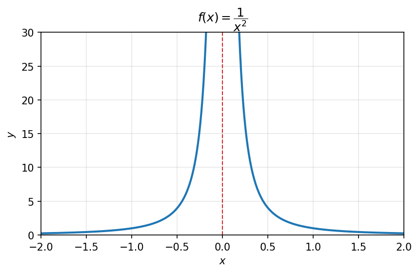{#fig-c04_fig12 width="62%" fig-align="center"}
:::

לדוגמא: $f(x) = \frac{1}{x^2}$

$$\lim_{x \to x_0} f(x) = -\infty \tag{2}$$

אם לכל $M < 0$, קיימת $\delta > 0$, כך שלכל $x$ עבורו $0 < |x - x_0| < \delta$ מתקיים $f(x) < M$.

$$\lim_{x \to \infty} f(x) = L \tag{3}$$

לכל $\varepsilon > 0$, קיים $a$ כך שלכל $x$ עבורו $x > a$ מתקיים $|f(x) - L| < \varepsilon$

```{python}
#| echo: false
#| output: false
import numpy as np
import matplotlib.pyplot as plt

fig, ax = plt.subplots(figsize=(6.4, 3.6))
x = np.linspace(-12, 12, 400)
ax.plot(x, np.arctan(x), color="C0", lw=2)
ax.axhline(np.pi / 2, color="C3", lw=1.0, ls="--")
ax.axhline(-np.pi / 2, color="C3", lw=1.0, ls="--")
ax.set_yticks([-np.pi / 2, 0, np.pi / 2])
ax.set_yticklabels([r"$-\frac{\pi}{2}$", r"$0$", r"$\frac{\pi}{2}$"])
ax.set_xlabel(r"$x$")
ax.set_ylabel(r"$y$")
ax.set_title(r"$f(x)=\arctan x$")
ax.grid(alpha=0.3)
ax.set_xlim(-12, 12)
fig.savefig("c08_fig13.png", dpi=150, bbox_inches="tight")
plt.close(fig)
```

```{=latex}
\par\medskip
\noindent\beginL\hbox to \linewidth{\hss\includegraphics[width=0.62\linewidth]{c08_fig13.png}\hss}\endL\par
\medskip
```

::: {style="text-align:center"}
תרשים: $f(x)=\arctan x$ — אסימפטוטה אופקית בגובה $\frac{\pi}{2}$
:::

::: {.content-visible when-format="html"}
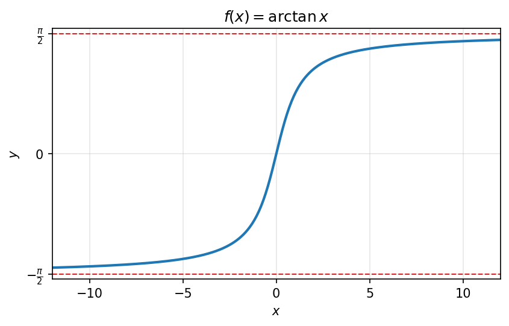{#fig-c04_fig13 width="62%" fig-align="center"}
:::

לדוגמא: $f(x) = \arctan$

$$\lim_{x \to \infty} f(x) = \infty \tag{4}$$

לכל $M > 0$, קיים $a$ עבורו לכל $x > a$ : $f(x) > M$

```{python}
#| echo: false
#| output: false
import numpy as np
import matplotlib.pyplot as plt

fig, ax = plt.subplots(figsize=(6.4, 3.6))
x = np.linspace(-5, 5, 400)
ax.plot(x, x ** 2, color="C0", lw=2)

M1, M2 = 6.0, 16.0
for M, a in [(M1, np.sqrt(6.0)), (M2, 4.0)]:
    ax.axhline(M, color="0.6", lw=0.8, ls="--")
    ax.plot([a], [M], "o", color="C0", ms=5, zorder=5)
    ax.vlines(a, 0, M, color="0.7", lw=0.8, ls=":")

ax.set_yticks([M1, M2])
ax.set_yticklabels([r"$M_1$", r"$M_2$"])
ax.set_xlabel(r"$x$")
ax.set_ylabel(r"$y$")
ax.set_title(r"$f(x)=x^2$")
ax.grid(alpha=0.3)
ax.set_xlim(-5, 5)
ax.set_ylim(0, 25)
fig.savefig("c08_fig14.png", dpi=150, bbox_inches="tight")
plt.close(fig)
```

```{=latex}
\par\medskip
\noindent\beginL\hbox to \linewidth{\hss\includegraphics[width=0.62\linewidth]{c08_fig14.png}\hss}\endL\par
\medskip
```

::: {style="text-align:center"}
תרשים: $f(x)=x^2$ — שואפת לאינסוף, עם הסימונים $M_1$, $M_2$ על ציר ה-$y$
:::

::: {.content-visible when-format="html"}
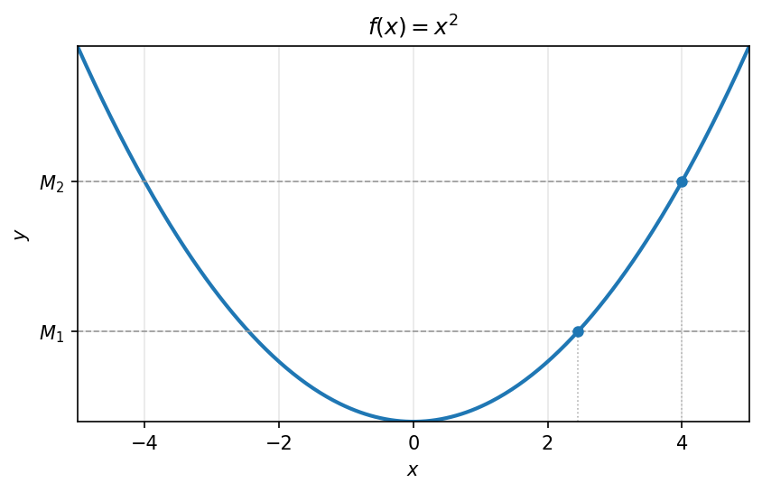{#fig-c04_fig14 width="62%" fig-align="center"}
:::

לדוגמא: $f(x) = x^2$

### האחד מבל האפשרויות של גבולות לא סופיים

$$\lim_{x \to \square} f(x) = \square$$

(החץ העליון: $-\infty / L / \infty$; החץ התחתון: $-\infty / \infty / x_0 / x_0^+ / x_0^-$)

<!-- בדיקה: כותרת המסגרת נקראת "האחד מבל האפשרויות של גבולות לא סופיים" -->

### נכון תמיד לכל סוגי הגבולות:

**משפט היינה**

כלומר: עבור $\displaystyle \lim_{x \to \square} f(x) = \square$

לכל סדרה $a_n \to \square$ (אדום)

מתקיים $f(a_n) \to \square$

**כללי האריתמטיקה במובן הרחב**

כלומר: אם $\displaystyle \lim_{x \to \square} f(x) = L_1$ , $\displaystyle \lim_{x \to \square} f(x) = L_2$

אז $\displaystyle \lim_{x \to \square} f(x) \overset{\cdot}{\underset{\cdot}{:}} g(x) = L_1 \overset{\cdot}{\underset{\cdot}{:}} L_2$

דוגמאות:

- $\infty + \infty = \infty$
- $\infty \cdot \infty = \infty$
- $\infty \cdot \infty$ (מסומן בקו אדום)
- $\frac{\infty}{\infty}$ (מחוק)
- $-\infty - \infty = -\infty$
- $-\infty \cdot \infty = -\infty$
- $\infty + L = \infty$
- $\infty \cdot L = \infty$ ($L > 0$)
- $\infty \cdot L = -\infty$ ($L < 0$)
- $-\infty + L = -\infty$
- $-\infty \cdot L = -\infty$ ($L > 0$)
- $-\infty \cdot L = \infty$ ($L < 0$)

<!-- בדיקה: שני הביטויים $\infty \cdot \infty$ ו-$\frac{\infty}{\infty}$ מסומנים/מחוקים בכתב יד -->

------------------------------------------------------------------------

- $\frac{1}{\infty} = 0$

- $\frac{1}{-\infty} = 0$

- $\frac{1}{0} = \infty$ (חיובי)

- $\frac{1}{0} = -\infty$ (שלילי)

- $\displaystyle \lim_{x \to \infty} \frac{1}{x} = 0$

- $\displaystyle \lim_{x \to 0^+} \frac{1}{x} = \infty$

- $\displaystyle \lim_{x \to 0^-} \frac{1}{x} = -\infty$

- $\displaystyle \lim_{x \to 0} \frac{1}{x}$ (מחוק)

**גבולות חד צדדיים**

כלומר: $\displaystyle \lim_{x \to x_0^-} f(x) = \square$

$$\lim_{x \to x_0^-} f(x) = \square = \lim_{x \to x_0^+} f(x)$$

דוגמאות:

- $\displaystyle \lim_{x \to \infty} x = \infty$
- $\displaystyle \lim_{x \to \infty} (x^2 + 2x) = \infty$
- $\displaystyle \lim_{x \to \infty} (x^2 - 2x) = \infty$

(עבור הדוגמא האחרונה: $\underbrace{x^2}_{\to \infty} \left(1 - \underbrace{\frac{2}{x}}_{\to 1}\right)$)

<!-- בדיקה: הסימון $\to 1$ מתחת ל-$\frac{2}{x}$ כתוב כך במקור (לכאורה צריך להיות $\to 0$) -->

- $\displaystyle \lim_{x \to \infty} \sin(x)$: לא קיים

(בעזרת משפט היינה)

$$a_n = \frac{\pi}{2} + 2 \cdot \pi \cdot n \to \infty$$

$$\sin(a_n) = 1 \to 1$$
