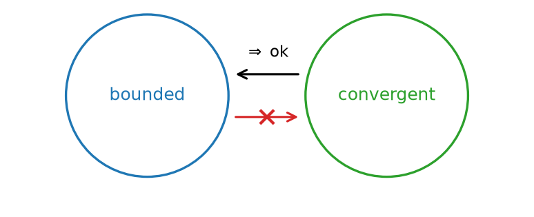

# תכונות של גבולות

## יחידות הגבול

### יחידות הגבול

::: {#box-thm-limit-uniqueness .thmthm}
אם $(a_n)_{n=1}^{\infty}$ סדרה המקיימת $a_n \to L_1$ וגם $a_n \to L_2$ אז $L_1 = L_2$

כלומר, אם סדרה מתכנסת אז <u>הגבול</u> שלה הוא יחיד.
:::

**הוכחה:**

נניח בשלילה: $L_1 \ne L_2$

נסמן את המרחק: $d = |L_1 - L_2| > 0$

נבחר: $\varepsilon = \dfrac{d}{4}$

$a_n$ עבור $n > max\{N_1, N_2\}$ $\leftarrow$ סתירה

```{python}
#| echo: false
#| output: false
import numpy as np
import matplotlib.pyplot as plt

fig, ax = plt.subplots(figsize=(6.4, 3.4))
ax.axhline(0, color="black", lw=1.2, zorder=1)

L1, L2 = -1.5, 1.5            # d = |L1 - L2| = 3
d = abs(L1 - L2)
eps = d / 4.0                 # eps = d/4 -> intervals are disjoint

# eps-interval around L1
ax.plot([L1-eps, L1+eps], [0, 0], color="tab:blue", lw=4, alpha=0.5, zorder=2)
# eps-interval around L2
ax.plot([L2-eps, L2+eps], [0, 0], color="tab:red", lw=4, alpha=0.5, zorder=2)

for x, lab, col in [(L1, r"$L_1$", "tab:blue"), (L2, r"$L_2$", "tab:red")]:
    ax.plot([x], [0], "o", color=col, ms=7, zorder=4)
    ax.annotate(lab, xy=(x, 0), xytext=(x, -0.12), ha="center", va="top", fontsize=13, color=col)

# eps labels under the bands
ax.annotate(r"$\varepsilon=\frac{d}{4}$", xy=(L1+eps, 0), xytext=(L1+eps, 0.16),
            ha="center", fontsize=11, color="tab:blue")
ax.annotate(r"$\varepsilon=\frac{d}{4}$", xy=(L2-eps, 0), xytext=(L2-eps, 0.16),
            ha="center", fontsize=11, color="tab:red")

# distance d bracket above
ax.annotate("", xy=(L1, 0.42), xytext=(L2, 0.42),
            arrowprops=dict(arrowstyle="<->", color="black", lw=1.3))
ax.annotate(r"$d=|L_1-L_2|$", xy=(0, 0.42), xytext=(0, 0.5), ha="center", fontsize=12)
for x in (L1, L2):
    ax.plot([x, x], [0.05, 0.42], color="black", lw=0.7, ls=":")

ax.set_xlim(-3.0, 3.0)
ax.set_ylim(-0.4, 0.7)
ax.axis("off")
fig.savefig("figures/c08_fig01.png", dpi=150, bbox_inches="tight")
plt.close(fig)
```

```{=latex}
\par\medskip
\noindent\beginL\hbox to \linewidth{\hss\includegraphics[width=0.62\linewidth]{figures/c08_fig01.png}\hss}\endL\par
\medskip
```

::: {style="text-align:center"}
תרשים: שני קטעי $\varepsilon=\tfrac{d}{4}$ זרים סביב $L_1$ ו-$L_2$ במרחק $d$ — איבר אחד אינו יכול להיות בשניהם, ומכאן הסתירה
:::

::: {.content-visible when-format="html"}
{#fig-c02_fig05 width="62%" fig-align="center"}
:::

## חסימוּת של סדרה מתכנסת (וההיפך השגוי)


### סדרה חסומה

::: {#box-def-bounded-sequence .thmdef}
תהי $(a_n)_{n=1}^{\infty}$ סדרה, נגיד כי $a_n$ חסומה, אם קיימים $m,M \in R$ כך שלכל $n$: $$m \le a_n \le M$$
:::

דוגמאות:

- $a_n = \dfrac{1}{n}$ סדרה חסומה, כי: $0 \le a_n \le 1$ לכל ח.

- $a_n = (-1)^n$ סדרה חסומה, כי: $-1 \le (-1)^n \le 1$ לכל ח.

- $a_n = n$ <u>לא</u> סדרה חסומה, כי: לכל $M$, יהיה $a_n > M$

  למשל, ניקח את $n = \lfloor M \rfloor + 1$ עבורו $a_n = n > M$

### הקשר בין התכנסות לחסימות של סדרה

- סדרה חסומה לא גורר שהיא מתכנסת.

  לדוגמא: $a_n = (-1)^n$

```{python}
#| echo: false
#| output: false
import numpy as np
import matplotlib.pyplot as plt
from matplotlib.patches import Circle, FancyArrowPatch

fig, ax = plt.subplots(figsize=(6.4, 3.4))

c1 = Circle((-1.4, 0), 0.95, fill=False, lw=1.6, ec="tab:blue")
c2 = Circle(( 1.4, 0), 0.95, fill=False, lw=1.6, ec="tab:green")
ax.add_patch(c1)
ax.add_patch(c2)
ax.annotate("bounded", xy=(-1.4, 0), ha="center", va="center", fontsize=12, color="tab:blue")
ax.annotate("convergent", xy=(1.4, 0), ha="center", va="center", fontsize=12, color="tab:green")

# convergent => bounded  (this implication holds)
a1 = FancyArrowPatch((0.4, 0.25), (-0.4, 0.25), arrowstyle="->",
                     mutation_scale=15, lw=1.5, color="black")
ax.add_patch(a1)
ax.annotate(r"$\Rightarrow$ ok", xy=(0, 0.45), ha="center", fontsize=11)

# bounded => convergent  (this one fails)
a2 = FancyArrowPatch((-0.4, -0.25), (0.4, -0.25), arrowstyle="->",
                     mutation_scale=15, lw=1.5, color="tab:red")
ax.add_patch(a2)
# cross it out
ax.plot([-0.07, 0.07], [-0.18, -0.32], color="tab:red", lw=2)
ax.plot([-0.07, 0.07], [-0.32, -0.18], color="tab:red", lw=2)

ax.set_xlim(-3.0, 3.0)
ax.set_ylim(-1.3, 1.0)
ax.set_aspect("equal")
ax.axis("off")
fig.savefig("figures/c08_fig02.png", dpi=150, bbox_inches="tight")
plt.close(fig)
```

```{=latex}
\par\medskip
\noindent\beginL\hbox to \linewidth{\hss\includegraphics[width=0.62\linewidth]{figures/c08_fig02.png}\hss}\endL\par
\medskip
```

::: {style="text-align:center"}
תרשים: סדרה מתכנסת גוררת חסומה, אך סדרה חסומה אינה גוררת מתכנסת (אין גרירה הדדית)
:::

::: {.content-visible when-format="html"}
{#fig-c02_fig03 width="62%" fig-align="center"}
:::

- אם $(a_n)_{n=1}^{\infty}$ סדרה מתכנסת, אז היא חסומה.

  $\downarrow$ הוכחת הטענה

  נסמן $a_n \to L$. מהגדרת הגבול, נבחר $\varepsilon = 1$, אז קיים $N$ כך שלכל $n>N$ מתקיים: $$|a_n - L| < 1 \ \leftarrow \ L-1 < a_n < L+1$$

  כלומר, בשביל לחסום את <u>כל</u> איברי הסדרה <u>מלמעלה</u>, ניקח: $M = max\{L+1, a_1, \ldots, a_N\}$

  ואז בוודאות <u>לכל ח</u>: $a_n \le M$

  ובשביל לחסום את <u>כל</u> איברי הסדרה <u>מלמטה</u>, ניקח: $m = min\{L-1, a_1, \ldots, a_N\}$

  ואז בוודאות <u>לכל ח</u>: $m \le a_n$

```{python}
#| echo: false
#| output: false
import numpy as np
import matplotlib.pyplot as plt

fig, ax = plt.subplots(figsize=(6.4, 3.4))
L = 0.0
ax.axhline(0, color="black", lw=1.2, zorder=1)

# band (L-1, L+1): the tail a_n for n > N lives here
ax.plot([L-1, L+1], [0, 0], color="tab:blue", lw=4, alpha=0.45, zorder=2)
for x, lab in [(L-1, r"$L-1$"), (L, r"$L$"), (L+1, r"$L+1$")]:
    ax.plot([x, x], [-0.05, 0.05], color="black", lw=1.2, zorder=3)
    ax.annotate(lab, xy=(x, 0), xytext=(x, -0.12), ha="center", va="top", fontsize=12)

# tail terms (n > N) inside the band
tail = [L-0.6, L-0.2, L+0.3, L+0.7]
ax.plot(tail, [0]*len(tail), "o", color="tab:green", ms=6, zorder=4)
ax.annotate(r"$a_n,\ n>N$", xy=(L+0.7, 0), xytext=(L+0.7, 0.18),
            ha="center", fontsize=11, color="tab:green")

# early terms a_1,...,a_N possibly outside; m and M are the overall bounds
ax.plot([-2.6, -1.9, 2.2], [0, 0, 0], "o", color="tab:orange", ms=6, zorder=4)
for x, lab in [(-2.6, r"$a_1$"), (-1.9, r"$a_N$"), (2.2, r"$a_2$")]:
    ax.annotate(lab, xy=(x, 0), xytext=(x, 0.15), ha="center", fontsize=11, color="tab:orange")

# overall bounds m and M
for x, lab, col in [(-2.9, r"$m$", "purple"), (2.6, r"$M$", "purple")]:
    ax.plot([x, x], [-0.07, 0.07], color=col, lw=1.6, zorder=3)
    ax.annotate(lab, xy=(x, 0), xytext=(x, -0.12), ha="center", va="top", fontsize=12, color=col)

ax.set_xlim(-3.3, 3.0)
ax.set_ylim(-0.4, 0.4)
ax.axis("off")
fig.savefig("figures/c08_fig03.png", dpi=150, bbox_inches="tight")
plt.close(fig)
```

```{=latex}
\par\medskip
\noindent\beginL\hbox to \linewidth{\hss\includegraphics[width=0.62\linewidth]{figures/c08_fig03.png}\hss}\endL\par
\medskip
```

::: {style="text-align:center"}
תרשים: הזנב $a_n$ (עבור $n>N$) בקטע $(L-1,L+1)$, והאיברים הראשונים שמחוץ לו — כל הסדרה חסומה בין $m$ ל-$M$
:::

::: {.content-visible when-format="html"}
{#fig-c02_fig04 width="62%" fig-align="center"}
:::

- סדרה <u>שאינה חסומה</u>, אז היא אינה מתכנסת.

## אריתמטיקה של גבולות

### כלי להראות התכנסות של סדרה ומציאת גבול - אריתמטיקה

מתוך סדרות מתכנסות, נייצר סדרות נוספות שהן מתכנסות, ע"י: $+$ , $-$ , $\cdot$ , $:$ .

::: {#box-thm-sequence-arithmetic .thmthm}
אם $(a_n)_{n=1}^{\infty}$ , $(b_n)_{n=1}^{\infty}$ סדרות המקיימות $a_n \to L_1$ , $b_n \to L_2$ אז:

(1) חיבור: הסדרה $(a_n + b_n)_{n=1}^{\infty}$ גם מתכנסת, ומתקיים $a_n + b_n \to L_1 + L_2$

(2) חיסור: הסדרה $(a_n - b_n)_{n=1}^{\infty}$ גם מתכנסת, ומתקיים $a_n - b_n \to L_1 - L_2$

(3) כפל: הסדרה $(a_n \cdot b_n)_{n=1}^{\infty}$ גם מתכנסת, ומתקיים $a_n \cdot b_n \to L_1 \cdot L_2$

(4) חילוק: הסדרה $\dfrac{a_n}{b_n}$ גם מתכנסת, ומתקיים $\dfrac{a_n}{b_n} \to \dfrac{L_1}{L_2}$ (רק כאשר $L_2 \ne 0$)
:::

### דוגמאות

::: {#box-exm-seq-rational-1 .thmexm}
נראה כי הסדרה $\dfrac{3n-4}{n+2}$ מתכנסת, ונמצא לאן.

הסדרה $b_n = n+2$ לא מתכנסת, כי היא לא חסומה.

נפשט את $a_n$ לפי החזקה הכי גדולה. כלומר, נחלק ב-ח את המונה ואת המכנה: $$a_n = \frac{3 - \dfrac{4}{n}}{1 + \dfrac{2}{n}} = \frac{\rightarrow 3}{\rightarrow 1} \to 3$$

$\dfrac{4}{n} \to 4 \cdot \dfrac{1}{n} \to 0$ , $\quad$ $\dfrac{2}{n} \to 2 \cdot \dfrac{1}{n} \to 0$
:::

::: {#box-exm-seq-rational-2 .thmexm}
מצאו את הגבול של הסדרה $$a_n = \frac{8n+3}{n^2+1}$$

נפשט ע"י חילוק בחזקה הכי גדולה במכנה: $$a_n = \frac{\dfrac{8}{n} + \dfrac{3}{n^2}}{1 + \dfrac{1}{n^2}} = \frac{\rightarrow 0}{\rightarrow 1} \to 0$$

$\dfrac{1}{n^2} = \dfrac{1}{n} \cdot \dfrac{1}{n} \to 0$ , $\quad$ $\dfrac{8}{n} \to 8 \cdot \dfrac{1}{n} \to 0$ , $\quad$ $\dfrac{3}{n^2} = 3 \cdot \dfrac{1}{n} \cdot \dfrac{1}{n} \to 0$
:::

<!-- מקור: הרצאה 5 -->

## משפט הסנדוויץ׳; כפל אפסית בחסומה

::: {#box-thm-piza-rachav .thmthm}
משפט הפיצה

אם $a_n \leq b_n$ לכל $n \geq 1$, ואם $a_n \to \infty$, אז $$\lim_{n\to\infty} b_n = \infty$$
:::

::: {#box-exm-piza-1 .thmexm}
דוגמא:

האם הסדרה $b_n = n + (-1)^n$ מתכנסת במובן הרחב?

**פתרון:**

נראה כי $b_n \to \infty$ מתקיים $b_n \geq n - 1$ אם נסתכל על $n - 1 \xrightarrow[\to\infty]{} \infty$

אז מכלל הפיצה $$b_n \to \infty$$
:::

::: {#box-exm-piza-2 .thmexm}
דוגמא:

האם הסדרה $b_n = \dfrac{n^2}{n!}$ מתכנסת במובן הרחב?

**פתרון:**

$$b_n = \frac{n^2}{n!} = \frac{n \cdots n}{1 \cdot 2 \cdots n} = \frac{n}{1} \cdot \underbrace{\frac{n}{2}}_{\geq 1} \cdots \cdots \underbrace{\frac{n}{n}}_{\geq 1} \geq n \geq n \cdot 1 \cdots \cdots 1$$

לכן מכלל הפיצה $$b_n \to \infty$$
:::

::: {#box-exm-piza-3 .thmexm}
דוגמא:

האם הסדרה $b_n = \left(1 + \dfrac{1}{n}\right)^{n^2}$ מתכנסת במובן הרחב?

$$\left(1 + \frac{1}{n}\right)^{n^2} = \left(1 + \frac{1}{n}\right)^{n \cdot n} = \left(\left(1 + \frac{1}{n}\right)^n\right)^n$$

$$\left(1 + \frac{1}{n}\right)^n \to e$$ כאשר $\left(1 + \frac{1}{n}\right)^n > 2$ באשר הם מספר מאוחרים מסוים

$$a_n = \left(\left(1 + \frac{1}{n}\right)^n\right)^n > 2$$ לבן הם מספר מאוחרים מסוים

הרי $2^n \to \infty$ לכן מכלל הפיצה: $$\boxed{a_n \to \infty}$$
:::

::: {#box-thm-piza-minf .thmthm}
כלל הפיצה ההפוכה

אם $a_n \leq b_n$ לכל $n \geq 1$, ואם $b_n \to -\infty$, אז $$\lim_{n\to n} a_n = -\infty$$
:::
