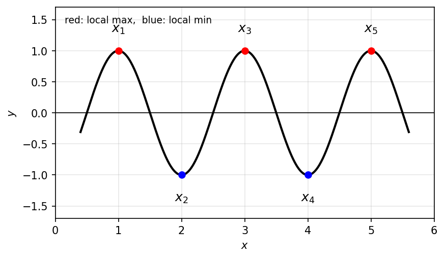
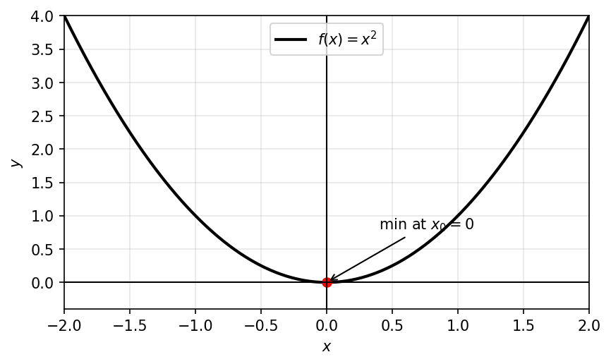
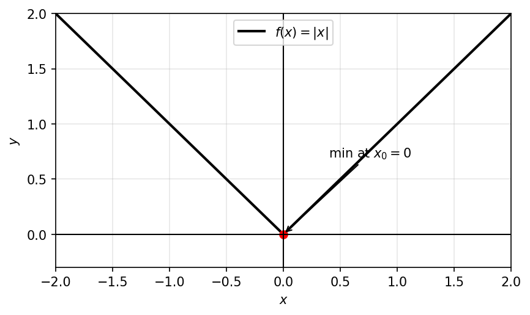
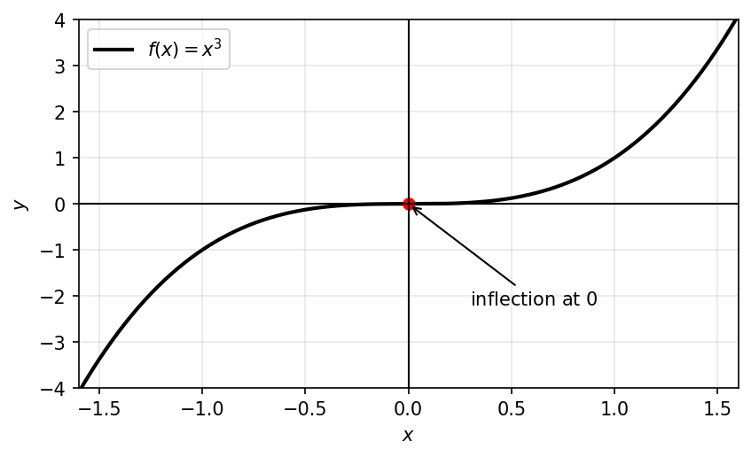
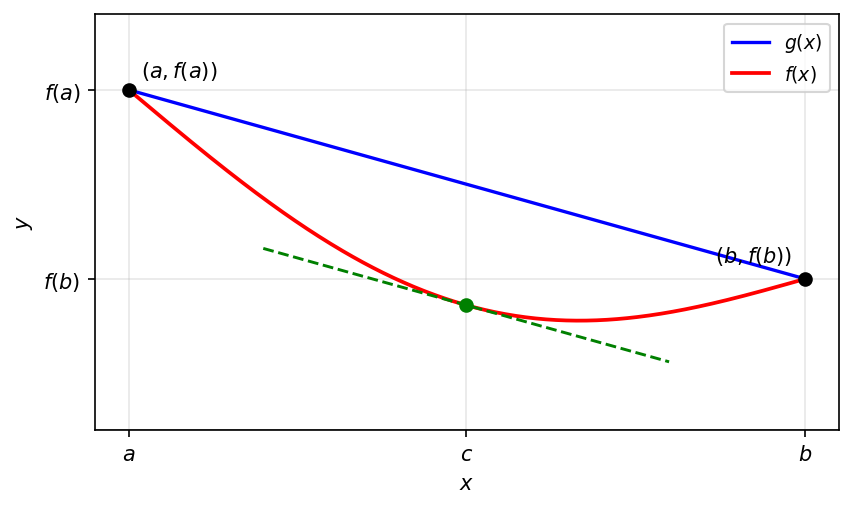

# שימושים של הנגזרת

## קיצון מקומי ומשפט פרמה

נקודות קיצון מקומיות של פונקציה

$x_0$ נקראת נקודת מקסימום מקומי של $f$, אם קיימת $\delta > 0$ כך שלכל $x \in (x_0 - \delta, x_0 + \delta)$ מתקיים: $$f(x) \leq f(x_0)$$

$x_0$ נקראת נקודת מינימום מקומי של $f$, אם קיימת $\delta > 0$ כך שלכל $x \in (x_0 - \delta, x_0 + \delta)$ מתקיים: $$f(x) \geq f(x_0)$$

$x_0$ נקראת נקודת קיצון מקומי של $f$, אם $x_0$ היא נקודת מקסימום מקומי <u>או</u> מינימום מקומי.

דוגמא כללית:

$x_1, x_3, x_5$- נקודות <u>מקסימום</u> מקומי של הפונקציה $x_2, x_4$- נקודות <u>מינימום</u> מקומי של הפונקציה

```{python}
#| echo: false
#| output: false
import numpy as np
import matplotlib.pyplot as plt

fig, ax = plt.subplots(figsize=(6.4, 3.6))

# smooth wavy curve with exactly 5 interior extrema: max, min, max, min, max
# use a cosine so extrema sit at x = 1,2,3,4,5
xs = np.linspace(0.4, 5.6, 600)
ys = np.cos(np.pi * xs)
ax.plot(xs, ys, color="black", lw=2)

# extrema at integer x: cos(pi*n) -> max at odd n (=1), min at even... here:
# cos(pi*1)=-1 (min), cos(pi*2)=1 (max). Shift so x1 is a maximum: use -cos
ax.cla()
ys = -np.cos(np.pi * xs)
ax.plot(xs, ys, color="black", lw=2)

extrema = [1, 2, 3, 4, 5]
for i, e in enumerate(extrema, start=1):
    ye = -np.cos(np.pi * e)
    is_max = ye > 0  # -cos(pi*odd)=+1 -> max at odd
    ax.plot([e], [ye], "o", color=("red" if is_max else "blue"), ms=6)
    ax.annotate(rf"$x_{i}$", xy=(e, ye),
                xytext=(e, ye + (0.3 if is_max else -0.42)),
                ha="center", fontsize=12)

ax.axhline(0, color="black", lw=0.8)
ax.set_xlim(0, 6)
ax.set_ylim(-1.7, 1.7)
ax.set_xlabel(r"$x$")
ax.set_ylabel(r"$y$")
ax.grid(alpha=0.3)
ax.text(0.15, 1.45, r"red: local max,  blue: local min", fontsize=9)

fig.savefig("figures/c11_fig01.png", dpi=150, bbox_inches="tight")
plt.close(fig)
```

```{=latex}
\par\medskip
\noindent\beginL\hbox to \linewidth{\hss\includegraphics[width=0.62\linewidth]{figures/c11_fig01.png}\hss}\endL\par
\medskip
```

::: {style="text-align:center"}
תרשים: פונקציה גלית עם חמש נקודות קיצון מקומיות $x_1,\dots,x_5$
:::

::: {.content-visible when-format="html"}
{#fig-c06_fig06 width="62%" fig-align="center"}
:::

דוגמאות:

לפונקציה $f(x) = x^2$ יש <u>רק</u> את נקודת הקיצון המקומי: $x_0 = 0$

```{python}
#| echo: false
#| output: false
import numpy as np
import matplotlib.pyplot as plt

fig, ax = plt.subplots(figsize=(6.4, 3.6))
x = np.linspace(-2, 2, 400)
ax.plot(x, x**2, color="black", lw=2, label=r"$f(x)=x^2$")
ax.plot([0], [0], "o", color="red", ms=6)
ax.annotate(r"min at $x_0=0$", xy=(0, 0), xytext=(0.4, 0.8), fontsize=10,
            arrowprops=dict(arrowstyle="->"))

ax.axhline(0, color="black", lw=1)
ax.axvline(0, color="black", lw=1)
ax.set_xlim(-2, 2)
ax.set_ylim(-0.4, 4)
ax.set_xlabel(r"$x$")
ax.set_ylabel(r"$y$")
ax.grid(alpha=0.3)
ax.legend(loc="upper center")

fig.savefig("figures/c11_fig02.png", dpi=150, bbox_inches="tight")
plt.close(fig)
```

```{=latex}
\par\medskip
\noindent\beginL\hbox to \linewidth{\hss\includegraphics[width=0.62\linewidth]{figures/c11_fig02.png}\hss}\endL\par
\medskip
```

::: {style="text-align:center"}
תרשים: הפרבולה $f(x)=x^2$ עם מינימום בראשית
:::

::: {.content-visible when-format="html"}
{#fig-c06_fig07 width="62%" fig-align="center"}
:::

לפונקציה $f(x) = |x|$ יש <u>רק</u> את נקודת הקיצון המקומי: $x_0 = 0$

```{python}
#| echo: false
#| output: false
import numpy as np
import matplotlib.pyplot as plt

fig, ax = plt.subplots(figsize=(6.4, 3.6))
x = np.linspace(-2, 2, 400)
ax.plot(x, np.abs(x), color="black", lw=2, label=r"$f(x)=|x|$")
ax.plot([0], [0], "o", color="red", ms=6)
ax.annotate(r"min at $x_0=0$", xy=(0, 0), xytext=(0.4, 0.7), fontsize=10,
            arrowprops=dict(arrowstyle="->"))

ax.axhline(0, color="black", lw=1)
ax.axvline(0, color="black", lw=1)
ax.set_xlim(-2, 2)
ax.set_ylim(-0.3, 2)
ax.set_xlabel(r"$x$")
ax.set_ylabel(r"$y$")
ax.grid(alpha=0.3)
ax.legend(loc="upper center")

fig.savefig("figures/c11_fig03.png", dpi=150, bbox_inches="tight")
plt.close(fig)
```

```{=latex}
\par\medskip
\noindent\beginL\hbox to \linewidth{\hss\includegraphics[width=0.62\linewidth]{figures/c11_fig03.png}\hss}\endL\par
\medskip
```

::: {style="text-align:center"}
תרשים: גרף $f(x)=|x|$ בצורת V, מינימום בראשית
:::

::: {.content-visible when-format="html"}
{#fig-c06_fig08 width="62%" fig-align="center"}
:::

לפונקציה $f(x) = x^3$ אין נקודות קיצון מקומי.

```{python}
#| echo: false
#| output: false
import numpy as np
import matplotlib.pyplot as plt

fig, ax = plt.subplots(figsize=(6.4, 3.6))
x = np.linspace(-1.6, 1.6, 400)
ax.plot(x, x**3, color="black", lw=2, label=r"$f(x)=x^3$")
ax.plot([0], [0], "o", color="red", ms=6)
ax.annotate(r"inflection at $0$", xy=(0, 0), xytext=(0.3, -2.2), fontsize=10,
            arrowprops=dict(arrowstyle="->"))

ax.axhline(0, color="black", lw=1)
ax.axvline(0, color="black", lw=1)
ax.set_xlim(-1.6, 1.6)
ax.set_ylim(-4, 4)
ax.set_xlabel(r"$x$")
ax.set_ylabel(r"$y$")
ax.grid(alpha=0.3)
ax.legend(loc="upper left")

fig.savefig("figures/c11_fig04.png", dpi=150, bbox_inches="tight")
plt.close(fig)
```

```{=latex}
\par\medskip
\noindent\beginL\hbox to \linewidth{\hss\includegraphics[width=0.62\linewidth]{figures/c11_fig04.png}\hss}\endL\par
\medskip
```

::: {style="text-align:center"}
תרשים: גרף $f(x)=x^3$ העולה דרך הראשית עם נקודת פיתול
:::

::: {.content-visible when-format="html"}
{#fig-c06_fig09 width="62%" fig-align="center"}
:::

::: {#box-thm-fermat .thmthm}
**פרמה**

אם $f(x)$ פונקציה ו-$x_0$ נקודת קיצון מקומי, ואם $f$ גזירה ב-$x_0$ אז $f'(x_0) = 0$
:::

טעויות נפוצות:

✗ אם $x_0$ קיצון מקומי, אז $f'(x_0) = 0$ דוגמא להבנה: לפונקציה $f(x) = |x|$ יש קיצון מקומי ב-0, אבל היא אינה גזירה ב-0.

✗ אם $f'(x_0) = 0$, אז $x_0$ קיצון מקומי דוגמא להבנה: $f'(x) = 3x^2 \longrightarrow f'(0) = 0$, הנקודה 0 לא קיצון מקומי.

::: theorem
אם $f(x)$ פונקציה ו- $x_0$ נקודת קיצון מקומי, ואם f גזירה ב- $x_0$ אז $f'(x_0) = 0$
:::

### טעויות נפוצות:

X אם $x_0$ קיצון מקומי, אז $f'(x_0) = 0$

דוגמא להבנה: לפונקציה $f(x) = |x|$ יש קיצון מקומי ב-0, אבל היא אינה גזירה ב-0.

X אם $f'(x_0) = 0$ , אז $x_0$ קיצון מקומי

דוגמא להבנה: $f'(x) = 3x^2 \longrightarrow f'(0) = 0$ , הנקודה 0 לא קיצון מקומי.

### הוכחה למשפט פרמה

נניח כי $x_0$ נקודת מקסימום מקומי של f, כלומר קיימת $\delta > 0$

כך שלכל $x_0 - \delta < x < x_0 + \delta$ מתקיים $f(x) \leq f(x_0)$ $\longleftarrow$ $f(x) - f(x_0) \leq 0$

ידוע כי הגבול הבא קיים

$$f'(x_0) = \lim_{x \to x_0} \frac{f(x) - f(x_0)}{x - x_0}$$

<!-- בדיקה: הערה בכתב יד מעל המונה: "≤ 0" ולמטה "הגבול קיים שווה ל-0" -->

לכן הגבול מימין:

$$f'(x_0) = \lim_{x \to x_0^+} \frac{f(x) - f(x_0)}{x - x_0}$$

אבל הפונקציה בסביבה ימנית היא אי-חיובי, ולכן $f'(x_0) \leq 0$

בדומה, הגבול משמאל:

$$f'(x_0) = \lim_{x \to x_0^-} \frac{f(x) - f(x_0)}{x - x_0}$$

והפונקציה בסביבה ימנית היא אי-שלילי, ולכן $f'(x_0) \geq 0$

ולכן $f'(x_0) = 0$

## מציאת קיצון של פונקציה רציפה בקטע סגור

### דוגמא:

::: {#box-exm-max-min-x3-3x .thmexm}
מצאו את הערך המקסימלי והמינימלי של הפונקציה $f(x) = x^3 - 3x$ בקטע $[-2,2]$ .

**פתרון:**

הפונקציה היא אלמנטרית ולכן רציפה ב- $[-2,2]$

אז ממשפט ויירשטראס, קיימות נקודות מקסימום ומינימום לפונקציה בקטע $[-2,2]$

אם הייתה נקודת מקסימום/ מינימום <u>בפנים הקטע</u>, כלומר לא בקצוות (2,2-), אז היא נקודת קיצון <u>מקומי</u>.

ואז לפי פרמה, כי הפונקציה גזירה בכל IR , בהכרח: $f'(x_0) = 0$ $$3 \cdot x_0^2 - 3 = 0$$ $$x_0 = 1, -1$$

בינתיים, הראינו כי ב (2,2-) אין נקודות מינימום ומקסימום של f, אולי חוץ מ- 1-, 1 . לכן מתוך הרשימה: 2-, 2 , 1- , 1 יש מקסימום ויש מינימום.

כעת נציב ונחשב: $f(2) = 2$ , $f(-2) = -2$ , $f(1) = -2$ , $f(-1) = 2$

לסיכום, לפונקציה יש נקודות מקסימום שהן: 1-, 2, ויש נקודות מינימום שהן: 2-, 1

לכן הערך המקסימלי הוא 2 והערך המינימלי הוא 2- .
:::

```{python}
#| echo: false
#| output: false
import numpy as np
import matplotlib.pyplot as plt

fig, ax = plt.subplots(figsize=(6.4, 3.6))
x = np.linspace(-2, 2, 400)
y = x**3 - 3*x
ax.plot(x, y, color="black", lw=1.8)

# maxima (value 2) at x=-1 and x=2  -> red
ax.scatter([-1, 2], [2, 2], color="red", zorder=5)
# minima (value -2) at x=-2 and x=1 -> blue
ax.scatter([-2, 1], [-2, -2], color="blue", zorder=5)

ax.annotate(r"$(-1,2)$", (-1, 2), textcoords="offset points", xytext=(-6, 8), ha="right")
ax.annotate(r"$(2,2)$", (2, 2), textcoords="offset points", xytext=(-4, 8), ha="right")
ax.annotate(r"$(-2,-2)$", (-2, -2), textcoords="offset points", xytext=(6, -4), ha="left")
ax.annotate(r"$(1,-2)$", (1, -2), textcoords="offset points", xytext=(6, -12), ha="left")

ax.axhline(0, color="gray", lw=0.8)
ax.axvline(0, color="gray", lw=0.8)
ax.set_xticks([-2, -1, 1, 2])
ax.set_yticks([-2, -1, 1, 2])
ax.set_xlabel(r"$x$")
ax.set_ylabel(r"$y$")
ax.grid(alpha=0.3)
fig.savefig("figures/c11_fig05.png", dpi=150, bbox_inches="tight")
plt.close(fig)
```

```{=latex}
\par\medskip
\noindent\beginL\hbox to \linewidth{\hss\includegraphics[width=0.62\linewidth]{figures/c11_fig05.png}\hss}\endL\par
\medskip
```

::: {style="text-align:center"}
תרשים: גרף הפונקציה $f(x)=x^3-3x$ בקטע $[-2,2]$ עם נקודות מקסימום (אדום) ומינימום (כחול)
:::

::: {.content-visible when-format="html"}
![גרף הפונקציה $f(x)=x^3-3x$ בקטע $[-2,2]$ עם נקודות מקסימום (אדום) ומינימום (כחול)](figures/c11_fig05.png){#fig-c07_fig01 width="62%" fig-align="center"}
:::

## משפט רול

::: {#box-thm-rolle .thmthm}
אם $f(x)$ רציפה ב- $[a,b]$ ואם $f(x)$ גזירה ב- (a,b) ואם $f(a) = f(b)$ , אז קיימת $c \in (a,b)$ עבורה $f'(c) = 0$
:::

```{python}
#| echo: false
#| output: false
import numpy as np
import matplotlib.pyplot as plt

fig, ax = plt.subplots(figsize=(6.4, 3.6))
a, b = 1.0, 5.0
x = np.linspace(a, b, 400)
# concave-down arc with f(a)=f(b)=0
y = -(x - a) * (x - b)
ax.plot(x, y, color="black", lw=1.8)

# endpoints on the x-axis
ax.scatter([a, b], [0, 0], color="black", zorder=5)
# maximum point
xc = (a + b) / 2
yc = -(xc - a) * (xc - b)
ax.scatter([xc], [yc], color="red", zorder=5)
ax.plot([xc, xc], [0, yc], color="gray", ls=":", lw=0.9)

ax.axhline(0, color="gray", lw=0.8)
ax.set_xticks([a, xc, b])
ax.set_xticklabels([r"$a$", r"$c$", r"$b$"])
ax.set_yticks([])
ax.set_xlabel(r"$x$")
ax.set_ylim(-0.5, yc + 1)
ax.grid(alpha=0.3)
fig.savefig("figures/c11_fig06.png", dpi=150, bbox_inches="tight")
plt.close(fig)
```

```{=latex}
\par\medskip
\noindent\beginL\hbox to \linewidth{\hss\includegraphics[width=0.62\linewidth]{figures/c11_fig06.png}\hss}\endL\par
\medskip
```

::: {style="text-align:center"}
תרשים: פונקציה קעורה כלפי מטה מעל $[a,b]$ עם $f(a)=f(b)$ ונקודת מקסימום ביניהן (משפט רול)
:::

::: {.content-visible when-format="html"}
![פונקציה קעורה כלפי מטה מעל $[a,b]$ עם $f(a)=f(b)$ ונקודת מקסימום ביניהן (משפט רול)](figures/c11_fig06.png){#fig-c07_fig02 width="62%" fig-align="center"}
:::

### הוכחת משפט רול

מויירשטראס קיימות נקודות מקסימום ומינימום של f ב- $[a,b]$ . נפריד לשני מקרים:

(1) אם המקסימום <u>או</u> המינימום הן לא בקצה של $[a,b]$, אז זו נקודת קיצון <u>מקומי</u> של f, והרי f גזירה ב- (a,b) , לכן שם $f'(x_0) = 0$

(2) אם גם המקסימום <u>וגם</u> המינימום הם בקצוות, בגלל ש $f(a) = f(b)$ אז f קבועה ב- $[a,b]$, ואז לכל $c \in (a,b)$ : $f'(c) = 0$ .

## משפט לגראנז'

::: {#box-thm-lagrange .thmthm}
אם $f(x)$ רציפה ב- $[a,b]$ וגזירה ב- (a,b) , אז קיימת נקודה $c \in (a,b)$ עבורה: $$f'(c) = \frac{f(b) - f(a)}{b - a}$$
:::

### דוגמא:

::: {#box-exm-lagrange-sin-sqrt .thmexm}
חשבו את הגבול של $$\lim_{n \to \infty} (\sin \sqrt{n+1} - \sin \sqrt{n})$$

**פתרון:**

נסמן $f(x) = \sin(x)$ , אז $\sin(\sqrt{n+1}) - \sin(\sqrt{n}) = f(\sqrt{n+1}) - f(\sqrt{n})$

הפונקציה f רציפה ב- $[\sqrt{n}, \sqrt{n+1}]$ וגזירה בקטע הפתוח, לכן ממשפט לגראנג' קיימת $\sqrt{n} < c < \sqrt{n+1}$ עבורה $\frac{f(\sqrt{n+1}) - f(\sqrt{n})}{\sqrt{n+1} - \sqrt{n}} = f'(c)$

ולכן $$f(\sqrt{n+1}) - f(\sqrt{n}) = (\sqrt{n+1} - \sqrt{n}) \cdot \cos(c) = \frac{1}{\sqrt{n+1} + \sqrt{n}} \cdot \cos(c) \to 0$$

<!-- בדיקה: מתחת ל- $\frac{1}{\sqrt{n+1}+\sqrt{n}}$ כתוב "→ 0" ומתחת ל- $\cos(c)$ כתוב "חסומה" -->

לכן $\sin \sqrt{n+1} - \sin \sqrt{n} \to 0$
:::

### הוכחת משפט לגראנג'

נבנה פונקציה חדשה g(x), מאוד פשוטה, המסכימה עם f(x) בקצוות: $$g(x) = \left( \frac{f(b) - f(a)}{b - a} \right) \cdot (x - a) + f(a)$$

ונזכור כי: $g(a) = f(a)$ , $g(b) = f(b)$

נגדיר פונקציה $h(x) = g(x) - f(x)$ : עבורה $h(a) = h(0) = 0$ והרי h היא חיסור של g,f. ולכן היא פונקציה רציפה ב- $[a,b]$ וגזירה ב- (a,b) , כי f,g, הן הן כאלה.

אז ממשפט רול, קיימת $a < c < b$ עבורה $0 = h'(c) = g'(c) - f'(c)$ $$f'(c) = \frac{f(b) - f(a)}{b - a}$$

```{python}
#| echo: false
#| output: false
import numpy as np
import matplotlib.pyplot as plt

fig, ax = plt.subplots(figsize=(6.4, 3.6))
a, b = 1.0, 6.0
fa, fb = 4.5, 2.0

# curve f below the chord, sharing the endpoints
x = np.linspace(a, b, 400)
slope = (fb - fa) / (b - a)
chord = slope * (x - a) + fa
f = chord - 1.6 * np.sin(np.pi * (x - a) / (b - a))

ax.plot(x, chord, color="blue", lw=1.6, label=r"$g(x)$")
ax.plot(x, f, color="red", lw=1.8, label=r"$f(x)$")

# point c where the tangent is parallel to the chord (max gap)
df = np.gradient(f, x)
ic = int(np.argmin(np.abs(df - slope)))
xc, yc = x[ic], f[ic]

# dashed green tangent at c, parallel to the chord
tx = np.linspace(xc - 1.5, xc + 1.5, 50)
tangent = slope * (tx - xc) + yc
ax.plot(tx, tangent, color="green", ls="--", lw=1.4)
ax.scatter([xc], [yc], color="green", zorder=5)

# endpoints
ax.scatter([a, b], [fa, fb], color="black", zorder=5)
ax.annotate(r"$(a,f(a))$", (a, fa), textcoords="offset points", xytext=(6, 6))
ax.annotate(r"$(b,f(b))$", (b, fb), textcoords="offset points", xytext=(-6, 8), ha="right")

ax.axhline(0, color="gray", lw=0.8)
ax.set_xticks([a, xc, b])
ax.set_xticklabels([r"$a$", r"$c$", r"$b$"])
ax.set_yticks([fb, fa])
ax.set_yticklabels([r"$f(b)$", r"$f(a)$"])
ax.set_xlabel(r"$x$")
ax.set_ylabel(r"$y$")
ax.legend(loc="upper right", fontsize=9)
ax.grid(alpha=0.3)
ax.set_ylim(0, fa + 1)
fig.savefig("figures/c11_fig07.png", dpi=150, bbox_inches="tight")
plt.close(fig)
```

```{=latex}
\par\medskip
\noindent\beginL\hbox to \linewidth{\hss\includegraphics[width=0.62\linewidth]{figures/c11_fig07.png}\hss}\endL\par
\medskip
```

::: {style="text-align:center"}
תרשים: הוכחת משפט לגראנג' — המיתר $g(x)$ בין הקצוות, העקומה $f(x)$ מתחתיו, ומשיק מקווקו ב-$c$ המקביל למיתר
:::

::: {.content-visible when-format="html"}
{#fig-c07_fig03 width="62%" fig-align="center"}
:::

## מסקנות ממשפט לגראנז' — מונוטוניות

::: {#box-thm-monotone-derivative .thmthm}
מסקנה ממשפט לגראנג'

אם $f(x)$ גזירה ב- $I = (a,b)$, אז:

א) $f(x)$ מונוטונית <u>עולה</u> ב- $I$ אם ורק אם לכל $x \in I$ : $f'(x) \geq 0$

$f(x)$ מונוטונית <u>יורדת</u> ב- $I$ אם ורק אם לכל $x \in I$ : $f'(x) \leq 0$

ב) אם $f'(x) > 0$ לכל $x \in I$ , אז $f(x)$ מונוטונית <u>עולה ממש</u> ב- $I$. אם $f'(x) < 0$ לכל $x \in I$ , אז $f(x)$ מונוטונית <u>יורדת ממש</u> ב- $I$ .
:::

### הוכחה לסעיף (א)

אם f מונוטונית עולה ב- $I$ , אז $$f'(x_0) = \lim_{x \to x_0} \frac{f(x) - f(x_0)}{x - x_0}$$

וכאשר $x > x_0$ : $\frac{f(x) - f(x_0)}{x - x_0} \geq 0$ $\longleftarrow$ $f'(x_0) \geq 0$

בכיוון השני- נניח כי $f'(x_0) \geq 0$ לכל $x \in I$ , נראה שאם $x_1 < x_2$ אז $f(x_1) \leq f(x_2)$

כלומר: $0 \leq f(x_2) - f(x_1)$

נפעיל את לגראנג' על f ב- $[x_1, x_2]$, שם היא גזירה ורציפה, ונקבל שקיימת $x_1 < c < x_2$

עבורה $f'(c) = \frac{f(x_2) - f(x_1)}{x_2 - x_1}$ ולכן $f(x_2) - f(x_1) \geq 0$ $\longleftarrow$ $f(x_2) \geq f(x_1)$

<!-- בדיקה: מתחת ל- $f'(c)$ כתוב "≥ 0", מתחת ל- $f(x_2)-f(x_1)$ כתוב "≥ 0", ומתחת ל- $x_2 - x_1$ כתוב "> 0" -->

<!-- מקור: הרצאה 19 -->


### תרגיל (1)

הוכיחו כי לכל $x \in \mathbb{R}$: $$|\sin(x)| \leq |x|$$

**פתרון:**

עבור $x=0$ מתקיים שוויון

עבור $x \neq 0$ אי השוויון שקול ל: $$\left|\frac{\sin(x)}{x}\right| \leq 1$$

נשים לב כי $$\frac{\sin(x)}{x} = \frac{\sin(x) - \sin(0)}{x - 0}$$

עבור הפונקציה $f(x) = \sin(x)$ בקטע בין $0$ ל-$x$: $$\frac{\sin(x) - \sin(0)}{x - 0} = f'(c)$$

ולכן קיימת $c$ כלשהיא בין $0$ ל-$x$, אבל $|f'(c)| = |\cos(c)| \leq 1$ $$\left|\frac{\sin(x)}{x}\right| \leq 1$$

### תרגיל (2)

הראו כי למשוואה $\sin(x) + \cos(x) = x$ יש פתרון <u>יחיד</u> ב-$\left(0, \frac{\pi}{2}\right)$

```{python}
#| echo: false
#| output: false
import numpy as np
import matplotlib.pyplot as plt

fig, ax = plt.subplots(figsize=(6.4, 3.6))
hi = np.pi / 2
x = np.linspace(0, hi, 400)
# inverted parabola over [0, pi/2], staying above the x-axis
y = 1.0 - ((x - hi / 2) / (hi / 2))**2 * 0.9
ax.plot(x, y, color="black", ls="--", lw=1.8)

# points c < x0 < d inside the interval
xc, x0, xd = 0.35, hi / 2, hi - 0.35
for xp, lab in [(xc, r"$c$"), (x0, r"$x_0$"), (xd, r"$d$")]:
    yp = 1.0 - ((xp - hi / 2) / (hi / 2))**2 * 0.9
    ax.scatter([xp], [yp], color="black", zorder=5)
    ax.plot([xp, xp], [0, yp], color="gray", ls=":", lw=0.8)

ax.axhline(0, color="gray", lw=0.8)
ax.set_xticks([0, xc, x0, xd, hi])
ax.set_xticklabels([r"$0$", r"$c$", r"$x_0$", r"$d$", r"$\frac{\pi}{2}$"])
ax.set_yticks([])
ax.set_xlabel(r"$x$")
ax.set_ylim(-0.25, 1.25)
ax.grid(alpha=0.3)
fig.savefig("figures/c11_fig08.png", dpi=150, bbox_inches="tight")
plt.close(fig)
```

```{=latex}
\par\medskip
\noindent\beginL\hbox to \linewidth{\hss\includegraphics[width=0.62\linewidth]{figures/c11_fig08.png}\hss}\endL\par
\medskip
```

::: {style="text-align:center"}
תרשים: עקומה מקווקוות (פרבולה הפוכה) מעל הקטע $\left[0,\frac{\pi}{2}\right]$ עם הנקודות $c$, $x_0$, $d$ (תרגיל היחידות)
:::

::: {.content-visible when-format="html"}
![עקומה מקווקוות (פרבולה הפוכה) מעל הקטע $\left[0,\frac{\pi}{2}\right]$ עם הנקודות $c$, $x_0$, $d$ (תרגיל היחידות)](figures/c11_fig08.png){#fig-c07_fig04 width="62%" fig-align="center"}
:::

**פתרון:**

נרצה להראות שלמשוואה $\sin(x) + \cos(x) - x = 0$ יש פתרון ב-$\left(0, \frac{\pi}{2}\right)$

נסמן $f(x) = \sin(x) + \cos(x) - x$, זו רציפה ב-$\mathbb{R}$ ובפרט ב-$\left[0, \frac{\pi}{2}\right]$

ומתקיים: $$f\left(\frac{\pi}{2}\right) = 1 - \frac{\pi}{2} < 0 \quad , \quad f(0) = 1 > 0$$

ולכן לפי משפט ערך הביניים, קיימת $c \in \left(0, \frac{\pi}{2}\right)$ עבורה $$f(c) = \sin(c) + \cos(c) - c = 0$$

נשאר להראות כי <u>אין</u> עוד פתרון ב-$\left(0, \frac{\pi}{2}\right)$:

נניח בשלילה שקיים פתרון נוסף, כלומר קיימת $d \in \left(0, \frac{\pi}{2}\right)$ בגלל ש $f(c) = f(d) = 0$ אז נפעיל את משפט רול (כי $f$ גזירה בין $c$ ל-$d$) ונקבל שקיימת נקודה $x_0$ בין $c$ ל-$d$ עבורה $f'(x_0) = 0$

נחשב: $$f'(x) = \cos x - \underset{>0}{\sin x} - 1$$

אבל לכל $x \in \left(0, \frac{\pi}{2}\right)$: $\sin(x) > 0$ , $\cos(x) - 1 \leq 0$ ולכן $f'(x) < 0$ בסתירה ל-$f'(x_0) = 0$

## משפט קושי

אם $f, g$ רציפות ב-$[a,b]$ וגזירות ב-$(a,b)$, ואם $g'(x) \neq 0$ לכל $x \in (a, b)$

אז קיימת נקודה $c \in (a, b)$ עבורה $$\frac{f'(c)}{g'(c)} = \frac{f(b) - f(a)}{g(b) - g(a)}$$

- משפט קושי עבור $g(x) = x$ זה בדיוק משפט לגראנג'.

- ההוכחה של משפט קושי דומה מאוד להוכחה של משפט לגראנג', בעזרת בניית העזר: $$h(x) = f(x) - \frac{f(b) - f(a)}{g(b) - g(a)} \to (g(x) - g(a))$$

## כלל לופיטל ($0/0$)

עונה על הצורך לחשב גבולות מהצורה $\left[\frac{0}{0}\right]$

נניח כי נרצה לחשב $$\lim_{x \to x_0} \frac{f(x)}{g(x)} = ?$$

כאשר $f, g$ רציפות בסביבה של $x_0$ , וגזירות שם וגם $f(x_0) = g(x_0) = 0$

נסתכל על: $$\frac{f(x)}{g(x)} = \frac{f(x) - f(x_0)}{g(x) - g(x_0)} = \frac{f'(c)}{g'(c)}$$

> **הערה (מהמקור):** קיימת $c$ בין $x$ ל-$x_0$.

אם $f, g$ רציפות בסביבה מנוקבת של $x_0$ , וגזירות בסביבה הזו,

ואם $\lim_{x \to x_0} g(x) = 0 = \lim_{x \to x_0} f(x)$ וגם $g'(x) \neq 0$ לכל $x$ בסביבה הזו,

אז אם הגבול $\lim_{x \to x_0} \frac{f'(x)}{g'(x)}$ קיים, אז $$\lim_{x \to x_0} \frac{f(x)}{g(x)} = \lim_{x \to x_0} \frac{f'(x)}{g'(x)}$$

### דוגמאות:

(1) חשבו את $$\lim_{x \to 0} \frac{\sin(x)}{x}$$

**פתרון:**

נסמן $g(x) = x$ , $f(x) = \sin(x)$

אלה רציפות וגזירות ב-$\mathbb{R}$ ולכן בסביבה של $x_0 = 0$ ,

בנוסף $f(0) = g(0) = 0$ לכל $x$ בסביבה, מתקיים $g'(x) = 1 \neq 0$

ולסיום נבדוק את $$\lim_{x \to 0} \frac{f'(x)}{g'(x)} = \lim_{x \to 0} \frac{\cos(x)}{1} = 1$$

לפי לופיטל: $$\lim_{x \to 0} \frac{\sin(x)}{x} = \boxed{1}$$

> **הערה (מהמקור):** מתחה שהגבול אכן קיים — הקושרת את $\lim_{x \to 0} \frac{f'(x)}{g'(x)}$ אל $\lim_{x \to 0} \frac{\sin(x)}{x}$.

(2) חשבו את $$\lim_{x \to 0} \frac{\ln(1 + x)}{x}$$

**פתרון:**

נסמן $g(x) = x$ , $f(x) = \ln(1 + x)$

אלה רציפות וגזירות בסביבה של הנקודה $x_0 = 0$ וגם $f(0) = g(0) = 0$ ו- $g'(x) = 1 \neq 0$

ולכן נקבל $$\lim_{x \to 0} \frac{\ln(1 + x)}{x} = \lim_{x \to 0} \frac{f'(x)}{g'(x)} = \lim_{x \to 0} \frac{\frac{1}{1+x}}{1} = \boxed{1}$$

> **הערה (מהמקור):** מתחה שהגבול אכן קיים.

## כלל לופיטל ($\infty/\infty$)

$$\lim_{x \to \square} \frac{f(x)}{g(x)} =$$

$\square$ יכול להיות: $x_0^-, x_0^+, x_0, \infty, -\infty$

$$\lim_{x \to \square} f(x) = \infty$$ $$\lim_{x \to \square} g(x) = \infty$$

$$\longrightarrow \quad \frac{f}{g} = \frac{\left(\frac{1}{g}\right)}{\left(\frac{1}{f}\right)}$$

### דוגמאות:

(1) חשבו את $$\lim_{x \to \infty} \frac{x^3}{e^x}$$

**פתרון:**

נסמן $g(x) = e^x$ , $f(x) = x^3$

הן גזירות ורציפות ב-$\mathbb{R}$ ובפרט ב-$[1, \infty)$

בנוסף $\lim_{x \to \infty} f(x) = \lim_{x \to \infty} g(x) = \infty$ וגם $g'(x) = e^x \neq 0$ לכל $x \in \mathbb{R}$

ולכן נקבל $$\lim_{x \to \infty} \frac{x^3}{e^x} = \lim_{x \to \infty} \frac{f'(x)}{g'(x)} = \lim_{x \to \infty} \frac{3x^2}{e^x} = \lim_{x \to \infty} \frac{6x}{e^x} = \lim_{x \to \infty} \frac{6}{e^x} = \boxed{0}$$

> **הערה (מהמקור):** מתחה שהגבול אכן קיים.

(2) מהו $\lim_{x \to 0^+} x \cdot \ln(x)$

**פתרון:**

$$\lim_{x \to 0^+} x \cdot \ln(x) = \frac{\ln(x) \longrightarrow -\infty}{\frac{1}{x} \longrightarrow \infty}$$

נסמן: $g(x) = \frac{1}{x}$ , $f(x) = \ln(x)$

הן גזירות ורציפות ב-$\mathbb{R}$ ובפרט ב-$(0,1)$

ולכן נקבל $$\lim_{x \to 0^+} x \cdot \ln(x) = \lim_{x \to 0} \frac{\ln x}{\left(\frac{1}{x}\right)} = \lim_{x \to 0} \frac{\left(\frac{1}{x}\right)}{\left(-\frac{1}{x^2}\right)} = \lim_{x \to 0} -x = \boxed{0}$$

> **הערה (מהמקור):** מתחה שהגבול אכן קיים.
