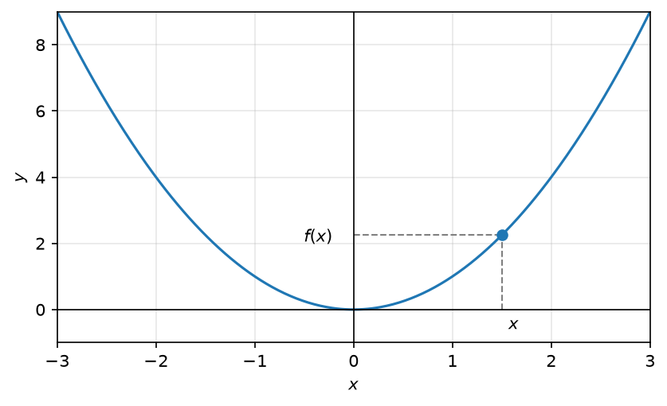
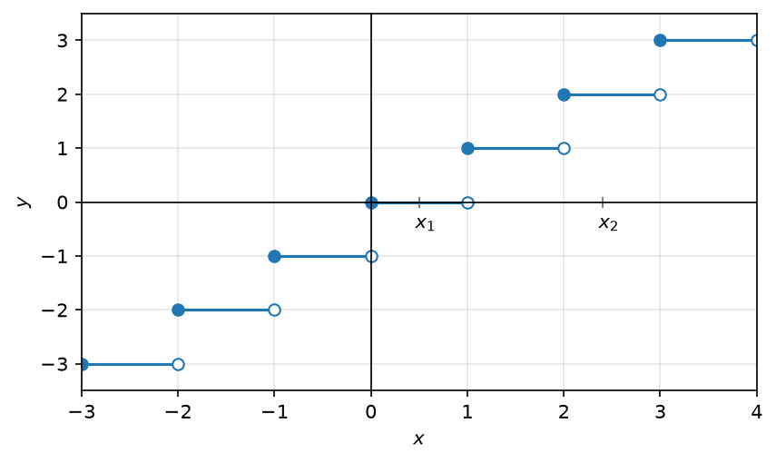
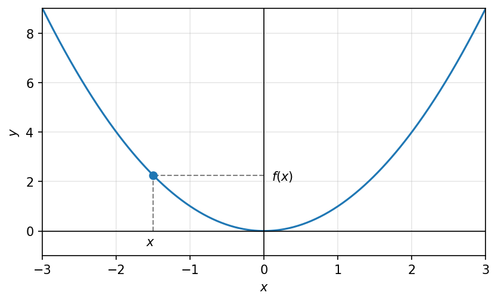
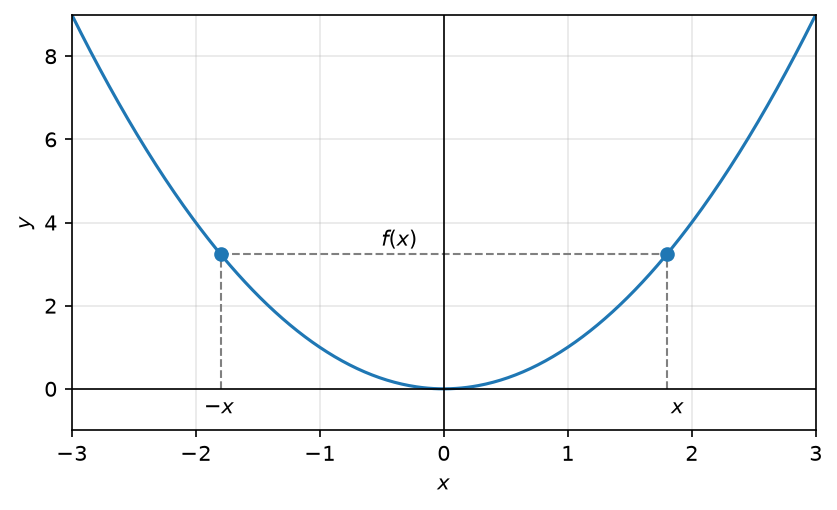
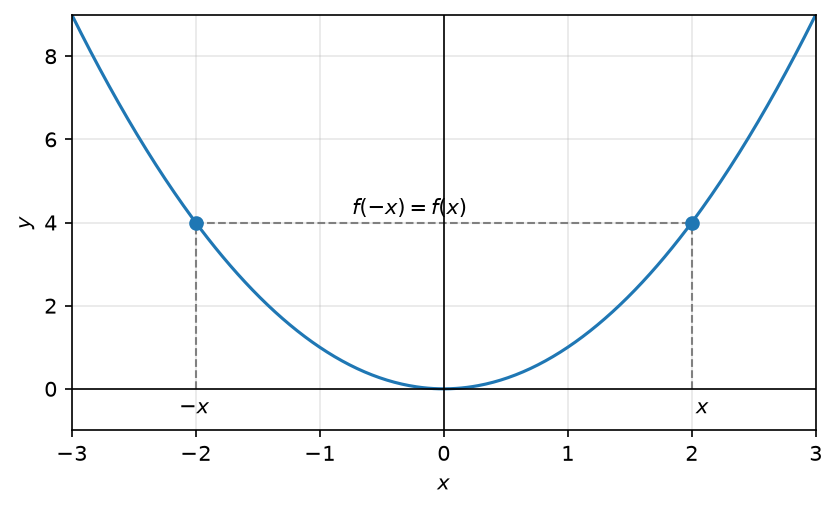
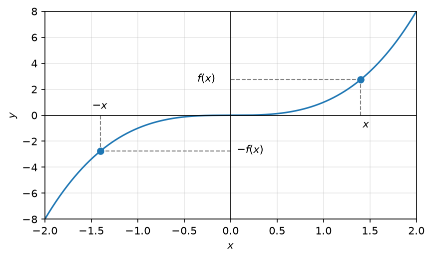

# נגזרות מסדר גבוה וחקירת פונקציות

## הגדרת הנגזרת מסדר גבוה וסימונים

נגזרת $f$ מסדר ח מסדר $x_0$:

$f$ גזירה ב- $x_0$

$f$ גזירה ב- $x_0$

$f'$ גזירה ב- $x_0$

$\vdots$

$((f')'\ldots)'$ גזירה ב- $x_0$ (ח-1 פעמים)

כלומר: $f$ גזירה מסדר ראשון $f$ גזירה ב- $x_0$

$f$ גזירה מסדר שלישי $f,f',f''$ גזירות ב- $x_0$

נסמן: $f^{(n)}(x) = (\ldots(f')'\ldots)'$ — ח נגזרות (הנגזרת ה-n-ית של $f$)

לפי המוסכמה:

$$f^{(0)}(x) = f(x)$$

$$f^{(1)}(x) = f'(x)$$

$$f^{(3)}(x) = f'''(x)$$

דוגמאות:

**(1)** נמצא את $f^{(n)}(x)$ עבור $f(x) = e^x$ לכל $n \geq 0$:

$$f^{(0)}(x) = e^x$$

$$f^{(1)}(x) = e^x$$

$$\vdots$$

$$f^{(n)}(x) = e^x$$

**(2)** נמצא את $f^{(n)}(x)$ עבור $f(x) = \sin(x)$ לכל $n \geq 0$:

$$f^{(0)}(x) = \sin(x)$$

$$f^{(1)}(x) = \cos(x)$$

$$f^{(2)}(x) = -\sin(x)$$

$$f^{(3)}(x) = -\cos(x)$$

$$f^{(4)}(x) = \sin(x)$$

$$f^{(1)}(x) = f^{(5)}(x)$$

$$\vdots$$

$$f^{(n)}(x) = \begin{cases} \sin(x) & n = 4k \\ \cos(x) & n = 4k+1 \\ -\sin(x) & n = 4k+2 \\ -\cos(x) & n = 4k+3 \end{cases}$$

לדוגמה:

$$f^{(103)}(x) = -\cos(x)$$

**(3)** נמצא את $f^{(n)}(x)$ עבור $f(x) = \ln(1+x)$ לכל $n \geq 0$:

$$f^{(0)}(x) = \ln(1+x)$$

$$f^{(1)}(x) = \frac{1}{1+x} = (1+x)^{-1}$$

$$f^{(2)}(x) = -(1+x)^{-2} = \frac{-1}{(1+x)^2}$$

$$f^{(3)}(x) = 2\cdot(1+x)^{-3} = \frac{2}{(1+x)^3}$$

$$f^{(4)}(x) = -3\cdot 2\cdot(1+x)^{-4} = \frac{-6}{(1+x)^4}$$

$$\vdots$$

$$f^{(n)}(x) = (-1)^{n+1}\cdot(n-1)!\cdot(1+x)^{-n}$$

$$f^{(n)}(x) = \frac{(-1)^{n+1}\cdot(n-1)!}{(1+x)^n}$$

## דוגמאות לנגזרת מסדר גבוה

::: {.todo}
דוגמאות לנגזרת מסדר גבוה ($\sin x,\ e^x,\ xe^x$) מופיעות בסעיף ״הגדרת הנגזרת מסדר גבוה״ לעיל. להשלמה והפרדה.
:::

## פולינום טיילור ומקלורן

### רעיון ראשון - פולינום טיילור

נתונה פונקציה $f(x)$, ידועות לנו הנגזרות שלה ב- $x_0$: $f^{(0)}(x_0), f^{(1)}(x_0), \ldots, f^{(n)}(x_0)$

נרצה למצוא פונקציה אחרת שהיא מאוד פשוטה (פולינום), נסמנה $g(x)$, שהיא מסכימה עם $f$ על הנגזרות ב- $x_0$.

כלומר:

$$f^{(0)}(x_0) = g^{(0)}(x_0)$$

$$f'(x_0) = g'(x_0)$$

$$\vdots$$

$$f^{(n)}(x_0) = g^{(n)}(x_0)$$

נחפש $g(x)$ מהצורה:

$$g(x) = a_0 + a_1(x-x_0) + \ldots + a_n(x-x_0)^n$$

כאשר אנחנו עדיין לא יודעים את: $a_0, a_1, \ldots, a_n$

נציב $x = x_0$ ב- $g(x)$: $g(x_0) = a_0 \overset{\text{נרצה}}{=} f(x_0)$

נגזור את $g(x)$:

$$g^{(1)}(x) = a_1 + 2\cdot a_2(x-x_0) + \ldots + na_n\cdot(x-x_0)^{n-1}$$

נציב $x = x_0$: $g^{(1)}(x_0) = a_1 \overset{\text{נרצה}}{=} f'(x_0)$

נגזור את $g^{(1)}(x)$:

$$g^{(2)}(x) = 2a_2 + 3\cdot 2\cdot a_3(x-x_0) + \ldots$$

נציב $x = x_0$: $g^{(2)}(x_0) = 2\cdot a_2 \overset{\text{נרצה}}{=} f^{(2)}(x_0)$

נגזור את $g^{(2)}(x)$:

$$g^{(3)}(x) = 3\cdot 2\cdot a_3 + \ldots(x-x_0) + \ldots$$

נציב $x = x_0$: $g^{(3)}(x_0) = 3!\cdot a_3 \overset{\text{נרצה}}{=} f^{(3)}(x_0)$

לכן, נבחר את $a_k = \dfrac{f^{(k)}(x_0)}{k!}$ לכל $k = 0,1,\ldots,n$

לסיכום, אם $f$ פונקציה גזירה מסדר ח בנקודה $x_0$, אז הפולינום:

$$P_n(x) = f(x_0) + \frac{f'(x_0)}{1!}\cdot(x-x_0) + \frac{f^{(2)}(x_0)}{2!}\cdot(x-x_0)^2 + \ldots + \frac{f^{(n)}(x_0)}{n!}\cdot(x-x_0)^n$$

נקרא "פולינום טיילור" של $f$ מסדר ח סביב $x_0$, ומסומן $P_n(x)$.

**\* מוסכמה:** $0! = 1$

הראנו כי פולינום טיילור מקיים:

$$f(x_0) = P_n(x_0)$$

$$f^{(1)}(x_0) = P^{(1)}n(x_0)$$

$$\vdots$$

$$f^{(n)}(x_0) = P^{(n)}n(x_0)$$

**\*** עבור $x_0 = 0$ פולינום טיילור נקרא "פולינום מקלורן".

## מציאת פולינום מקלורן מסדר $n$

### פולינום מקלורן

פולינום מקלורן של $e^x$ מסדר ח, לכל $n \geq 0$:

$$P_n(x) = 1 + x + \frac{x^2}{2!} + \frac{x^3}{3!} + \ldots + \frac{x^n}{n!}$$

דוגמאות:

**(1)** עבור $f(x) = e^x$ נמצא את פולינומי-מקלורן:

$$P_0(x) = f(0) = 1 \qquad f^{(0)}(0) = 1$$

$$P_1(x) = 1 + 1\cdot x = 1 + x$$

$$P_2(x) = 1 + x + \frac{x^2}{2}$$

**(2)** עבור $f(x) = \sin(x)$ נמצא את פולינומי-מקלורן:

$$f^{(n)}(0) = \begin{cases} 0 & n = 4k \\ 1 & n = 4k+1 \\ 0 & n = 4k+2 \\ -1 & n = 4k+3 \end{cases}$$

ולכן:

$$P_1(x) = x = P_2(x)$$

$$P_3(x) = x - \frac{x^3}{3!} = P_4(x)$$

$$P_5(x) = x - \frac{x^3}{3!} + \frac{x^5}{5!}$$

## סימון $o(x^n)$ של פיאנו והשימוש בו לחישוב גבולות

### רעיון שני

לעיתים, נשתמש ב- $P_n(x)$ במקום ב- $f(x)$, לשתי מטרות:

**(1)** חישובי גבולות.

**(2)** קירובים ל- $f(x)$.

#### חישובי גבולות

::: {#box-thm-taylor-limit .thmthm}
משפט: (ללא הוכחה)

אם $f$ גזירה ב- $x_0 = 0$ מסדר ח, אז מתקיים:

$$\lim_{x\to 0} \frac{f(x) - P_n(x)}{x^n} = 0$$
:::

**הוכחה המשפט:** ננסה בעזרת לופיטל:

$$\lim_{x\to 0} \frac{f(x) - P_n(x)}{x^n} \;\underset{f(0)-P_n(0)=0}{=}\; \lim_{x\to 0} \frac{f'(x) - P_n'(x)}{n\cdot x^{n-1}} = \ldots = \lim_{x\to 0} \frac{f^{(n)}(x) - P_n^{(n)}(x)}{n!} = 0$$

<!-- בדיקה: מעל השוויונים נכתב "מפעילים את לופיטל n פעמים" -->

דוגמאות:

**(1)** עבור $f(x) = e^x$ ניקח את פולינום מקלורן מסדר 1: $P_1(x) = 1 + x$

נציב ונקבל:

$$\lim_{x\to 0} \frac{e^x - (1+x)}{x} = 0$$

$$\lim_{x\to 0} \left(\frac{e^x - 1}{x} - 1\right) = 0$$

$$\boxed{\lim_{x\to 0} \frac{e^x - 1}{x} = 1}$$

**(2)** עבור $f(x) = e^x$ ניקח את פולינום מקלורן מסדר 2: $P_2(x) = 1 + x + \dfrac{x^2}{2}$

נציב ונקבל:

$$\lim_{x\to 0} \frac{e^x - (1 + x + \frac{x^2}{2})}{x^2} = 0$$

$$\boxed{\lim_{x\to 0} \frac{e^{x-1} - x}{x^2} = \frac{1}{2}}$$

<!-- מקור: הרצאה 21a -->


### השארית

$f(x) - P_n(x)$ ייקרא "השארית (מסדר n)", ויסומן ע"י: $R_n(x)$

$$R_n(x) = f(x) - P_n(x)$$

### סדרי גודל

אם פונקציה $g(x)$ מקיימת: $\lim_{x \to 0} \frac{g(x)}{x^n} = 0$ אז נסמן ע"י: $g(x) = o(x^n)$

ב- $o(x^n)$ יש חזקות של $x$ שגדולות מ-$n$.

$$o(x^n) \cdot o(x^m) = o(x^{n+m})$$

### דוגמאות:

**1)** האם זה נכון ש $x^{100} = o(x^4)$ ?

נבדוק האם

$$\lim_{x \to 0} \frac{x^{100}}{x^4} = x^{96} = 0 \quad \Longleftarrow \quad x^{100} = o(x^4)$$

**2)** האם זה נכון ש $\sin^4(x) = o(x^4)$ ?

נבדוק האם

$$\lim_{x \to 0} \frac{\sin^4(x)}{x^4} = \lim_{x \to 0} \left( \frac{\sin x}{x} \right)^4 = 1 \quad \Longleftarrow \quad \sin^4(x) \neq o(x^4)$$

נתון- האם זה נכון ש $\sin^4(x) = o(x^3)$ ?

נבדוק האם

$$\lim_{x \to 0} \frac{\sin^4(x)}{x^3} = \lim_{x \to 0} \frac{\sin^3(x)}{x^3} \sin(x) = 0 \quad \Longleftarrow \quad \sin^4(x) = o(x^3)$$

### השארית בטיילור

ראינו ש

$$\lim_{x \to 0} \frac{f(x) - P_n(x)}{x^n} = 0 \quad \text{כלומר} \quad f(x) - P_n(x) = o(x^n)$$

$$f(x) = P_n(x) + o(x^n)$$

למשל: פולינום מקלורן של $f(x) = e^x$ :

$$P_n(x) = 1 + x + \frac{x^2}{2!} + \ldots + \frac{x^n}{n!}$$

ולכן $e^x = 1 + x + o(x)$ , אפשר גם לרשום

$$\underbrace{e^x = 1 + x + \frac{x^2}{2!}}_{P_n(x)} + o(x^2)$$

### דוגמאות:

**1)** חשבו את הגבול: $\lim_{x \to 0} \frac{\sin(x)}{x}$

$$\lim_{x \to 0} \frac{\sin(x)}{x} = \lim_{x \to 0} \frac{P_1(x) + o(x)}{x} = \lim_{x \to 0} \frac{x + o(x)}{x} = \lim_{x \to 0} \left( 1 + \frac{o(x)}{x} \right) = \boxed{1}$$

**2)** חשבו את הגבול: $\lim_{x \to 0} \frac{\sin x \cdot \cos x - x}{x^2}$

$$\sin x = P_2(x) + o(x^2) = x + o(x^2) \quad , \quad \cos x = P_2(x) + o(x^2) = 1 - \frac{x^2}{2!} + o(x^2)$$

$$\lim_{x \to 0} \frac{\sin x \cdot \cos x - x}{x^2} = \lim_{x \to 0} \frac{(x + o(x^2))(1 - \frac{x^2}{2} + o(x^2)) - x}{x^2} =$$

$$= \lim_{x \to 0} \frac{x - \frac{x^3}{2} + x \cdot o(x^2) + o(x^2) - \frac{x^2}{2} \cdot o(x^2) + o(x^2) \cdot o(x^2) - x}{x^2} =$$

$$= \lim_{x \to 0} \frac{-\frac{x^3}{2} + o(x^2)}{x^2} = \lim_{x \to 0} \left( -\frac{x}{2} + \frac{o(x^2)}{x^2} \right) = \boxed{0}$$

**3)** מצאו את פולינום מקלורן מסדר $4$ של $g(x) = \sqrt{1 + x^2}$

נגזור את הפונקציה $g(x)$ : $g(x) = (1 + x^2)^{\frac{1}{2}}$

$$g'(x) = \frac{1}{2}(1 + x^2)^{-\frac{1}{2}} \cdot 2x$$

$$g^{(2)}(x) = (1 + x^2)^{-\frac{1}{2}} - x^2 \cdot (1 + x^2)^{-\frac{3}{2}}$$

$$g^{(3)}(x) = -\frac{1}{2}(1 + x^2)^{-\frac{3}{2}} \cdot 2x - \left[ 2x \cdot (1 + x^2)^{-\frac{3}{2}} + x^2 \cdot \left( -\frac{3}{2} \right)(1 + x^2)^{-\frac{5}{2}} \cdot 2x \right]$$

$$g^{(4)}(x) = -3 \cdot \left[ (1 + x^2)^{-\frac{3}{2}} \cdot 1 + x \left( -\frac{3}{2} \right) \cdot (1 + x^2)^{-\frac{5}{2}} \cdot 2x \right] + 3 \left[ 3x^2 \cdot (1 + x^2)^{-\frac{5}{2}} + x^3 \left( -\frac{5}{2} \right) \cdot (1 + x^2)^{-\frac{7}{2}} \cdot 2x \right]$$

ולכן: $g(0) = 1$ , $g'(0) = 0$ , $g^{(2)}(0) = 1$ , $g^{(3)}(0) = 0$ , $g^{(4)}(0) = -3$

פולינום מקלורן מסדר $4$ של $g(x) = \sqrt{1 + x^2}$ :

$$\boxed{P_4(x) = 1 + \frac{1}{2}x^2 - \frac{3}{4!}x^4}$$

**4)** חשבו את הגבול: $\lim_{x \to 0} \frac{1 - \cos x \cdot \sqrt{1 + x^2}}{x^4}$

$$\cos x = 1 - \frac{x^2}{2} + \frac{x^4}{4!} + o(x^4) \quad , \quad \sqrt{1 + x^2} = 1 + \frac{x^2}{2} - \frac{3 \cdot x^4}{4!} + o(x^4)$$

$$\lim_{x \to 0} \frac{1 - \cos x \cdot \sqrt{1 + x^2}}{x^4} = \lim_{x \to 0} \frac{1 - (1 - \frac{x^2}{2} + \frac{x^4}{4!} + o(x^4))(1 + \frac{x^2}{2} - \frac{3 x^4}{4!} + o(x^4))}{x^4} =$$

$$= \lim_{x \to 0} \frac{1 - 1 - \frac{x^2}{2} + \frac{3x^4}{4!} + \frac{x^2}{2} + \frac{x^4}{4} - \frac{x^4}{4!} - x^4 \cdot o(x^4)}{x^4} = \lim_{x \to 0} \frac{x^4 \left( \frac{3}{4!} + \frac{1}{4} - \frac{1}{4!} \right) + o(x^4)}{x^4} =$$

$$= \frac{3}{4!} + \frac{1}{4} - \frac{1}{4!} = \boxed{\frac{2}{4!} + \frac{1}{4}}$$

## משפט לגראנז' על השארית

חישוב ספרות אחרי הנקודה.

::: {#box-thm-lagrange-remainder .thmthm}
אם $f(x)$ גזירה $(n+1)$ פעמים בסביבת הנקודה $x_0$ , לכל $x$ בסביבת $x_0$ , אז קיימת נקודה $c$ בין $x_0$ ל-$x$ עבורה:

$$f(x) - P_n(x) = \frac{f^{(n+1)}(c)}{(n+1)!} \cdot (x - x_0)^{n+1}$$
:::

(הנוסחה כוללת: מספר אקראי $x_0$ , הביטוי $f(x) - P_n(x)$ הוא השארית.)

<!-- בדיקה: הערות בכתב יד מסביב לנוסחה - "מספר אקראי בין x_0", "השארית" -->

**\*** אם נרצה לחשב בקירוב את $f(x)$ , במקום זה נחשב את $P_n(x)$ והשגיאה (המרחק בין $f(x)$ ל-$P_n(x)$ ) היא מהצורה $\frac{f^{(n+1)}(c)}{(n+1)!}$ ונוסה להעריך אותה.

### דוגמא:

ניקח את $f(x) = \sin(x)$ ואת $x_0 = 0$ , אז

$$P_n(x) = x - \frac{x^3}{3!} + \frac{x^5}{5!} - \ldots$$

נקרב את $\sin(0.1)$ עד כדי דיוק של $10^{-2}$ .

נסתכל על $x = 0.1$ ואז מהמשפט נקבל לנגראנז' של השארית:

$$\underbrace{\sin(0.1)}_{f(0.1)} - \underbrace{P_n(0.1)}_{הקירוב} = \frac{f^{(n+1)}(c)}{(n+1)!} \cdot (0.1 - 0)^{n+1}$$

<!-- בדיקה: הערה בכתב יד - "c איזה נקודה בלתי ידועה בין 0 ל-0.1" -->

נרצה שיתקיים: $|\sin(0.1) - P_n(0.1)| < 10^{-2}$

אז נפשט את הביטוי:

$$|\sin(0.1) - P_n(0.1)| = \frac{f^{(n+1)}(c)}{(n+1)! \cdot 10^{n+1}} \leq \frac{1}{(n+1)! \cdot 10^{n+1}}$$

<!-- בדיקה: הערה בכתב יד - "כי הנגזרת של sin היא ±sin x, ±cos x" -->

נרצה לבחור את $n$ כך ש:

$$\frac{1}{(n+1)! \cdot 10^{n+1}} \leq 10^{-2} \quad \Longleftarrow \quad \text{רואים שמספיק} \; n=1 : \quad \frac{1}{2! \cdot 10^2} < \frac{1}{10^2}$$

ולכן קיבלנו כי $|\sin(0.1) - P_1(0.1)| < 10^{-2}$

כך שהקירוב המבוקש יהיה:

$$\boxed{P_1(0.1) = 0.1}$$

<!-- מקור: הרצאה 21b -->

## מבחן הנגזרת השנייה לנקודות קיצון מקומי

- אם $f$ גזירה ב-$x_0$ ו-$f'(x_0) = 0$, אז $x_0$ נקודת קיצון.

כלומר, אם ב-$x_0$, $f'(x_0) \neq 0$ אז $x_0$ לא נקודת קיצון (מקומית).

- אם $f'(x) \geq 0$ בקטע $I$ אז $f$ מונוטונית עולה ב-$I$.

  אם $f'(x) \leq 0$ בקטע $I$ אז $f$ מונוטונית יורדת ב-$I$.

::: {#box-thm-second-derivative-test .thmthm}
**מבחן הנגזרת השנייה לקיצון**

אם $f$ גזירה בסביבה של $x_0$ מסדר $2$, ואם $f'(x_0) = 0$ ואם $f^{(2)}(x_0) \neq 0$

אז $x_0$ נקודת קיצון מקומית של $f$.

לכן אם $f^{(2)}(x_0) > 0$ אז $x_0$ נקודת מינימום מקומית,

ואם $f^{(2)}(x_0) < 0$ אז $x_0$ נקודת מקסימום מקומית.
:::

### הסבר רעיוני למשפט

עבור $x_0 = 0$: $f(x) = P_2(x) + o(x^2)$ פולינום מקלורן של $f$ מסדר $2$.

כלומר: $$P_2(x) = f(0) + \frac{f'(0)}{1!}x + \frac{f^{(2)}(0)}{2!}x^2$$

כאשר $\frac{f'(0)}{1!} = 0$.

נניח ש $f^{(2)}(0) > 0$: $$f(x) = f(0) + \frac{f^{(2)}(0)}{2!}x^2 + o(x^2)$$

$$.f(x) - f(0) = \frac{f^{(2)}(0)}{2!}x^2 + o(x^2) \geq 0$$

כאשר $\frac{f^{(2)}(0)}{2!}x^2 + o(x^2)$ נזרקת אי-שלילי (חיובי), כי $x^2$ גדל יותר מהר מ-$o(x^2)$ קרוב ל-$0$.

::: {#box-exm-critical-points .thmexm}
**דוגמא:**

עבור $f(x) = \frac{x^2+1}{x}$ נמצא את כל נקודות הקיצון המקומי שלה.

ב-$\mathbb{R}\backslash\{0\}$ הפונקציה $f$ גזירה ולכן נבדוק: $$f'(x) = \left(x + \frac{1}{x}\right)' = 1 - \frac{1}{x^2}$$

$$f'(x) = 0$$

$$\frac{1}{x^2} = 1 \quad \Rightarrow \quad x = \pm 1$$

החשודות לקיצון.

נבדוק האם $x = \pm 1$ הן אכן נקודות קיצון מקומיות: $$f^{(2)}(x) = \frac{2}{x^3}$$

$$f^{(2)}(1) = 2 > 0 \quad \Rightarrow \quad x = 1 \text{ נקודת קיצון מינימום}$$

$$f^{(2)}(-1) = -2 < 0 \quad \Rightarrow \quad x = -1 \text{ נקודת קיצון מקסימום}$$

(לפי מבחן הנגזרת השנייה).
:::

```{python}
#| echo: false
#| output: false
import numpy as np
import matplotlib.pyplot as plt

fig, ax = plt.subplots(figsize=(6.4, 3.6))

xp = np.linspace(0.18, 4.0, 400)
xn = np.linspace(-4.0, -0.18, 400)
fp = (xp**2 + 1) / xp
fn = (xn**2 + 1) / xn

ax.plot(xp, fp, color="C0", lw=2)
ax.plot(xn, fn, color="C0", lw=2)

# extremum points
ax.plot(1, 2, "ko", ms=5)
ax.annotate(r"$(1,\,2)$ min", xy=(1, 2), xytext=(1.4, 3.2),
            fontsize=9)
ax.plot(-1, -2, "ko", ms=5)
ax.annotate(r"$(-1,\,-2)$ max", xy=(-1, -2), xytext=(-3.8, -3.2),
            fontsize=9)

ax.axhline(0, color="k", lw=0.8)
ax.axvline(0, color="k", lw=0.8)
ax.set_xlim(-4, 4)
ax.set_ylim(-6, 6)
ax.set_xlabel(r"$x$")
ax.set_ylabel(r"$y$")
ax.grid(alpha=0.3)

fig.savefig("figures/c12_fig01.png", dpi=150, bbox_inches="tight")
plt.close(fig)
```

```{=latex}
\par\medskip
\noindent\beginL\hbox to \linewidth{\hss\includegraphics[width=0.62\linewidth]{figures/c12_fig01.png}\hss}\endL\par
\medskip
```

::: {style="text-align:center"}
תרשים: שני ענפי הפונקציה $f(x)=\frac{x^2+1}{x}$ — ענף ימני עם מינימום ב-$(1,2)$ וענף שמאלי עם מקסימום ב-$(-1,-2)$.
:::

::: {.content-visible when-format="html"}
{#fig-c08_fig01 width="62%" fig-align="center"}
:::

## קמירות וקעירות של פונקציה

נגיד כי פונקציה היא קמורה כלפי מטה בקטע $I$, אם לכל $2$ נקודות $x_1, x_2 \in I$ נמצא הגרף של $f$ מעל המיתר שמחבר בין $(x_1, f(x_1)), (x_2, f(x_2))$.

נגיד כי פונקציה היא קמורה כלפי מעלה בקטע $I$, אם לכל $2$ נקודות $x_1, x_2 \in I$ נמצא הגרף של $f$ מתחת למיתר שמחבר בין $(x_1, f(x_1)), (x_2, f(x_2))$.

```{python}
#| echo: false
#| output: false
import numpy as np
import matplotlib.pyplot as plt

fig, ax = plt.subplots(figsize=(6.4, 3.6))

x = np.linspace(0, 2 * np.pi, 600)
y = np.sin(x)

# concave down where sin''<0 i.e. sin>0 -> (0, pi); concave up on (pi, 2pi)
mask_down = x <= np.pi
mask_up = x >= np.pi

ax.plot(x[mask_down], y[mask_down], color="C3", lw=2.5, label="convex down")
ax.plot(x[mask_up], y[mask_up], color="C0", lw=2.5, label="convex up")

ax.plot(np.pi, 0, "ko", ms=5)
ax.annotate("inflection", xy=(np.pi, 0), xytext=(np.pi + 0.2, 0.4),
            fontsize=9)

ax.axhline(0, color="k", lw=0.8)
ax.set_xlim(0, 2 * np.pi)
ax.set_ylim(-1.5, 1.5)
ax.set_xlabel(r"$x$")
ax.set_ylabel(r"$y$")
ax.legend(loc="lower left", fontsize=9)
ax.grid(alpha=0.3)

fig.savefig("figures/c12_fig02.png", dpi=150, bbox_inches="tight")
plt.close(fig)
```

```{=latex}
\par\medskip
\noindent\beginL\hbox to \linewidth{\hss\includegraphics[width=0.62\linewidth]{figures/c12_fig02.png}\hss}\endL\par
\medskip
```

::: {style="text-align:center"}
תרשים: עקומה גלית — החלק העליון (אדום) קמור כלפי מטה והחלק התחתון (כחול) קמור כלפי מעלה.
:::

::: {.content-visible when-format="html"}
{#fig-c08_fig02 width="62%" fig-align="center"}
:::

::: {#box-thm-convexity .thmthm}
אם $f$ גזירה פעמיים בקטע $I$, ואם $f''(x) \leq 0$ ב-$I$, אז $f$ קמורה כלפי מטה ב-$I$.

אם $f$ גזירה פעמיים בקטע $I$, ואם $f''(x) \geq 0$ ב-$I$, אז $f$ קמורה כלפי מעלה ב-$I$.
:::

::: {#box-exm-convexity .thmexm}
**דוגמא:**

עבור $f(x) = \frac{x^2+1}{x}$ ← $f^{(2)}(x) = \frac{2}{x^3}$.

מתקיים: $f^{(2)}(x) > 0$ לכל $x > 0$ ו-$f^{(2)}(x) < 0$ לכל $x < 0$.

אז ב-$(0, \infty)$ הפונקציה $f$ קמורה כלפי מעלה,

וב-$(-\infty, 0)$ הפונקציה $f$ קמורה כלפי מטה.
:::

```{python}
#| echo: false
#| output: false
import numpy as np
import matplotlib.pyplot as plt

fig, ax = plt.subplots(figsize=(6.4, 3.6))

xp = np.linspace(0.18, 4.0, 400)
xn = np.linspace(-4.0, -0.18, 400)
fp = (xp**2 + 1) / xp
fn = (xn**2 + 1) / xn

ax.plot(xp, fp, color="C0", lw=2, label="convex up")
ax.plot(xn, fn, color="C3", lw=2, label="convex down")

ax.annotate("convex up", xy=(2.2, 2.65), fontsize=9, color="C0")
ax.annotate("convex down", xy=(-3.8, -2.65), fontsize=9, color="C3")

ax.axhline(0, color="k", lw=0.8)
ax.axvline(0, color="k", lw=0.8)
ax.set_xlim(-4, 4)
ax.set_ylim(-6, 6)
ax.set_xlabel(r"$x$")
ax.set_ylabel(r"$y$")
ax.grid(alpha=0.3)

fig.savefig("figures/c12_fig03.png", dpi=150, bbox_inches="tight")
plt.close(fig)
```

```{=latex}
\par\medskip
\noindent\beginL\hbox to \linewidth{\hss\includegraphics[width=0.62\linewidth]{figures/c12_fig03.png}\hss}\endL\par
\medskip
```

::: {style="text-align:center"}
תרשים: שני ענפי $f(x)=\frac{x^2+1}{x}$ — הענף הימני ($x>0$) קמור כלפי מעלה והענף השמאלי ($x<0$) קמור כלפי מטה.
:::

::: {.content-visible when-format="html"}
{#fig-c08_fig03 width="62%" fig-align="center"}
:::

- הנקודה $x_0$ בה מתחלף סימן הקמירות, נקרא "נקודת פיתול".

דוגמא: $f(x) = x^3$

```{python}
#| echo: false
#| output: false
import numpy as np
import matplotlib.pyplot as plt

fig, ax = plt.subplots(figsize=(6.4, 3.6))

x = np.linspace(-2, 2, 400)
y = x**3

ax.plot(x, y, color="C0", lw=2)
ax.plot(0, 0, "ko", ms=5)
ax.annotate(r"inflection $(0,0)$", xy=(0, 0), xytext=(0.3, -3.5),
            fontsize=9)

ax.annotate("convex down", xy=(-1.9, -5), fontsize=9, color="C3")
ax.annotate("convex up", xy=(0.6, 4.5), fontsize=9, color="C0")

ax.axhline(0, color="k", lw=0.8)
ax.axvline(0, color="k", lw=0.8)
ax.set_xlim(-2, 2)
ax.set_ylim(-8, 8)
ax.set_xlabel(r"$x$")
ax.set_ylabel(r"$y$")
ax.grid(alpha=0.3)

fig.savefig("figures/c12_fig04.png", dpi=150, bbox_inches="tight")
plt.close(fig)
```

```{=latex}
\par\medskip
\noindent\beginL\hbox to \linewidth{\hss\includegraphics[width=0.62\linewidth]{figures/c12_fig04.png}\hss}\endL\par
\medskip
```

::: {style="text-align:center"}
תרשים: הפונקציה $f(x)=x^3$ עם נקודת פיתול בראשית $x=0$.
:::

::: {.content-visible when-format="html"}
{#fig-c08_fig04 width="62%" fig-align="center"}
:::

## נקודת פיתול

::: {.todo}
נקודת הפיתול מוזכרת בדיון על הקמירות לעיל. להשלמה.
:::

## אסימפטוטות — אנכיות ומשופעות


### אסימפטוטה אנכית

ל-$f(x)$ יש אסימפטוטה אנכית בנקודה $x_0$, אם $$\lim_{x \to x_0^+} f(x) = \pm\infty \quad \underline{\text{או}} \quad \lim_{x \to x_0^-} f(x) = \pm\infty$$

::: {#box-exm-vertical-asymptote .thmexm}
**דוגמא:**

עבור $f(x) = \frac{x^2+1}{x}$ רק $x=0$ אסימפטוטה אפשרית: $$\lim_{x \to x_0^+} f(x) = \infty \quad , \quad \lim_{x \to x_0^-} f(x) = -\infty$$
:::

```{python}
#| echo: false
#| output: false
import numpy as np
import matplotlib.pyplot as plt

fig, ax = plt.subplots(figsize=(6.4, 3.6))

xp = np.linspace(0.08, 4.0, 500)
xn = np.linspace(-4.0, -0.08, 500)
fp = (xp**2 + 1) / xp
fn = (xn**2 + 1) / xn

ax.plot(xp, fp, color="C0", lw=2)
ax.plot(xn, fn, color="C0", lw=2)

# vertical asymptote
ax.axvline(0, color="C3", lw=1.5, ls="--", label=r"$x=0$")

ax.axhline(0, color="k", lw=0.8)
ax.set_xlim(-4, 4)
ax.set_ylim(-12, 12)
ax.set_xlabel(r"$x$")
ax.set_ylabel(r"$y$")
ax.legend(loc="lower right", fontsize=9)
ax.grid(alpha=0.3)

fig.savefig("figures/c12_fig05.png", dpi=150, bbox_inches="tight")
plt.close(fig)
```

```{=latex}
\par\medskip
\noindent\beginL\hbox to \linewidth{\hss\includegraphics[width=0.62\linewidth]{figures/c12_fig05.png}\hss}\endL\par
\medskip
```

::: {style="text-align:center"}
תרשים: $f(x)=\frac{x^2+1}{x}$ עם אסימפטוטה אנכית מקווקוות ב-$x=0$ — הענף הימני נשאף ל-$+\infty$ והשמאלי ל-$-\infty$.
:::

::: {.content-visible when-format="html"}
{#fig-c08_fig05 width="62%" fig-align="center"}
:::

### אסימפטוטה משופעת

ל-$f(x)$ יש אסימפטוטה משופעת $y = ax + b$ ב-$\infty$ (או ב-$(-\infty)$) אם $$\lim_{x \to \infty} (f(x) - (ax+b)) = 0$$

הנוסחאות עבור $a, b$: $\lim_{x \to \infty} (f(x) - (ax+b)) = 0$ $$\lim_{x \to \infty} \frac{f(x) - ax - b}{x} = 0 \quad \Rightarrow \quad \lim_{x \to \infty} \left(\frac{f(x)}{x} - a\right) = 0$$

$$a = \lim_{x \to \infty} \frac{f(x)}{x}$$

$$b = \lim_{x \to \infty} (f(x) - a(x))$$

::: {#box-exm-oblique-asymptote .thmexm}
**דוגמא:**

עבור $f(x) = \frac{x^2+1}{x}$

נבדוק: $$a = \lim_{\substack{x \to \infty \\ (-\infty)}} \frac{f(x)}{x} = \lim_{\substack{x \to \infty \\ (-\infty)}} \frac{x^2+1}{x^2} = 1 \quad , \quad b = \lim_{\substack{x \to \infty \\ (-\infty)}} (f(x) - 1 \cdot x) = \lim_{\substack{x \to \infty \\ (-\infty)}} \frac{1}{x} = 0$$

לכן ל-$f$ יש אסימפטוטה משופעת ב-$\infty$ וב-$(-\infty)$, שהיא $y = x$.
:::

```{python}
#| echo: false
#| output: false
import numpy as np
import matplotlib.pyplot as plt

fig, ax = plt.subplots(figsize=(6.4, 3.6))

xp = np.linspace(0.18, 5.0, 500)
xn = np.linspace(-5.0, -0.18, 500)
fp = (xp**2 + 1) / xp
fn = (xn**2 + 1) / xn

ax.plot(xp, fp, color="C0", lw=2)
ax.plot(xn, fn, color="C0", lw=2)

# oblique asymptote y = x
xa = np.linspace(-5, 5, 200)
ax.plot(xa, xa, color="C3", lw=1.5, ls="--", label=r"$y=x$")

ax.axhline(0, color="k", lw=0.8)
ax.axvline(0, color="k", lw=0.8)
ax.set_xlim(-5, 5)
ax.set_ylim(-7, 7)
ax.set_xlabel(r"$x$")
ax.set_ylabel(r"$y$")
ax.legend(loc="lower right", fontsize=9)
ax.grid(alpha=0.3)

fig.savefig("figures/c12_fig06.png", dpi=150, bbox_inches="tight")
plt.close(fig)
```

```{=latex}
\par\medskip
\noindent\beginL\hbox to \linewidth{\hss\includegraphics[width=0.62\linewidth]{figures/c12_fig06.png}\hss}\endL\par
\medskip
```

::: {style="text-align:center"}
תרשים: שני ענפי $f(x)=\frac{x^2+1}{x}$ עם האסימפטוטה המשופעת $y=x$ (מקווקוות) ב-$\infty$ וב-$-\infty$.
:::

::: {.content-visible when-format="html"}
{#fig-c08_fig06 width="62%" fig-align="center"}
:::

## שרטוט גרף של פונקציה

::: {.todo}
תוכן בהכנה — להשלמה.
:::
