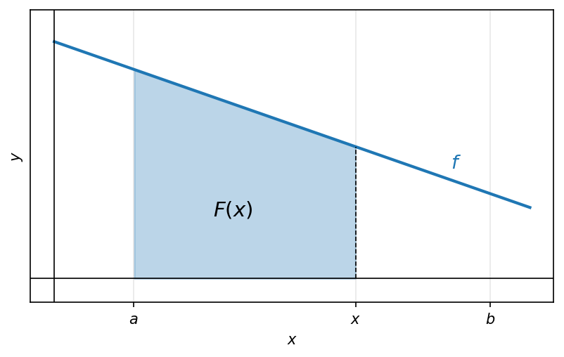
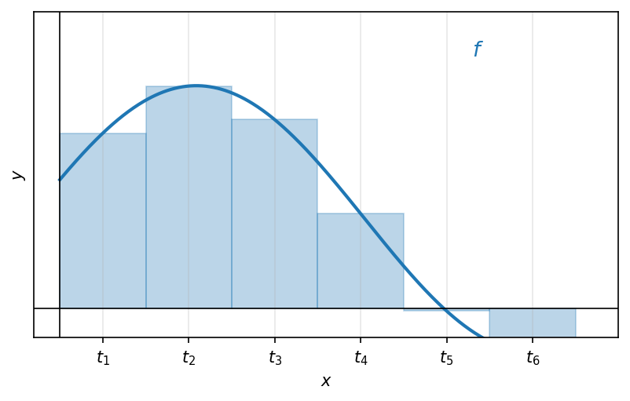
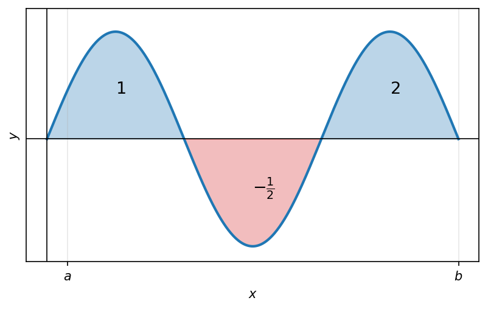
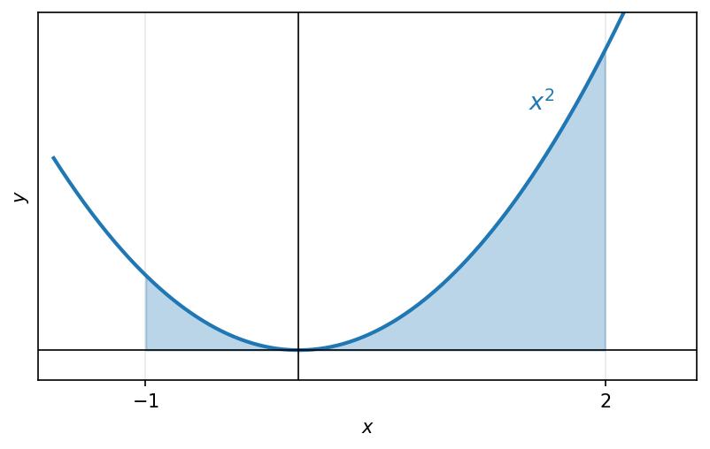
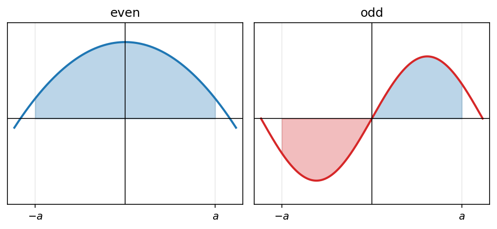
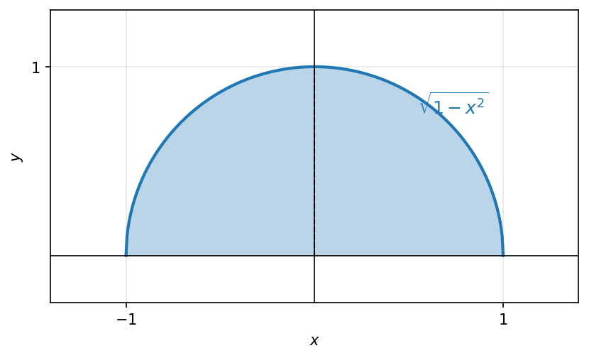
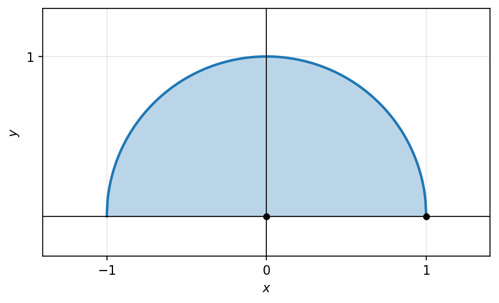
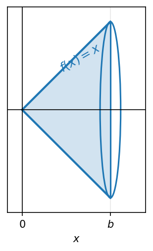
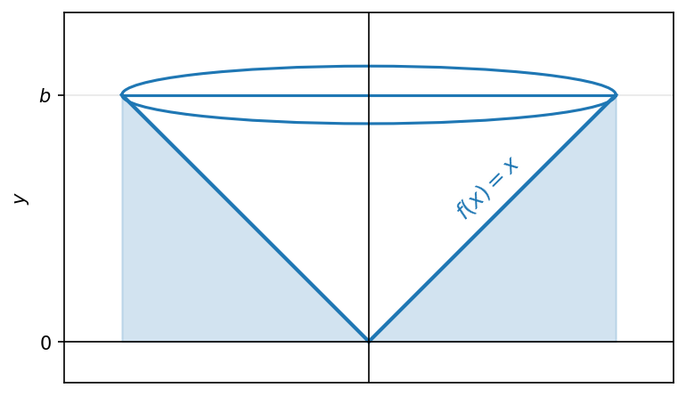

# האינטגרל המסוים

## חלוקה של קטע, עובי החלוקה ובחירת נקודות

אינטגרל מהצורה: $$\int_b^a f(x)\,dx$$

```{python}
#| echo: false
#| output: false
import numpy as np
import matplotlib.pyplot as plt

fig, ax = plt.subplots(figsize=(6.4, 3.6))
x = np.linspace(0, 5, 400)
f = 0.15 * (x - 1) * (x - 4) + 2.5
a, b = 1.5, 4.0
ax.plot(x, f, color="C0", lw=2, label=r"$f$")
mask = (x >= a) & (x <= b)
ax.fill_between(x[mask], 0, f[mask], color="C0", alpha=0.3)
ax.axhline(0, color="black", lw=0.8)
ax.axvline(0, color="black", lw=0.8)
ax.set_xticks([a, b])
ax.set_xticklabels([r"$a$", r"$b$"])
ax.set_yticks([])
ax.set_xlabel(r"$x$")
ax.set_ylabel(r"$y$")
ax.text(2.7, 1.0, r"$f$", fontsize=13, color="C0")
ax.set_xlim(-0.3, 5.2)
ax.set_ylim(-0.4, 4)
ax.grid(alpha=0.3)
fig.savefig("c14_fig01.png", dpi=150, bbox_inches="tight")
plt.close(fig)
```

```{=latex}
\par\medskip
\noindent\beginL\hbox to \linewidth{\hss\includegraphics[width=0.62\linewidth]{c14_fig01.png}\hss}\endL\par
\medskip
```

::: {style="text-align:center"}
תרשים: השטח הכלוא בין גרף $f$ לציר ה-$x$ בקטע $[a,b]$
:::

::: {.content-visible when-format="html"}
![השטח הכלוא בין גרף $f$ לציר ה-$x$ בקטע $[a,b]$](c14_fig01.png){#fig-c10_fig01 width="62%" fig-align="center"}
:::

השטח שכלוא בין גרף הפונקציה של $f$, לציר ה-$x$, כאשר $a \le x \le b$.

## סכום רימן

### דוגמא

```{python}
#| echo: false
#| output: false
import numpy as np
import matplotlib.pyplot as plt

fig, ax = plt.subplots(figsize=(6.4, 3.6))
x = np.linspace(-0.3, 1.3, 400)
f = x**2
ax.plot(x, f, color="C0", lw=2)
mask = (x >= 0) & (x <= 1)
ax.fill_between(x[mask], 0, f[mask], color="C0", alpha=0.3)
ax.axhline(0, color="black", lw=0.8)
ax.axvline(0, color="black", lw=0.8)
ax.set_xticks([0, 1])
ax.set_xticklabels([r"$0$", r"$1$"])
ax.set_yticks([1])
ax.set_yticklabels([r"$1$"])
ax.set_xlabel(r"$x$")
ax.set_ylabel(r"$y$")
ax.text(0.85, 1.0, r"$x^2$", fontsize=13, color="C0")
ax.set_xlim(-0.35, 1.35)
ax.set_ylim(-0.2, 1.6)
ax.grid(alpha=0.3)
fig.savefig("c14_fig02.png", dpi=150, bbox_inches="tight")
plt.close(fig)
```

```{=latex}
\par\medskip
\noindent\beginL\hbox to \linewidth{\hss\includegraphics[width=0.62\linewidth]{c14_fig02.png}\hss}\endL\par
\medskip
```

::: {style="text-align:center"}
תרשים: השטח הכלוא מתחת ל-$f(x)=x^2$ בקטע $[0,1]$
:::

::: {.content-visible when-format="html"}
![השטח הכלוא מתחת ל-$f(x)=x^2$ בקטע $[0,1]$](c14_fig02.png){#fig-c10_fig02 width="62%" fig-align="center"}
:::

השטח הכלוא: $$\int_0^1 x^2\,dx = \left.\frac{x^3}{3}\right|_0^1 = \frac{1}{3}$$

(הקדומה שלה)

### פיתוח האינטואיציה

```{python}
#| echo: false
#| output: false
import numpy as np
import matplotlib.pyplot as plt

fig, ax = plt.subplots(figsize=(6.4, 3.6))
a, b, C = 1.5, 4.0, 2.0
x = np.linspace(-0.3, 5, 400)
ax.plot(x, np.full_like(x, C), color="C0", lw=2)
mask = (x >= a) & (x <= b)
ax.fill_between(x[mask], 0, C, color="C0", alpha=0.3)
ax.axhline(0, color="black", lw=0.8)
ax.axvline(0, color="black", lw=0.8)
ax.set_xticks([a, b])
ax.set_xticklabels([r"$a$", r"$b$"])
ax.set_yticks([C])
ax.set_yticklabels([r"$C$"])
ax.set_xlabel(r"$x$")
ax.set_ylabel(r"$y$")
ax.text(4.3, C + 0.1, r"$f(x)=C$", fontsize=12, color="C0")
ax.set_xlim(-0.3, 5.2)
ax.set_ylim(-0.3, 3)
ax.grid(alpha=0.3)
fig.savefig("c14_fig03.png", dpi=150, bbox_inches="tight")
plt.close(fig)
```

```{=latex}
\par\medskip
\noindent\beginL\hbox to \linewidth{\hss\includegraphics[width=0.62\linewidth]{c14_fig03.png}\hss}\endL\par
\medskip
```

::: {style="text-align:center"}
תרשים: מלבן השטח מתחת לפונקציה הקבועה $f(x)=C$ בקטע $[a,b]$
:::

::: {.content-visible when-format="html"}
![מלבן השטח מתחת לפונקציה הקבועה $f(x)=C$ בקטע $[a,b]$](c14_fig03.png){#fig-c10_fig03 width="62%" fig-align="center"}
:::

השטח הכלוא: $$(b-a) \cdot C$$

(שטח מלבן)

## פונקציה אינטגרבילית בקטע

### מהסכומים והתחומים

שטחי $n$ המלבנים יתקרבו לשטח שרצינו.

```{python}
#| echo: false
#| output: false
import numpy as np
import matplotlib.pyplot as plt

fig, ax = plt.subplots(figsize=(6.4, 3.6))
x = np.linspace(0, 1.05, 400)
ax.plot(x, x**2, color="C0", lw=2)
n = 8
edges = np.arange(1, n + 1) / n
heights = edges**2
ax.bar(edges - 1.0/n, heights, width=1.0/n, align="edge",
       color="C0", alpha=0.3, edgecolor="C0", linewidth=0.8)
ax.axhline(0, color="black", lw=0.8)
ax.axvline(0, color="black", lw=0.8)
ax.set_xticks([1.0/n, 2.0/n, 3.0/n, 1.0])
ax.set_xticklabels([r"$\frac{1}{n}$", r"$\frac{2}{n}$", r"$\frac{3}{n}$", r"$1$"])
ax.set_yticks([])
ax.set_xlabel(r"$x$")
ax.set_ylabel(r"$y$")
ax.text(0.8, 0.85, r"$x^2$", fontsize=13, color="C0")
ax.set_xlim(-0.05, 1.15)
ax.set_ylim(-0.1, 1.2)
ax.grid(alpha=0.3)
fig.savefig("c14_fig04.png", dpi=150, bbox_inches="tight")
plt.close(fig)
```

```{=latex}
\par\medskip
\noindent\beginL\hbox to \linewidth{\hss\includegraphics[width=0.62\linewidth]{c14_fig04.png}\hss}\endL\par
\medskip
```

::: {style="text-align:center"}
תרשים: קירוב השטח מתחת ל-$x^2$ ב-$n$ מלבנים (סכום רימן) בקטע $[0,1]$
:::

::: {.content-visible when-format="html"}
![קירוב השטח מתחת ל-$x^2$ ב-$n$ מלבנים (סכום רימן) בקטע $[0,1]$](c14_fig04.png){#fig-c10_fig04 width="62%" fig-align="center"}
:::

נחשב את סכומי המלבנים: $$\frac{1}{n} \cdot \left(\frac{1}{n}\right)^2 + \frac{1}{n} \cdot \left(\frac{2}{n}\right)^2 + \dots + \frac{1}{n}\left(\frac{n}{n}\right)^2 =$$

(מלבן 1, מלבן 2, מלבן $n$)

$$= \frac{1}{n} \cdot \frac{1}{n^2} \cdot (1^2 + 2^2 + \dots + n^2) =$$

$$= \frac{1^2 + 2^2 + \dots + n^2}{n^3} = \frac{n(n+1)(2n+1)}{6n^3} \xrightarrow{n \to \infty} \frac{1}{3}$$

(מאינדוקציה)

פונקציה $f$ שמוגדרת ב- $[a,b]$ וחסומה בו, נקראת אינטגרבילית ב- $[a,b]$, אם לכל חלוקה של $[a,b]$ ל-$n$ קטעים שווים, ולכל בחירה של נקודות (מדגם) בין הקטעים האלה $(t_1, \dots, t_n)$ מתקיים:

סכומי רימן: $$\sum_{k=1}^{n} f(t_k) \cdot \left(\frac{b-a}{n}\right) \xrightarrow{n \to \infty} I$$

עבור $I \in \mathbb{R}$ (מספר) ואז $$I = \int_a^b f(x)\,dx$$

## פונקציית דיריכלה כפונקציה שאינה אינטגרבילית

### דוגמא

```{python}
#| echo: false
#| output: false
import numpy as np
import matplotlib.pyplot as plt

fig, ax = plt.subplots(figsize=(6.4, 3.6))
ax.axhline(0, color="black", lw=0.8)
ax.axvline(0, color="black", lw=0.8)
# value 1 on rationals (dashed dotted row), value 0 on irrationals (axis)
ax.plot([0, 2], [1, 1], color="C0", lw=1.2, ls="--")
xr = np.linspace(0, 2, 60)
ax.scatter(xr, np.ones_like(xr), color="C0", s=8, zorder=3)
ax.scatter(xr + 1.0/120, np.zeros_like(xr), color="C1", s=8, zorder=3)
ax.set_xticks([0, 1, 2])
ax.set_xticklabels([r"$0$", r"$1$", r"$2$"])
ax.set_yticks([0, 1])
ax.set_yticklabels([r"$0$", r"$1$"])
ax.set_xlabel(r"$x$")
ax.set_ylabel(r"$D(x)$")
ax.text(2.05, 1, r"$x\in\mathbb{Q}$", fontsize=11, color="C0", va="center")
ax.text(2.05, 0.08, r"$x\notin\mathbb{Q}$", fontsize=11, color="C1", va="center")
ax.set_xlim(-0.2, 2.9)
ax.set_ylim(-0.3, 1.5)
ax.grid(alpha=0.3)
fig.savefig("c14_fig05.png", dpi=150, bbox_inches="tight")
plt.close(fig)
```

```{=latex}
\par\medskip
\noindent\beginL\hbox to \linewidth{\hss\includegraphics[width=0.62\linewidth]{c14_fig05.png}\hss}\endL\par
\medskip
```

::: {style="text-align:center"}
תרשים: פונקציית דיריכלה בקטע $[0,2]$ — ערך $1$ ברציונליים וערך $0$ באי-רציונליים
:::

::: {.content-visible when-format="html"}
![פונקציית דיריכלה בקטע $[0,2]$ — ערך $1$ ברציונליים וערך $0$ באי-רציונליים](c14_fig05.png){#fig-c10_fig05 width="62%" fig-align="center"}
:::

פונקציית דיריכלה: $$D(x) = \begin{cases} 1 & x \in \mathbb{Q} \\ 0 & x \notin \mathbb{Q} \end{cases}$$

פונקציית דיריכלה אינה אינטגרבילית ב- $[1,2]$: $$\int_1^2 D(x)\,dx$$

<!-- מקור: הרצאה 26 -->

## משפט: כל פונקציה רציפה בקטע סגור אינטגרבילית

### משפט

כל פונקציה $f$ שהיא רציפה ב- $[a,b]$, היא אינטגרבילית ב- $[a,b]$.

## משפט: כל פונקציה מונוטונית בקטע סגור אינטגרבילית

::: {.todo}
תוכן בהכנה — להשלמה.
:::

## משפט: פונקציה חסומה עם מספר סופי של נקודות אי-רציפות אינטגרבילית

```{python}
#| echo: false
#| output: false
import numpy as np
import matplotlib.pyplot as plt

fig, ax = plt.subplots(figsize=(6.4, 3.6))
x = np.linspace(0, 6, 500)
f = 1.0 + 0.8 * np.sin(0.6 * x) + 0.15 * x
ax.plot(x, f, color="C0", lw=2)
a, b = 1.2, 4.8
m = (x >= a) & (x <= b)
ax.fill_between(x[m], 0, f[m], color="C0", alpha=0.3)
ax.axhline(0, color="black", lw=0.8)
ax.axvline(0, color="black", lw=0.8)
ax.set_xticks([a, b])
ax.set_xticklabels([r"$a$", r"$b$"])
ax.set_yticks([])
ax.set_xlabel(r"$x$")
ax.set_ylabel(r"$y$")
ax.text(2.6, 0.9, r"$\int_a^b f$", fontsize=14)
ax.text(5.0, 2.3, r"$f$", fontsize=13, color="C0")
ax.set_xlim(-0.3, 6.3)
ax.set_ylim(-0.3, 3)
ax.grid(alpha=0.3)
fig.savefig("c14_fig06.png", dpi=150, bbox_inches="tight")
plt.close(fig)
```

```{=latex}
\par\medskip
\noindent\beginL\hbox to \linewidth{\hss\includegraphics[width=0.62\linewidth]{c14_fig06.png}\hss}\endL\par
\medskip
```

::: {style="text-align:center"}
תרשים: השטח המוצלל מתחת ל-$f$ בקטע $[a,b]$, המייצג את $\int_a^b f$
:::

::: {.content-visible when-format="html"}
![השטח המוצלל מתחת ל-$f$ בקטע $[a,b]$, המייצג את $\int_a^b f$](c14_fig06.png){#fig-c10_fig14 width="62%" fig-align="center"}
:::

אם $f$ פונקציה רציפה ב-$[a,b]$, פרט למספר <u>סופי</u> כלשהוא של נקודות בהן יש קפיצה או סליקה ("חור"), אז $f$ אינטגרבילית ב-$[a,b]$.

דוגמא: פונקציית הערך השלם $|x|$

```{python}
#| echo: false
#| output: false
import numpy as np
import matplotlib.pyplot as plt

fig, ax = plt.subplots(figsize=(6.4, 3.6))
x = np.linspace(-2.5, 3.5, 500)
ax.plot(x, np.abs(x), color="C0", lw=2)
m = (x >= -2) & (x <= 3)
ax.fill_between(x[m], 0, np.abs(x[m]), color="C0", alpha=0.3)
for p in [-2, -1, 1, 2, 3]:
    ax.plot([p, p], [0, abs(p)], color="black", lw=0.7, ls="--", alpha=0.6)
ax.axhline(0, color="black", lw=0.8)
ax.axvline(0, color="black", lw=0.8)
ax.set_xticks([-2, -1, 0, 1, 2, 3])
ax.set_xticklabels([r"$-2$", r"$-1$", r"$0$", r"$1$", r"$2$", r"$3$"])
ax.set_yticks([])
ax.set_xlabel(r"$x$")
ax.set_ylabel(r"$y$")
ax.text(2.6, 2.2, r"$|x|$", fontsize=13, color="C0")
ax.set_xlim(-2.6, 3.7)
ax.set_ylim(-0.3, 3.5)
ax.grid(alpha=0.3)
fig.savefig("c14_fig07.png", dpi=150, bbox_inches="tight")
plt.close(fig)
```

```{=latex}
\par\medskip
\noindent\beginL\hbox to \linewidth{\hss\includegraphics[width=0.62\linewidth]{c14_fig07.png}\hss}\endL\par
\medskip
```

::: {style="text-align:center"}
תרשים: הפונקציה $f(x)=|x|$ עם הנקודות $-2,-1,1,2,3$ והשטח המוצלל בקטע $[-2,3]$
:::

::: {.content-visible when-format="html"}
![הפונקציה $f(x)=|x|$ עם הנקודות $-2,-1,1,2,3$ והשטח המוצלל בקטע $[-2,3]$](c14_fig07.png){#fig-c10_fig15 width="62%" fig-align="center"}
:::

חשבו: $\int_{-2}^{3} |x|\,dx$

הפונקציה רציפה ב-$[-2,3]$ , פרט למספר נקודות (המספרים השלמים) ולכן היא אינטגרבילית בקטע.

אז:

$$\int_{-2}^{3} |x|\,dx = \int_{-2}^{-1} |x|\,dx + \int_{-1}^{0} |x|\,dx + \int_{0}^{1} |x|\,dx + \int_{1}^{2} |x|\,dx + \int_{2}^{3} |x|\,dx =$$

$$= \int_{-2}^{-1} (-2)\,dx + \int_{-1}^{0} (-1)\,dx + \int_{0}^{1} 0\,dx + \int_{1}^{2} 1\,dx + \int_{2}^{3} 2\,dx = -2 \cdot 1 - .. = 0$$

## המשפט היסודי של החשבון האינפיניטסימלי

$$F(x) = \int_{a}^{x} f(t)dt : \text{השטח שמצטבר מתחת לגרף } f \text{ בין } a \text{ ל-x.}$$

(פונקציה של השטח הצבור)

זו פונקציה של $x$ כאשר $a \leq x \leq b$

הרעיון:

$$F(x) \xrightarrow[x \to x_0]{} F(x_0)$$

המשפט:

אם $f(x)$ רציפה ב-$[a,b]$ , אז הפונקציה $F(x) = \int_{a}^{x} f(t)dt$ היא קדומה של $f(x)$ ב-$[a,b]$.

כלומר, לכל $F'(x) = f(x) : x \in [a,b]$

```{python}
#| echo: false
#| output: false
import numpy as np
import matplotlib.pyplot as plt

fig, ax = plt.subplots(figsize=(6.4, 3.6))
t = np.linspace(0, 6, 500)
f = 3.0 - 0.35 * t
ax.plot(t, f, color="C0", lw=2)
a, xv, b = 1.0, 3.8, 5.5
m = (t >= a) & (t <= xv)
ax.fill_between(t[m], 0, 3.0 - 0.35 * t[m], color="C0", alpha=0.3)
ax.axhline(0, color="black", lw=0.8)
ax.axvline(0, color="black", lw=0.8)
ax.plot([xv, xv], [0, 3.0 - 0.35 * xv], color="black", lw=0.8, ls="--")
ax.set_xticks([a, xv, b])
ax.set_xticklabels([r"$a$", r"$x$", r"$b$"])
ax.set_yticks([])
ax.set_xlabel(r"$x$")
ax.set_ylabel(r"$y$")
ax.text(2.0, 0.8, r"$F(x)$", fontsize=14)
ax.text(5.0, 1.4, r"$f$", fontsize=13, color="C0")
ax.set_xlim(-0.3, 6.3)
ax.set_ylim(-0.3, 3.4)
ax.grid(alpha=0.3)
fig.savefig("c14_fig08.png", dpi=150, bbox_inches="tight")
plt.close(fig)
```

```{=latex}
\par\medskip
\noindent\beginL\hbox to \linewidth{\hss\includegraphics[width=0.62\linewidth]{c14_fig08.png}\hss}\endL\par
\medskip
```

::: {style="text-align:center"}
תרשים: פונקציית השטח הצבור $F(x)=\int_a^x f(t)\,dt$ — השטח מ-$a$ עד $x$ מתחת לפונקציה יורדת
:::

::: {.content-visible when-format="html"}
{#fig-c10_fig16 width="62%" fig-align="center"}
:::

דוגמאות:

(1) אם $f(t)=t$ ב-$[1,2]$, אז המשפט נותן ש:

$$F(x) \int_{1}^{x} t\,dt = \left.\frac{t^2}{2}\right|_{1}^{x} = \frac{x^2}{2} - \frac{1^2}{2} = \frac{x^2}{2} = \frac{1}{2}$$

הפונקציה הקדומה של $f(x)=x$

(2) עבור הפונקציה $f(t) = \sin(t^2)$ (שאין לה קדומה אלמנטרית)

המשפט היסודי טוען כי יש לה קדומה ב-$[0,1]$, שנתונה ע"י: $F(x) = \int_{0}^{x} \sin(t^2)dt$

כלומר $F'(x) = \sin(x^2)$ : הזו F(x) מקיימת

(3) נגדיר פונקציה $g(x) = \int_{0}^{x} \sin(t^2)dt$

א- נחשב $g(0)$ : $g(0) = \int_{0}^{0} \sin(t^2)dt = 0$

ב- נחשב את $g'(3)$ : מהמשפט היסודי $g(x)$ היא קדומה של $\sin(x^2)$ $\to$ $g'(3) = \sin(3^2) = \sin(9)$

\* אם היינו רוצים לחשב את $g(1)$, לא היה אפשר.

נתונה $g(x) = \int_{2}^{x^2} \frac{\sin(t)}{t}\,dt$ , חשבו את $g'(2)$

אם היינו לוקחים את $F(x) = \int_{2}^{x} \frac{\sin(t)}{t}\,dt$ אז מהמשפט היסודי ידוע כי $F'(x) = \frac{\sin(x)}{x}$

לכן הקשר בין $g$ ו-F: $g(x) = F(x^2)$

$$\downarrow$$

$$g'(x) = F'(x^2) \cdot 2x$$

$$\downarrow$$

$$g'(2) = F'(4) \cdot 4 = \frac{\sin(4)}{4} \cdot 4 = \sin(4)$$

## נוסחת ניוטון-לייבניץ ומסקנות לגבי נגזרת של אינטגרל

אם ל- $f(x)$ יש קדומה $F(x)$ ב- $[a,b]$, אז

$$\int_a^b f(x)dx = F(b) - F(a)$$

### הוכחת המשפט

ניקח את $[0,1]$ : היא מקיימת $F'(x) = f(x)$.

```{python}
#| echo: false
#| output: false
import numpy as np
import matplotlib.pyplot as plt

fig, ax = plt.subplots(figsize=(6.4, 3.6))
def f(x):
    return 0.6 + 0.9 * np.sin(0.8 * x + 0.3)
x = np.linspace(0, 6, 400)
ax.plot(x, f(x), color="C0", lw=2)
n = 6
edges = np.linspace(0, 6, n + 1)
mids = 0.5 * (edges[:-1] + edges[1:])
ax.bar(edges[:-1], f(mids), width=edges[1] - edges[0], align="edge",
       color="C0", alpha=0.3, edgecolor="C0", linewidth=0.8)
ax.axhline(0, color="black", lw=0.8)
ax.axvline(0, color="black", lw=0.8)
ax.set_xticks(mids)
ax.set_xticklabels([rf"$t_{{{i+1}}}$" for i in range(n)])
ax.set_yticks([])
ax.set_xlabel(r"$x$")
ax.set_ylabel(r"$y$")
ax.text(4.8, 1.7, r"$f$", fontsize=13, color="C0")
ax.set_xlim(-0.3, 6.5)
ax.set_ylim(-0.2, 2)
ax.grid(alpha=0.3)
fig.savefig("c14_fig09.png", dpi=150, bbox_inches="tight")
plt.close(fig)
```

```{=latex}
\par\medskip
\noindent\beginL\hbox to \linewidth{\hss\includegraphics[width=0.62\linewidth]{c14_fig09.png}\hss}\endL\par
\medskip
```

::: {style="text-align:center"}
תרשים: חלוקה לתת-קטעים עם נקודות מדגם $t_1,\dots,t_n$ ומלבני סכום רימן מתחת ל-$f$
:::

::: {.content-visible when-format="html"}
{#fig-c10_fig06 width="62%" fig-align="center"}
:::

נפתח את אגף ימין:

$$F(b) - F(a) = F(1) - F(0) = F(\frac{n}{n}) - F(\frac{n-1}{n}) + F(\frac{n-1}{n}) - F(\frac{n-2}{n}) + F(\frac{n-2}{n})$$

$$+ \dots + -F(\frac{2}{n}) + F(\frac{2}{n}) + F(\frac{1}{n}) + F(\frac{1}{n}) - F(0)$$

$$.= \frac{1}{n} \cdot \frac{F(\frac{n}{n}) - F(\frac{n-1}{n})}{\frac{1}{n}} + \frac{1}{n} + \dots + \frac{1}{n} \frac{F(\frac{2}{n}) - F(\frac{1}{n})}{\frac{1}{n}} + \frac{1}{n} \frac{F(\frac{1}{n}) - F(0)}{\frac{1}{n}}$$

נפעיל את לגראנד' על $F(x)$ על כל הקטעים $[0, \frac{1}{n}], \dots$

$$= \frac{1}{n}[F'(t_n) + \dots + F'(t_2) + F'(t_1)] = \frac{1}{n}[f(t_1) + \dots + f(t_n)] = \text{סכום רימן}$$

<!-- בדיקה: בצד שמאל כתוב "סכום רימן (כאשר n שאף לאינסוף)" -->

כך חיברנו בין מציאת פונקציה קדומה של $f$, לבין החישוב של $\int_a^b f(x)dx$.

::: {#rem-hagdara .definition}
**הערה:**

האינטגרל המסוים מייצג "שטח נטו", כלומר שטחים שנמצאים מעל ציר ה-x יתווספו בסימן חיובי, ושטחים שנמצאים מתחת לציר ה-x יוחסרו (סימן שלילי). זאת בניגוד לחישוב שטח גיאומטרי כולל, שבו היינו מחברים את הערכים המוחלטים של כל האזורים.
:::

```{python}
#| echo: false
#| output: false
import numpy as np
import matplotlib.pyplot as plt

fig, ax = plt.subplots(figsize=(6.4, 3.6))
x = np.linspace(0, 6, 500)
f = np.sin(x * np.pi / 2.0) * 1.4
ax.plot(x, f, color="C0", lw=2)
pos = f >= 0
ax.fill_between(x, 0, f, where=pos, color="C0", alpha=0.3)
ax.fill_between(x, 0, f, where=~pos, color="C3", alpha=0.3)
ax.axhline(0, color="black", lw=0.8)
ax.axvline(0, color="black", lw=0.8)
ax.set_xticks([0.3, 6])
ax.set_xticklabels([r"$a$", r"$b$"])
ax.set_yticks([])
ax.set_xlabel(r"$x$")
ax.set_ylabel(r"$y$")
ax.text(1.0, 0.6, r"$1$", fontsize=13)
ax.text(3.0, -0.7, r"$-\frac{1}{2}$", fontsize=13)
ax.text(5.0, 0.6, r"$2$", fontsize=13)
ax.set_xlim(-0.3, 6.3)
ax.set_ylim(-1.6, 1.7)
ax.grid(alpha=0.3)
fig.savefig("c14_fig10.png", dpi=150, bbox_inches="tight")
plt.close(fig)
```

```{=latex}
\par\medskip
\noindent\beginL\hbox to \linewidth{\hss\includegraphics[width=0.62\linewidth]{c14_fig10.png}\hss}\endL\par
\medskip
```

::: {style="text-align:center"}
תרשים: שטח נטו — אזורים מעל הציר חיוביים ואזור מתחת לציר שלילי ($-\tfrac{1}{2}$)
:::

::: {.content-visible when-format="html"}
{#fig-c10_fig07 width="62%" fig-align="center"}
:::

$$\int_a^b f(x)dx = 1 - \frac{1}{2} + 2 = 2\frac{1}{2}$$

### דוגמאות

**(1)** חשבו: $\int_{-1}^2 x^2 dx$

לפונקציה $f(x) = x^2$ יש קדומה

$$f(x) = \frac{x^3}{3}$$

ולכן ממשפט ניוטון-לייבניץ, נחשב:

$$\int_{-1}^2 x^2 dx = F(2) - F(-1) = \frac{2^3}{3} - \frac{(-1)^3}{3} = \frac{8}{3} + \frac{1}{3} = \boxed{3}$$

```{python}
#| echo: false
#| output: false
import numpy as np
import matplotlib.pyplot as plt

fig, ax = plt.subplots(figsize=(6.4, 3.6))
x = np.linspace(-1.6, 2.4, 400)
ax.plot(x, x**2, color="C0", lw=2)
mask = (x >= -1) & (x <= 2)
ax.fill_between(x[mask], 0, (x[mask])**2, color="C0", alpha=0.3)
ax.axhline(0, color="black", lw=0.8)
ax.axvline(0, color="black", lw=0.8)
ax.set_xticks([-1, 2])
ax.set_xticklabels([r"$-1$", r"$2$"])
ax.set_yticks([])
ax.set_xlabel(r"$x$")
ax.set_ylabel(r"$y$")
ax.text(1.5, 3.2, r"$x^2$", fontsize=13, color="C0")
ax.set_xlim(-1.7, 2.6)
ax.set_ylim(-0.4, 4.5)
ax.grid(alpha=0.3)
fig.savefig("c14_fig11.png", dpi=150, bbox_inches="tight")
plt.close(fig)
```

```{=latex}
\par\medskip
\noindent\beginL\hbox to \linewidth{\hss\includegraphics[width=0.62\linewidth]{c14_fig11.png}\hss}\endL\par
\medskip
```

::: {style="text-align:center"}
תרשים: השטח מתחת ל-$f(x)=x^2$ בין $x=-1$ ל-$x=2$
:::

::: {.content-visible when-format="html"}
{#fig-c10_fig08 width="62%" fig-align="center"}
:::

**(2)** בקטע $[a,c]$ מתקיים $f(x) \geq g(x)$

```{python}
#| echo: false
#| output: false
import numpy as np
import matplotlib.pyplot as plt

fig, ax = plt.subplots(figsize=(6.4, 3.6))
x = np.linspace(0.5, 7.5, 600)
# pick f and g crossing at c and d, with f>=g on [a,c] and [d,b], g>=f on [c,d]
f = 0.05 * (x - 4)**3 + 3.0
g = 0.9 * x - 0.5
ax.plot(x, f, color="C0", lw=2, label=r"$f$")
ax.plot(x, g, color="C3", lw=2, label=r"$g$")
a, c, d, b = 1.5, 3.0, 5.0, 7.0
m1 = (x >= a) & (x <= c)
m2 = (x >= c) & (x <= d)
m3 = (x >= d) & (x <= b)
ax.fill_between(x[m1], g[m1], f[m1], color="C0", alpha=0.3)
ax.fill_between(x[m2], f[m2], g[m2], color="C3", alpha=0.3)
ax.fill_between(x[m3], g[m3], f[m3], color="C0", alpha=0.3)
ax.axhline(0, color="black", lw=0.8)
ax.axvline(0, color="black", lw=0.8)
ax.set_xticks([a, c, d, b])
ax.set_xticklabels([r"$a$", r"$c$", r"$d$", r"$b$"])
ax.set_yticks([])
ax.set_xlabel(r"$x$")
ax.set_ylabel(r"$y$")
ax.text(2.2, 2.6, r"$1$", fontsize=13)
ax.text(4.0, 3.0, r"$2$", fontsize=13)
ax.text(6.0, 4.2, r"$3$", fontsize=13)
ax.text(7.0, 5.5, r"$f$", fontsize=12, color="C0")
ax.text(7.0, 6.2, r"$g$", fontsize=12, color="C3")
ax.set_xlim(0.3, 7.8)
ax.set_ylim(-0.3, 7)
ax.grid(alpha=0.3)
fig.savefig("c14_fig12.png", dpi=150, bbox_inches="tight")
plt.close(fig)
```

```{=latex}
\par\medskip
\noindent\beginL\hbox to \linewidth{\hss\includegraphics[width=0.62\linewidth]{c14_fig12.png}\hss}\endL\par
\medskip
```

::: {style="text-align:center"}
תרשים: השטחים $1,2,3$ הכלואים בין $f$ ל-$g$ בקטעים $[a,c],[c,d],[d,b]$
:::

::: {.content-visible when-format="html"}
![השטחים $1,2,3$ הכלואים בין $f$ ל-$g$ בקטעים $[a,c],[c,d],[d,b]$](c14_fig12.png){#fig-c10_fig09 width="62%" fig-align="center"}
:::

שטח 1 ב- $[a,c]$ : $\int_a^c (f(x) - g(x))dx$

שטח 2 ב- $[c,d]$ : $\int_c^d (g(x) - f(x))dx$

שטח 2 ב- $[d,b]$ : $\int_d^b (f(x) - g(x))dx$

סה"כ : $\int_a^c f - g + \int_c^d g - f + \int_d^b f - g = \boxed{\int_a^b |f(x) - g(x)|dx}$

**(3)** חשבו את השטח החסום בין הפונקציות $g(x) = x^3$ , $f(x) = x$

```{python}
#| echo: false
#| output: false
import numpy as np
import matplotlib.pyplot as plt

fig, ax = plt.subplots(figsize=(6.4, 3.6))
x = np.linspace(-1.2, 1.2, 500)
ax.plot(x, x, color="C0", lw=2, label=r"$x$")
ax.plot(x, x**3, color="C3", lw=2, label=r"$x^3$")
# on [-1,0]: x^3 >= x ; on [0,1]: x >= x^3
mL = (x >= -1) & (x <= 0)
mR = (x >= 0) & (x <= 1)
ax.fill_between(x[mL], x[mL], x[mL]**3, color="C0", alpha=0.3)
ax.fill_between(x[mR], x[mR]**3, x[mR], color="C0", alpha=0.3)
ax.axhline(0, color="black", lw=0.8)
ax.axvline(0, color="black", lw=0.8)
ax.set_xticks([-1, 1])
ax.set_xticklabels([r"$-1$", r"$1$"])
ax.set_yticks([-1, 1])
ax.set_yticklabels([r"$-1$", r"$1$"])
ax.set_xlabel(r"$x$")
ax.set_ylabel(r"$y$")
ax.text(1.05, 1.0, r"$x$", fontsize=12, color="C0")
ax.text(1.05, 0.5, r"$x^3$", fontsize=12, color="C3")
ax.set_xlim(-1.3, 1.4)
ax.set_ylim(-1.3, 1.3)
ax.grid(alpha=0.3)
fig.savefig("c14_fig13.png", dpi=150, bbox_inches="tight")
plt.close(fig)
```

```{=latex}
\par\medskip
\noindent\beginL\hbox to \linewidth{\hss\includegraphics[width=0.62\linewidth]{c14_fig13.png}\hss}\endL\par
\medskip
```

::: {style="text-align:center"}
תרשים: השטחים החסומים בין $f(x)=x$ ל-$g(x)=x^3$ בקטע $[-1,1]$
:::

::: {.content-visible when-format="html"}
![השטחים החסומים בין $f(x)=x$ ל-$g(x)=x^3$ בקטע $[-1,1]$](c14_fig13.png){#fig-c10_fig10 width="62%" fig-align="center"}
:::

$$\int_{-1}^1 |x - x^3| dx = \int_{-1}^0 (x^3 - x)dx + \int_0^1 (x - x^3)dx =$$

<!-- בדיקה: מעל האינטגרל הראשון כתוב "קדומה: $F(x) = \frac{x^4}{4} - \frac{x^2}{2}$" ומעל השני "קדומה: $F(x) = \frac{x^2}{2} - \frac{x^4}{4}$" -->

$$= (\frac{0^4}{4} - \frac{0^2}{2}) - (\frac{1}{4} - \frac{1}{2}) = (\frac{1}{2} - \frac{1}{4} - 0) = \boxed{\frac{1}{2}}$$

<!-- בדיקה: מתחת לאיברים כתוב F(0) ו- F(-1) -->

**(4)** חשבו את $\int_{-1}^1 x^2 \sin(x)dx$

נמצא קדומה של $x^2 \sin(x)$ :

$$\int \underset{u}{x^2} \underset{v'}{\sin(x)} dx = \underset{u}{x^2} \cdot \underset{v}{(-\cos(x))} - \int \underset{u'}{2x} \cdot \underset{v}{(-\cos(x))} dx = -x^2 \cos(x) + 2 \cdot \int \underset{u}{x} \underset{v'}{\cos(x)} dx =$$

<!-- בדיקה: מסומן "אינטגרציה בחלקים" עם הלוח: $u(x) = x^2$, $v'(x) = \sin(x)$, $u'(x) = 2x$, $v(x) = -\cos(x)$ -->

$$= -x^2 \cos(x) + 2[x \cdot \sin(x) - \int \sin(x)dx] = \boxed{-x^2 \cos(x) + 2 \cdot \cos(x) + 2 \cdot \cos(x)}$$

<!-- בדיקה: מתחת לתיבה כתוב F(x). מסומן "אינטגרציה בחלקים" עם הלוח: $u(x) = x$, $v'(x) = \cos(x)$, $u'(x) = 1$, $v(x) = \sin(x)$ -->

נסמן $F(x)$ קדומה של $x^2 \sin(x)$ ולכן לפי משפט ניוטון-לייבניץ:

$$\int_{-1}^1 x^2 \sin(x)dx = F(1) - F(-1) =$$

$$= (-\cos(1) + 2\sin(1) + 2\cos(1)) - (-\cos(-1) - 2\sin(-1) + 2\cos(-1)) = \boxed{0}$$

<!-- בדיקה: מסומן "זוגיות" עם: $\cos(-\alpha) = \cos(\alpha)$ , $\sin(-\alpha) = -\sin(\alpha)$ -->

הפונקציה $x^2 \sin(x)$ אי-זוגית

::::: {#rem-zugiut .definition}
**הערה:**

```{python}
#| echo: false
#| output: false
import numpy as np
import matplotlib.pyplot as plt

fig, axes = plt.subplots(1, 2, figsize=(6.8, 3.2))
a = 1.3
x = np.linspace(-1.6, 1.6, 500)

# even function
ax = axes[0]
fe = 1.6 - 0.7 * x**2
ax.plot(x, fe, color="C0", lw=2)
m = (x >= -a) & (x <= a)
ax.fill_between(x[m], 0, 1.6 - 0.7 * x[m]**2, color="C0", alpha=0.3)
ax.axhline(0, color="black", lw=0.8)
ax.axvline(0, color="black", lw=0.8)
ax.set_xticks([-a, a]); ax.set_xticklabels([r"$-a$", r"$a$"])
ax.set_yticks([])
ax.set_title(r"even")
ax.set_xlim(-1.7, 1.7); ax.set_ylim(-1.8, 2)
ax.grid(alpha=0.3)

# odd function
ax = axes[1]
fo = np.sin(x * np.pi / 1.6) * 1.3
ax.plot(x, fo, color="C3", lw=2)
mR = (x >= 0) & (x <= a)
mL = (x >= -a) & (x <= 0)
ax.fill_between(x[mR], 0, np.sin(x[mR] * np.pi / 1.6) * 1.3, color="C0", alpha=0.3)
ax.fill_between(x[mL], 0, np.sin(x[mL] * np.pi / 1.6) * 1.3, color="C3", alpha=0.3)
ax.axhline(0, color="black", lw=0.8)
ax.axvline(0, color="black", lw=0.8)
ax.set_xticks([-a, a]); ax.set_xticklabels([r"$-a$", r"$a$"])
ax.set_yticks([])
ax.set_title(r"odd")
ax.set_xlim(-1.7, 1.7); ax.set_ylim(-1.8, 2)
ax.grid(alpha=0.3)

fig.tight_layout()
fig.savefig("c14_fig14.png", dpi=150, bbox_inches="tight")
plt.close(fig)
```

```{=latex}
\par\medskip
\noindent\beginL\hbox to \linewidth{\hss\includegraphics[width=0.62\linewidth]{c14_fig14.png}\hss}\endL\par
\medskip
```

::: {style="text-align:center"}
תרשים: פונקציה זוגית (סימטרית, השטחים מצטברים) מול פונקציה אי-זוגית (השטחים מתבטלים)
:::

::: {.content-visible when-format="html"}
{#fig-c10_fig11 width="62%" fig-align="center"}
:::

פונקציה זוגית:

$$\int_{-a}^a f(x)dx = 2\int_0^a f(x)dx$$

$-a$ , $a$ חייבים להיות שווים

פונקציה אי-זוגית:

$$\int_{-a}^a f(x)dx = \boxed{0}$$

$-a$ , $a$ חייבים להיות שווים
:::::

**(5)** חשבו את השטח של חצי מעגל סביב 0 עם רדיוס 1.

```{python}
#| echo: false
#| output: false
import numpy as np
import matplotlib.pyplot as plt

fig, ax = plt.subplots(figsize=(6.4, 3.6))
x = np.linspace(-1, 1, 400)
y = np.sqrt(1 - x**2)
ax.plot(x, y, color="C0", lw=2)
ax.fill_between(x, 0, y, color="C0", alpha=0.3)
ax.axhline(0, color="black", lw=0.8)
ax.axvline(0, color="black", lw=0.8)
ax.plot([0, 0], [0, 1], color="black", lw=1.0, ls="--")
ax.set_xticks([-1, 1])
ax.set_xticklabels([r"$-1$", r"$1$"])
ax.set_yticks([1])
ax.set_yticklabels([r"$1$"])
ax.set_xlabel(r"$x$")
ax.set_ylabel(r"$y$")
ax.text(0.55, 0.75, r"$\sqrt{1-x^2}$", fontsize=12, color="C0")
ax.set_xlim(-1.4, 1.4)
ax.set_ylim(-0.25, 1.3)
ax.set_aspect("equal", adjustable="box")
ax.grid(alpha=0.3)
fig.savefig("c14_fig15.png", dpi=150, bbox_inches="tight")
plt.close(fig)
```

```{=latex}
\par\medskip
\noindent\beginL\hbox to \linewidth{\hss\includegraphics[width=0.62\linewidth]{c14_fig15.png}\hss}\endL\par
\medskip
```

::: {style="text-align:center"}
תרשים: חצי העיגול העליון $y=\sqrt{1-x^2}$ עם מרכז בראשית ורדיוס $1$, השטח צבוע
:::

::: {.content-visible when-format="html"}
{#fig-c10_fig12 width="62%" fig-align="center"}
:::

$$x^2 + y^2 = R^2$$ $$R = 1$$ $$y^2 = 1 - x^2$$ $$y = \sqrt{1 - x^2}$$

<!-- בדיקה: מתחת לתרשים כתוב $\sqrt{x^2 + y^2} \leq 1$ , $y = \sqrt{1 - x^2}$ -->

נסמן : $f(x) = \sqrt{1 - x^2}$

$$\int_{-1}^1 f(x)dx = \int_{-1}^1 \sqrt{1 - x^2}dx = \int \sqrt{1 - \sin^2(t)} \cdot \cos(t)dt = \int \cos(t) \cdot \cos(t)dt =$$

<!-- בדיקה: מסומן "הצבה" עם הלוח: $x = \sin(t)$ , $\arcsin(x) = t$ , $dx = \cos(t)dt$ -->

$$= \int \cos^2(t)dt = \int \frac{1 + \cos(2t)}{2}dt = \int \frac{1}{2}dt + \frac{1}{2}\int \cos(2t)dt = \frac{t}{2} + \frac{1}{2} \cdot \frac{\sin(2t)}{2} =$$

<!-- בדיקה: מסומן "זהות כפולה" מתחת לאיבר -->

$$= \frac{t}{2} + \frac{\sin(2t)}{4} = \frac{\arcsin(x)}{2} + \frac{\sin(2 \cdot \arcsin(x))}{4} = \boxed{\frac{\arcsin(x)}{2} + \frac{\sqrt{1 - x^2} \cdot x}{2}}$$

<!-- בדיקה: מסומן "הצבה" מתחת לאיבר -->

<!-- מקור: הרצאה 27 -->

## דוגמה: גבול עם אינטגרל

::: {.todo}
תוכן בהכנה — להשלמה.
:::

## שימושים: שטח, נפח גוף סיבוב ואורך עקומה

(5) חשבו את השטח של חצי מעגל סביב 0 עם רדיוס 1.

```{python}
#| echo: false
#| output: false
import numpy as np
import matplotlib.pyplot as plt

fig, ax = plt.subplots(figsize=(6.4, 3.6))
x = np.linspace(-1, 1, 400)
y = np.sqrt(1 - x**2)
ax.plot(x, y, color="C0", lw=2)
ax.fill_between(x, 0, y, color="C0", alpha=0.3)
ax.axhline(0, color="black", lw=0.8)
ax.axvline(0, color="black", lw=0.8)
ax.scatter([0, 1], [0, 0], color="black", s=20, zorder=3)
ax.set_xticks([-1, 0, 1])
ax.set_xticklabels([r"$-1$", r"$0$", r"$1$"])
ax.set_yticks([1])
ax.set_yticklabels([r"$1$"])
ax.set_xlabel(r"$x$")
ax.set_ylabel(r"$y$")
ax.set_xlim(-1.4, 1.4)
ax.set_ylim(-0.25, 1.3)
ax.set_aspect("equal", adjustable="box")
ax.grid(alpha=0.3)
fig.savefig("c14_fig16.png", dpi=150, bbox_inches="tight")
plt.close(fig)
```

```{=latex}
\par\medskip
\noindent\beginL\hbox to \linewidth{\hss\includegraphics[width=0.62\linewidth]{c14_fig16.png}\hss}\endL\par
\medskip
```

::: {style="text-align:center"}
תרשים: חצי מעגל ברדיוס $1$ ומרכז בראשית, הנקודות $0$ ו-$1$ מסומנות על הציר
:::

::: {.content-visible when-format="html"}
{#fig-c10_fig13 width="62%" fig-align="center"}
:::

$$x^2 + y^2 = R^2$$ $$R = 1$$ $$y^2 = 1 - x^2$$ $$y = \sqrt{1 - x^2}$$

$$\sqrt{x^2 + y^2} \leq 1 \ , \ y = \sqrt{1 - x^2}$$

נסמן: $f(x) = \sqrt{1 - x^2}$

$$\int_{-1}^{1} f(x)dx = \int_{-1}^{1} \sqrt{1 - x^2}\,dx = \int \sqrt{1 - \sin^2(t)} \cdot \cos(t)\,dt = \int \cos(t) \cdot \cos(t)\,dt =$$

נסמן: $$\begin{bmatrix} x = \sin(t) \ , \ \arcsin(x) = t \\ dx = \cos(t)dt \end{bmatrix}$$

$$= \int \cos^2(t)dt = \int \frac{1 + \cos(2t)}{2}\,dt = \int \frac{1}{2}\,dt + \frac{1}{2}\int \cos(2t)\,dt = \frac{t}{2} + \frac{1}{2} \cdot \frac{\sin(2t)}{2} =$$

(זווית כפולה)

$$= \frac{t}{2} + \frac{\sin(2t)}{4} = \frac{\arcsin(x)}{2} + \frac{\sin(2 \cdot \arcsin(x))}{4} = \frac{\arcsin(x)}{2} + \frac{\sqrt{1 - x^2} \cdot x}{2}$$

(הצבה)

$$= F(x)$$

ולכן

$$\int_{-1}^{1} f(x)dx = \int_{-1}^{1} \sqrt{1 - x^2}\,dx = \frac{\arcsin(1)}{2} - \frac{\arcsin(-1)}{2} = \frac{\frac{\pi}{2} - \frac{-\pi}{2}}{2} = \frac{\pi}{2}$$

$$= F(1) - F(-1)$$

$$\begin{bmatrix} \arcsin(1) = \frac{\pi}{2} \to \sin(\frac{\pi}{2}) = 1 \\ \arcsin(-1) = -\frac{\pi}{2} \to \sin(-\frac{\pi}{2}) = -1 \end{bmatrix}$$

דרך אחרת לפתרון:

$$\int_{-1}^{1} f(x)dx = \int_{-1}^{1} \sqrt{1 - x^2}\,dx = \int \sqrt{1 - \sin^2(t)} \cdot \cos(t)\,dt = \int \cos(t) \cdot \cos(t)\,dt =$$

נסמן: $$\begin{bmatrix} x = \sin(t) \ , \ \arcsin(x) = t \\ dx = \cos(t)dt \end{bmatrix}$$

$$= \int \cos^2(t)dt = \int \frac{1 + \cos(2t)}{2}\,dt = \int \frac{1}{2}\,dt + \frac{1}{2}\int \cos(2t)\,dt = g(\frac{\pi}{2}) - g(-\frac{\pi}{2}) = \frac{\pi}{4} - (-\frac{\pi}{4}) = \frac{\pi}{2}$$

(זווית כפולה)

(ניוטון-לייבניץ)

$$g(t) = \frac{t}{2} + \frac{\sin(2t)}{4}$$

הקדומה שלה:

הפונקציה $f$ רציפה ב-$[a,b]$ והיא אי-שלילית.

נפח של סיבוב- סביב ציר ה-x:

```{python}
#| echo: false
#| output: false
import numpy as np
import matplotlib.pyplot as plt
from matplotlib.patches import Ellipse

fig, ax = plt.subplots(figsize=(6.4, 3.6))
b = 3.0
# profile of f(x)=x rotated about x-axis -> cone opening to the right
ax.plot([0, b], [0, b], color="C0", lw=2)          # f(x)=x
ax.plot([0, b], [0, -b], color="C0", lw=2)         # mirror profile
ax.plot([b, b], [-b, b], color="C0", lw=1.5)       # base edge
# ellipse at the open base to suggest rotation
ax.add_patch(Ellipse((b, 0), width=0.7, height=2 * b, angle=0,
                      fill=False, edgecolor="C0", lw=1.5))
ax.fill_between([0, b], [0, b], [0, -b], color="C0", alpha=0.2)
ax.axhline(0, color="black", lw=0.8)
ax.axvline(0, color="black", lw=0.8)
ax.set_xticks([0, b]); ax.set_xticklabels([r"$0$", r"$b$"])
ax.set_yticks([])
ax.set_xlabel(r"$x$")
ax.text(1.2, 1.3, r"$f(x)=x$", fontsize=12, color="C0", rotation=30)
ax.set_xlim(-0.5, 4.2)
ax.set_ylim(-3.5, 3.5)
ax.set_aspect("equal", adjustable="box")
ax.grid(alpha=0.3)
fig.savefig("c14_fig17.png", dpi=150, bbox_inches="tight")
plt.close(fig)
```

```{=latex}
\par\medskip
\noindent\beginL\hbox to \linewidth{\hss\includegraphics[width=0.62\linewidth]{c14_fig17.png}\hss}\endL\par
\medskip
```

::: {style="text-align:center"}
תרשים: חרוט שנוצר מסיבוב הישר $f(x)=x$ סביב ציר ה-$x$
:::

::: {.content-visible when-format="html"}
{#fig-c10_fig17 width="62%" fig-align="center"}
:::

$$\pi \int_{a}^{b} f(x)^2\,dx$$

נפח של סיבוב- סביב ציר ה-y:

```{python}
#| echo: false
#| output: false
import numpy as np
import matplotlib.pyplot as plt
from matplotlib.patches import Ellipse

fig, ax = plt.subplots(figsize=(6.4, 3.6))
b = 3.0
# profile of f(x)=x rotated about y-axis -> cone opening upward
ax.plot([0, b], [0, b], color="C0", lw=2)          # f(x)=x
ax.plot([0, -b], [0, b], color="C0", lw=2)         # mirror profile
ax.plot([-b, b], [b, b], color="C0", lw=1.5)       # top edge
# ellipse at the open top to suggest rotation
ax.add_patch(Ellipse((0, b), width=2 * b, height=0.7, angle=0,
                      fill=False, edgecolor="C0", lw=1.5))
ax.fill_between([-b, 0, b], [b, 0, b], color="C0", alpha=0.2)
ax.axhline(0, color="black", lw=0.8)
ax.axvline(0, color="black", lw=0.8)
ax.set_yticks([0, b]); ax.set_yticklabels([r"$0$", r"$b$"])
ax.set_xticks([])
ax.set_ylabel(r"$y$")
ax.text(1.0, 1.5, r"$f(x)=x$", fontsize=12, color="C0", rotation=45)
ax.set_xlim(-3.7, 3.7)
ax.set_ylim(-0.5, 4.0)
ax.set_aspect("equal", adjustable="box")
ax.grid(alpha=0.3)
fig.savefig("c14_fig18.png", dpi=150, bbox_inches="tight")
plt.close(fig)
```

```{=latex}
\par\medskip
\noindent\beginL\hbox to \linewidth{\hss\includegraphics[width=0.62\linewidth]{c14_fig18.png}\hss}\endL\par
\medskip
```

::: {style="text-align:center"}
תרשים: חרוט שנוצר מסיבוב הישר $f(x)=x$ סביב ציר ה-$y$
:::

::: {.content-visible when-format="html"}
{#fig-c10_fig18 width="62%" fig-align="center"}
:::

$$\pi \int_{a}^{b} x \cdot f(x)\,dx$$

אורך קשת:

```{python}
#| echo: false
#| output: false
import numpy as np
import matplotlib.pyplot as plt

fig, ax = plt.subplots(figsize=(6.4, 3.6))
x = np.linspace(0, 6, 500)
f = 1.5 + 0.9 * np.sin(0.7 * x) + 0.12 * x
ax.plot(x, f, color="C0", lw=2)
a, b = 1.2, 4.8
fa = 1.5 + 0.9 * np.sin(0.7 * a) + 0.12 * a
fb = 1.5 + 0.9 * np.sin(0.7 * b) + 0.12 * b
ax.plot([a, a], [0, fa], color="black", lw=0.9, ls="--")
ax.plot([b, b], [0, fb], color="black", lw=0.9, ls="--")
ax.axhline(0, color="black", lw=0.8)
ax.axvline(0, color="black", lw=0.8)
ax.set_xticks([a, b])
ax.set_xticklabels([r"$a$", r"$b$"])
ax.set_yticks([])
ax.set_xlabel(r"$x$")
ax.set_ylabel(r"$y$")
ax.text(4.9, 2.9, r"$f$", fontsize=13, color="C0")
ax.set_xlim(-0.3, 6.3)
ax.set_ylim(-0.3, 3.5)
ax.grid(alpha=0.3)
fig.savefig("c14_fig19.png", dpi=150, bbox_inches="tight")
plt.close(fig)
```

```{=latex}
\par\medskip
\noindent\beginL\hbox to \linewidth{\hss\includegraphics[width=0.62\linewidth]{c14_fig19.png}\hss}\endL\par
\medskip
```

::: {style="text-align:center"}
תרשים: אורך הקשת של העקומה $f$ בקטע $[a,b]$, עם קווים אנכיים בקצוות
:::

::: {.content-visible when-format="html"}
![אורך הקשת של העקומה $f$ בקטע $[a,b]$, עם קווים אנכיים בקצוות](c14_fig19.png){#fig-c10_fig19 width="62%" fig-align="center"}
:::

$$l = \int_{a}^{b} \sqrt{1 + (f'(x))^2}\,dx$$
